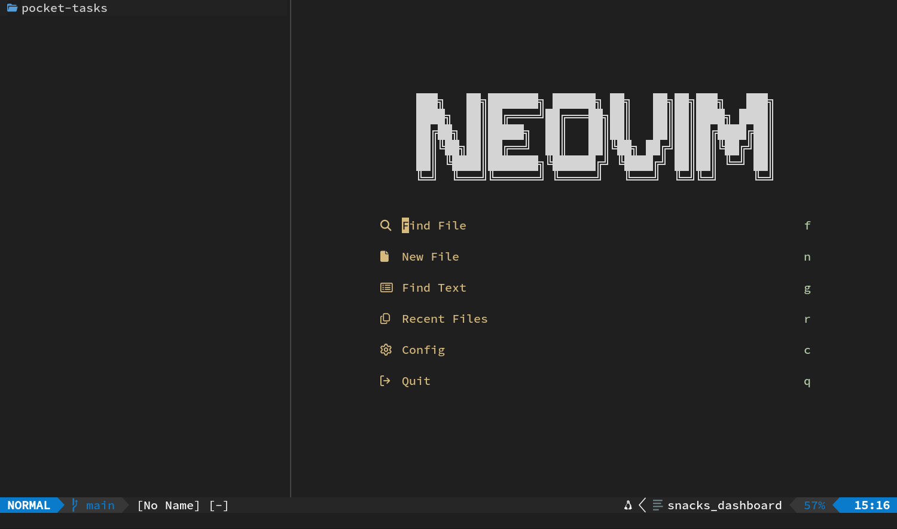
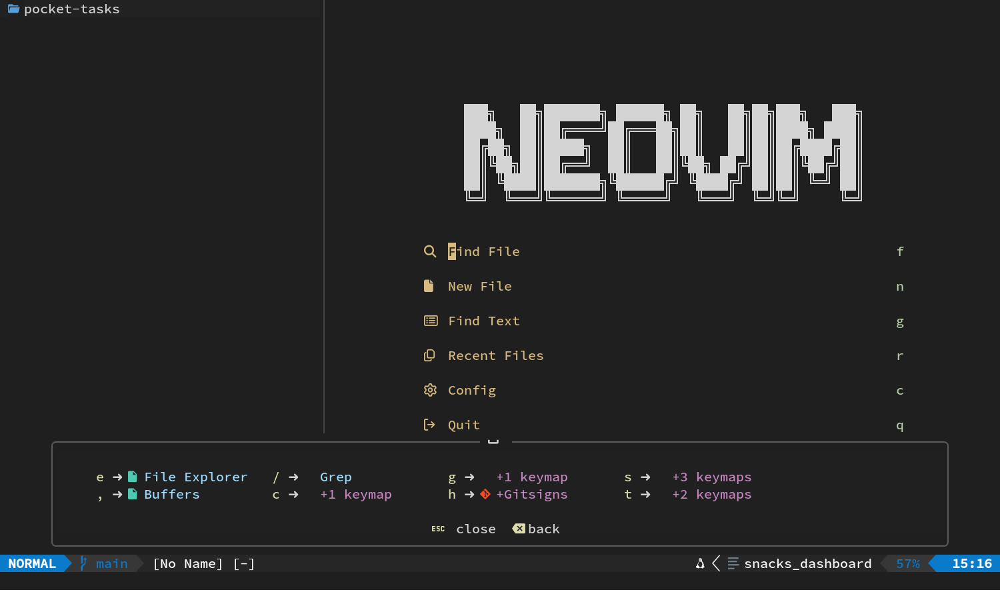
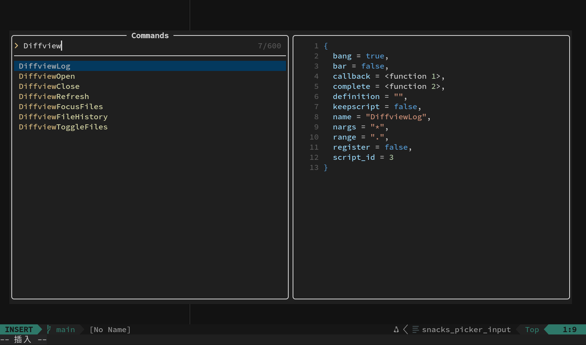

# 00｜认识界面和交互方式

这章咱不写代码，先把界面认清楚：屏幕上的各个区域分别有什么用、焦点现在落在哪里、接下来的按键会由谁接收。弄明白这些概念之后，你会发现日常操作其实没有多少。

## 本章只记三件事

- [[Esc]]：回到普通模式。
- [[Space]] 后停一下：打开 Which-key 提示。
- [[F1]]：打开命令搜索器。

其他按键暂时不用记，后面的章节会逐一练到。

## 四种启动场景

| 启动方式 | 会做什么 |
| --- | --- |
| `nvim .` | 打开当前目录，Snacks Explorer 接管目录；最近会话不会自动载入 |
| `nvim path/to/file.py` | 直接打开指定文件；最近会话不会自动载入 |
| 无参数的 `nvim`，已有会话 | 自动恢复最近保存的项目布局，随后打开 Explorer |
| 无参数的 `nvim`，没有会话 | 显示 Snacks Dashboard 启动页 |

因此，无论是新项目，还是想明确打开某个已有项目，都可以使用 `nvim .`。如果想接着上次保存的布局继续工作，直接运行 `nvim` 即可。



## 如果你看到了启动页

第一次无参数启动时，中央会有一个大标题和快捷入口：

| 键 | 效果 |
| --- | --- |
| [[f]] | 按文件名模糊查找文件 |
| [[n]] | 创建一个空 Buffer，并立即进入插入模式 |
| [[g]] | 搜索项目文字 |
| [[r]] | 查找最近打开的文件 |
| [[q]] | 退出 |

如果已经保存过会话，启动页可能只会闪一下，接着便恢复之前的窗口。这属于正常现象。

## Neovim 的模式

最常见的三个模式如下：

| 模式 | 你在做什么 | 如何进入 | 如何离开 |
| --- | --- | --- | --- |
| 普通模式 | 移动、删除、复制、触发快捷键 | 启动后默认处于这里 | 按进入其他模式的键 |
| 插入模式 | 输入文字 | [[i]]、[[a]]、[[o]] 等 | [[Esc]] |
| 可视模式 | 选择一段文字 | [[v]]、[[V]]、[[Ctrl]]+[[v]] | [[Esc]] |

此外还有终端模式、命令输入状态和 Picker 输入状态，后面用到时再分别介绍。

当前处于哪种模式，可以看底部状态栏的左侧。实在拿不准，就按一次 [[Esc]]；即使已经在普通模式，再按一次通常也不会修改内容。

## 屏幕从上到下

一个典型开发界面可以画成这样：

```text
┌──────────────────────── Tab 页签：只在多 Tab 时出现 ─────────────────────┐
│ Explorer 窗口 │                 代码窗口                │ 终端窗口（可选） │
│ 文件和目录树   │ 行号  │ Git/诊断标记 │ 文本               │ 测试、Git、命令 │
│              │      │             │                   │               │
├───────────────────────────────────────────────────────────────────────┤
│ 全局状态栏：模式、分支/差异、文件名、位置等                                  │
└───────────────────────────────────────────────────────────────────────┘
                       通知与 Picker 会临时浮在上面
```

还有几个值得留意的界面细节：

- 行号是绝对行号。
- 当前行和当前行号会高亮。
- 行号左侧的符号栏始终保留，用于显示 Git 修改、错误和警告。
- 缩进引导线来自 Snacks Indent。
- 状态栏由 Lualine 提供，并横跨整个 Neovim。
- 顶部显示的是 Tab 页签，不用于列出所有 Buffer。
- 通知会以浮窗出现，并在一段时间后自动隐藏。

## Buffer、Window 与 Tab 的区别

这三个概念很容易混在一起，最好现在就分清楚。

```text
Neovim
└── Tab page
    ├── Window A ──显示──> Buffer：model.py
    ├── Window B ──显示──> Buffer：test_service.py
    └── Window C ──显示──> Buffer：终端
```

### Buffer

Buffer 是已经载入内存的内容，通常对应一个文件。关闭 Window 并不等于关闭 Buffer，它仍然可以留在内存里。按 [[Space]] [[,]] 打开的列表，管理的主要就是 Buffer。

### Window

Window 是屏幕上用来显示内容的区域。两个 Window 可以各自显示不同文件，也可以同时显示同一个 Buffer 的不同位置。讲到分屏时，我们会用 [[Ctrl]]+[[w]] 配合方向键在 Window 之间切换。

### Tab page

Tab page 保存的是一整套 Window 布局。比如 Diffview 会新建一个 Tab，在里面放置文件面板和对比窗口。顶部出现页签后，可以用 [[g]] [[t]] 切到下一个 Tab，用 [[g]] [[T]] 切回上一个。

可以概括为：

> Buffer 保存内容，Window 显示内容，Tab 管理一组 Window。

## 三类临时界面

### Which-key

在普通模式按 [[Space]] 后停大约半秒，底部会弹出可继续输入的按键提示。

试一次：

1. 按 [[Esc]]，确认回到普通模式。
2. 按 [[Space]]。
3. 暂停，不要急着接下一键。
4. 看见 [[e]]、[[g]]、[[h]]、[[l]]、[[s]] 等分组。



5. 按 [[Esc]] 收起提示。

Which-key 会显示当前 Leader 前缀下可继续输入的按键。忘记某个组合时，可以先打开提示再选择。

### Snacks Picker

[[F1]]、[[Space]] [[/]] 和 [[Space]] [[,]] 都会打开 Picker。它通常包含输入框、结果列表和预览区。

通用操作：

| 键 | 效果 |
| --- | --- |
| 直接打字 | 缩小结果范围 |
| [[Ctrl]]+[[n]] / [[Ctrl]]+[[p]] | 选择下一项 / 上一项 |
| [[Down]] / [[Up]] | 同样选择下一项 / 上一项 |
| [[Enter]] | 确认当前项 |
| [[Esc]] | 取消并关闭 |

后面还会用到分屏打开、加入 Quickfix 等操作。

### 浮窗

诊断详情、Git hunk 预览、函数说明、重命名输入框都会使用浮窗。多数只读浮窗按 [[Esc]] 或移动光标便会离开。带输入框的浮窗通常用 [[Enter]] 确认，[[Esc]] 取消。

## F1 命令中心

你已经用过 [[F1]] → 输入 `wqa` → 连按两次回车。第一次回车只是把选中的命令填进底部命令行，第二次才会真正执行。下面再做两个不会改动内容的练习：

### 保存当前文件

1. 按 [[Esc]]。
2. 按 [[F1]]。
3. 输入 `write`。
4. 结果高亮到 Write 后按 [[Enter]]。Picker 关闭，底部出现 `:write`；冒号已经替你填好。
5. 再按一次 [[Enter]] 执行。

效果：当前 Buffer 写入磁盘，Neovim 保持打开。

### 查看可执行命令

1. 按 [[F1]]。
2. 输入 `Diffview`。
3. 用 [[Ctrl]]+[[n]] 浏览 `DiffviewOpen`、`DiffviewClose`、`DiffviewFileHistory`。



4. 按 [[Esc]]，这次什么也不执行。

也就是说，命令面板既能执行命令，也适合用来查找自己一时想不起名字的命令。

## 不同界面怎么回来

下面这张表先留作参考，不用背：

| 当前所在位置 | 回到代码的常用动作 |
| --- | --- |
| 插入模式 | [[Esc]] |
| Picker | [[Esc]] |
| Explorer | [[Space]] [[e]] 切换关闭 |
| 右侧终端 | [[Ctrl]]+[[&#92;]] 隐藏 |
| Quickfix 底部窗口 | [[Ctrl]]+[[w]]，再按 [[q]] |
| Diffview | [[F1]]，输入 `DiffviewClose`，连按两次回车 |

## 十秒自检

你现在应当能回答：

1. 想明确打开当前项目，用什么启动方式？
2. Buffer 和 Window 有什么关系？
3. 顶部页签表示 Buffer 还是 Tab？
4. 忘记 Leader 快捷键时，先按什么？
5. 不想输入冒号时，怎样执行命令？

答案依次是：`nvim .`；Window 显示 Buffer；Tab；空格后等待；[[F1]] 搜索命令。

下一章进入 [01：基础交互](01-survival-and-interface.md)，开始练习普通模式下的实际操作。
