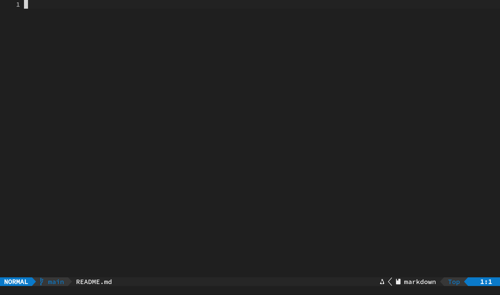
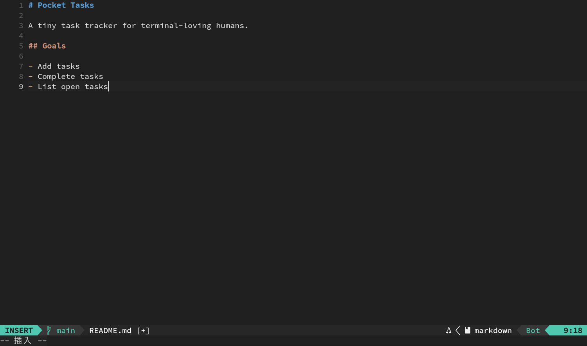
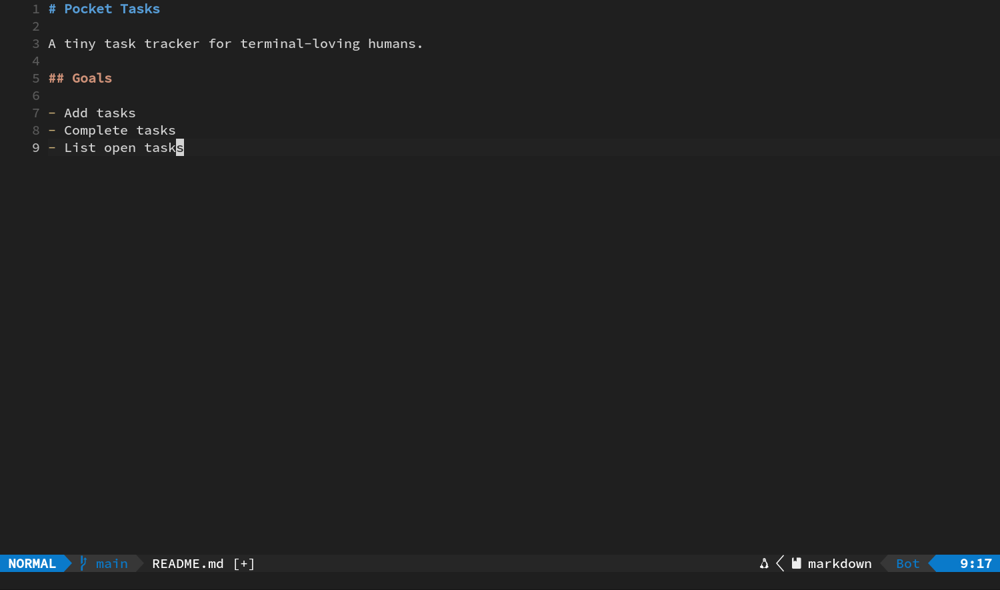
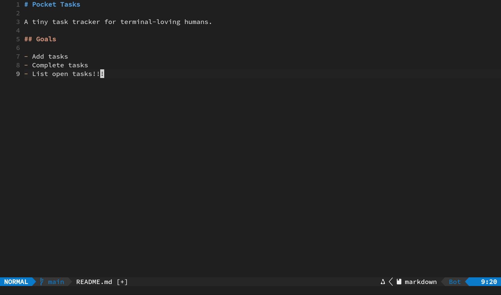
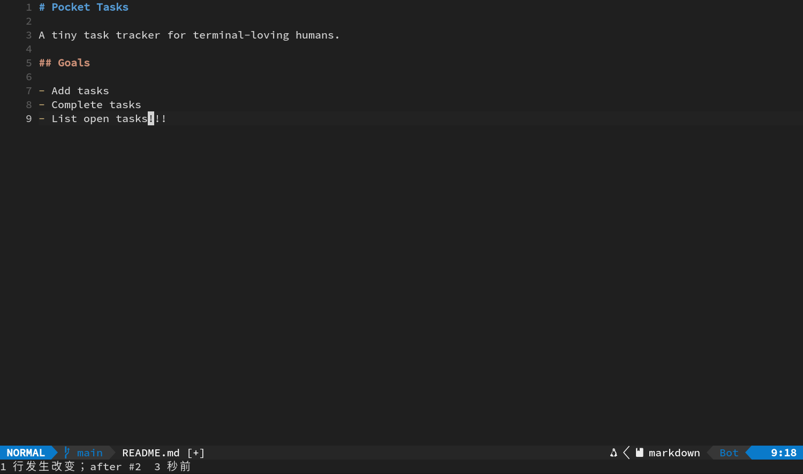
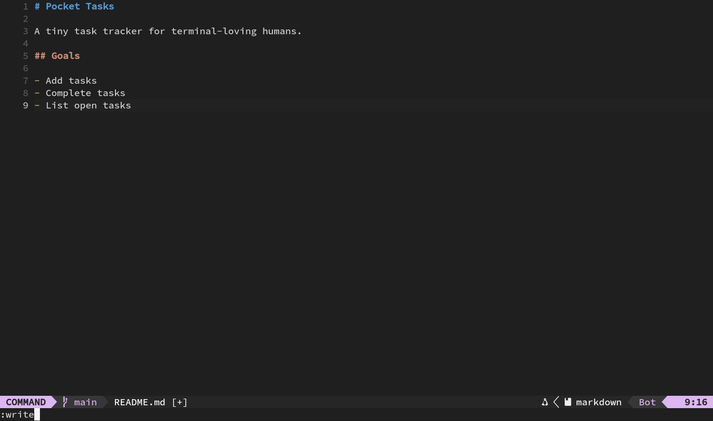
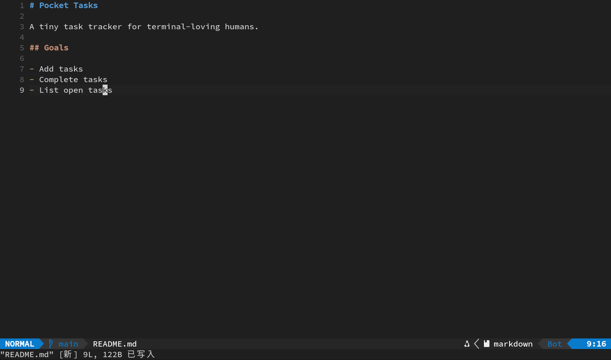
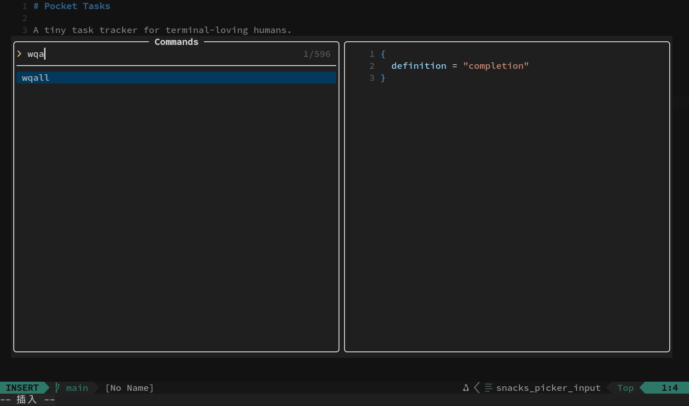
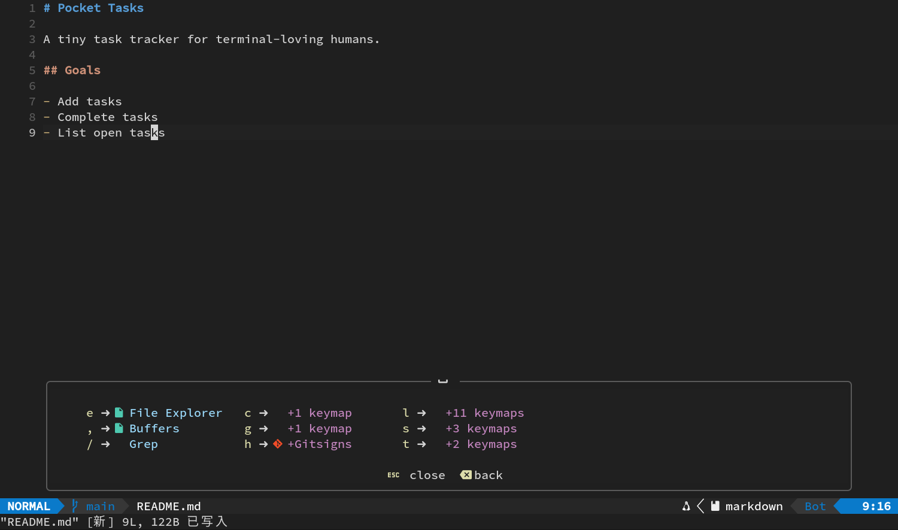

# 01｜基础交互：界面、模式、保存与撤销

这一章只有一个目标：让你在 Neovim 里随时知道自己处于什么状态、下一次按键会发生什么，以及怎样安全退出。

整套教程会持续完善同一个小项目 `pocket-tasks`。后续章节依赖前面的练习结果，因此请保留项目文件。

## 本章结束时，你会掌握

- 看懂屏幕上几个常驻区域；
- 在普通模式和插入模式之间切换；
- 用 `F1` 命令面板保存，不碰冒号；
- 撤销、重做，并确认文件何时真的写进磁盘；
- 读懂教程里的按键写法。

本章新增的按键不多，只有 `Esc`、`A`、`u`、`Ctrl-r` 和 `Space`。已经接触过的 `i` 与 `F1` 也会再练一次。

## 1. 建立练习项目

若你还停在第 00 章打开的 Neovim，先用 `F1`、`wqa`、`Enter`、`Enter` 回到终端。随后执行：

```bash
mkdir -p ~/playground/pocket-tasks
cd ~/playground/pocket-tasks
git init
nvim README.md
```

此时 `README.md` 可能还没有出现在磁盘上。Neovim 会先创建一个同名 Buffer，第一次保存后才会在磁盘上生成文件。



### 教程里的按键记号

| 写法 | 实际动作 |
| --- | --- |
| `Space e` | 依次按空格、`e`，无需同时按 |
| `Ctrl-r` | 按住 `Ctrl`，点一下 `r` |
| `F1` | 按键盘的 F1 |
| `Enter` | 回车 |
| `Esc` | 退出当前输入状态，回到普通模式 |

把空格设为 Leader。文中出现 `Space` 时，表示从 Leader 开始输入自定义快捷键。

## 2. 认识界面区域

刚打开文件时，屏幕大致分成这些区域：

1. **最左侧符号栏**：用于显示 Git 改动和诊断标记。当前配置始终保留这一列，没有标记时为空。
2. **行号栏**：显示绝对行号。当前行及其行号会高亮，便于确认光标位置。
3. **中央编辑区**：文件正文。波浪线 `~` 表示文件内容已经结束，它们不属于文件。
4. **顶部标签栏**：存在多个 Tab 时显示。Tab 表示一套窗口布局；文件内容保存在 Buffer 中，后面会专门练习。
5. **底部状态栏**：Lualine 会显示模式、文件名、Git 分支、诊断、光标位置等信息。不同文件和环境下，空着的项目会自动省略。
6. **最底部命令与消息行**：搜索内容、插件提示和保存结果会暂时显示在这里。

状态栏里若看到 `NORMAL`，说明键盘正用于发命令；看到 `INSERT`，说明键盘正用于输入文字。

## 3. 两个核心模式

同一个按键在不同模式下会有不同作用。现在先记住两种模式：

### 普通模式 Normal

这是默认模式。字母键在这里代表移动、删除、复制等动作。打开文件后通常就在普通模式。

### 插入模式 Insert

按 `i` 进入插入模式，随后输入的文字会写进文件。按 `Esc` 回普通模式。

可以把 `Esc` 当作返回普通模式的通用按键。只要不确定当前状态，就先按一次 `Esc`，再输入普通模式命令。

### 练习：写下第一份 README

确认底部显示普通模式，然后：

1. 按 `i`。
2. 输入下面的内容。换行就按 `Enter`。

```markdown
# Pocket Tasks

A tiny task tracker for terminal-loving humans.

## Goals

- Add tasks
- Complete tasks
- List open tasks
```



3. 全部输入完后按 `Esc`。

预期结果：正文已经出现在编辑区，底部模式回到 `NORMAL`。此刻内容仍可能只在内存里。



> 小提示：插入时输入 `(`、`[`、引号等字符，`mini.pairs` 会自动补上另一半。继续在中间打字即可；输入已有的右半边时，光标通常会越过它。

## 4. 从行尾继续写：`A`

普通模式下：

- `i`：在光标位置之前开始插入；
- `A`：跳到当前行末尾，并进入插入模式。

下面故意做一次临时修改：

1. 你现在应当停在最后一行附近。按 `A`。
2. 输入 `!!!`。
3. 按 `Esc`。

预期结果：最后一行变成 `- List open tasks!!!`。



需要在行尾补逗号、注释或参数时，`A` 很方便，因为它省去了先把光标移到行尾这一步。

## 5. 撤销与重做

普通模式下：

- `u`：撤销最近一次修改；
- `Ctrl-r`：重做刚撤销的修改。

接着上面的 `!!!` 练习：

1. 按 `u`，三个感叹号消失。


2. 按 `Ctrl-r`，三个感叹号回来。



3. 再按 `u`，把它们清掉，留下干净的 README。


预期结果：最后一行重新是 `- List open tasks`。

一次进入插入模式到离开，通常会被算作一个撤销单元。也就是说，从按 `i` 或 `A` 开始，到按 `Esc` 结束，这期间的修改往往可以用一次 `u` 全部撤销。如果希望撤销记录更细，可以每写一小段就回一次普通模式。

## 6. 用 `F1` 保存，不用输入冒号

默认情况下不会自动保存和格式化。你按下保存命令后，内容才写入磁盘。

### 只保存当前文件

1. 确认已按 `Esc` 回普通模式。
2. 按 `F1`，打开 Snacks 命令选择器。
3. 输入 `write`。


4. 按第一次 `Enter` 选中命令；底部命令行会出现自动填好的 `:write`。



5. 再按一次 `Enter` 执行。

预期结果：命令面板关闭，底部出现类似 `README.md written` 的消息，磁盘上出现 `README.md`。



命令面板里的基本交互：

- 直接打字：筛选命令；
- `Up` / `Down`：移动高亮项；
- 第一次 `Enter`：选中高亮命令并送到底部命令行；
- 第二次 `Enter`：执行命令；
- `Esc`：取消并关闭面板。

### 保存全部文件并退出

你已经使用过这个流程，这里再明确说明它的作用：

1. 普通模式按 `F1`；
2. 输入 `wqa`；



3. 连按两次 `Enter`：第一下选中，第二下执行。

`wqa` 会写入所有已修改缓冲区，然后退出全部窗口。

本章后面还要继续操作，所以现在只用 `write` 保存，先不要退出。等到最后检查时再用 `wqa`。

## 7. 用 `Space` 查看功能入口

在普通模式按一下 `Space`，稍等片刻。Which-key 会列出当前可用的后续按键。你无需背完整菜单，先建立一个习惯：



> 想查找某个功能时，先按 `Space` 查看 Which-key 提示。

目前只观察，不选择功能。按 `Esc` 收起菜单。

后面很快会用到：

- `Space e`：文件浏览器；
- `Space ,`：已打开文件列表；
- `Space /`：全项目文字搜索；
- `Space g s`：Git 变更视图；
- `Space c f`：格式化当前文件。

这些按键是依次输入的。例如 `Space c f` 就是空格、`c`、`f` 三下。

## 8. 退出前检查

离开前逐项确认：

- README 内容与示例一致；
- `!!!` 已经清理；
- 你能看出底部当前显示 `NORMAL` 还是 `INSERT`；
- 你明确知道当前配置不会自动保存。

现在按：

```text
Esc  →  F1  →  wqa  →  Enter  →  Enter
```

回到终端后运行 `ls`，应该能看到 `README.md`。

## 本章肌肉记忆

| 目标 | 按键 |
| --- | --- |
| 开始输入 | `i` |
| 从行尾追加 | `A` |
| 回普通模式 | `Esc` |
| 撤销 | `u` |
| 重做 | `Ctrl-r` |
| 打开命令面板 | `F1` |
| 保存当前文件 | `F1`，输入 `write`，`Enter`，`Enter` |
| 保存全部并退出 | `F1`，输入 `wqa`，`Enter`，`Enter` |
| 查看 Leader 提示 | `Space`，稍等 |

下一章：[用 Snacks Explorer 搭项目骨架](02-explorer-and-skeleton.md)
