# 02｜Snacks Explorer：创建项目结构

上一章只建了一个 README。这一章换用 Snacks Explorer 来创建目录和文件，顺便练习改名、删除，以及在侧栏和正文窗口之间来回切换。

最终会得到：

```text
pocket-tasks/
├── .editorconfig
├── README.md
├── pyproject.toml
├── src/
│   └── pocket_tasks/
│       ├── __init__.py
│       └── model.py
└── tests/
    └── __init__.py
```

接下来我们分几轮来做，每轮只加两三个新操作。

## 1. 打开项目与文件树

在终端进入上一章的目录：

```bash
cd ~/playground/pocket-tasks
nvim README.md
```

普通模式按 [[Space]] [[e]]。

左侧会打开 Snacks Explorer，焦点也会落到文件列表里。它会跟着当前文件走，所以 `README.md` 通常已经处于高亮状态。


### 第一轮按键：打开、移动、收起

| 按键 | Explorer 中的效果 |
| --- | --- |
| [[j]] / [[k]] | 高亮下一个 / 上一个条目 |
| [[Enter]] 或 [[l]] | 目录会展开或折叠；文件会在编辑窗口打开 |
| [[h]] | 收起高亮目录；高亮文件时会收起它所在的目录 |
| [[q]] 或 [[Esc]] | 关闭 Explorer |
| [[Space]] [[e]] | 切换 Explorer；已打开时再按会关闭它 |

先用 [[j]]、[[k]] 在列表里上下走几次，再回到 `README.md`，按 [[Enter]] 打开它。

Explorer 打开文件后不会收起侧栏，只会把焦点切到正文。现在屏幕里有两个窗口：左边是 Explorer，右边是文件。

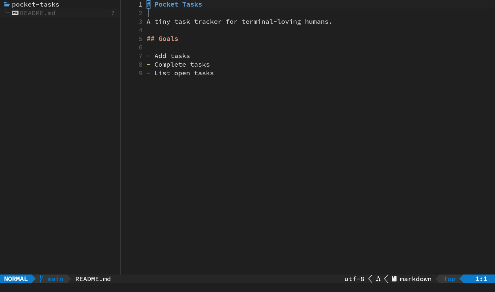

### 在两个窗口之间切换焦点

| 按键 | 效果 |
| --- | --- |
| [[Ctrl]]+[[w]] [[h]] | 去左侧窗口 |
| [[Ctrl]]+[[w]] [[l]] | 去右侧窗口 |

这里的 [[Ctrl]]+[[w]] [[h]] 要分两段按：先按住 [[Ctrl]] 点一下 [[w]]，松开以后再按 [[h]]。

来回练习两次：

1. 在正文按 [[Ctrl]]+[[w]] [[h]]，焦点回 Explorer。
2. 按 [[Ctrl]]+[[w]] [[l]]，焦点回 README。
3. 再按 [[Ctrl]]+[[w]] [[h]]，将焦点留在 Explorer，继续后面的操作。

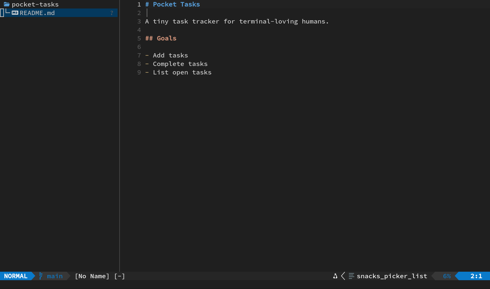

> 同一个按键放在不同窗口里，作用也不一样：在正文中，[[h]] 是向左移动一个字符；到了 Explorer 里，[[h]] 就会收起目录。动手前先看清焦点在哪个窗口。

## 2. 新建 `.editorconfig`

确认 `README.md` 高亮，然后：

### 练习文件名筛选

项目一大，光靠 [[j]] 一项项找文件就有点慢了。在 Explorer 里按 [[/]]，可以直接按文件名筛选：

1. 按 [[/]]，焦点来到筛选输入框。
2. 输入 `README`。

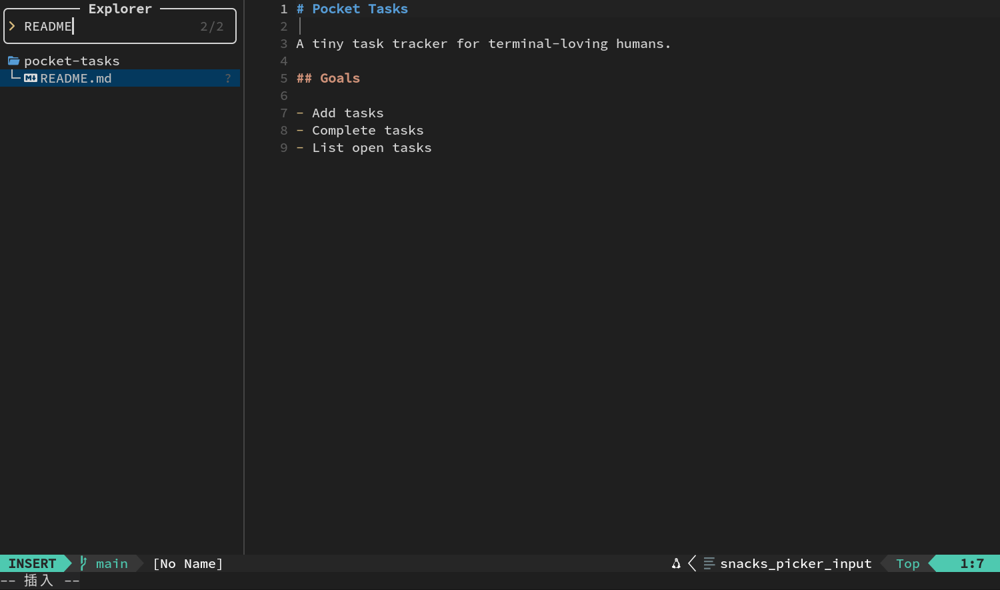

3. 第一次按 [[Enter]]，焦点回到文件树，并定位匹配项。

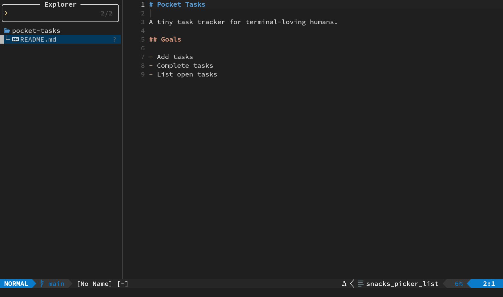

4. 第二次按 [[Enter]]，打开 `README.md`。
5. 按 [[Ctrl]]+[[w]] [[h]] 回到 Explorer，按 [[q]] 关闭，再按 [[Space]] [[e]] 重新打开完整的文件树。

可以这么记：[[/]] 负责筛选，第一次 [[Enter]] 回到文件树并找到结果，第二次 [[Enter]] 才是打开文件。

再次确认根目录的 `README.md` 高亮，然后：

1. 按 [[a]]，弹出“Add a new file or directory”输入框。
2. 输入 `.editorconfig`。

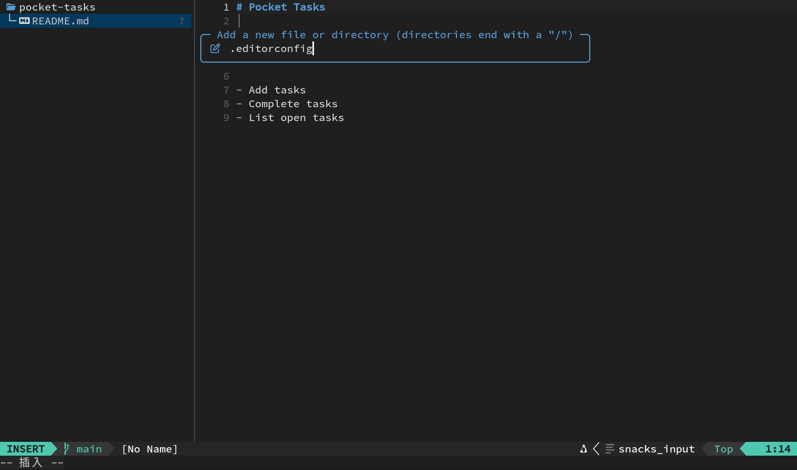

3. 按 [[Enter]]。

[[a]] 会根据当前高亮的位置，决定把文件或目录建在哪儿：

- 高亮文件时，创建在该文件的同级目录；
- 高亮目录时，创建在该目录里面；
- 输入以 `/` 结尾的名字时，创建目录；
- 输入普通名字时，创建空文件。

Snacks Explorer 的 [[a]] 会立刻在磁盘上创建空文件。所以这时候，`.editorconfig` 已经真的存在了。

### 显示和隐藏点文件

`.editorconfig` 的名字以点开头，算是隐藏文件。Explorer 默认不显示这类文件，所以刚创建完时，你可能在树里找不到它。现在按 [[H]]，`.editorconfig` 就会出现并被高亮。

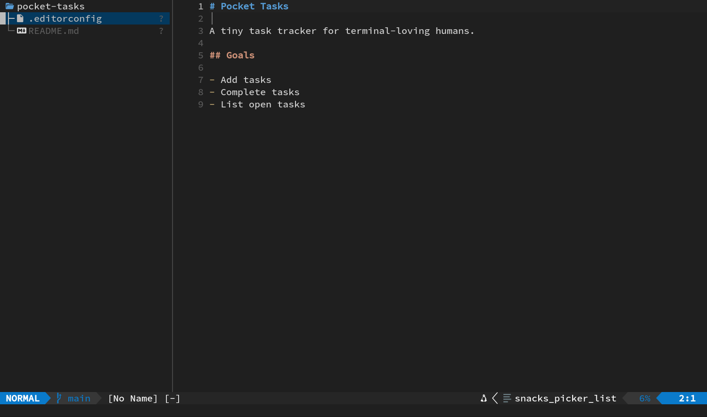

再按一次 [[H]]，它会从树中隐藏：

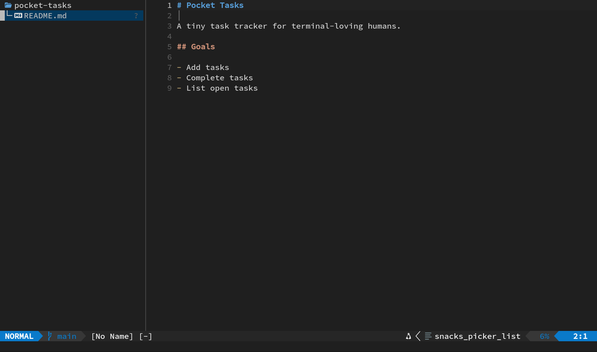

最后再按一次 [[H]]，让 `.editorconfig` 重新出现并保持可见，继续后面的编辑。


以后想看 `.gitignore`、`.env.example` 这类点文件，也按这个键。

高亮 `.editorconfig` 后按 [[Enter]]。

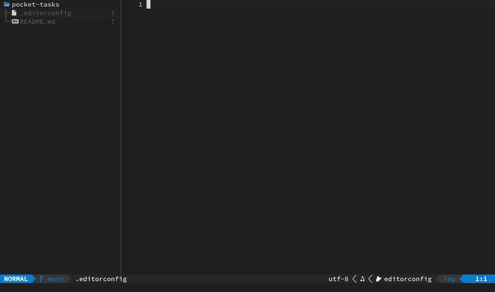

在正文里按 [[i]]，输入：

```ini
root = true

[*]
indent_style = space
indent_size = 4
charset = utf-8
end_of_line = lf
insert_final_newline = true

[*.nix]
indent_size = 2
```

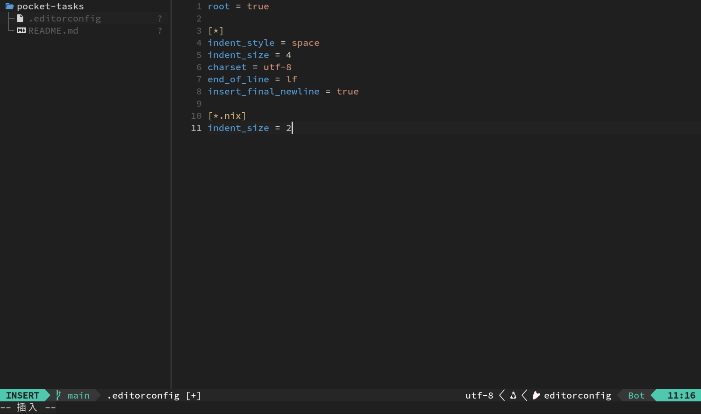

输完以后按 [[Esc]]，再用 [[F1]]、`write`、[[Enter]]、[[Enter]] 保存。

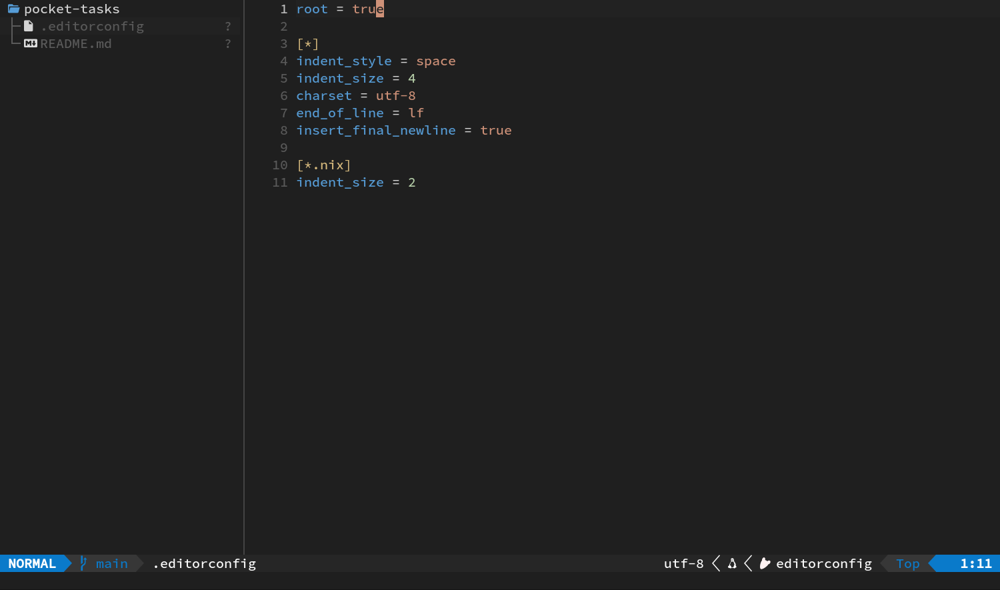

这份文件规定了项目怎么缩进：普通文件用 4 个空格，Nix 文件用 2 个空格。Neovim 的全局缩进宽度目前是 8，不过进入这个项目后，EditorConfig 会覆盖掉它；`vim-sleuth` 也会根据现有文件判断项目的缩进习惯。

按 [[Ctrl]]+[[w]] [[h]] 回 Explorer。

## 3. 用 [[a]] 创建其余文件

下面的操作都在 Explorer 里完成。输入框弹出来后，填好名字，再按 [[Enter]]。

### 创建根目录文件

当前高亮 `.editorconfig`，它位于项目根目录。按 [[a]]，输入 `pyproject.toml`，先不要回车。

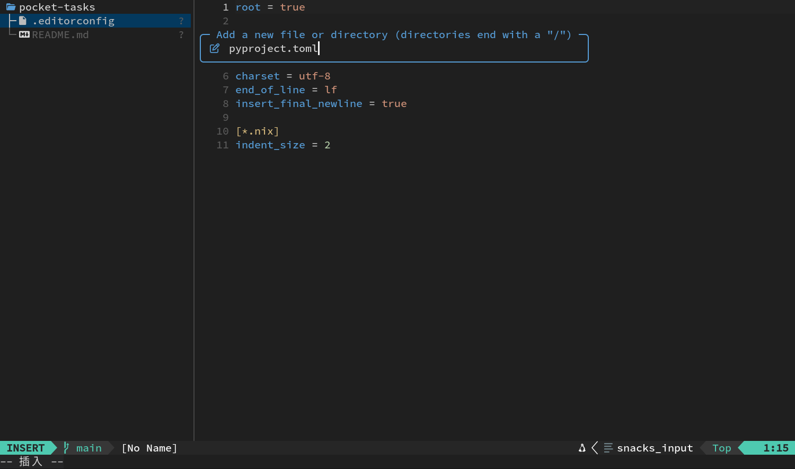

按 [[Enter]] 创建文件。

完成后，根目录里会多出一个空的 `pyproject.toml`，高亮也会停在它上面。

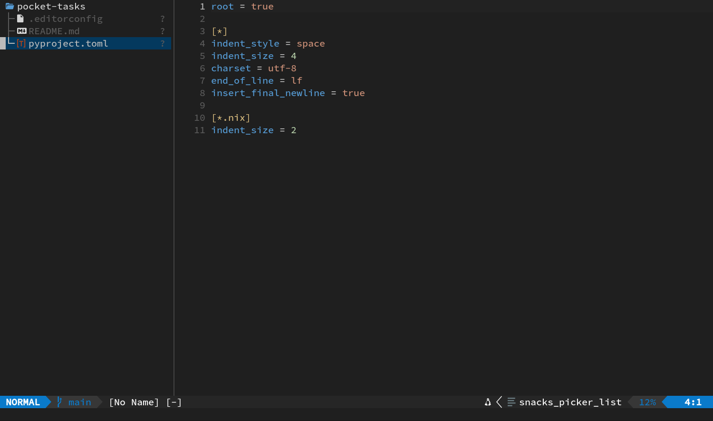

### 一次创建嵌套目录

继续按 [[a]]，输入 `src/pocket_tasks/`，先不要回车。

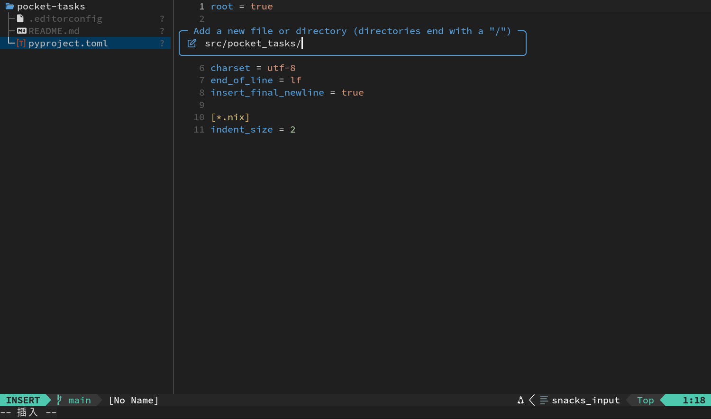

按 [[Enter]] 创建目录。

末尾的 `/` 很关键，它是在告诉 Explorer：要创建的是目录。中间还不存在的 `src/` 也会顺手建好。文件树会一路展开到新目录，高亮停在 `pocket_tasks/` 上。

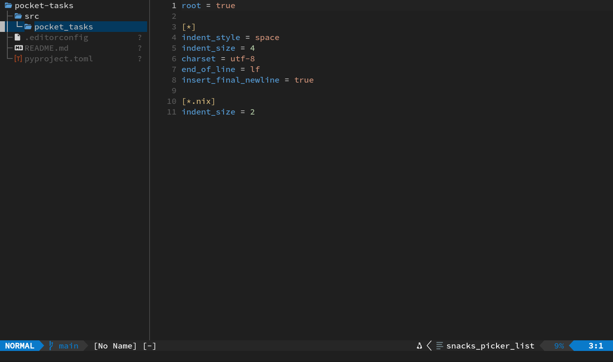

现在高亮的是一个目录，接下来的文件都会建到里面。先按 [[a]]，输入 `__init__.py`。


按 [[Enter]] 创建它，再按 [[a]]，输入 `model.py`。

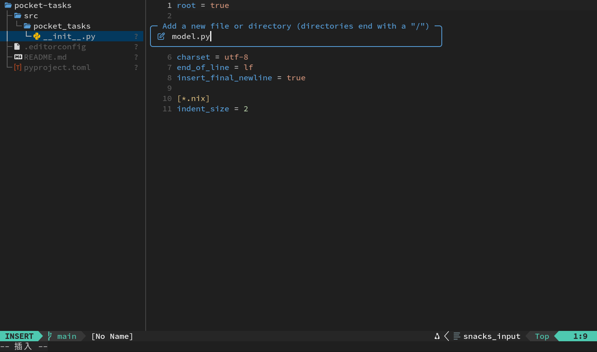

按 [[Enter]] 创建第二个文件。

完成后，`src/pocket_tasks/` 里应该有两个空的 Python 文件。

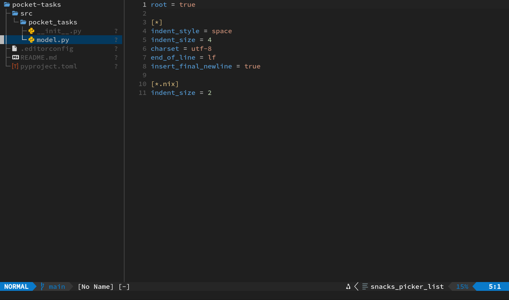

### 回到项目根目录，创建测试目录

当前高亮 `model.py`。按两次 [[h]]：

1. 第一次收起 `pocket_tasks/`；
2. 第二次收起 `src/`。

用 [[j]] / [[k]] 移到根目录下的 `README.md` 或 `pyproject.toml`。具体是哪一个不重要，只要高亮的是根目录里的文件就行。

随后按 [[a]]，输入 `tests/`。

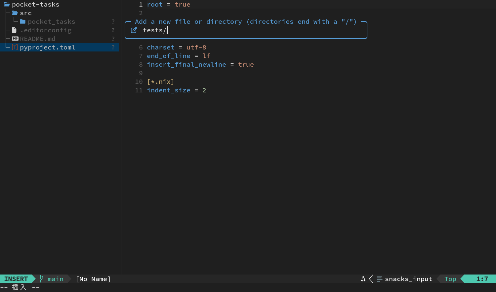

按 [[Enter]] 创建目录。

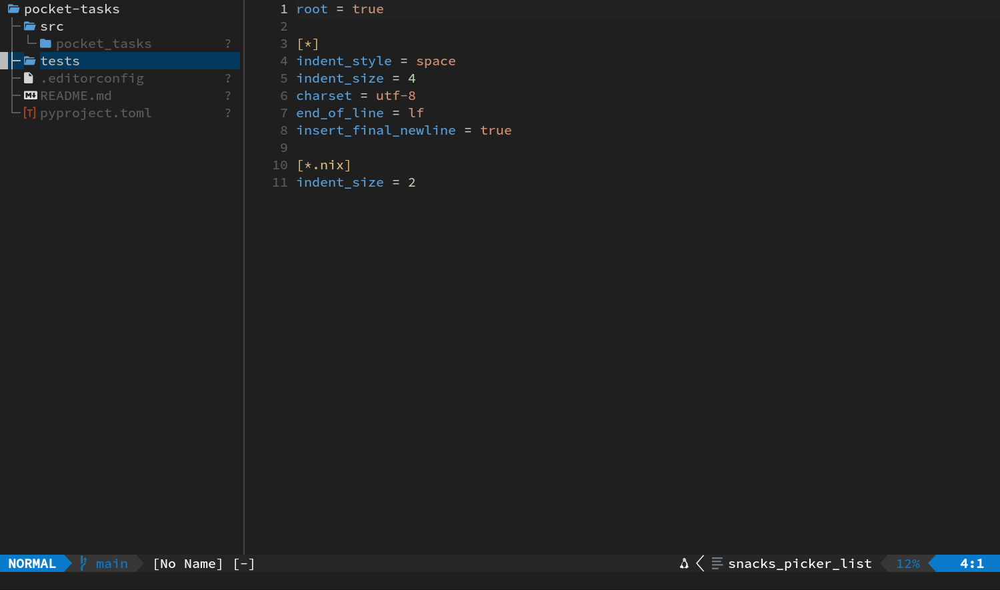

保持高亮在 `tests/`，按 [[a]]，输入 `__init__.py`。

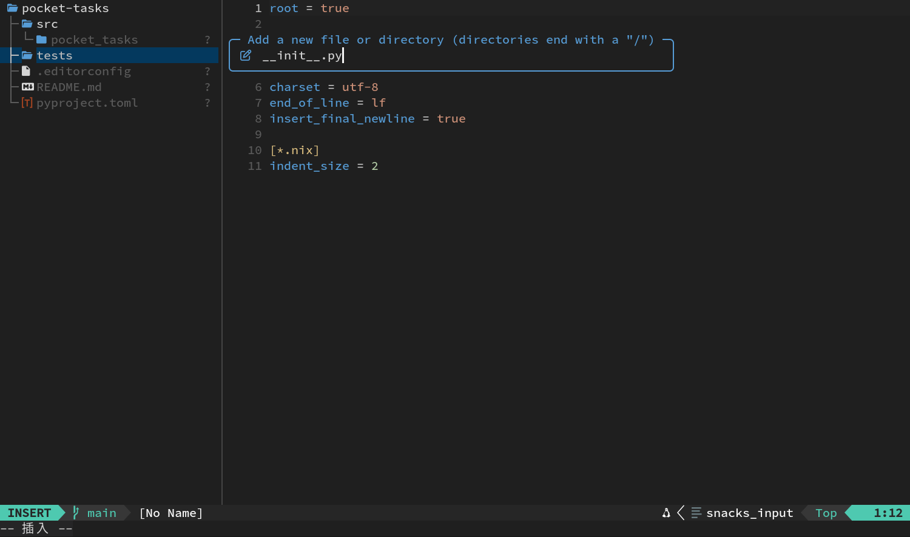

按 [[Enter]] 创建文件。

完成后，根目录里会出现 `tests/`，里面有一个空的 `__init__.py`。

> [!CAUTION] Explorer 的磁盘操作不能用 u 键撤销
> 如果文件建错了地方，可以在下一节用改名或删除来修正。[[u]] 没法可靠撤销 Explorer 对磁盘的操作，所以动手前一定要看清当前高亮的是谁。

## 4. 用临时文件练习改名与删除

这一轮只新增 [[r]] 和 [[d]]。

当前高亮的是 `tests/__init__.py`，所以按 [[a]] 会在 `tests/` 里创建同级文件。按 [[a]]，输入 `scratch.txt`。

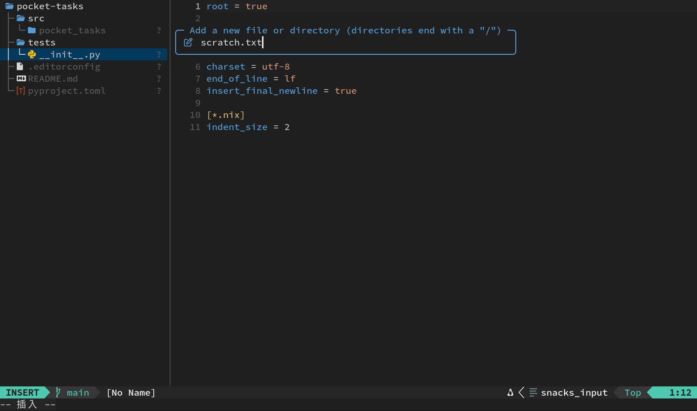

按 [[Enter]] 创建它。

### 改名：[[r]]

高亮 `scratch.txt`，按 [[r]]，把名字改成 `scratch.tmp`。

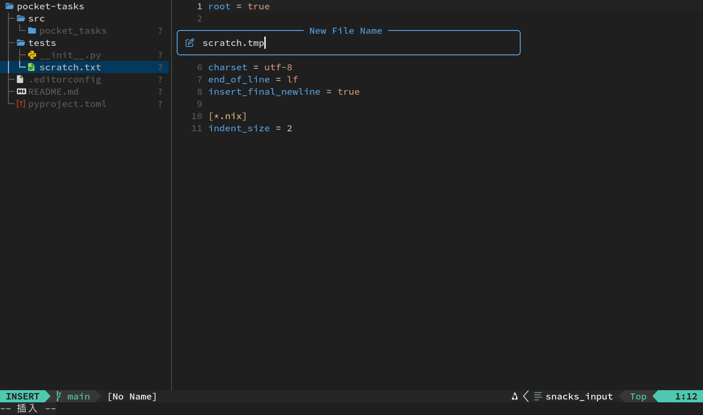

按 [[Enter]] 确认改名。

完成后，`scratch.txt` 会消失，原来的位置会出现 `scratch.tmp`。

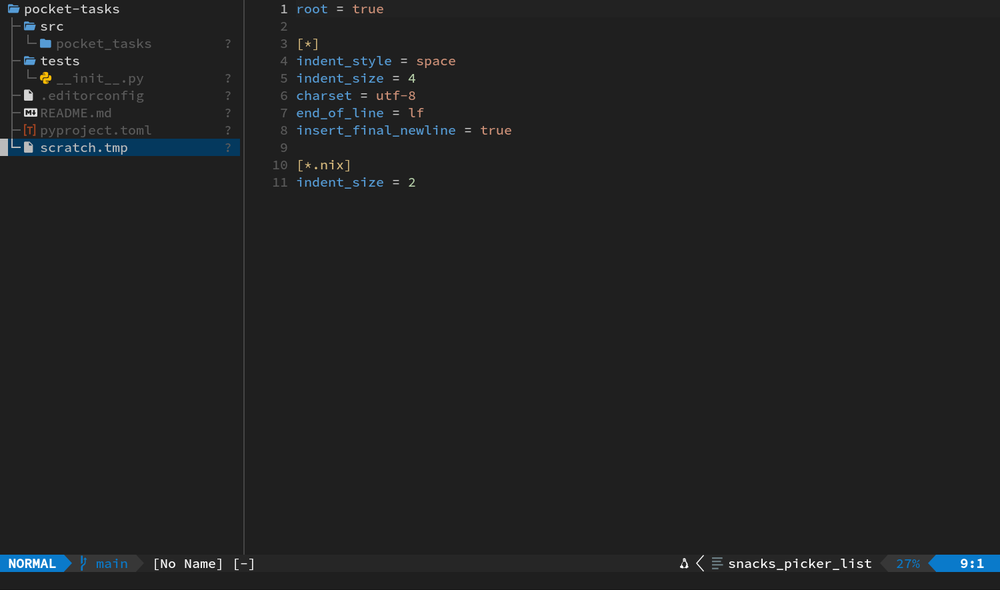

### 删除：[[d]]

高亮 `scratch.tmp`，按 [[d]]。确认选择器会显示 `No` 和 `Yes`：

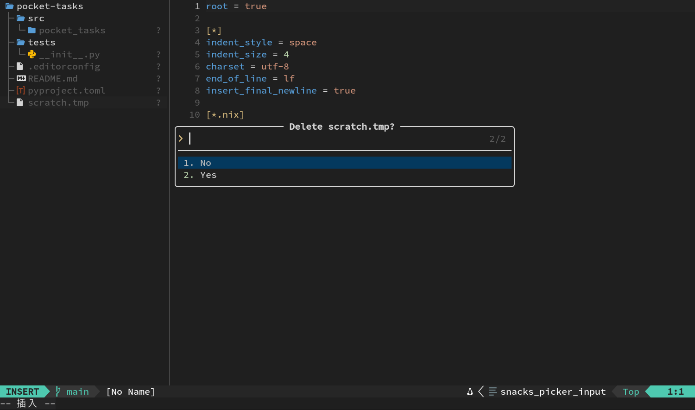

1. 用 [[j]] 或 [[Down]] 高亮 `Yes`；
2. 按 [[Enter]]。

完成后，`scratch.tmp` 会从文件树里消失。

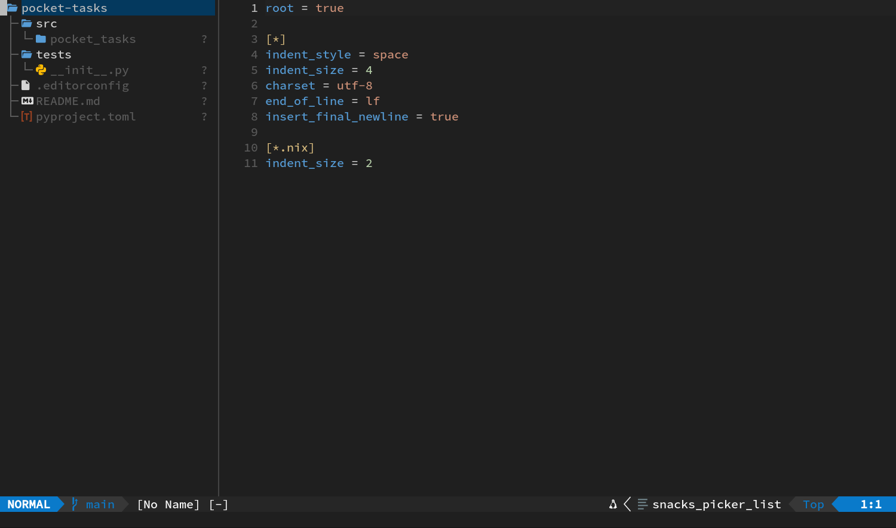

当前系统里没有 Snacks 能用的回收站命令，所以文件一旦删掉，就没法直接恢复。这一节才特意拿临时文件练手。以后按 [[d]] 之前，记得先核对文件名；如果用 [[Tab]] 标记过多个条目，还要把整个选择范围看一遍。

[[d]] 永远会作用在当前高亮项上，目录同样会被删除。确认之前，务必再检查一次完整提示。

## 5. Explorer 的上下文规则

记住下面三种情况，基本就不会搞错 [[a]] 到底会把东西建在哪儿：

| 当前高亮 | 输入 | 创建位置 |
| --- | --- | --- |
| 根目录的 `README.md` | `notes.md` | 项目根目录 |
| `src/` 目录 | `demo.py` | `src/demo.py` |
| `src/pocket_tasks/model.py` | `service.py` | `src/pocket_tasks/service.py` |

也可以直接在输入框里写相对路径，比如 `docs/guide.md`；缺少的父目录，Explorer 会一起建好。

## 6. 骨架验收

在 Explorer 按 [[h]] 收起目录，再用 [[l]] 展开，确认结构与章首一致。

最后：

1. 按 [[q]] 关闭 Explorer；
2. 按 [[F1]]，输入 `wqa`，连按两次 [[Enter]]。

回到终端可用下面的命令核对：

```bash
find . -maxdepth 4 -type f | sort
```

应看到：

```text
./.editorconfig
./README.md
./pyproject.toml
./src/pocket_tasks/__init__.py
./src/pocket_tasks/model.py
./tests/__init__.py
```

## 本章肌肉记忆

| 目标 | 按键 |
| --- | --- |
| 切换 Explorer | [[Space]] [[e]] |
| 上下选择 | [[j]] / [[k]] |
| 打开文件或切换目录 | [[Enter]] 或 [[l]] |
| 收起目录 | [[h]] |
| 新建 | [[a]] |
| 改名 | [[r]] |
| 删除 | [[d]]，选择 `Yes` |
| 切换隐藏文件 | [[H]] |
| 按文件名筛选 | [[/]]，输入文字，按两次 [[Enter]] |
| 左右窗口切换 | [[Ctrl]]+[[w]] [[h]] / [[Ctrl]]+[[w]] [[l]] |
| 关闭 Explorer | [[q]] 或 [[Esc]] |

上一章：[先活下来](01-survival-and-interface.md) · 下一章：[移动与小修改](03-navigation-and-small-edits.md)
