# 03｜移动与小修改

频繁使用鼠标会打断输入节奏，方向键又离主键区较远。这一章开始练习普通模式下的光标移动，同时通过几处小修改补全 `pyproject.toml` 和 README。

按键分四轮学习：

1. [[h]] [[j]] [[k]] [[l]]；
2. [[w]] [[b]] [[e]] 与 [[0]] [[^]] [[$]]；
3. [[g]] [[g]] [[G]] 与文件内搜索；
4. [[I]] [[A]] [[o]] [[O]]、[[x]]、[[r]]。

每一轮都会先做一个短练习，再把刚学到的操作用到项目里。

## 1. 填写 `pyproject.toml`

在终端进入项目：

```bash
cd ~/playground/pocket-tasks
nvim pyproject.toml
```

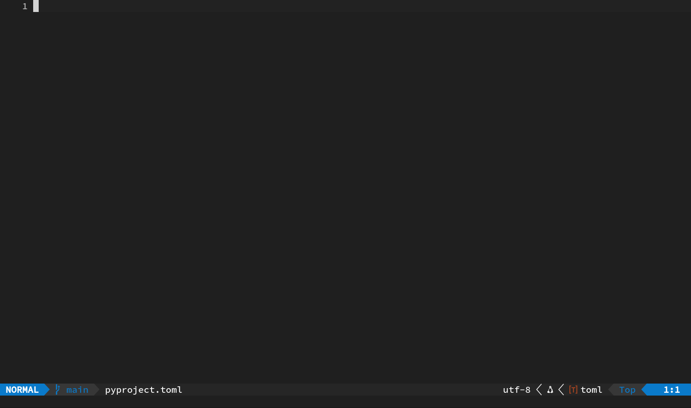

按 [[i]]，输入下面的完整内容：

```toml
[project]
name = "pocket-tasks"
version = "0.1.0"
requires-python = ">=3.11"

[tool.basedpyright]
extraPaths = ["src"]
typeCheckingMode = "standard"
```

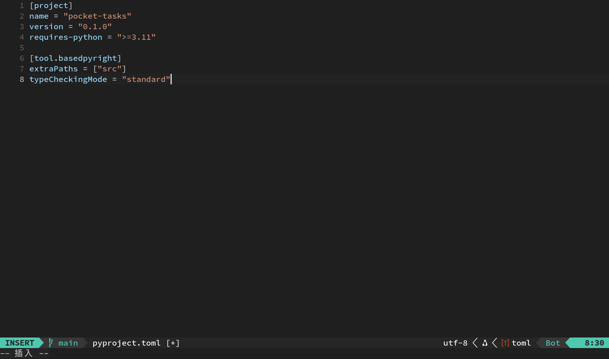

输入完后按 [[Esc]]。

输入引号和方括号时，`mini.pairs` 会补全右半边。你照常输入右引号或右方括号，光标会越过已经存在的字符。

暂时不要保存，下面会使用这八行文字练习移动。

## 2. 第一轮：单格移动 [[h]] [[j]] [[k]] [[l]]

普通模式中：

| 按键 | 效果 |
| --- | --- |
| [[h]] | 左移一个字符 |
| [[j]] | 下一行 |
| [[k]] | 上一行 |
| [[l]] | 右移一个字符 |

这四个键排在同一行，左手不必离开主键区。先随意移动十几次，观察当前行高亮和行号怎样跟随光标变化。

有两个边界规则：

- [[h]] 到行首就停；
- [[l]] 到行尾就停。

移动到边界后便会停下，不会自动跳到相邻行。

### 小练习

1. 用 [[j]] 到 `version` 那一行。
2. 用 [[l]] 向右移动到 `0.1.0` 附近。

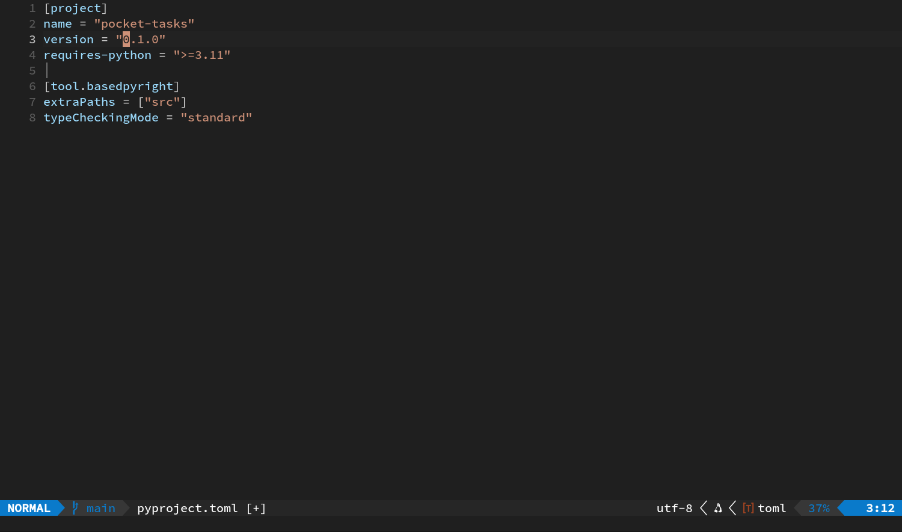

3. 用 [[k]] 回到 `name` 行。
4. 用 [[h]] 向左移动。

这一轮追求方向感，无需精确停在某个字符。

## 3. 第二轮：按词和按行跳

逐字符移动适合微调，距离较远时可以使用下面这些按键。

### 按词移动

| 按键 | 效果 |
| --- | --- |
| [[w]] | 跳到下一个词块的开头 |
| [[b]] | 跳到前一个词块的开头 |
| [[e]] | 跳到当前或下一个词块的末尾 |

标点也会形成独立的词边界。因此在 `version = "0.1.0"` 这一行里，等号、引号和句点都可能是 [[w]] 停下的位置。

### 在一行内直达

| 按键 | 效果 |
| --- | --- |
| [[0]] | 到这一行的第 1 列 |
| [[^]] | 到这一行第一个非空白字符 |
| [[$]] | 到这一行最后一个字符 |

在当前 TOML 文件里，行首没有缩进，所以 [[0]] 和 [[^]] 看起来相同。等写 Python 类时，[[0]] 会落在缩进空格上，[[^]] 会落在第一个代码字符上。

### 精确练习

1. 用 [[j]] / [[k]] 到 `requires-python` 行。
2. 按 [[0]]，光标到行首的 [[r]]。
3. 连续按几次 [[w]]，观察它依次越过键名、连字符、等号和字符串。

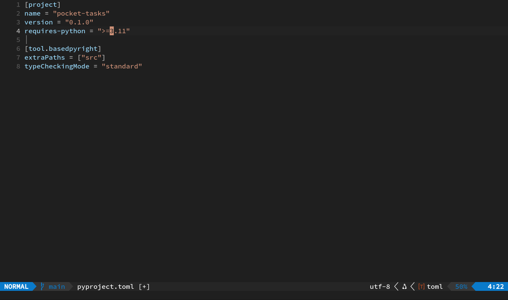

4. 按 [[$]]，光标到最后一个引号。
5. 按 [[b]]，向前回到前一个词块。
6. 按 [[^]]，回到行首第一个有效字符。

## 4. 第三轮：文件级跳转

| 按键 | 效果 |
| --- | --- |
| [[g]] [[g]] | 文件第一行 |
| [[G]] | 文件最后一行 |
| ` 数字 G` | 跳到指定行，例如 [[3]] [[G]] 去第 3 行 |

依次试：

1. [[g]] [[g]]：到 `[project]`。
2. [[G]]：到 `typeCheckingMode`。

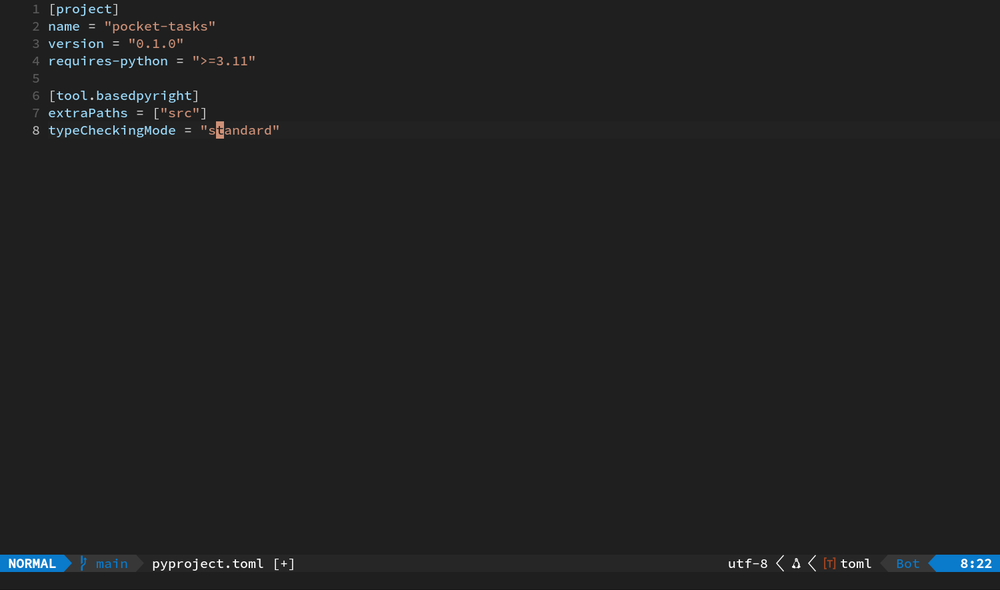

3. [[3]] [[G]]：到 `version`。

数字可以给很多普通模式动作加次数。[[5]] [[j]] 表示向下五行，[[3]] [[w]] 表示向前跳三个词块。暂时把它当作“动作前面的倍数”。

现在用 [[F1]]、`write`、[[Enter]]、[[Enter]] 保存 `pyproject.toml`。

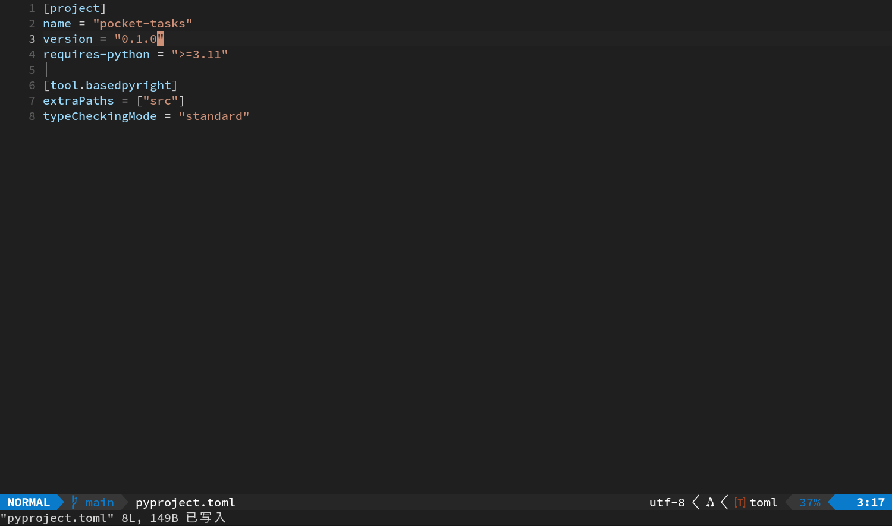

## 5. 文件内搜索：[[/]]、[[n]]、[[N]]

你已经会 [[Space]] [[/]]，它调用 Snacks Grep 搜索整个项目。少了前面的 [[Space]]，单独 [[/]] 会搜索当前缓冲区。

打开 README：

1. 按 [[Space]] [[e]] 打开 Explorer。
2. 用 [[j]] / [[k]] 高亮 `README.md`。

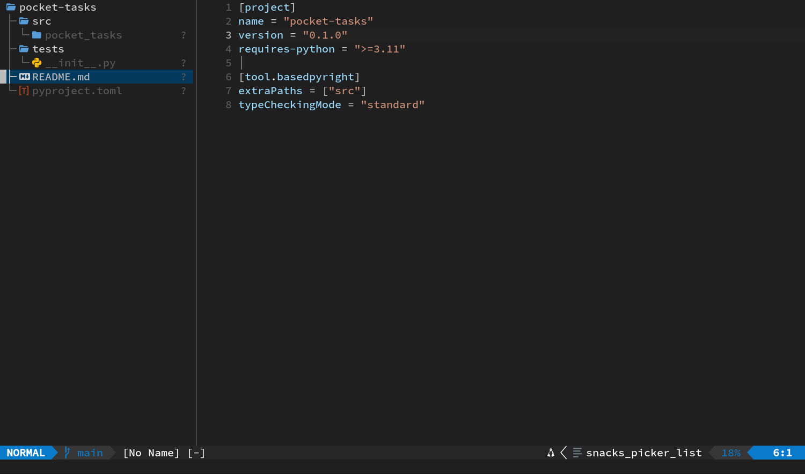

3. 按 [[Enter]]。

焦点来到 README 后，输入 `/tasks`，先不要回车。

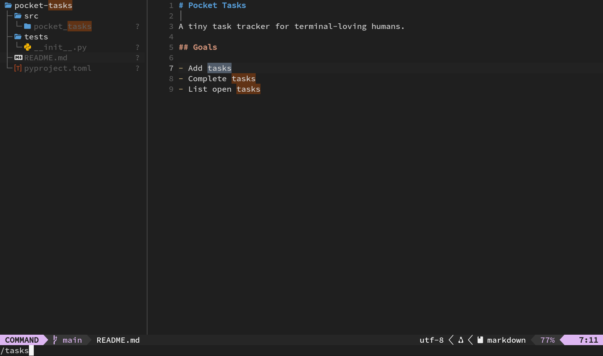

底部会先接收搜索词。按 [[Enter]] 后，光标跳到下一个小写 `tasks`。

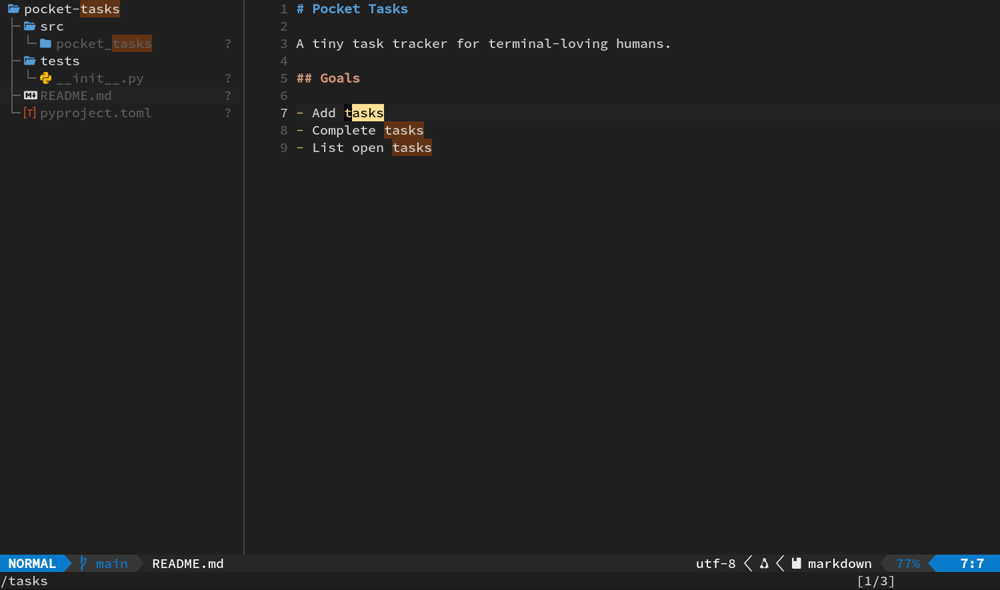

| 按键 | 效果 |
| --- | --- |
| `/文字 `，[[Enter]] | 在当前文件中向后搜索 |
| [[n]] | 沿相同方向找下一处 |
| [[N]] | 反方向找上一处 |
| [[Ctrl]]+[[l]] | 清掉屏幕上的搜索高亮并重绘界面 |

当前配置区分大小写，所以 `/tasks` 不会命中标题里的 `Tasks`。搜索越过文件末尾时会从开头继续，并在底部给出提示。

练习：先按两次 [[n]]。

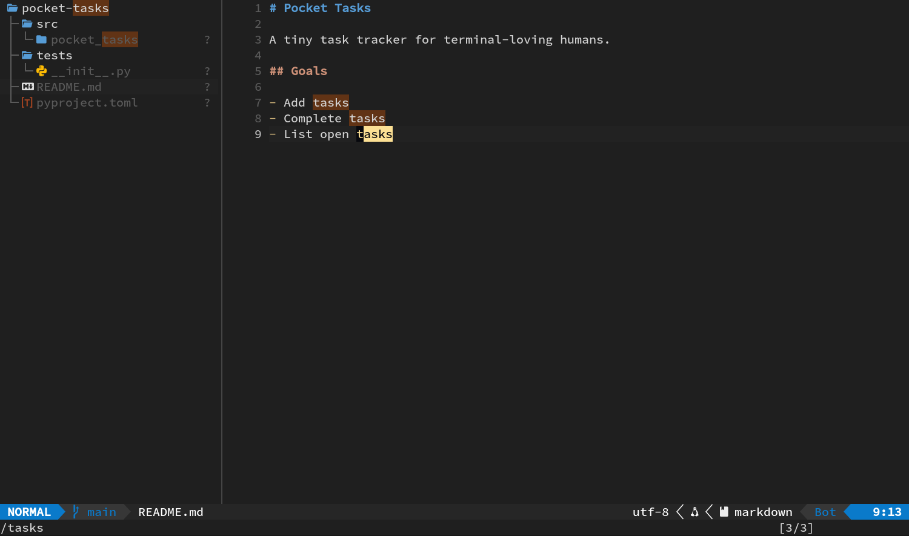

再按一次 [[N]]。

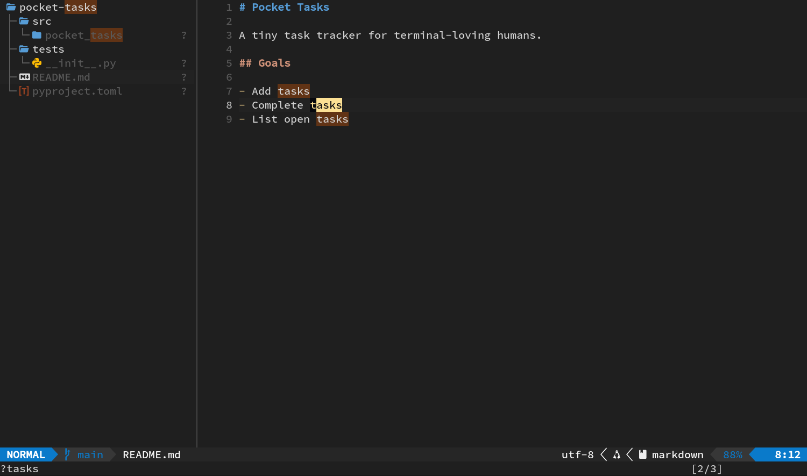

最后按 [[Ctrl]]+[[l]] 清掉高亮。

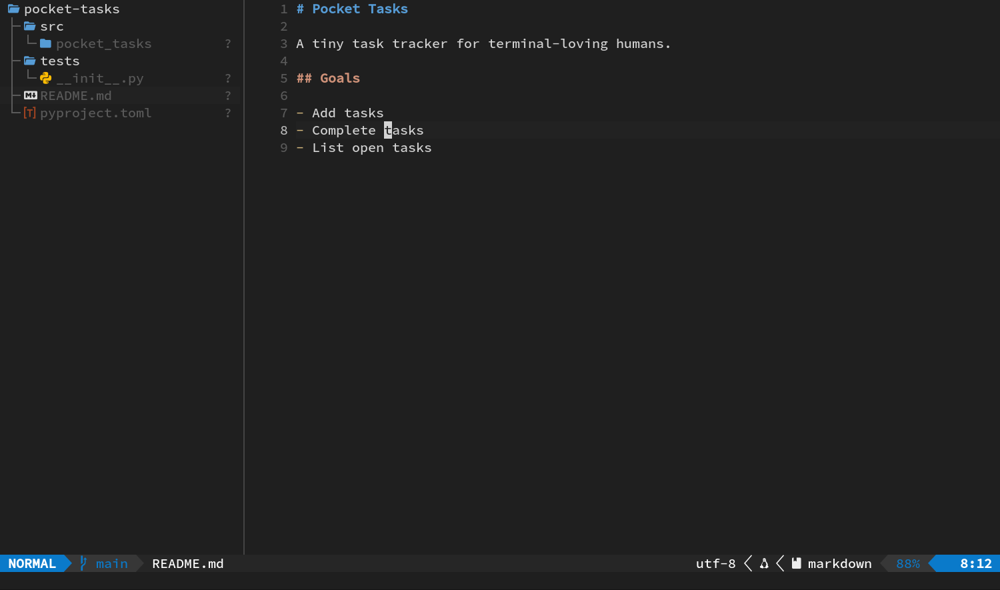

## 6. 第四轮：四个插入入口

你已经会用 [[i]] 和 [[A]]，现在把这一组常用按键补全：

| 按键 | 进入插入模式的位置 |
| --- | --- |
| [[i]] | 光标字符之前 |
| [[I]] | 当前行第一个非空白字符之前 |
| [[A]] | 当前行末尾之后 |
| [[o]] | 在当前行下方新建一行 |
| [[O]] | 在当前行上方新建一行 |

[[o]] 和 [[O]] 会同时新建一行并进入插入模式，在代码编辑中很常用。

### 用 [[o]] 添加 Quick start

1. 按 [[G]] 到 README 最后一行。
2. 按 [[o]]，下方出现新行并进入插入模式。
3. 先按一次 [[Enter]]，留下空行。
4. 输入 `## Quick start`。

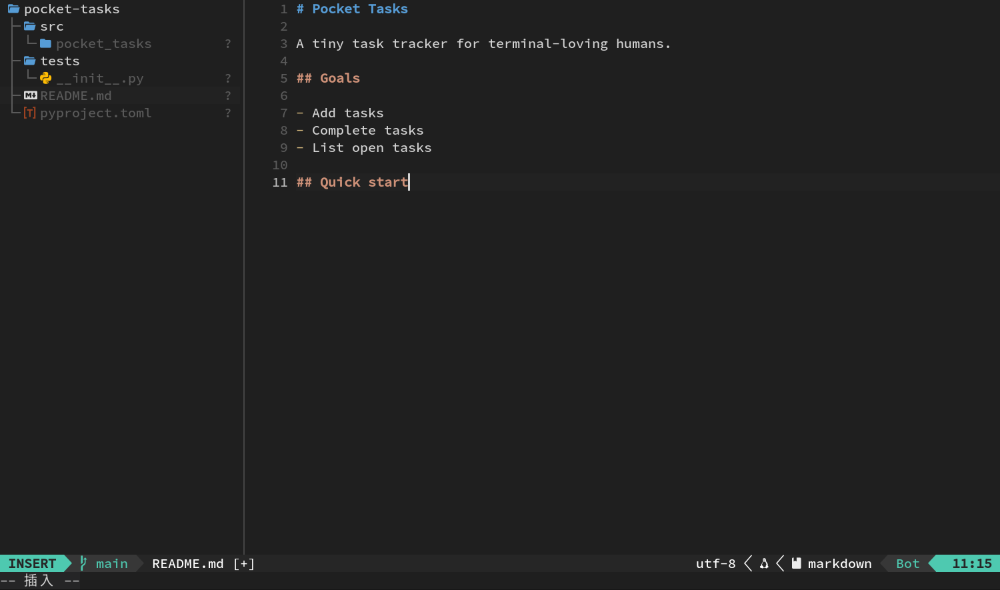

5. 连按两次 [[Enter]]，留下标题后的空行。
6. 输入 `` `PYTHONPATH=src python -m pocket_tasks.cli` ``。

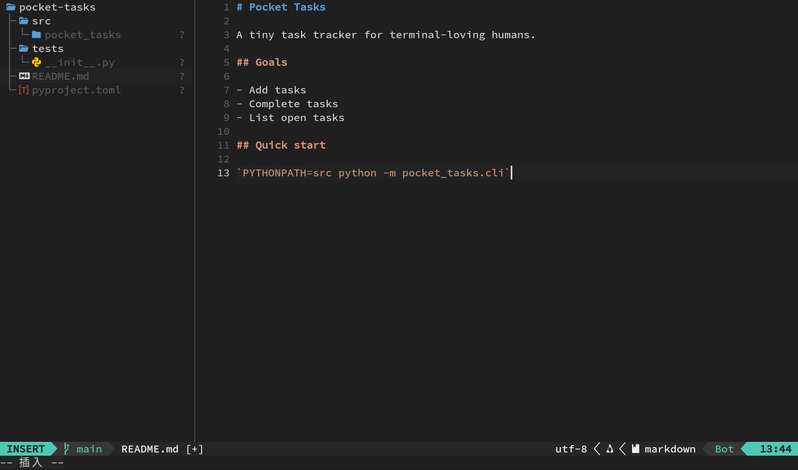

7. 按 [[Esc]]。

现在最后一行只有一段命令。用两个入口补成句子：

1. 按 [[I]]，输入 `Run` 后跟一个空格，按 [[Esc]]。

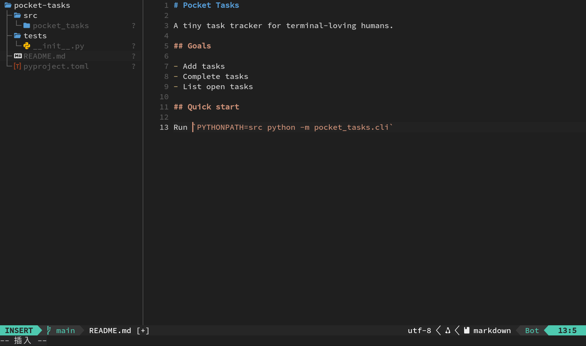

2. 按 [[A]]，输入 `.`，按 [[Esc]]。

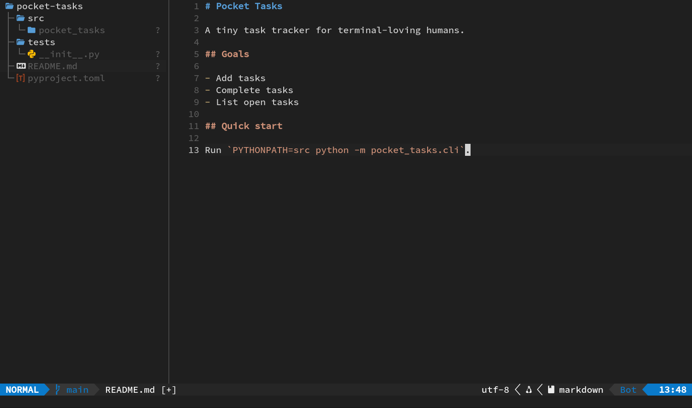

预期结果：

```markdown
## Quick start

Run `PYTHONPATH=src python -m pocket_tasks.cli`.
```

### 用 [[O]] 做一次可撤销实验

1. 输入 `/Quick`，按 [[Enter]]，光标落在标题上。
2. 按 [[O]]，在标题上方新建一行。
3. 输入 `temporary note`，按 [[Esc]]。


4. 按 [[u]]，临时行消失。

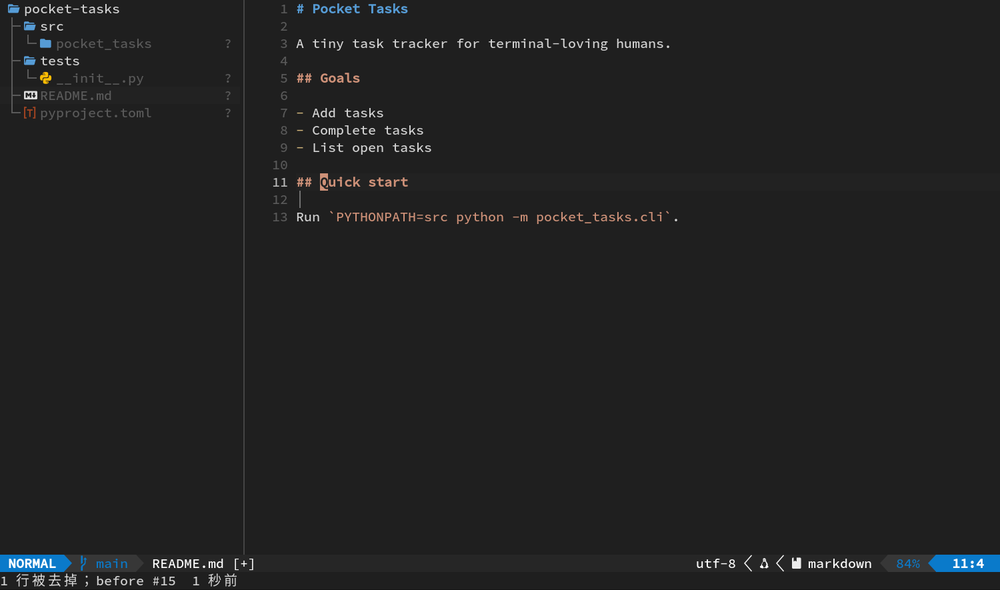

这样既练到了 [[O]]，也没有在 README 里留下临时内容。

## 7. 单字符删除与替换：[[x]] 和 [[r]]

| 按键 | 效果 |
| --- | --- |
| [[x]] | 删除光标下的一个字符 |
| `r 字符 ` | 用新字符替换光标下的一个字符，仍留在普通模式 |

### [[x]] 练习

1. 按 [[g]] [[g]] 到第一行。
2. 按 [[A]]，输入 `!`，按 [[Esc]]。


3. 光标此时在感叹号上，按 [[x]]。

预期结果：感叹号被删除，标题恢复为 `# Pocket Tasks`。

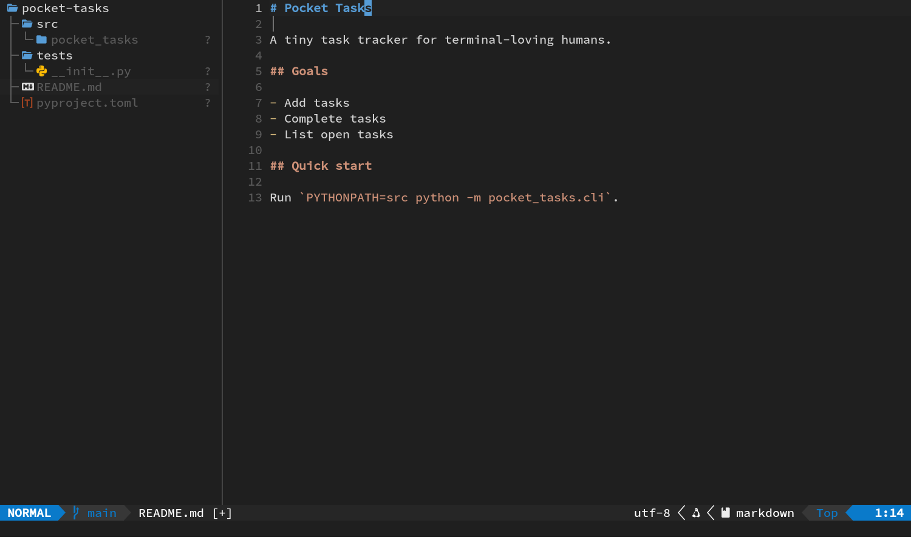

### [[r]] 练习

1. 输入 `/Goals`，按 [[Enter]]。
2. 光标落在 [[G]] 上，按 [[r]] [[X]]。
3. 标题暂时变成 `## Xoals`。


4. 按 [[u]]，恢复 `## Goals`。

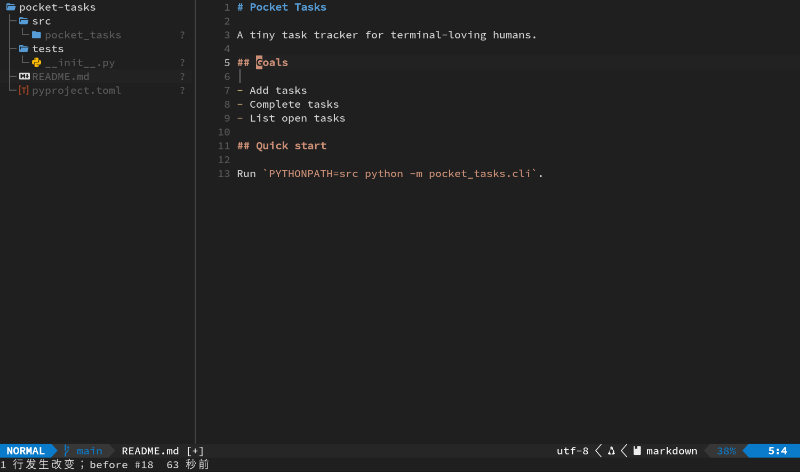

[[r]] 适合修改单个字母、替换引号，或者改动布尔值中的一个字符。它只处理当前字符，而且不会进入插入模式。

## 8. 保存与结果检查

用 [[F1]]、`write`、[[Enter]]、[[Enter]] 保存 README。它现在应为：

```markdown
# Pocket Tasks

A tiny task tracker for terminal-loving humans.

## Goals

- Add tasks
- Complete tasks
- List open tasks

## Quick start

Run `PYTHONPATH=src python -m pocket_tasks.cli`.
```

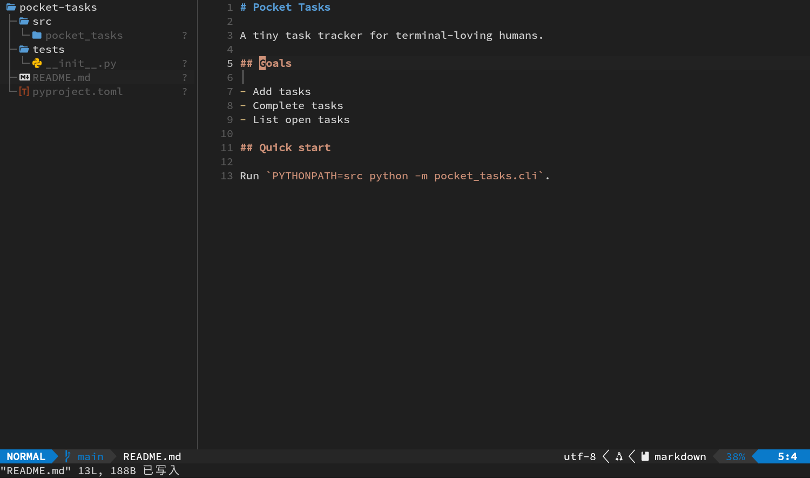

`pyproject.toml` 应为：

```toml
[project]
name = "pocket-tasks"
version = "0.1.0"
requires-python = ">=3.11"

[tool.basedpyright]
extraPaths = ["src"]
typeCheckingMode = "standard"
```

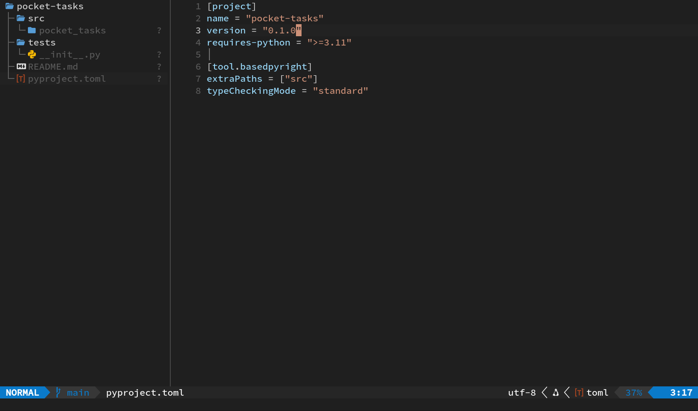

结束时按 [[F1]]，输入 `wqa`，连按两次 [[Enter]]。

## 本章肌肉记忆

| 范围 | 按键 |
| --- | --- |
| 单字符移动 | [[h]] [[j]] [[k]] [[l]] |
| 按词移动 | [[w]] [[b]] [[e]] |
| 行首 / 首个非空白 / 行尾 | [[0]] / [[^]] / [[$]] |
| 文件首 / 文件尾 / 指定行 | [[g]] [[g]] / [[G]] / ` 数字 G` |
| 当前文件搜索 | [[/]]，然后 [[n]] / [[N]] |
| 行首插入 / 行尾追加 | [[I]] / [[A]] |
| 下方 / 上方开新行 | [[o]] / [[O]] |
| 删一个字符 / 换一个字符 | [[x]] / `r 字符 ` |

上一章：[Explorer 与项目骨架](02-explorer-and-skeleton.md) · 下一章：[编辑语法与文本对象](04-edit-grammar-and-text-objects.md)
