# 04｜编辑语法与文本对象

普通模式之所以高效，靠的是一套很小的语法：

```text
操作 + 范围
```

比如，[[d]] 表示删除，[[w]] 表示移动到下一个词；两个键拼成 [[d]] [[w]]，意思就是“删除到下一个词”。理解这条规则后，许多快捷键都可以根据含义组合，无需逐一记忆。

这一章我们会写出 `Task` 数据模型，重点练下面这些内容：

- [[d]]、[[c]]、[[y]] 三个操作；
- [[p]] 粘贴与 [[.]] 重复；
- [[i]] / [[a]] 文本对象；
- 当前配置里 `mini.ai` 提供的参数和函数调用对象。

## 1. 先输入一份故意留有两处问题的模型

在终端进入项目并打开文件：

```bash
cd ~/playground/pocket-tasks
nvim src/pocket_tasks/model.py
```

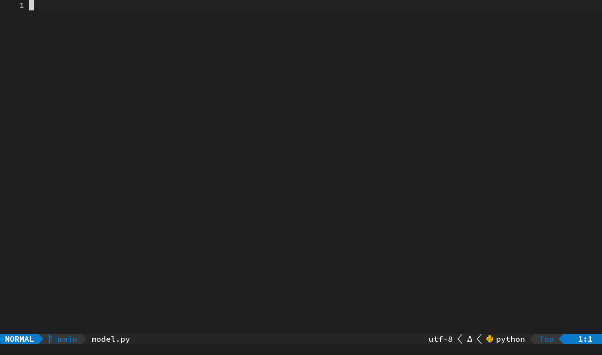

按 [[i]] 输入：

```python
from dataclasses import dataclass
from datetime import datetime

@dataclass(slots=False)  # [!code warning]
class Task:
    name: str  # [!code warning]
    created_at: datetime
    completed: bool = False
```

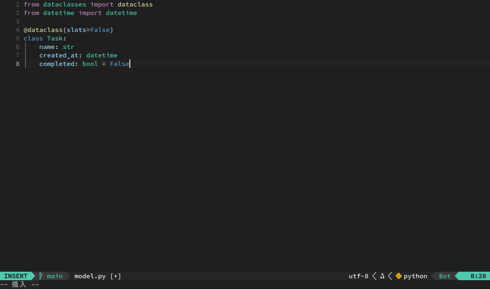

按 [[Esc]] 回普通模式。

这里特意把 `slots=False` 和 `name` 写错了，后面正好拿这两处练习编辑语法。

> 输入时如果弹出了自动补全菜单，可以接着打字，把候选范围越缩越小；[[Tab]] 用来接受候选，[[Enter]] 还是正常换行。当然，这里全程手动输入也没问题。

## 2. 三个操作符

| 操作符 | 含义 | 完成后所处模式 |
| --- | --- | --- |
| [[d]] | 删除范围 | 普通模式 |
| [[c]] | 删除范围，并立刻开始输入 | 插入模式 |
| [[y]] | 复制范围，Vim 术语叫 yank | 普通模式 |

这些操作符后面还得跟一个范围。上一章学过的移动键，就可以直接拿来当范围：

| 组合 | 逐键解释 | 效果 |
| --- | --- | --- |
| [[d]] [[w]] | [[d]] 删除，[[w]] 到下一词 | 删除到下一个词 |
| [[d]] [[$]] | [[d]] 删除，[[$]] 到行尾 | 删除到行尾 |
| [[c]] [[w]] | [[c]] 修改，[[w]] 到下一词 | 删除词尾范围并进入插入模式 |
| [[y]] [[w]] | [[y]] 复制，[[w]] 到下一词 | 复制到下一个词 |

按下操作符以后，Neovim 会进入“等待范围”的状态，底部可能会显示还没输完的操作。只有把范围补上，操作才会真正执行；中途反悔，按 [[Esc]] 就能取消。

### 重复操作符：整行操作

同一个操作符连按两次，Neovim 就会把当前整行当成范围；这时光标停在行里的哪一列都无所谓。

| 按键 | 效果 |
| --- | --- |
| [[d]] [[d]] | 删除当前整行 |
| [[c]] [[c]] | 清掉当前行内容，保留合适的缩进并进入插入模式 |
| [[y]] [[y]] | 复制当前整行 |

前面还可以加次数：[[2]] [[d]] [[d]] 删除两行，[[3]] [[y]] [[y]] 复制三行。

## 3. 练习删除、复制和粘贴

先输入 `/completed`，按 [[Enter]] 搜索到最后一个字段。

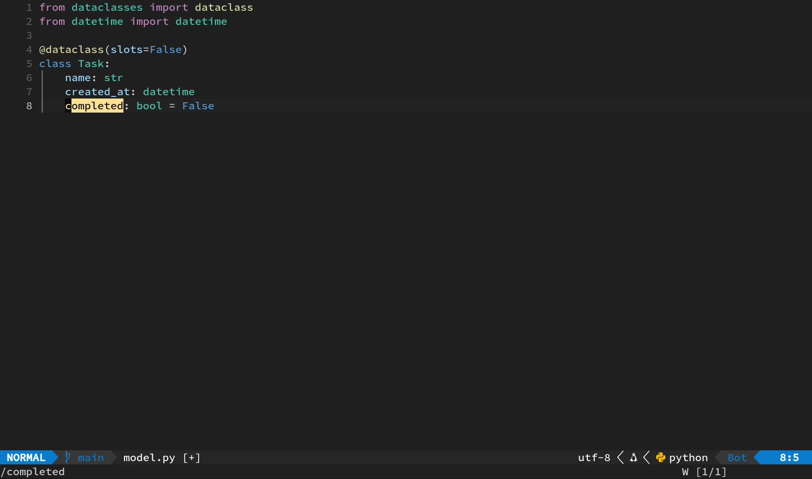

### 复制一行再粘贴

1. 按 [[y]] [[y]]：复制整行，画面暂时不变。
2. 按 [[p]]：把整行粘贴到当前行下方。

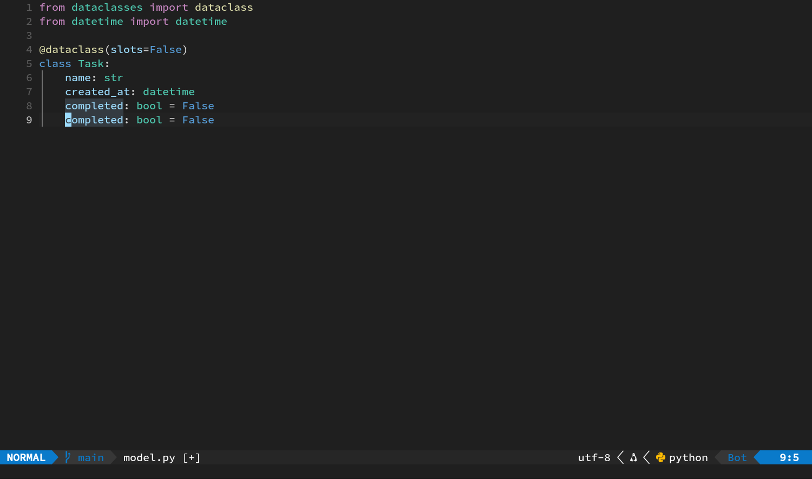

3. 按 [[u]]：撤销粘贴，恢复一行。

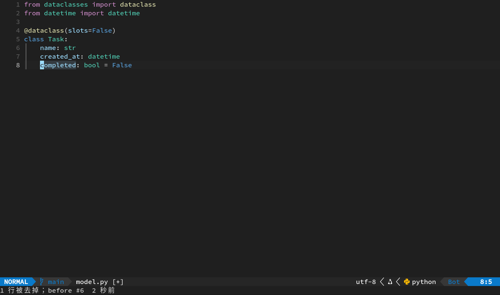

普通模式下：

- [[p]] 把字符内容放在光标后，把整行内容放在当前行下；
- [[P]] 把字符内容放在光标前，把整行内容放在当前行上。

删除和修改的内容也会进入寄存器，所以 [[d]] [[d]] 后按 [[p]]，可以把那一行挪回来。

### 删除一行再恢复

1. 保持光标在 `completed` 行，按 [[d]] [[d]]。
2. 这一行消失。

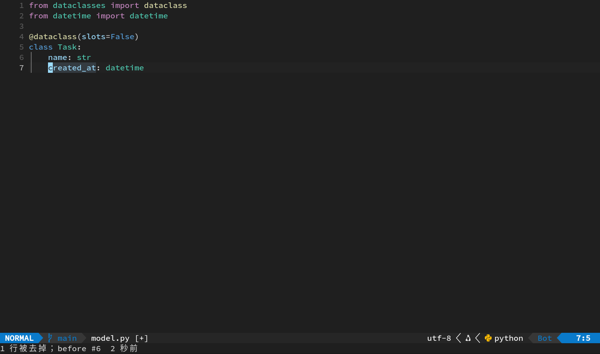

3. 按 [[u]]，这一行回来。

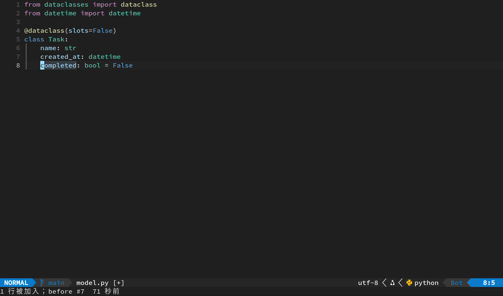

### 修改整行再恢复

1. 按 [[c]] [[c]]，当前内容被清掉，光标进入插入模式。

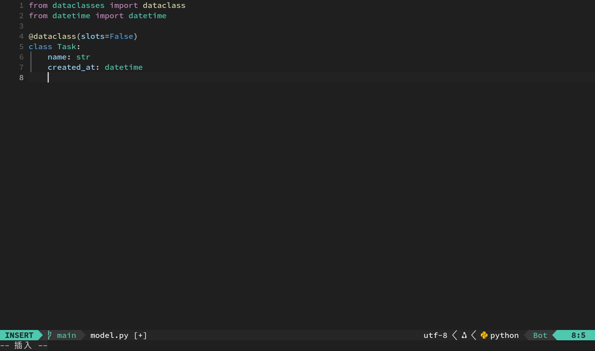

2. 先不输入，按 [[Esc]]。
3. 按 [[u]]，原行恢复。

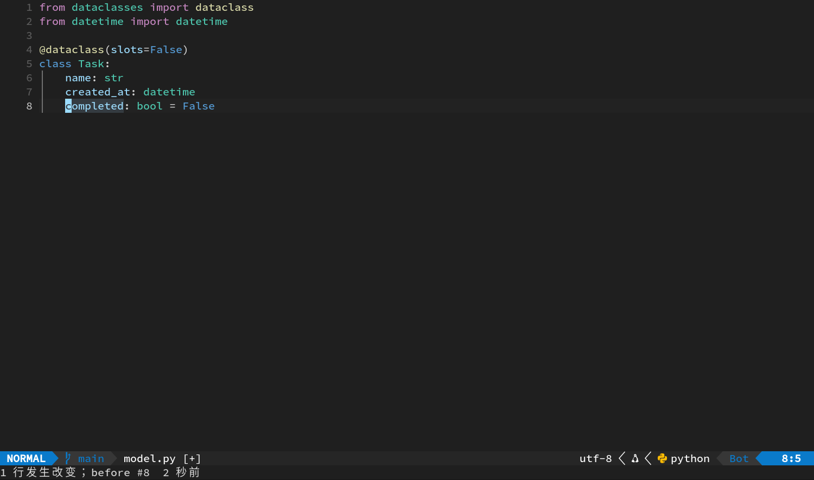

三次实验做完，模型应该还是原来的三个字段。

## 4. 文本对象：选择内部或连同边界

用移动键指定范围，往往得先把边界找准。文本对象就省事多了，它可以直接描述一个完整单位，比如一个单词、引号或括号里的内容，甚至一个函数参数。

基本结构是：

```text
操作 + i/a + 对象
```

- [[i]]：inside，只取里面；
- [[a]]：around，把包围符或相邻空白也包括在内。

### 最常用的对象

| 对象 | [[i]] 版本 | [[a]] 版本 |
| --- | --- | --- |
| 单词 word | [[i]] [[w]] 取词本身 | [[a]] [[w]] 通常连相邻空白一起取 |
| 双引号 | [[i]] [["]] 取引号里的内容 | [[a]] [["]] 连双引号一起取 |
| 圆括号 | [[i]] [[(]] 或 [[i]] [[)]] 取括号内部 | [[a]] [[(]] 或 [[a]] [[)]] 连括号一起取 |
| 任意常见括号 | [[i]] [[b]] | [[a]] [[b]]，`mini.ai` 会在 `()`、`[]`、`{}` 中找平衡的一对 |

由此可以读出：

- [[c]] [[i]] [[w]]：修改当前词；
- [[d]] [[i]] [["]]：删除双引号里的内容，留下引号；
- [[d]] [[a]] [["]]：连内容和双引号一起删除；
- [[y]] [[i]] [[(]]：复制圆括号里面的内容。

### 先选中，再决定

[[v]] 进入字符可视模式。它也能和文本对象组合：

1. 光标放进任意单词；
2. 按 [[v]] [[i]] [[w]]；
3. 当前单词被高亮选中；

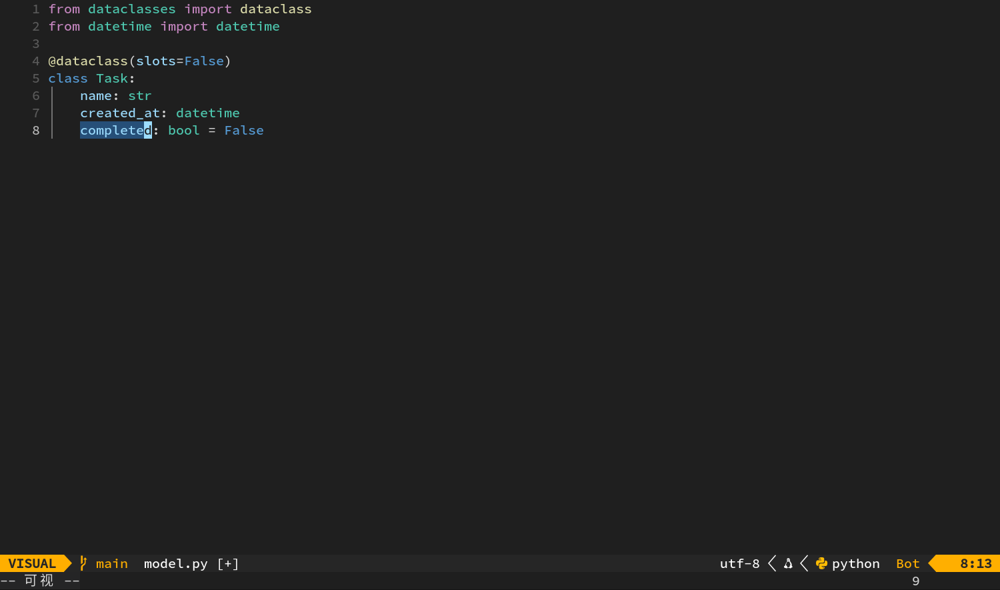

4. 按 [[Esc]] 取消选择。

碰到不熟悉的文本对象，可以先用 [[v]] 看看它到底会选中哪里。范围确认无误后，再换成 [[c]]、[[d]] 或 [[y]]。

## 5. 用 [[c]] [[i]] [[w]] 修正字段名

输入 `/name`，按 [[Enter]]；再按 [[c]] [[i]] [[w]]，输入 `title`。

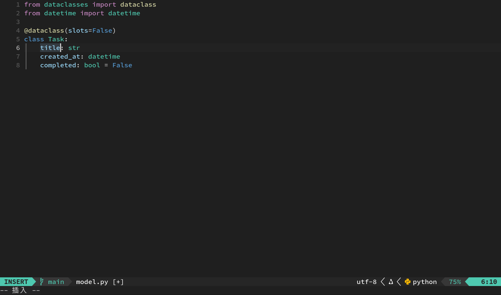

按 [[Esc]]，结束这次修改。

这几个键依次做了下面这些事：

1. `/name` 找到 `name`；
2. [[c]] 准备修改；
3. [[i]] [[w]] 指定当前单词内部；
4. `name` 被清掉，并进入插入模式；
5. 输入 `title`；
6. [[Esc]] 完成本次修改。

字段变化如下：

```diff
-    name: str
+    title: str
```

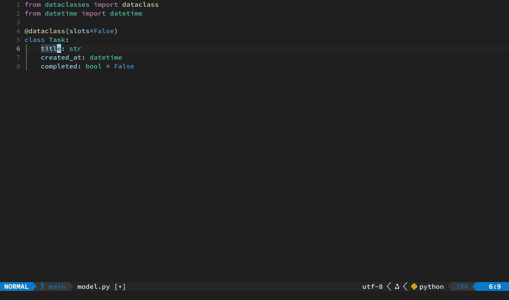

[[c]] [[i]] [[w]] 是平时最常用的编辑组合之一。只要光标还在单词里面，具体停在哪个字母上并不重要。

### 把文字复制到系统剪贴板

普通的 [[y]] 只会把内容放进 Neovim 寄存器。如果想在浏览器、终端或聊天窗口之间复制文字，可以在操作前指定 [["]] [[+]] 寄存器：

1. 输入 `/title`，按 [[Enter]]。
2. 按 [[v]] [[i]] [[w]] 选中 `title`。

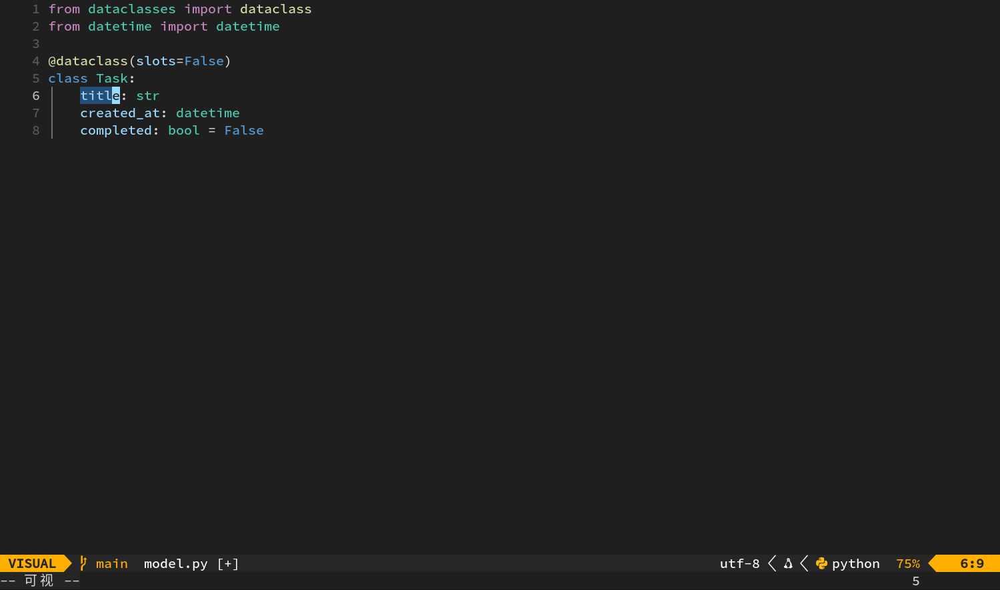

3. 按 [["]] [[+]] [[y]]，把选中文字复制到系统剪贴板。
4. 按 [[o]]，输入 `# clipboard:` 后跟一个空格，按 [[Esc]]。
5. 按 [["]] [[+]] [[p]]，系统剪贴板里的 `title` 会粘到注释末尾。

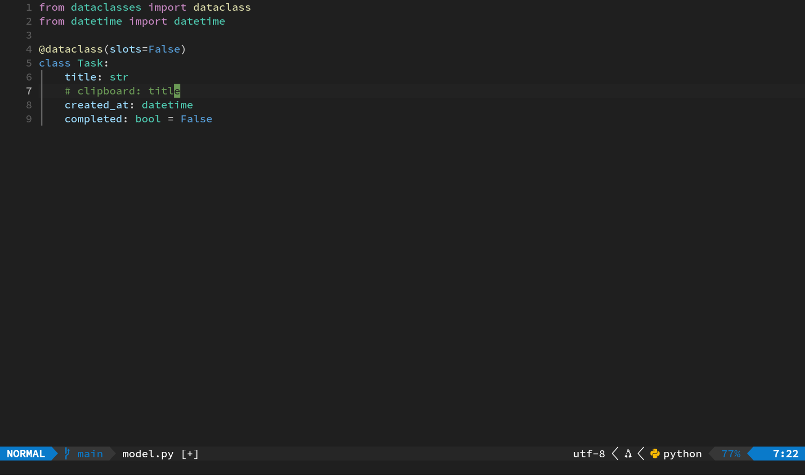

6. 按 [[d]] [[d]] 删除这行临时注释。


[["]] 的意思是“接下来要指定寄存器”，[[+]] 代表系统剪贴板，最后的 [[y]] / [[p]] 才是真正的复制 / 粘贴。如果系统没有剪贴板后端，Neovim 会报 provider 错误；当前系统已经装了 `wl-copy`，这组按键可以直接用。

## 6. `mini.ai` 的特色对象：参数 [[a]]

由于启用了 `mini.ai`，它在常规文本对象之外，又加了几种很实用的目标：

| 对象字母 | 代表什么 | 示例 |
| --- | --- | --- |
| [[a]] | 函数调用中的一个 argument | [[c]] [[i]] [[a]] 修改当前参数内部 |
| [[f]] | 整个 function call | [[v]] [[a]] [[f]] 选中函数名与括号 |
| [[q]] | 最近的一对单引号、双引号或反引号 | [[c]] [[i]] [[q]] 修改任一种引号内部 |
| [[t]] | HTML/XML 标签 | [[v]] [[i]] [[t]] 选中标签内容 |

这里每个字母都要结合所在位置来理解：[[c]] 是修改，[[i]] 是内部，[[a]] 则是当前参数。

现在修复装饰器参数：

输入 `/slots`，按 [[Enter]]；再按 [[c]] [[i]] [[a]]，输入 `slots=True`。


按 [[Esc]]，结束这次修改。

结果应该是：

```python
@dataclass(slots=True)
```

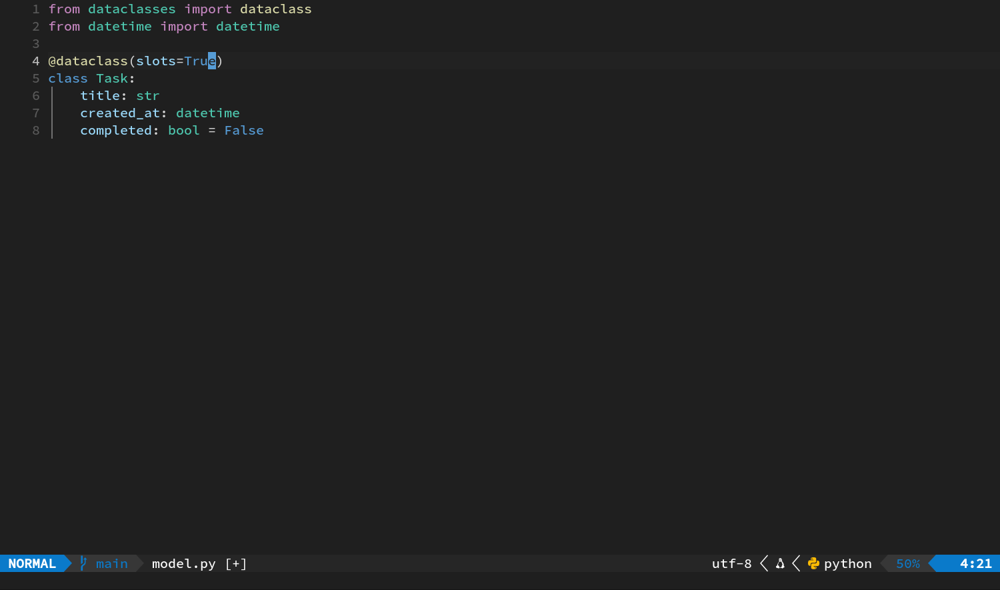

`mini.ai` 认出了 `dataclass(...)` 里的参数 `slots=False`，所以 [[c]] [[i]] [[a]] 会把整个参数内容交给你修改。如果还想把参数旁边的空白或逗号一起算进去，可以用 around 版本 [[c]] [[a]] [[a]]。

### 看看函数调用对象

1. 再搜索 `/slots`。
2. 按 [[v]] [[a]] [[f]]。
3. 这时应该会高亮整个 `dataclass(slots=True)` 函数调用，但不会选中行首的 `@`。

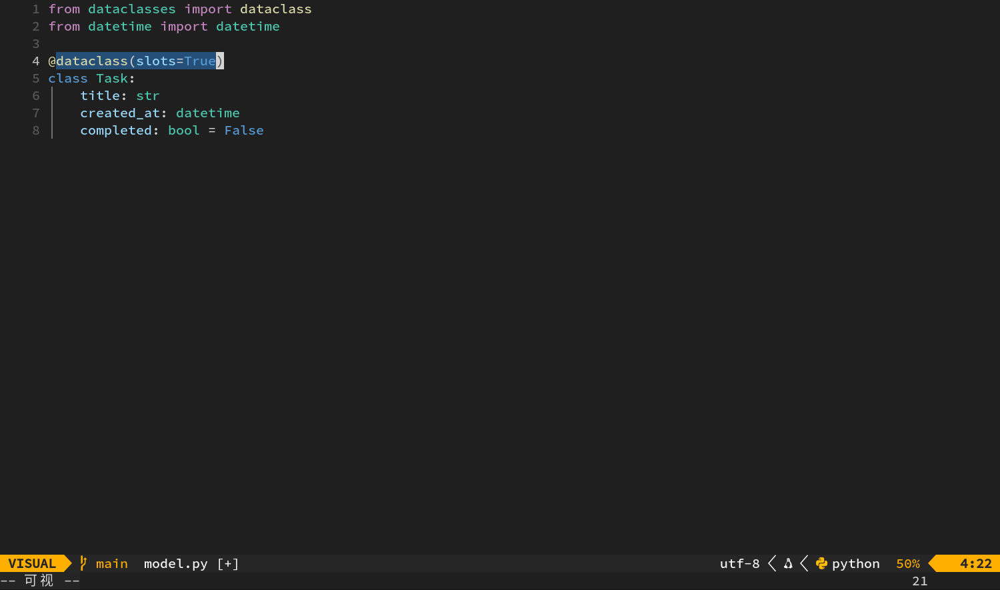

4. 按 [[Esc]] 取消。

`mini.ai` 会优先找光标所在的对象。如果当前位置没有匹配项，它还会去前后 50 行里继续找。所以拿不准范围时，最好先用 [[v]] 看一眼选区。

## 7. 点命令 [[.]]：重放上一次修改

普通模式下的 [[.]] 会把上一次文本修改原样再做一遍，当时输入的文字也算在内；不过移动和搜索本身不会跟着重复。

做一个可撤销实验：

1. 输入 `/created_at`，按 [[Enter]]。
2. 按 [[c]] [[i]] [[w]]，输入 `created`，按 [[Esc]]。


3. 输入 `/completed`，按 [[Enter]]。
4. 按 [[.]]。

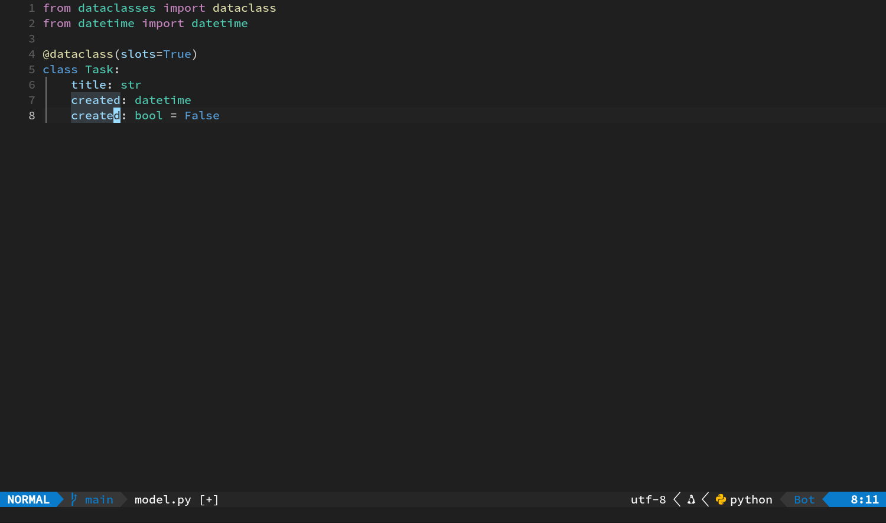

这时会得到：

- 第一次修改把 `created_at` 变成 `created`；
- [[.]] 在新位置重放 [[c]] [[i]] [[w]] 加输入 `created`，把 `completed` 也变成 `created`。

现在按一次 [[u]]，先恢复 `completed`。


再按一次 [[u]]，恢复 `created_at`。

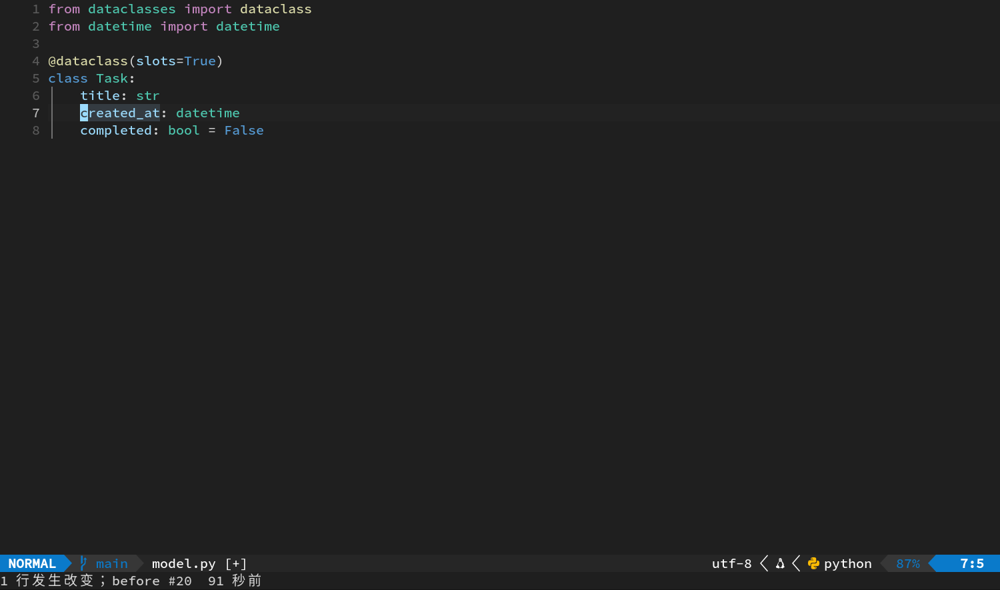

通常的用法，是先做完一次可以重复的修改，再移到下一处按 [[.]]。后面批量处理同类代码时，我们还会继续用到这一招。

## 8. 保存最终模型

确认文件为：

```python
from dataclasses import dataclass
from datetime import datetime

@dataclass(slots=True)  # [!code highlight]
class Task:
    title: str  # [!code highlight]
    created_at: datetime
    completed: bool = False
```


按 [[F1]]，输入 `write`。

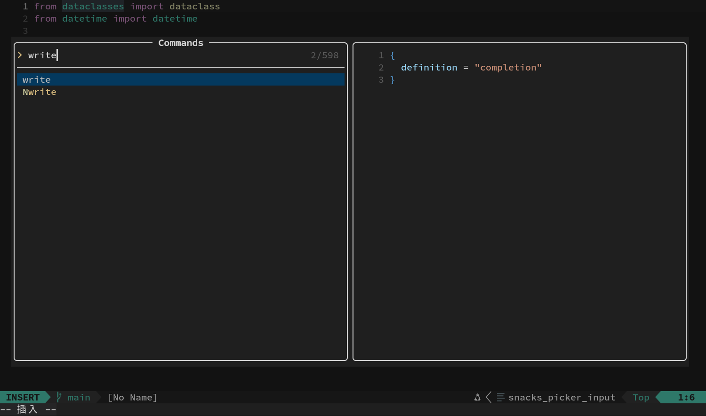

第一次按 [[Enter]] 后，命令行中会出现 `:write`。

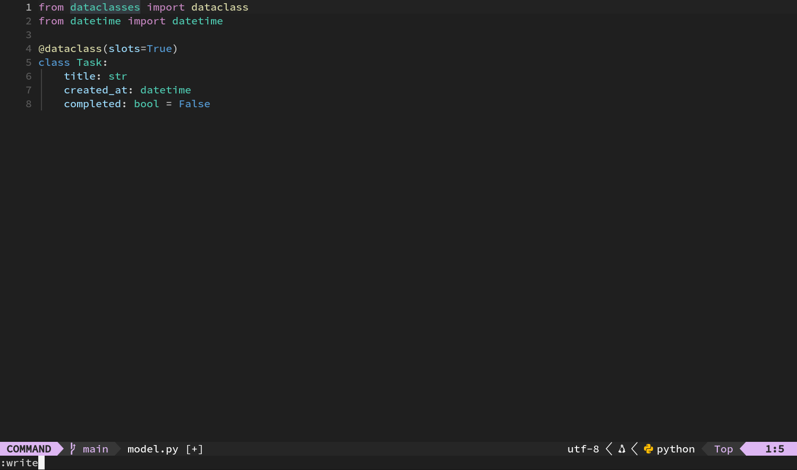

再按一次 [[Enter]] 执行保存。

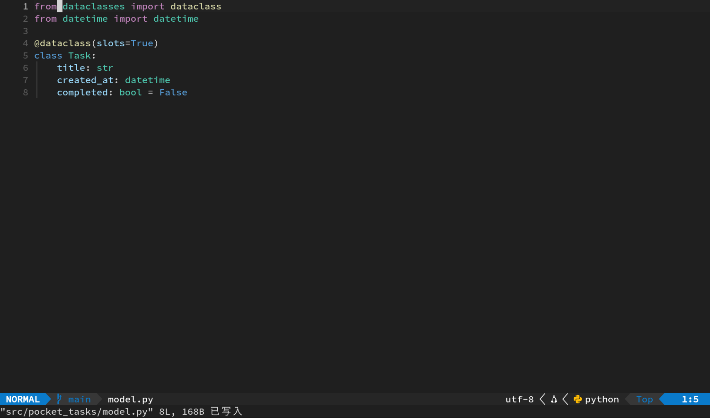

按 [[Space]] [[e]] 打开 Explorer，可以同时检查文件位置和最终内容。

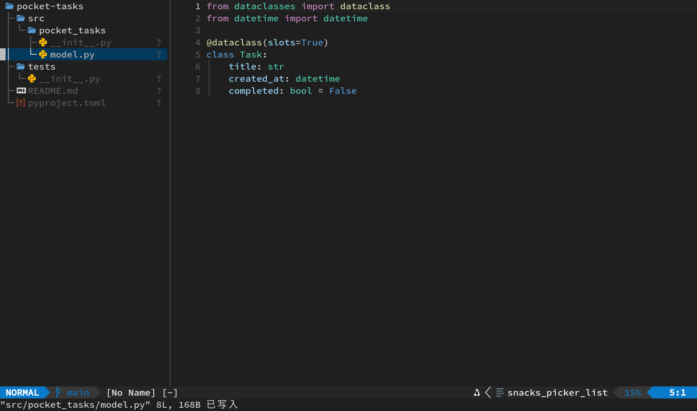

如果左侧符号栏出现了诊断标记，可以先等 basedpyright 分析完；这一章的最终代码放在 Python 3.11 下，应该不会留下任何问题。

## 本章肌肉记忆

| 目标 | 按键 |
| --- | --- |
| 删除 / 修改 / 复制范围 | [[d]] / [[c]] / [[y]] + 范围 |
| 删除 / 修改 / 复制整行 | [[d]] [[d]] / [[c]] [[c]] / [[y]] [[y]] |
| 粘贴到后面 / 前面 | [[p]] / [[P]] |
| 当前词内部 | [[i]] [[w]] |
| 连词与邻近空白 | [[a]] [[w]] |
| 修改当前词 | [[c]] [[i]] [[w]] |
| 修改 `mini.ai` 参数 | [[c]] [[i]] [[a]] |
| 选中整个函数调用 | [[v]] [[a]] [[f]] |
| 重复上次修改 | [[.]] |
| 复制到 / 粘贴自系统剪贴板 | [["]] [[+]] [[y]] / [["]] [[+]] [[p]] |

上一章：[移动与小修改](03-navigation-and-small-edits.md) · 下一章：[包围与注释](05-surround-and-comments.md)
