# 05｜包围符与注释

这一章介绍两组很实用的操作：

- `mini.surround` 用来处理引号、括号、标签等成对符号；
- Neovim 0.12 内置的 [[g]] [[c]] / [[g]] [[c]] [[c]] 用来处理注释。

所有练习都在 `model.py` 上完成，结束时文件内容会恢复到上一章的最终版本，不会保留临时修改。

## 1. 打开训练文件

```bash
cd ~/playground/pocket-tasks
nvim src/pocket_tasks/model.py
```

先确认内容为：

```python
from dataclasses import dataclass
from datetime import datetime

@dataclass(slots=True)
class Task:
    title: str
    created_at: datetime
    completed: bool = False
```


如果内容有差异，请先按上一章的最终结果修正，再用 [[F1]]、`write`、[[Enter]]、[[Enter]] 保存当前正确版本。

## 2. `mini.surround` 的三个核心操作

当前配置使用 `mini.surround` 默认映射：

| 前缀 | 含义 | 后面还要输入什么 |
| --- | --- | --- |
| [[s]] [[a]] | add，添加包围 | 目标范围，再输入新的包围符 |
| [[s]] [[d]] | delete，删除包围 | 要删除的包围符类型 |
| [[s]] [[r]] | replace，替换包围 | 旧包围符类型，再输入新包围符 |

另外还有两组辅助操作：

| 前缀 | 效果 |
| --- | --- |
| [[s]] [[h]] | 短暂高亮匹配到的包围，默认约半秒 |
| [[s]] [[f]] / [[s]] [[F]] | 跳到包围的右边 / 左边 |

### 如果 [[s]] 单独按会怎样

`mini.surround` 把 [[s]] 用作前缀，并将单独的 [[s]] 映射为空操作，避免误触。按下 [[s]] 后，需要继续输入 [[a]]、[[d]]、[[r]]、[[h]]、[[f]] 等后续按键。

若你想使用 Vim 传统的“替换当前一个字符并进入插入模式”，按 [[c]] [[l]] 即可：[[c]] 修改，[[l]] 给出一个字符的范围。

## 3. 第一轮：添加和删除引号

先输入 `/title`，按 [[Enter]] 找到字段名。

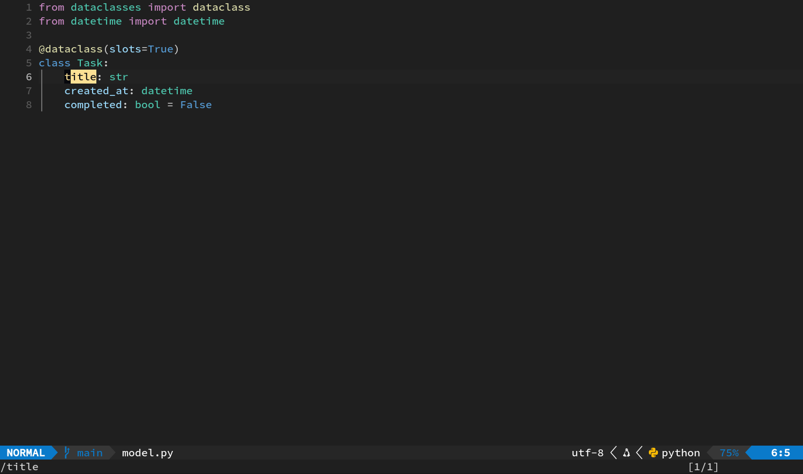

然后按 [[s]] [[a]] [[i]] [[w]] [["]]。

逐段解释：

1. [[s]] [[a]]：准备添加包围；
2. [[i]] [[w]]：目标是当前单词内部，也就是 `title`；
3. [["]]：使用双引号作为新的包围符。

预期结果：

```python
    "title": str
```


现在搜索 `/title` 让光标确保在引号里面，再按 [[s]] [[d]] [["]]。

[[s]] [[d]] 准备删除包围，最后的 [["]] 指定双引号。预期恢复为：

```python
    title: str
```

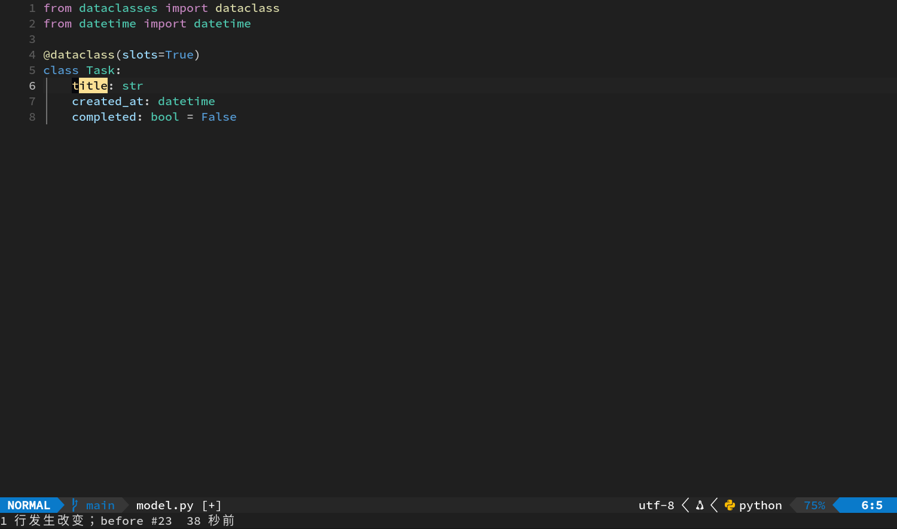

包围操作也支持点命令。以后需要给多处单词加引号时，可以先完成一次 [[s]] [[a]] [[i]] [[w]] [["]]，移动到下一处后按 [[.]] 重复操作。

## 4. 第二轮：括号、预览与替换

再次搜索 `/title`，然后按 [[s]] [[a]] [[i]] [[w]] [[)]]。

预期结果是紧凑括号：

```python
    (title): str
```


`mini.surround` 对开括号和闭括号安排了很实用的区别：

| 最后输入 | 生成结果 |
| --- | --- |
| [[)]] | `(text)` |
| [[(]] | `( text )` |
| [[&#93;]] | `[text]` |
| [[&#91;]] | `[ text ]` |
| [[}]] | `{text}` |
| [[{]] | `{ text }` |

想要代码常见的紧凑形式，就输入闭括号。

### 先看它认出了哪一对

把光标留在 `title` 上，按 [[s]] [[h]] [[)]]。

匹配到的左右圆括号会短暂高亮。[[s]] [[h]] 只显示范围，不会修改文件；遇到多层嵌套括号时尤其有用。

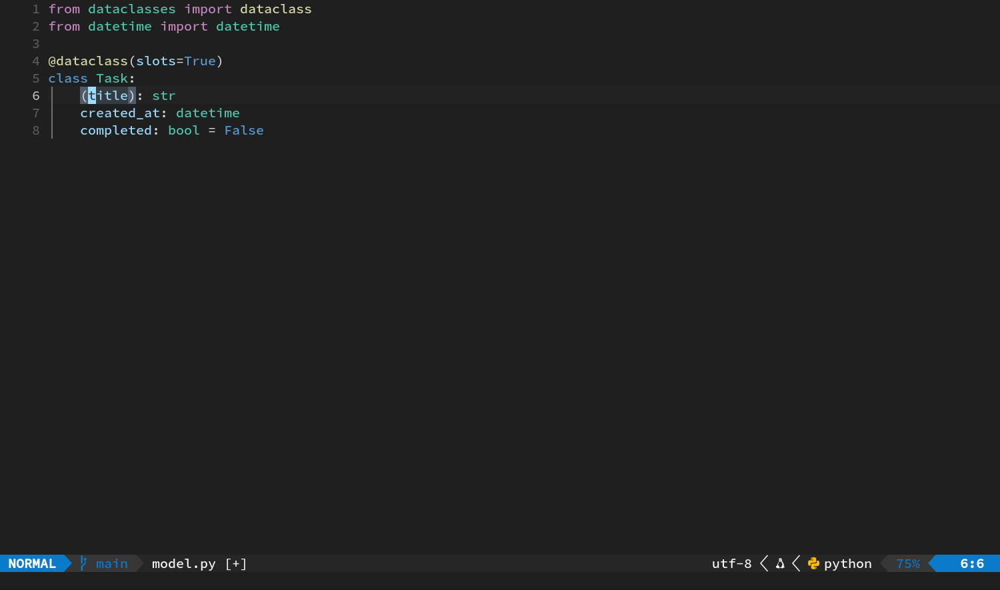

### 圆括号换成方括号

按 [[s]] [[r]] [[)]] [[&#93;]]。

逐键解释：

1. [[s]] [[r]]：准备替换包围符；
2. [[)]]：寻找紧凑圆括号；
3. [[&#93;]]：换成紧凑方括号。

预期结果：

```python
    [title]: str
```

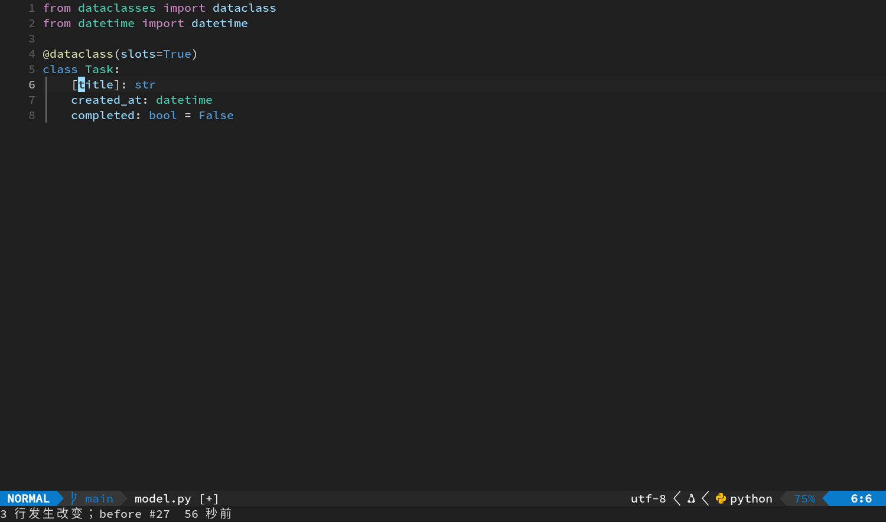

最后搜索 `/title`，按 [[s]] [[d]] [[&#93;]] 删除方括号，恢复 `title: str`。


`mini.surround` 默认只处理光标所在的那对包围符。如果光标不在符号内部，它会提示找不到目标；把光标移进去再试即可。

## 5. 注释来自 Neovim 0.12 本体

Neovim 0.12 已内置：

| 按键 | 效果 |
| --- | --- |
| [[g]] [[c]] [[c]] | 切换当前行注释 |
| ` 数字 gcc` | 从当前行开始切换指定行数，例如 [[2]] [[g]] [[c]] [[c]] |
| [[g]] [[c]] + 移动 | 切换该移动范围覆盖的行，例如 [[g]] [[c]] [[j]] |
| 可视选择后 [[g]] [[c]] | 切换选中行的注释 |

它会根据文件类型读取 `commentstring`。在 Python 文件中会生成 `#` 注释；遇到 Treesitter 语言注入时，还能根据光标位置选用对应语言的注释格式。

切换多行时有一条规则：选区内每个非空行都已经是注释，操作会统一取消；只要其中还有普通代码，操作就会把整组选区注释起来。

## 6. 第三轮：[[g]] [[c]] [[c]] 切换单行与多行

### 单行

1. 输入 `/created_at`，按 [[Enter]]。
2. 按 [[g]] [[c]] [[c]]。

预期这一行变成类似：

```python
    # created_at: datetime
```

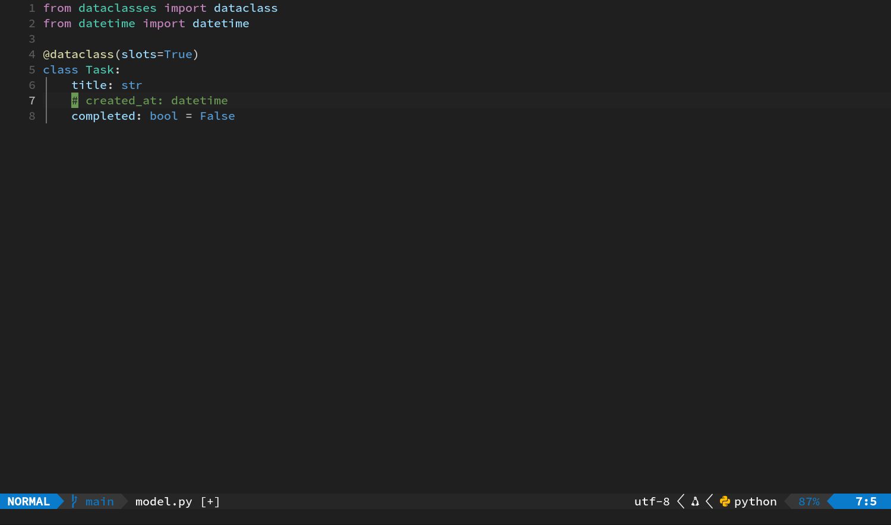

再按一次 [[g]] [[c]] [[c]]，注释被移除。


### 用次数处理两行

1. 输入 `/title`，按 [[Enter]]。
2. 按 [[2]] [[g]] [[c]] [[c]]。

`title` 和 `created_at` 两行会一起变成注释。


保持光标不动，再按 [[2]] [[g]] [[c]] [[c]]，两行一起恢复。


次数放在动作前面。[[3]] [[g]] [[c]] [[c]] 就是从当前行开始处理三行，适合暂时关闭一小段连续代码。

## 7. 第四轮：可视选择后注释

[[V]] 会按整行进入可视模式。结合 [[j]] 和 [[g]] [[c]]：

1. 输入 `/title`，按 [[Enter]]。
2. 按 [[V]]，当前整行高亮。
3. 按 [[j]]，选择扩展到下一行。

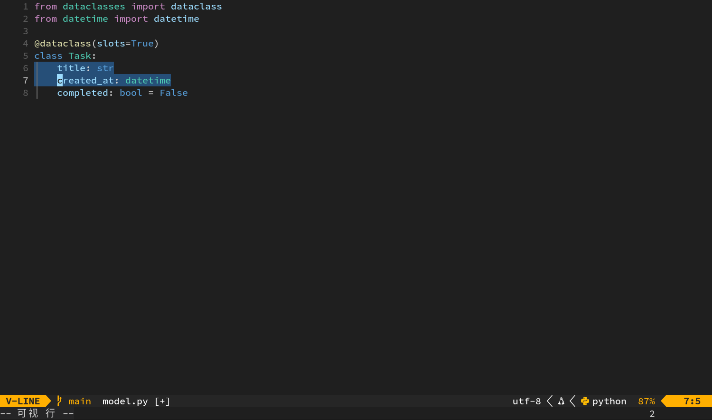

4. 按 [[g]] [[c]]，两行一起注释。

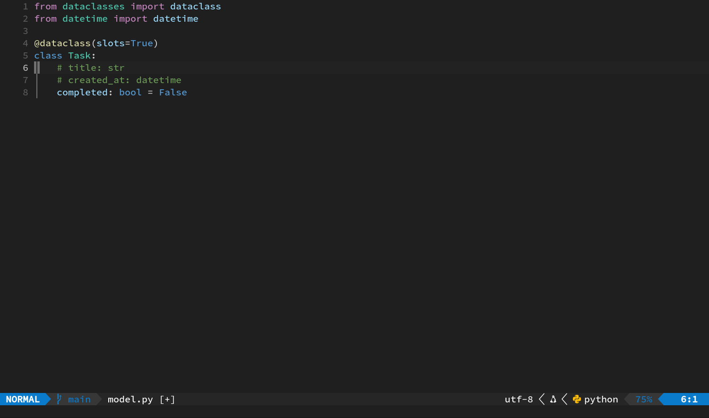

要恢复：

1. 再次输入 `/title`，按 [[Enter]]；搜索可以命中注释里的文字。
2. 按 [[V]] [[j]] [[g]] [[c]]。

预期两行恢复成普通代码。

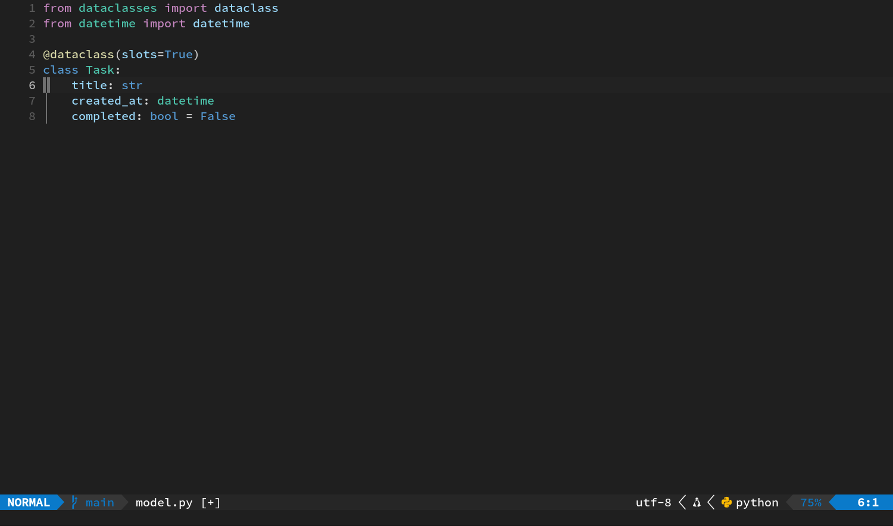

当注释范围不方便用行数表示时，可以先用 [[V]]、[[j]]、[[k]] 明确选区，再按 [[g]] [[c]] 执行。

### 操作符版本

[[g]] [[c]] 也遵循上一章的“操作 + 范围”语法。按 [[g]] [[c]] [[j]]，表示切换当前行和下一行的注释。


再执行一次相同组合即可恢复。


范围很清楚时，[[g]] [[c]] [[j]] 比先进入可视模式更快。

## 8. 最终检查与保存

所有包围和注释都应已经清理。文件最终仍为：

```python
from dataclasses import dataclass
from datetime import datetime

@dataclass(slots=True)
class Task:
    title: str
    created_at: datetime
    completed: bool = False
```

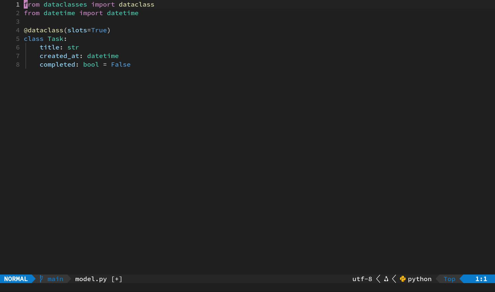

如果还有包围符没有清理，把光标移到里面，用 [[s]] [[d]] 加对应符号删除；如果仍有注释，把光标放在相应行按 [[g]] [[c]] [[c]]。也可以用 [[u]] 沿撤销记录逐步恢复。

确认干净后，按 [[F1]]，输入 `write`。

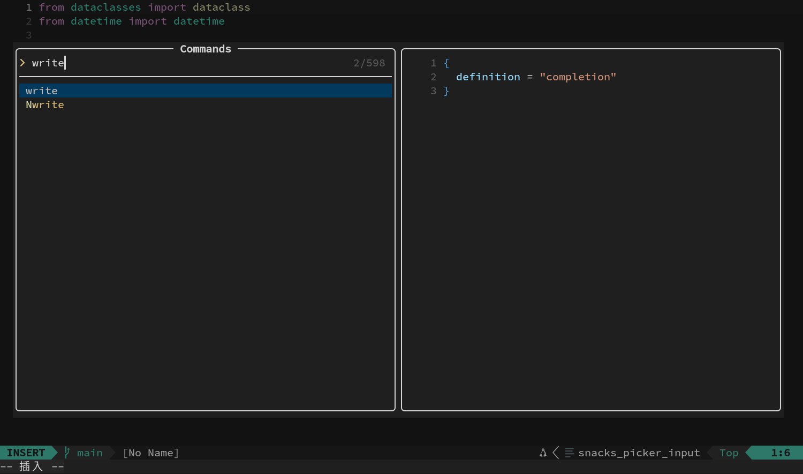

按第一次 [[Enter]]，让命令行形成 `:write`。

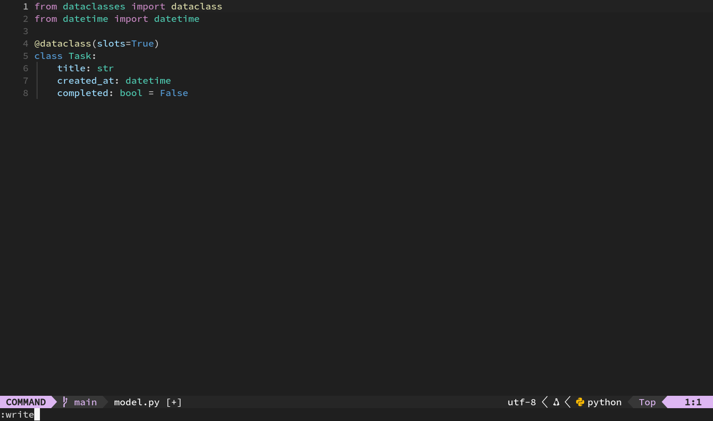

再按一次 [[Enter]] 保存。

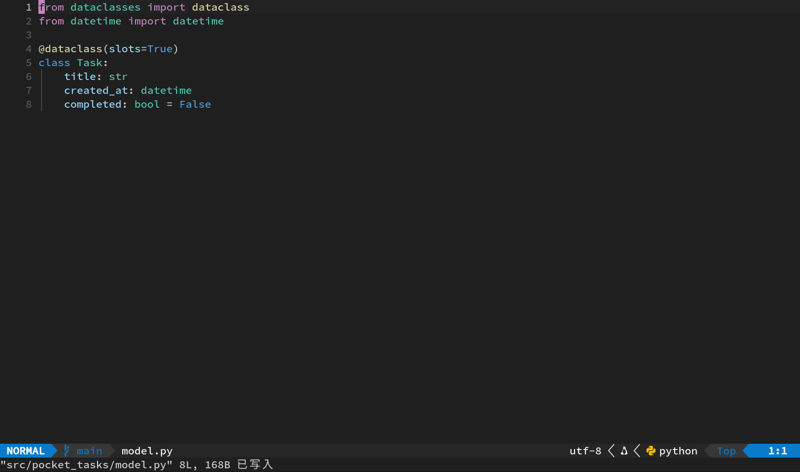

最后再用 [[F1]]、`wqa`、[[Enter]]、[[Enter]] 退出。

## 本章肌肉记忆

| 目标 | 按键 |
| --- | --- |
| 给当前词加双引号 | [[s]] [[a]] [[i]] [[w]] [["]] |
| 删除双引号 | [[s]] [[d]] [["]] |
| 加紧凑圆括号 | [[s]] [[a]] [[i]] [[w]] [[)]] |
| 预览圆括号 | [[s]] [[h]] [[)]] |
| 圆括号换方括号 | [[s]] [[r]] [[)]] [[&#93;]] |
| 切换当前行注释 | [[g]] [[c]] [[c]] |
| 切换两行注释 | [[2]] [[g]] [[c]] [[c]] 或 [[g]] [[c]] [[j]] |
| 选中整行并扩展 | [[V]]，然后 [[j]] / [[k]] |
| 切换可视选区注释 | [[g]] [[c]] |

上一章：[编辑语法与文本对象](04-edit-grammar-and-text-objects.md) · 下一章：[搜索与 Quickfix](06-search-and-quickfix.md)
