# 06｜项目搜索与 Quickfix

项目里只有一个文件时，[[/]] 通常就够用了。文件多起来以后，还需要两个面向整个项目的工具：

- [[Space]] [[/]]：在整个项目中搜索；
- Quickfix：把多条搜索结果保留在底部，方便逐项跳转。

本章最后会使用 Quicker 直接编辑 Quickfix 结果，并把修改写回多个文件。由于影响范围较大，开始前先建立 Git 基线。

## 1. 开始前的项目检查点

`src/pocket_tasks/model.py` 应为：

```python
from dataclasses import dataclass
from datetime import datetime

@dataclass(slots=True)
class Task:
    title: str
    created_at: datetime
    completed: bool = False
```

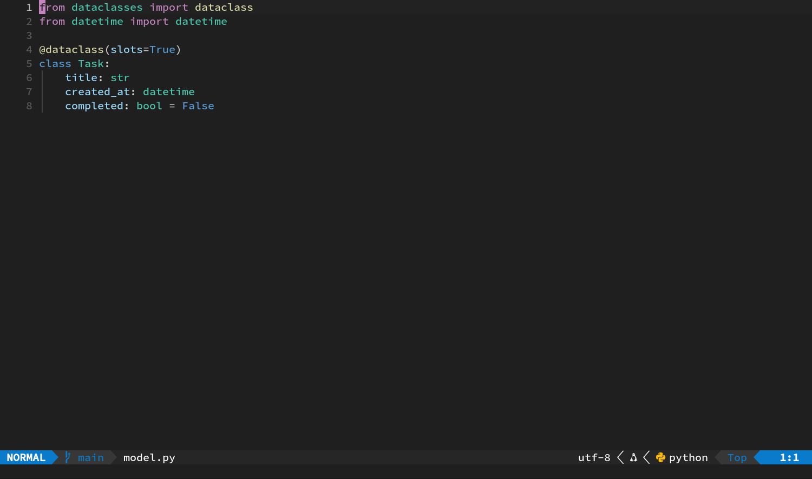

README 中应已有 `Goals` 和 `Quick start`。若内容仍有差异，先回到上一章的最终检查点。

### 先提交一份便于恢复的基线

右侧内置终端将在第 10 章介绍，本节先使用外部终端。

1. 在 Neovim 中按 [[F1]]，输入 `wall`，选中同名命令后连按两次 [[Enter]]。`wall` 会保存所有已修改文件。
2. 按 [[F1]]，输入 `wqa`，连按两次 [[Enter]] 退回终端。
3. 在 `pocket-tasks` 目录中依次运行：

```bash
git status --short
git add .
git commit -m "checkpoint before quickfix"
```

若提交因缺少 Git 身份而失败，可以只为当前练习仓库设置临时身份，然后重新提交：

```bash
git config user.name "Nvim Student"
git config user.email "nvim@example.invalid"
git commit -m "checkpoint before quickfix"
```

这两项写进当前仓库的 `.git/config`，不会替你修改其他项目或全局 Git 身份。

如果第三条命令提示没有可提交内容，说明当前已经有可用的 Git 基线，可以继续。然后重新打开：

```bash
nvim .
```

如果后面的批量修改结果不正确，先退出 Neovim，并在项目根目录运行 `git diff` 查看影响范围。只有在确定要放弃本章全部未提交改动时，才使用 `git restore .`。该命令会丢弃当前项目的所有未提交修改，执行前应再次确认目录。

## 2. 工作流一：用 [[Space]] [[/]] 准确定位内容

这一轮只记四件事：

| 按键 | 在项目搜索 Picker 中的效果 |
| --- | --- |
| [[Space]] [[/]] | 打开项目全文搜索 |
| [[Ctrl]]+[[n]] / [[Ctrl]]+[[p]] | 选中下一条 / 上一条结果 |
| [[Enter]] | 打开当前结果并跳到命中位置 |
| [[Esc]] | 关闭 Picker，不打开任何结果 |

### 使用搜索定位 README

1. 确认在普通模式，按 [[Space]] [[/]]。

2. Picker 出现后可直接输入 `Quick start`。结果会边输入边缩小，无需先按回车。

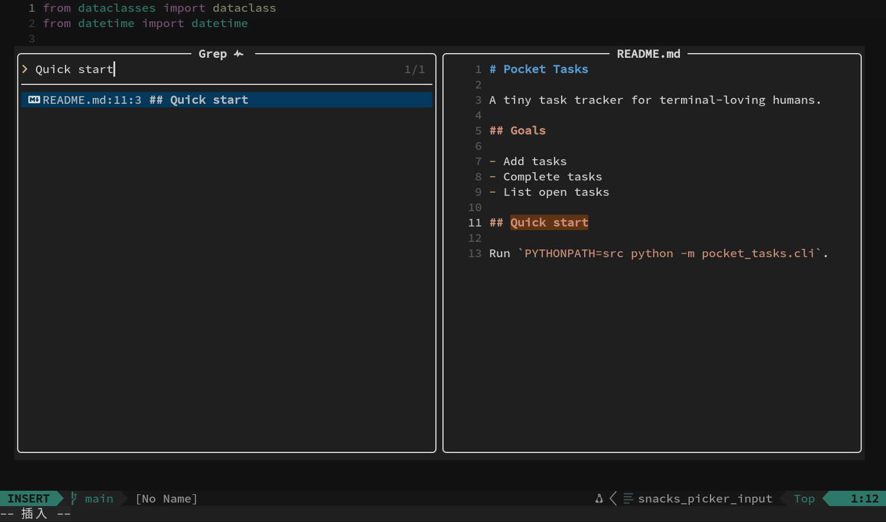

3. 若有多条结果，用 [[Ctrl]]+[[n]] 和 [[Ctrl]]+[[p]] 上下选择。
4. 选中 README 里的 `## Quick start`，按 [[Enter]]。

Picker 会关闭，`README.md` 在主编辑窗口打开，光标落到命中附近。

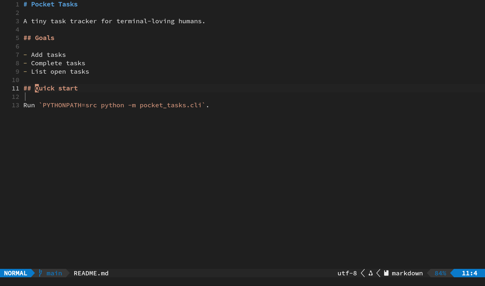

现在按 [[G]] 到文件末尾，按 [[o]] 新建一行，输入下面这段：

```markdown

## Data model

A task stores:

- `title`
- `created_at`
- `completed`
```

输入完成后按 [[Esc]]。

按 [[F1]]，输入 `write`。

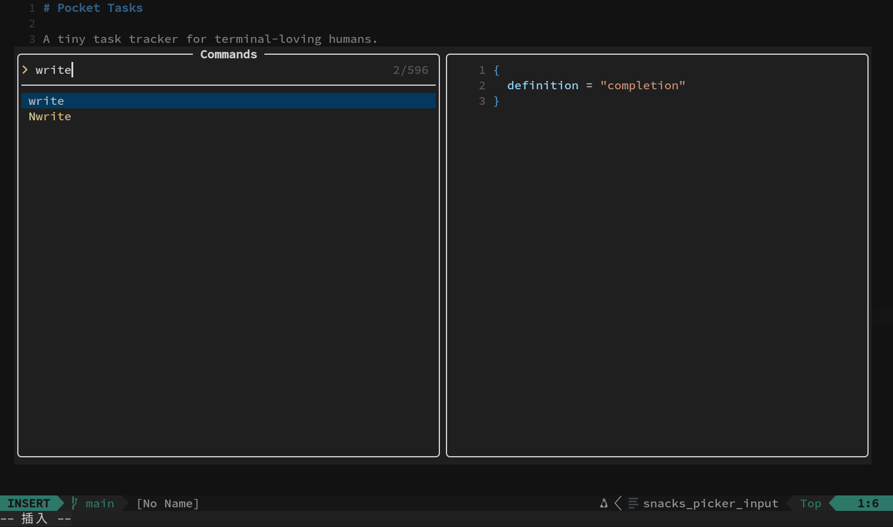

按第一次 [[Enter]]，让命令行形成 `:write`。

再按一次 [[Enter]] 保存。

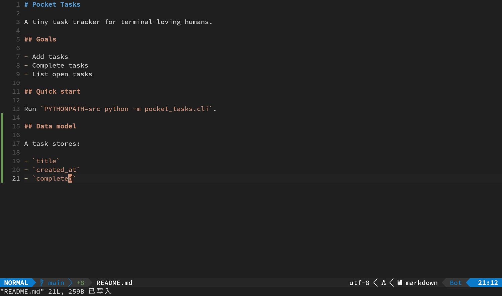

后面的跨文件搜索练习会使用这三个字段。

### 关闭一次 Picker

1. 按 [[Space]] [[/]]。
2. 输入 `pocket`。

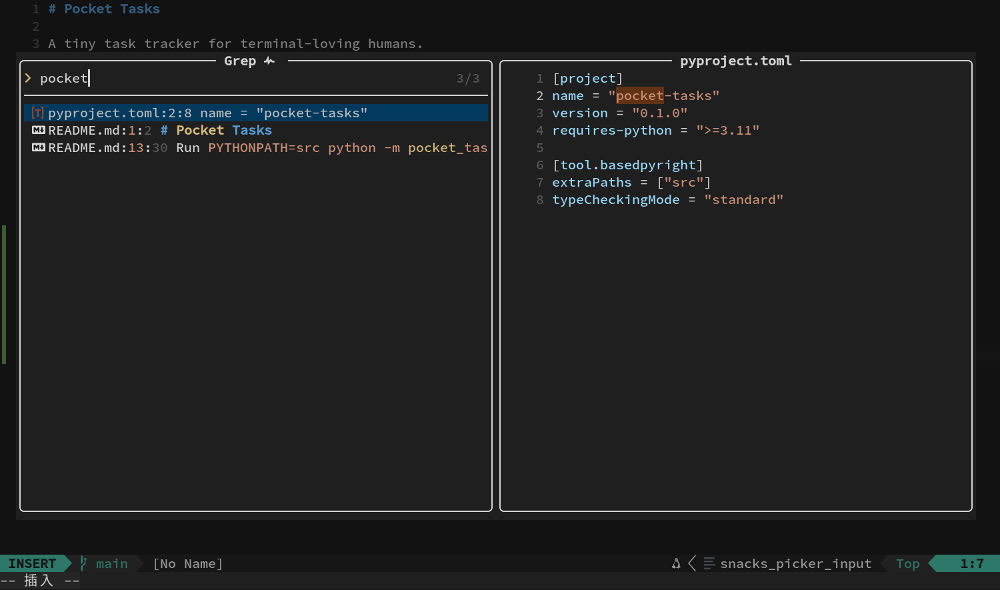

3. 按几次 [[Ctrl]]+[[n]] 看看不同文件的预览。

4. 按 [[Esc]]。

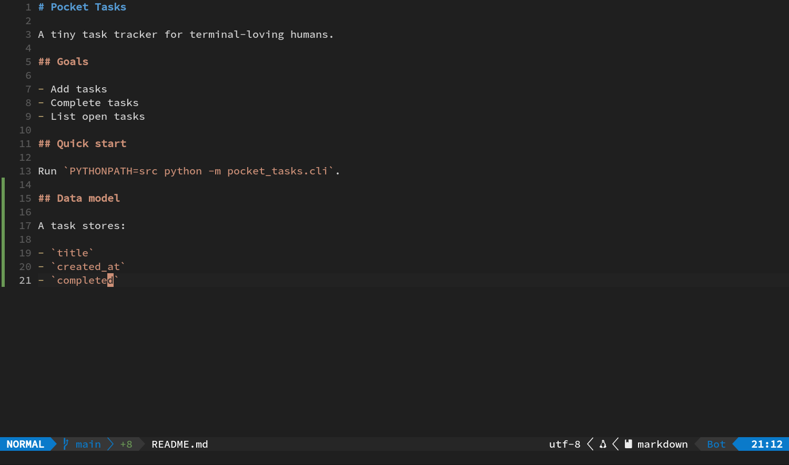

文件和光标都会停在打开 Picker 之前的位置。如果发现搜索内容不对，直接按 [[Esc]] 取消即可。

### [[Space]] [[/]] 和 [[/]] 的分工

| 场景 | 按键 | 搜索范围 |
| --- | --- | --- |
| 已知道内容在当前文件 | `/文字 ` → [[Enter]] | 当前 Buffer |
| 只知道它在项目某处 | [[Space]] [[/]]，再输入文字 | 当前项目 |

[[Space]] [[/]] 底层使用 ripgrep，并遵守项目的 Git ignore 规则，因此项目搜索通常不会包含构建产物。

## 3. 工作流二：选择部分结果并加入 Quickfix

搜索 Picker 适合找到一处后立即打开。如果需要连续查看多个结果，可以把它们加入 Quickfix，让结果列表一直保留在底部。

这一轮新增：

| 按键 | 效果 |
| --- | --- |
| [[Tab]] | 选中当前 Picker 结果，并移到下一条 |
| [[Ctrl]]+[[q]] | 把已选结果加入 Quickfix；没有选中项时会加入当前全部结果 |
| [[&#93;]] [[q]] / [[&#91;]] [[q]] | 跳到下一条 / 上一条 Quickfix 项 |

### 只挑两条 `tasks`

1. 按 [[Space]] [[/]]，输入 `tasks`。

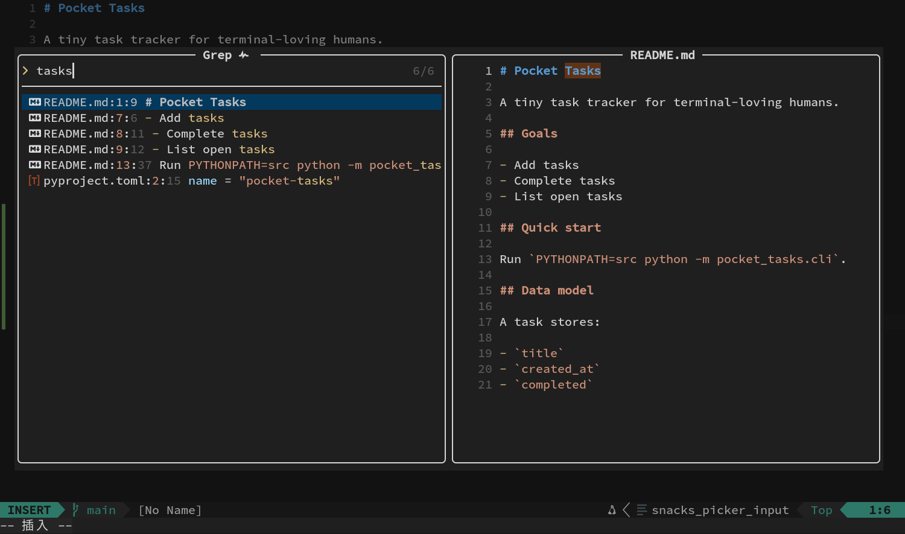

2. 用 [[Ctrl]]+[[n]] / [[Ctrl]]+[[p]] 找到一条想保留的结果。
3. 按 [[Tab]]。当前行出现选中标记，高亮自动移到下一条。

4. 再选一条，按 [[Tab]]。

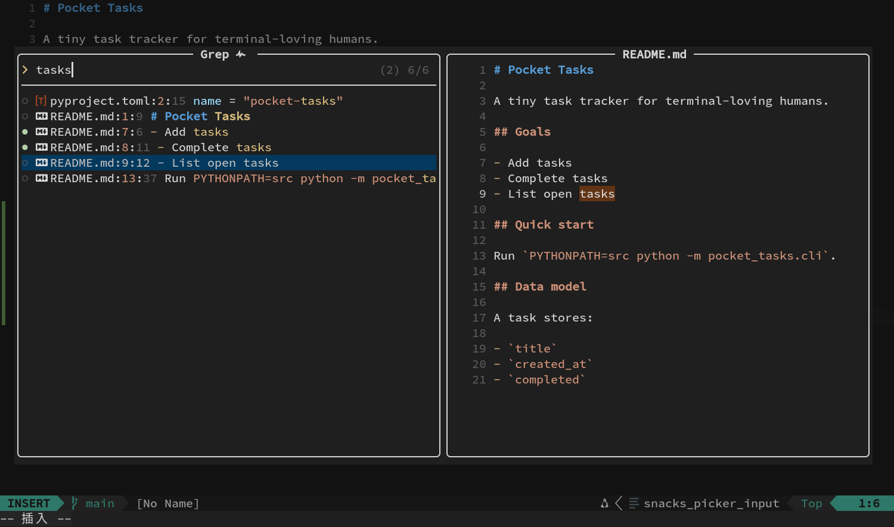

5. 按 [[Ctrl]]+[[q]]。

Picker 会关闭，底部打开 Quickfix 窗口。因为刚才明确选了两项，这里只会有两条。Quicker 会为文件名、行号和源代码加上更清楚的样式。

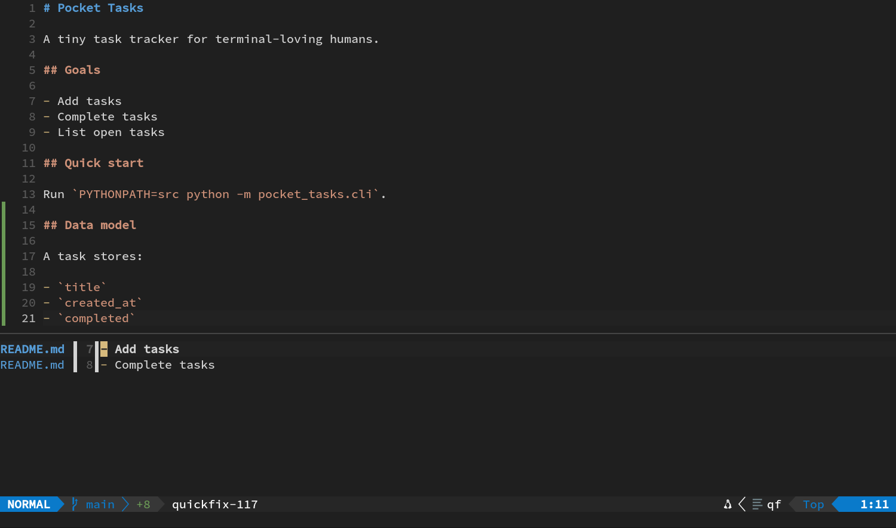

### 在 Quickfix 中逐项查看

1. Quickfix 刚打开时，焦点在底部。按 [[j]] / [[k]] 选择其中一条。
2. 按 [[Enter]]。对应文件会在上方编辑窗口打开，光标跳到命中位置；底部 Quickfix 列表继续保留。

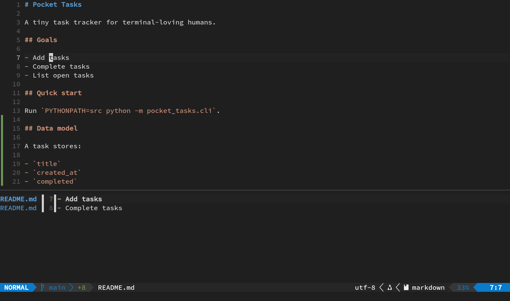

3. 在上方代码中按 [[&#93;]] [[q]]，跳到下一条。

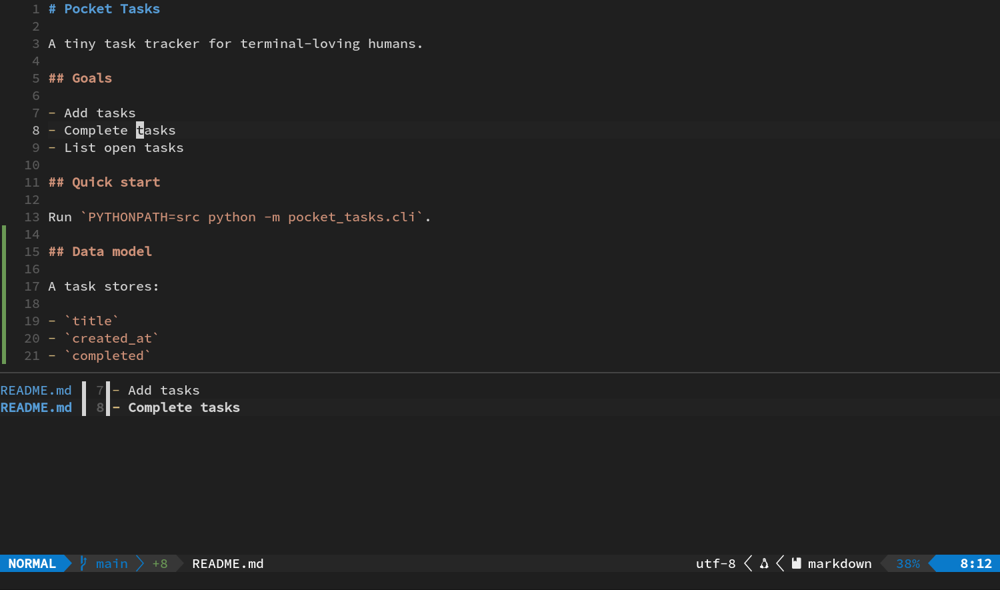

4. 按 [[&#91;]] [[q]]，返回上一条。

Quickfix 可以在不同文件之间跳转。上方窗口显示当前结果对应的代码，底部的结果列表则会一直保留。

检查完成后，按 [[F1]]，输入 `cclose`。

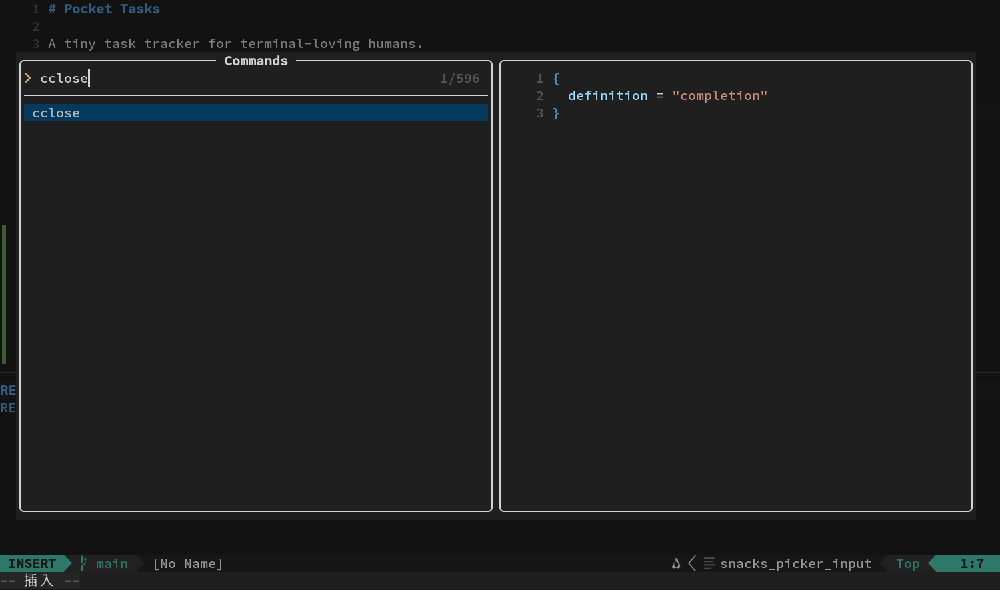

连按两次 [[Enter]] 关闭 Quickfix 窗口。

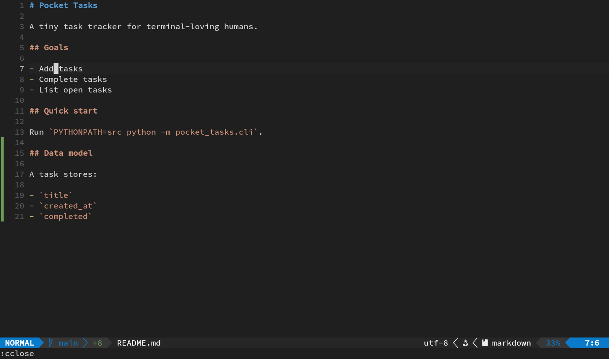

## 4. 工作流三：在 Quickfix 里跨文件改名

Quicker 允许直接编辑 Quickfix Buffer，可以像编辑普通文本一样修改结果行。

> [!CAUTION] 保存 Quickfix 会立即写回源文件
> 在 Quickfix 中按 [[u]] 可以撤销尚未保存的编辑。一旦保存，变化就会写入源文件。前面建立的 Git 基线用于检查或恢复这些修改。

### 把 `completed` 批量改成 `done`

1. 按 [[Space]] [[/]]，输入 `completed`。
2. 确认结果包含 `model.py` 中的字段和 README 中的列表项。

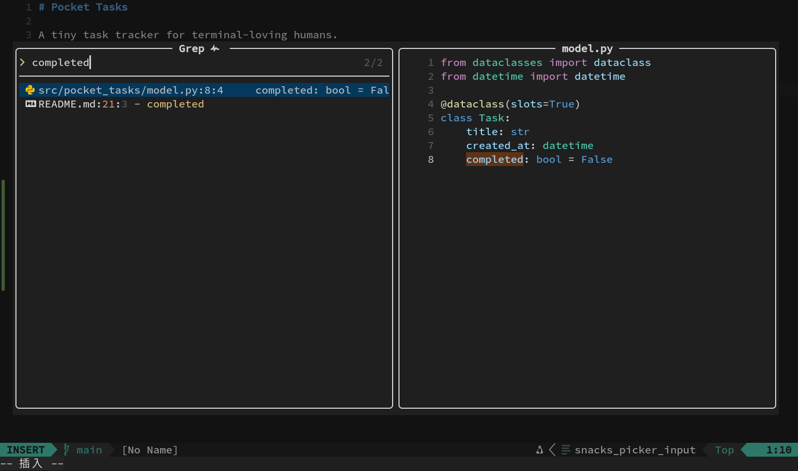

3. 这次不按 [[Tab]]，直接按 [[Ctrl]]+[[q]]。没有手动选中项时，当前全部结果都会进入 Quickfix。

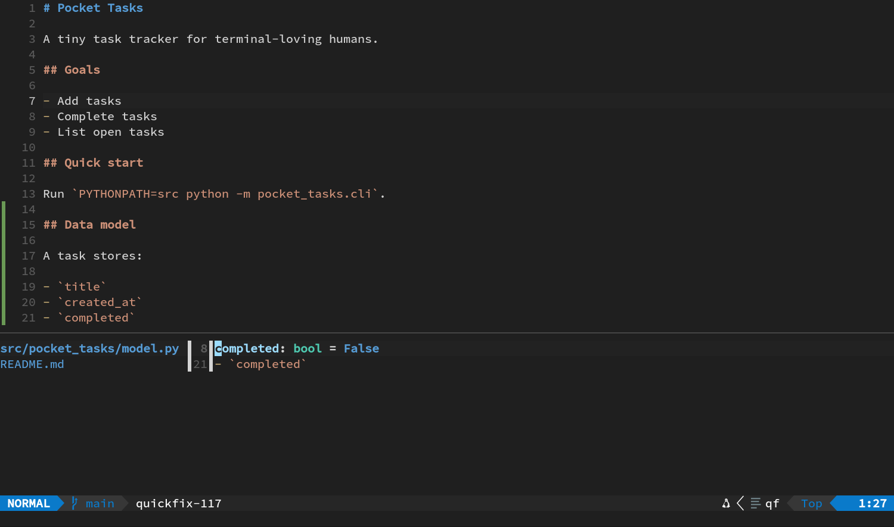

4. 在底部 Quickfix 中输入 `/completed`，按 [[Enter]]。这里的 [[/]] 搜索当前 Quickfix Buffer。
5. 按 [[c]] [[i]] [[w]]，输入 `done`，按 [[Esc]]。

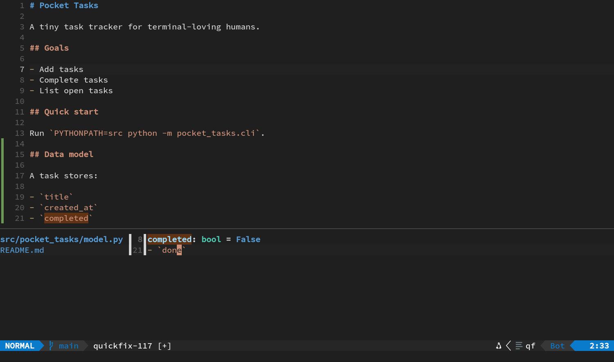

6. 按 [[n]] 到下一个 `completed`，再按 [[.]] 重放刚才的修改。

此时只改了 Quickfix Buffer，底部状态会显示它已修改。先查看两行，确认两处都变成 `done`。若改错，按 [[u]] 撤销，修好后再继续。

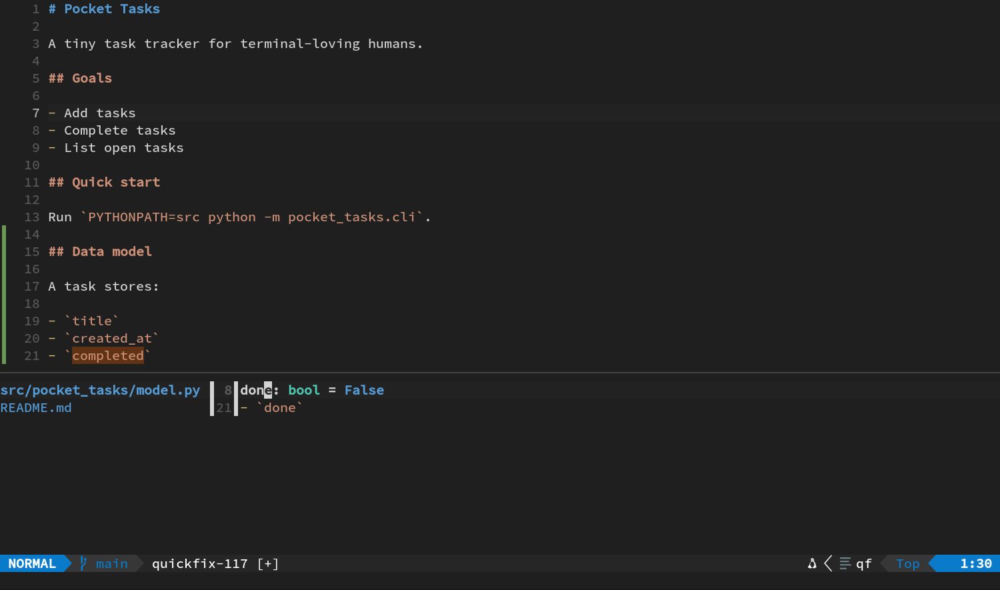

确认无误后：

1. 按 [[F1]]，输入 `write`。
2. 用 [[Ctrl]]+[[n]] / [[Ctrl]]+[[p]] 选中准确的 `write` 命令。

3. 连按两次 [[Enter]]。第一下把命令送到底部命令行，第二下执行写回。

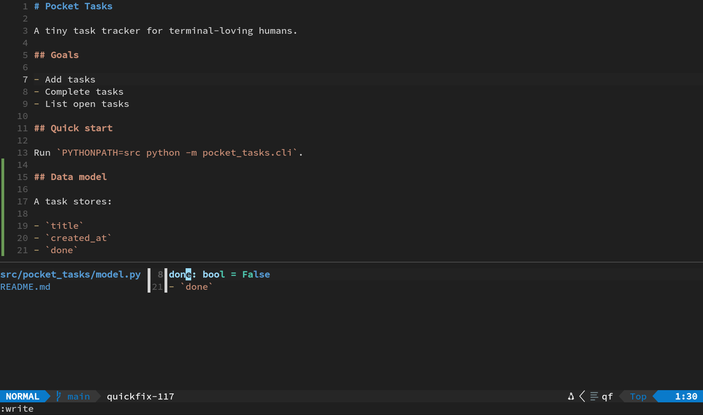

这次保存会触发 Quicker 应用修改。当源 Buffer 原本没有其他未保存内容时，当前 Quicker 设置还会将它写入磁盘。某个源 Buffer 事先已被改动时，它会保留已修改状态，稍后需要单独保存。

按 [[F1]]，输入 `cclose`。

连按两次 [[Enter]] 收起底部窗口。

再按 [[Space]] [[/]]，搜索 `completed`。

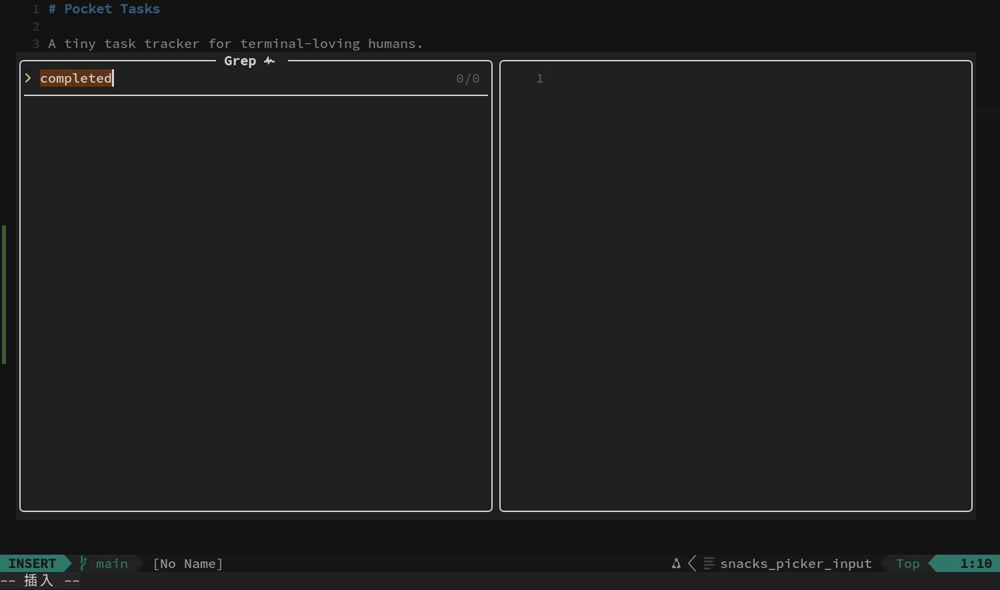

- 预期没有结果；
- 按 [[Esc]] 关闭无结果的 Picker；
- 重新按 [[Space]] [[/]]，搜索 `done`，应看到 README 和 `model.py` 的两处结果。

## 5. 工作流四：从 Quickfix 删除条目，再修改源文件

`created_at` 在现在的小工具里还用不上。它出现在两行：

1. `model.py` 的字段定义；
2. README 的字段列表。

这一轮区分两种删除：在 Quickfix 中按 [[d]] [[d]] 只移除一条结果；在源码 Buffer 中按 [[d]] [[d]] 才会删除真实代码行。

1. 按 [[Space]] [[/]]，输入 `created_at`。
2. 确认 Picker 正好有上面两条结果。如果数量更多，请通过 [[Tab]] 只选这两条。

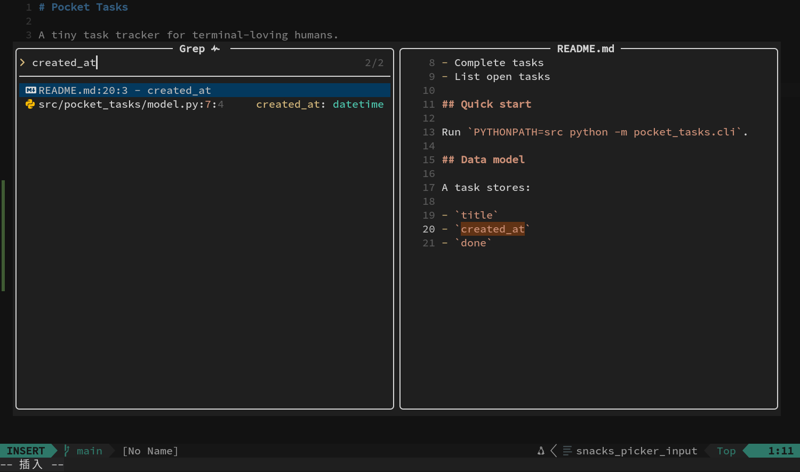

3. 按 [[Ctrl]]+[[q]] 加入 Quickfix。

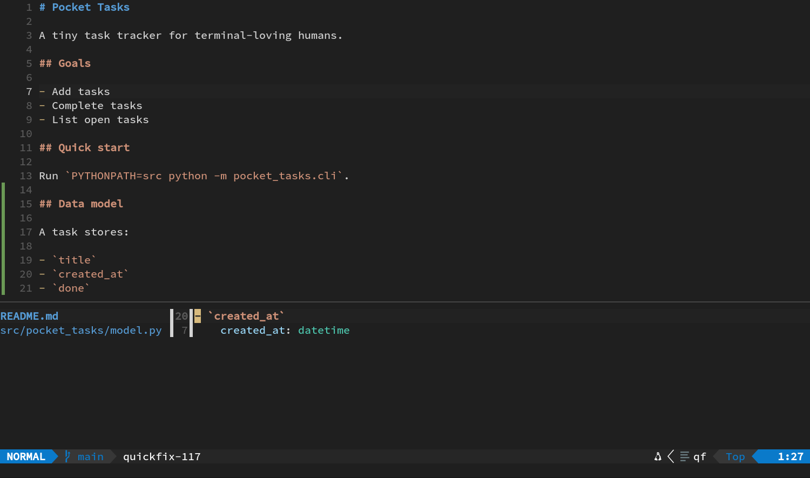

4. 按 [[g]] [[g]] 到 Quickfix 第一行。
5. 看清当前行的文件名，按 [[d]] [[d]]。

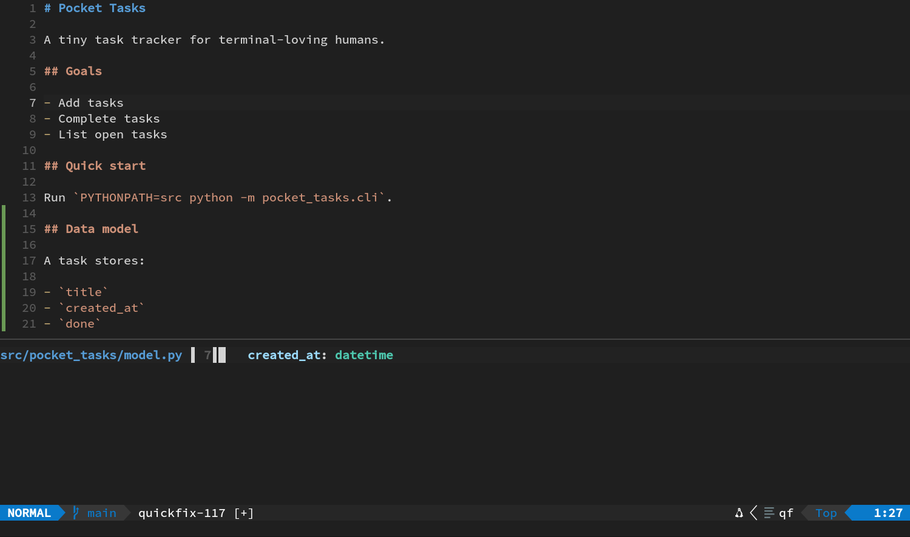

当前结果会从底部 Quickfix 列表中消失。按 [[u]] 可以恢复该条目。

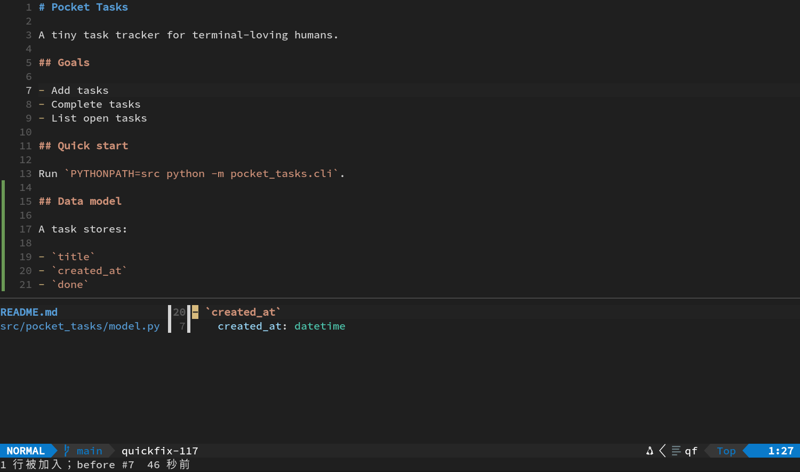

再按 [[d]] [[d]] 删除同一条目。

检查后执行 [[F1]] → `write` → [[Enter]] → [[Enter]]。这次保存只更新 Quickfix 列表，删除的结果条目不会导致源文件中的对应行被删除。

按 [[F1]] → `cclose` → [[Enter]] → [[Enter]]。再用 [[Space]] [[/]] 搜索 `created_at`，两份源文件中的结果仍然存在。需要区分：修改 Quickfix 行中的文字会写回源文件，而删除整个 Quickfix 条目只会改变结果列表。

现在回到真正的源码删除流程：

1. 在当前搜索 Picker 中选中 `model.py` 里的字段结果。

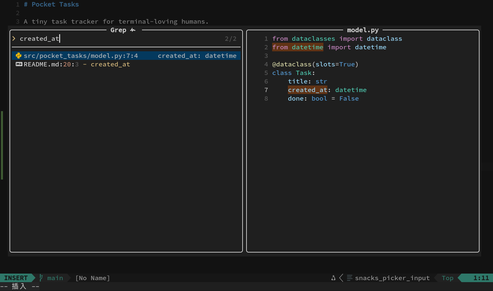

2. 按 [[Enter]] 打开它。

3. 光标落到 `created_at: datetime` 后按 [[d]] [[d]]。
4. 输入 `/from datetime`，按 [[Enter]]，再按 [[d]] [[d]] 删除已经无用的导入。

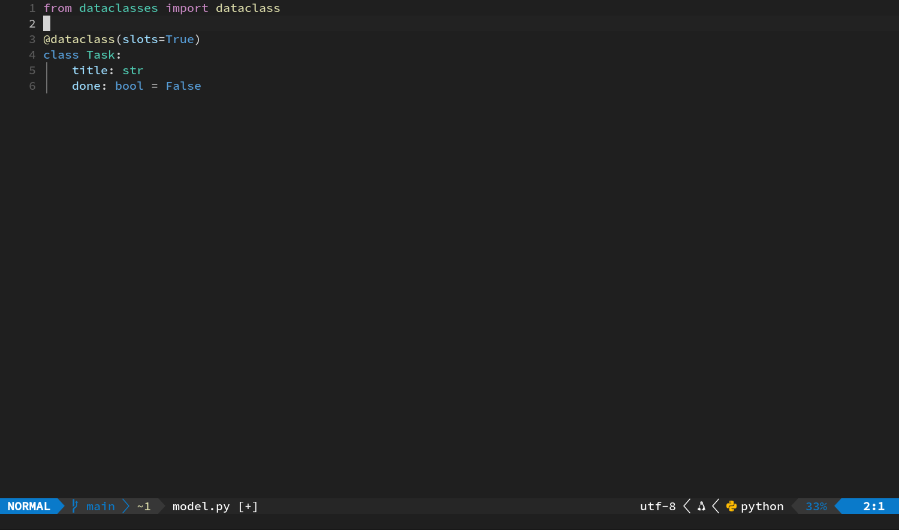

5. 按 [[F1]]，输入 `write`。

6. 连按两次 [[Enter]] 保存 `model.py`。

7. 按 [[Space]] [[/]]，再次搜索 `created_at`；此时只应剩 README 的列表项。

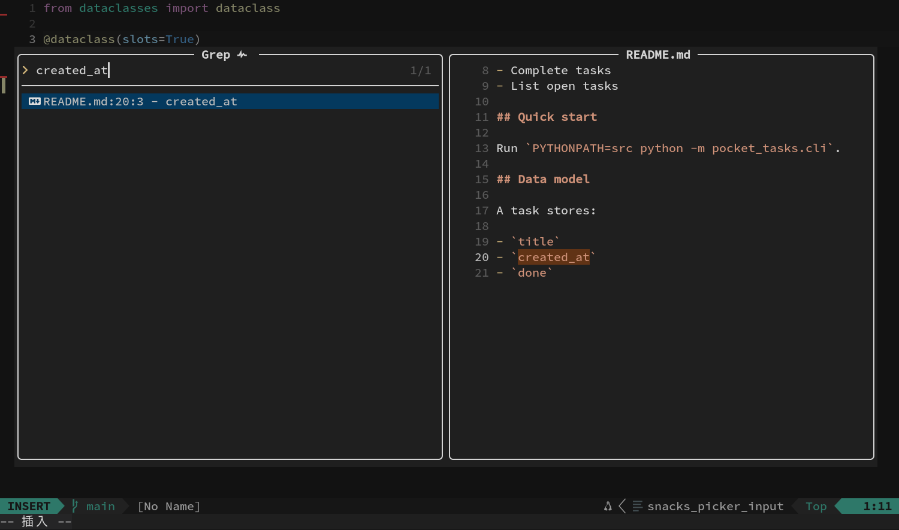

8. 按 [[Enter]] 打开它，光标落在 `- \`created_at\`` 上后按 [[d]] [[d]]。

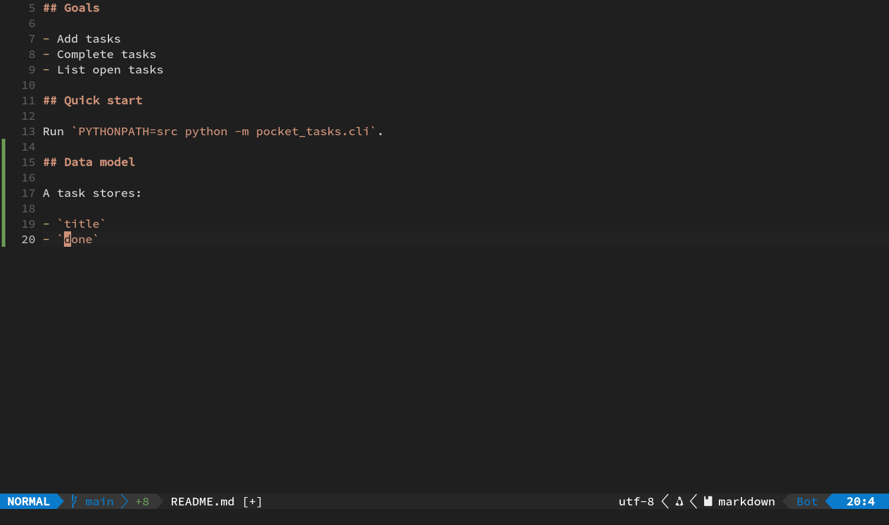

9. 按 [[F1]] → `write` → [[Enter]] → [[Enter]] 保存 README。

最后用 [[Space]] [[/]] 搜索 `created_at`，应得到空结果。

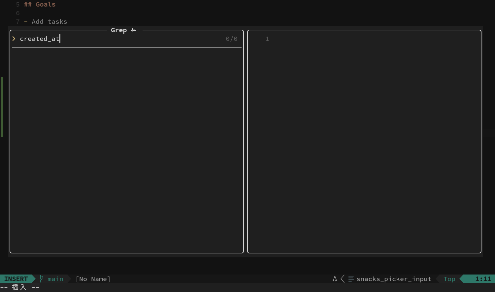

若仍有命中，按 [[Enter]] 打开，先看清文件与上下文，再决定是否删除。

再搜索 `class Task`，确认模型类仍然完整。

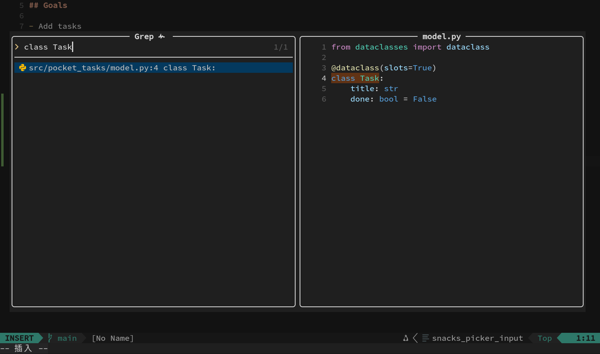

> [!WARNING] 使用 dd 前先确认当前 Buffer
> 在 Quickfix 中，[[d]] [[d]] 删除结果条目；在源码 Buffer 中，[[d]] [[d]] 删除代码行。操作前先确认当前窗口。

## 6. 结果检查

用 [[Space]] [[/]] 搜索 `class Task`，按 [[Enter]] 打开 `model.py`。它现在应为：

```python
from dataclasses import dataclass

@dataclass(slots=True)
class Task:
    title: str
    done: bool = False
```

README 的末尾应为：

```markdown
## Data model

A task stores:

- `title`
- `done`
```

按 [[F1]] → `wall` → [[Enter]] → [[Enter]] 再保存一次所有文件。本章的变化可以先留在 Git 工作区，第 11 章会系统处理它们。

## 本章肌肉记忆

| 目标 | 按键 |
| --- | --- |
| 项目全文搜索 | [[Space]] [[/]] |
| 在 Picker 中上下选择 | [[Ctrl]]+[[n]] / [[Ctrl]]+[[p]] |
| 打开结果 / 关闭 Picker | [[Enter]] / [[Esc]] |
| 选中多条 Picker 结果 | [[Tab]] |
| 把已选项或全部结果加入 Quickfix | [[Ctrl]]+[[q]] |
| 前后遍历 Quickfix | [[&#91;]] [[q]] / [[&#93;]] [[q]] |
| 将 Quicker 编辑应用到源文件 | 在 Quickfix Buffer 中保存 |
| 从 Quickfix 移除当前结果 | Quickfix 中按 [[d]] [[d]]；源文件保持原样 |
| 关闭 Quickfix 窗口 | [[F1]] → `cclose` → [[Enter]] → [[Enter]] |

上一章：[包围与注释](05-surround-and-comments.md) · 下一章：[Buffer、分屏与 Tab](07-buffers-windows-and-tabs.md)
