# 07｜Buffer、Window 与 Tab：组织开发布局

这一章会把 `model.py`、`service.py`、测试和 CLI 同时显示在屏幕上。最终布局为：左上编辑服务，左下查看测试，右侧对照数据模型，另一个 Tab 单独编辑 CLI。

先复习三个名词：

| 名词 | 它保存什么 | 说明 |
| --- | --- | --- |
| Buffer | 已读入内存的文件内容，也可能还没有磁盘文件 | 内容本身 |
| Window | 某个 Buffer 的可见视口 | 显示内容的区域 |
| Tab | 一整套 Window 布局 | 一组窗口布局 |

同一个 Buffer 可以同时显示在多个 Window 里。关闭 Window 只会关闭一个显示区域，通常不会把 Buffer 从内存中卸载。Tab 也不等同于单个文件，它保存的是一组分屏布局。

## 1. 开始前：补全可以运行的项目结构

第 06 章结束后，`model.py` 应为：

```python
from dataclasses import dataclass

@dataclass(slots=True)
class Task:
    title: str
    done: bool = False
```

我们先把它改成不可变数据类，然后建立服务、测试和 CLI 文件。本节只使用已经学过的按键，为后面的分屏练习准备文件。

### 更新 `model.py`

1. 按 `Space /`，输入 `@dataclass`。

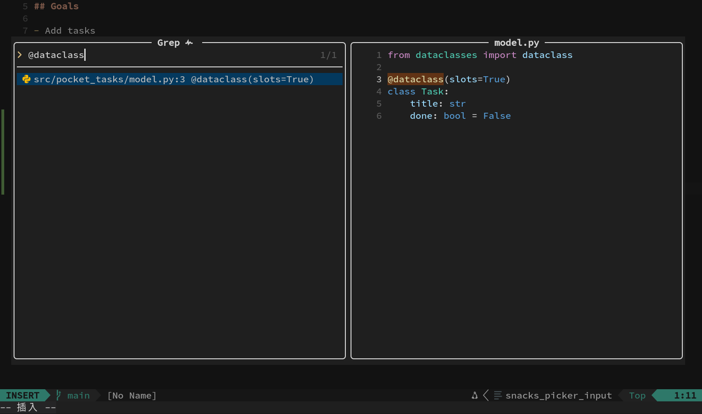

2. 选中 `model.py` 的结果，按 `Enter`。

3. 输入 `/slots`，按 `Enter`。
4. 按 `cia`，输入 `frozen=True`，按 `Esc`。

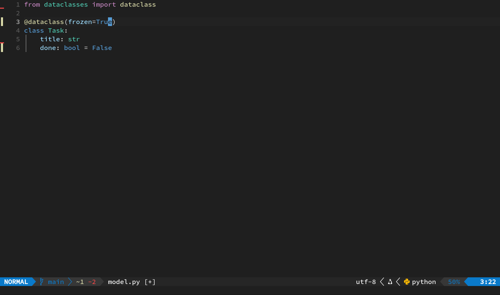

5. 按 `F1`，输入 `write`。

6. 连按两次 `Enter` 保存。

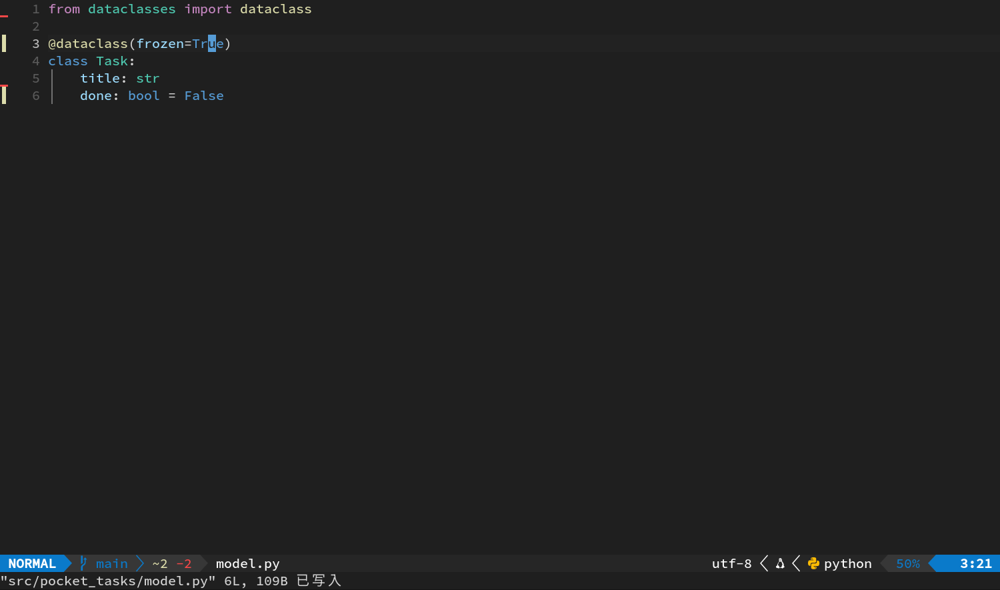

`cia` 会修改 `dataclass(...)` 中光标所在的参数。结果应为 `@dataclass(frozen=True)`。

### 用 Explorer 创建三个文件

1. 按 `Space e` 打开 Explorer。

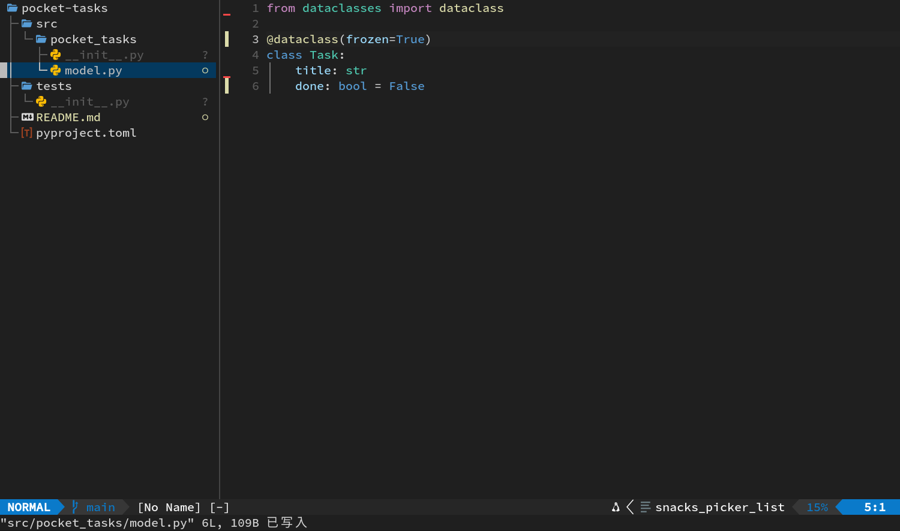

2. 它会跟随当前的 `model.py`。高亮 `model.py`，按 `a`，输入 `service.py`，按 `Enter`。

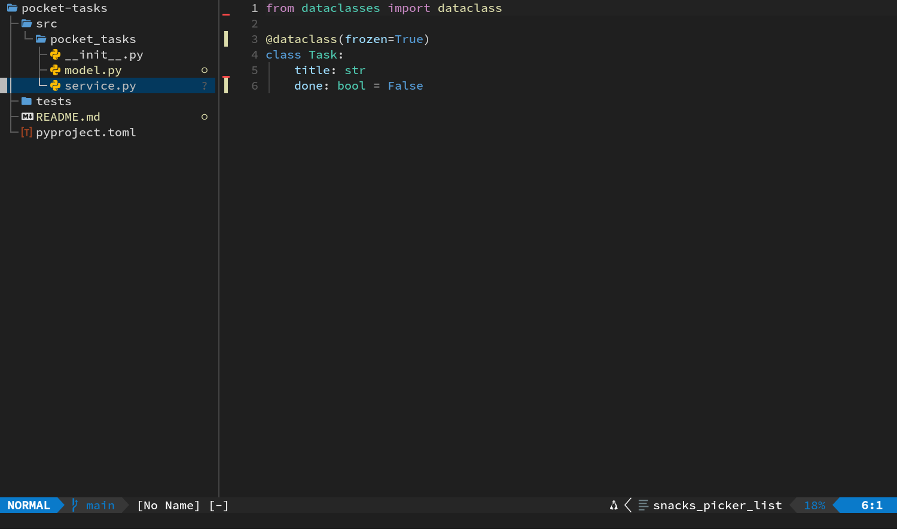

3. 新文件与 `model.py` 同级。继续按 `a`，输入 `cli.py`，按 `Enter`。

4. 用 `h` / `l` 折叠或展开目录，用 `j` / `k` 移到 `tests/`。
5. 展开 `tests/`，高亮 `__init__.py`，按 `a`，输入 `test_service.py`，按 `Enter`。

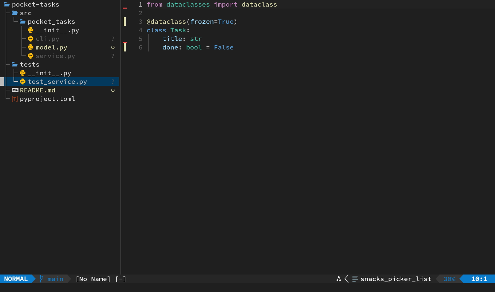

至此，服务、CLI 和测试文件都已创建完成。

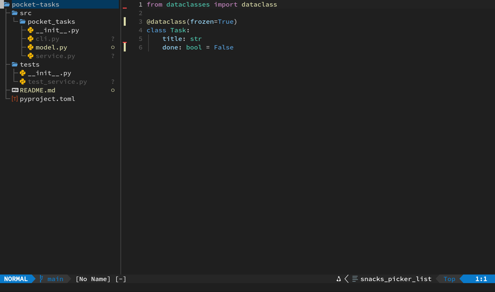

若某个文件已经存在，跳过对应的 `a`，直接打开它。Explorer 的 `a` 会立即创建磁盘文件，所以输入名字前先看一眼当前高亮项所在目录。

### 填写 `service.py`

在 Explorer 中打开 `src/pocket_tasks/service.py`，按 `i` 输入：

```python
from pocket_tasks.model import Task

def add_task(tasks: list[Task], title: str) -> list[Task]:
    return [*tasks, Task(title=title)]

def complete_task(tasks: list[Task], index: int) -> list[Task]:
    updated = list(tasks)
    task = updated[index]
    updated[index] = Task(title=task.title, done=True)
    return updated

def visible_titles(tasks: list[Task]) -> list[str]:
    return [task.title for task in tasks if not task.done]
```

按 `Esc`，再按 `F1`，输入 `write`。

连按两次 `Enter` 保存。第一次回车把命令送到底部命令行，第二次才执行。

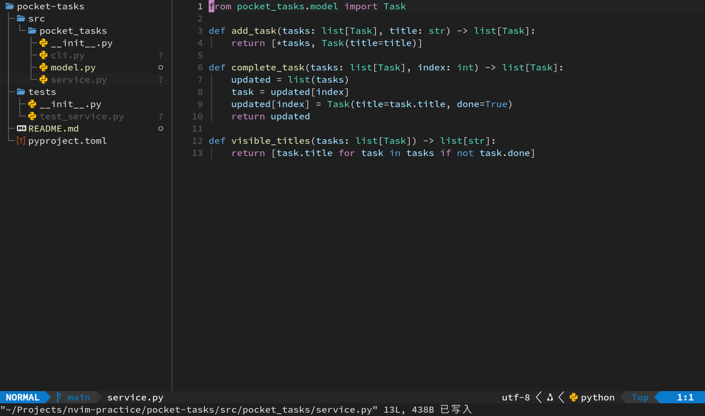

### 填写 `tests/test_service.py`

打开文件后 Explorer 通常仍留在左侧。按 `Ctrl-w h` 回到 Explorer；若左侧已经关闭，按 `Space e` 重新打开。导航到 `tests/test_service.py`，按 `Enter` 打开，再按 `i` 输入：

```python
import unittest

from pocket_tasks.model import Task
from pocket_tasks.service import add_task, complete_task, visible_titles

class ServiceTests(unittest.TestCase):
    def test_add_task(self) -> None:
        tasks = add_task([], "learn nvim")
        self.assertEqual(tasks, [Task(title="learn nvim")])

    def test_complete_task(self) -> None:
        tasks = complete_task([Task(title="learn nvim")], 0)
        self.assertTrue(tasks[0].done)

    def test_visible_titles_hides_completed(self) -> None:
        tasks = [
            Task(title="write code"),
            Task(title="take a walk", done=True),
        ]
        self.assertEqual(visible_titles(tasks), ["write code"])

if __name__ == "__main__":
    unittest.main()
```

按 `Esc`，再按 `F1`，输入 `write`。

连按两次 `Enter` 保存测试。

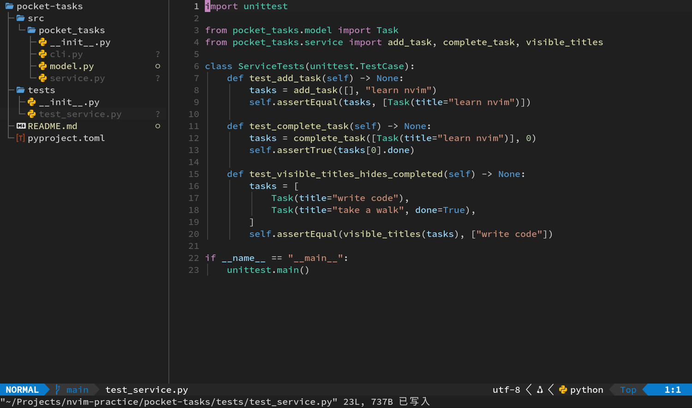

再按 `Ctrl-w h` 回到 Explorer；若 Explorer 已关闭，用 `Space e` 打开。导航到空的 `src/pocket_tasks/cli.py`，按 `Enter`。先不输入，只要打开一次，它就进入了 Buffer 列表。

焦点现在在 `cli.py`。按 `Space e` 关闭仍在左侧的 Explorer，让屏幕只留一个普通编辑 Window。

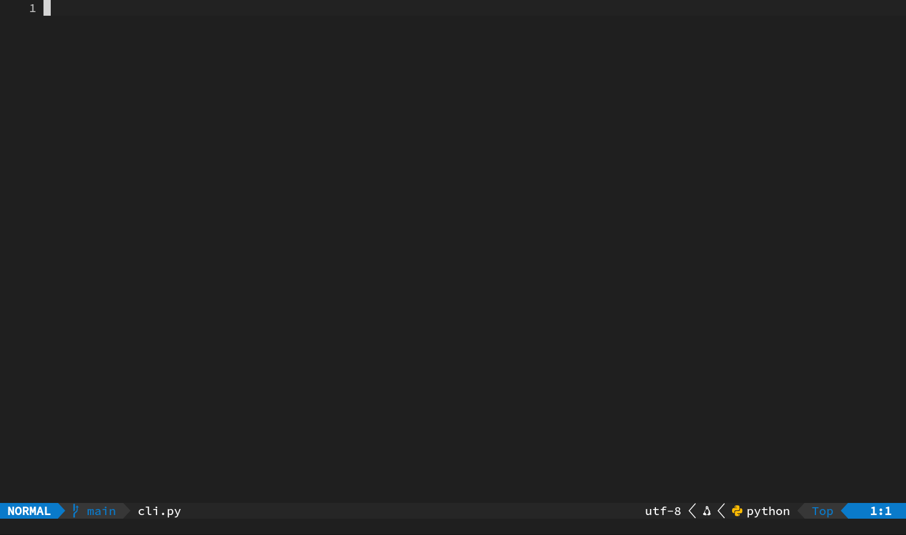

现在内存里至少有 `model.py`、`service.py`、`test_service.py` 和 `cli.py`。接下来开始组织窗口布局。

## 2. 工作流一：用 Buffer Picker 在已打开文件间切换

这一节只增加一个入口：

| 按键 | 效果 |
| --- | --- |
| `Space ,` | 打开 Buffer Picker |

Picker 里继续使用上一章的通用操作：直接输入筛选，`Ctrl-n` / `Ctrl-p` 移动，`Enter` 确认，`Esc` 关闭。

### 从 CLI 切回服务文件

1. 当前光标在空的 `cli.py`。按 `Space ,`。
2. 输入 `service`。

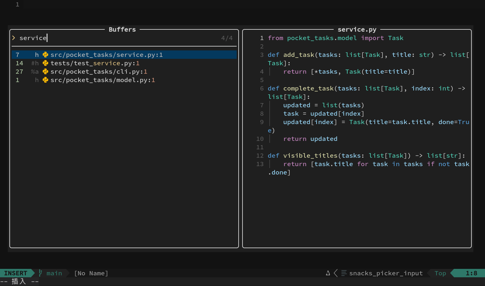

3. 选中 `src/pocket_tasks/service.py`，按 `Enter`。

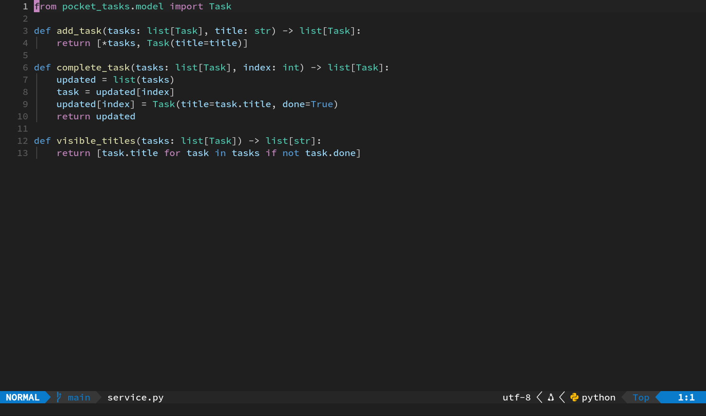

`service.py` 会在当前 Window 显示。`cli.py` 没有被关闭，它仍在 Buffer 列表中。再按 `Space ,`，输入 `cli`，就能看到它。按 `Esc` 关闭 Picker，继续留在 `service.py`。

### 文件、Buffer 和 Window 在这一刻的关系

```text
磁盘：src/pocket_tasks/cli.py
          ↑ 打开后读入
Buffer：cli.py 的内存内容
          ↑ 可以被某个窗口显示
Window：当前屏幕上的一块编辑区
```

在 Buffer Picker 中按 `Enter`，会让当前 Window 显示选中的 Buffer。Window 本身不变，只是显示内容发生变化。

## 3. 从 Buffer Picker 卸载 Buffer

打开的文件多了以后，Buffer Picker 也会越来越长。暂时不用的 Buffer 可以卸载，这不会影响磁盘上的文件。

这一轮新增：

| 按键 | 使用位置 | 效果 |
| --- | --- | --- |
| `Ctrl-x` | Buffer Picker 的输入区或结果列表 | 删除当前候选 Buffer |
| `dd` | Buffer Picker 的结果列表 | 删除高亮 Buffer |

### 用干净的 README 练 `Ctrl-x`

先确保 README 在 Buffer 列表里：

1. 按 `Space /`，输入 `# Pocket Tasks`，按 `Enter` 打开 README。
2. 不修改它。按 `Space ,`，输入 `service`，按 `Enter` 切回 `service.py`。
3. 再按 `Space ,`，输入 `README`。

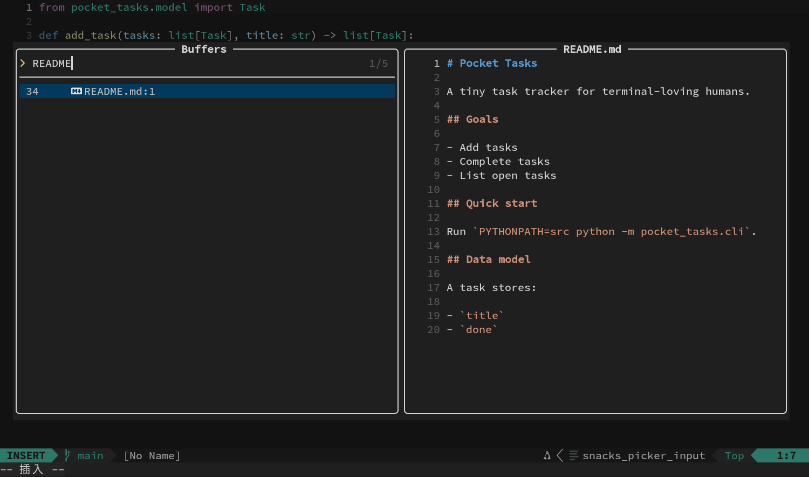

4. 高亮 README 后按 `Ctrl-x`。

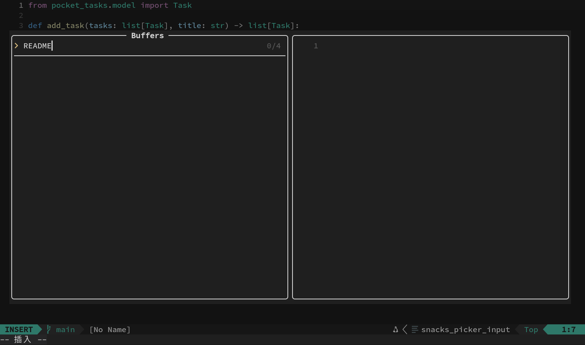

README 会从 Picker 中消失，Picker 仍然打开。按 `Esc` 收起它。此时 `README.md` 依然存在于项目目录；以后通过 Explorer 或项目搜索打开，它会重新变成 Buffer。

### 在结果列表中使用 `dd`

Buffer Picker 初始焦点在输入区。想使用 `dd` 时：

1. 按 `Space ,`，输入目标文件名。
2. 按 `/` 把焦点切到结果列表。这个 `/` 是 Picker 内的焦点开关。
3. 用 `j` / `k` 选择，按 `dd` 删除高亮 Buffer。
4. 按 `Esc` 关闭 Picker。

日常使用优先记 `Ctrl-x`，它在输入区就能直接工作。`dd` 适合已经把焦点切到列表的时候。

### 删除已修改 Buffer 时的确认框

若目标 Buffer 有未保存内容，Snacks 会询问是否保存：

- `Yes`：先保存，再卸载 Buffer；
- `No`：关闭 Buffer，丢弃其中尚未写盘的改动；
- `Cancel`：什么都不做。

> [!CAUTION] 选择 `No` 会丢弃未保存内容
> 不确定时选择 `Cancel`，回到文件确认内容。卸载 Buffer 与在 Explorer 中按 `d` 删除磁盘文件是两种不同操作；后者会影响磁盘文件。

## 4. 工作流二：竖分屏对照服务和模型

除了用 `Enter` 在当前 Window 中打开结果，Picker 还可以直接把结果放进新的分屏。

这一轮新增：

| 按键 | 效果 |
| --- | --- |
| `Ctrl-v` | 在右侧竖分屏打开 Picker 当前结果 |
| `Ctrl-w h` / `Ctrl-w l` | 移到左侧 / 右侧 Window |
| `Ctrl-w =` | 让当前 Tab 里的 Window 重新平分可用空间 |
| `Ctrl-w q` | 关闭当前 Window |

`Ctrl-w` 系列都是两段按键：先按住 `Ctrl` 点一下 `w`，松开后再按方向或命令字母。

### 创建一组对照窗口

1. 确认当前只有一个普通编辑 Window，里面显示 `service.py`。
2. 按 `Space ,`，输入 `model`。

3. 选中 `model.py`，按 `Ctrl-v`。

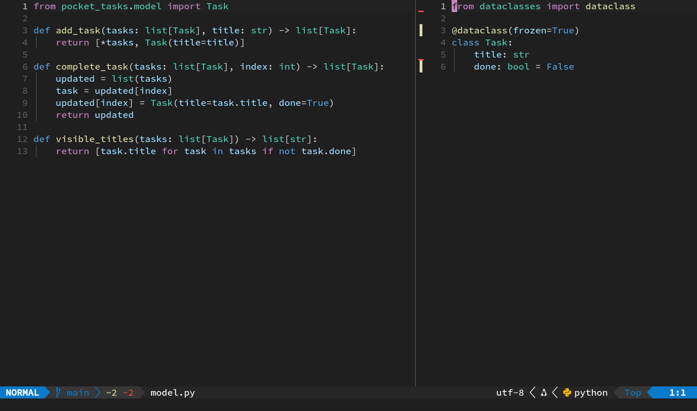

默认会将新竖分屏放在右边，所以预期布局是：

```text
+----------------------+----------------------+
| service.py           | model.py             |
|                      |                      |
| 主要逻辑              | Task 定义             |
|                      |                      |
+----------------------+----------------------+
```

焦点落在刚打开的右侧 `model.py`。

1. 按 `Ctrl-w h`，光标到左侧 `service.py`。
2. 按 `Ctrl-w l`，光标回右侧 `model.py`。
3. 按 `Ctrl-w =`，两边宽度重新均分。


注意光标所在行、状态栏文件名和高亮边框的变化。按键始终作用于当前 Window 中的 Buffer，操作前先看一眼状态栏，可以避免改错文件。

### 关窗口，保留 Buffer

1. 保持焦点在右侧 `model.py`。
2. 按 `Ctrl-w q`。


右侧 Window 消失，`service.py` 重新占满编辑区。`model.py` Buffer 仍然存在：

1. 按 `Space ,`，输入 `model`，它还在候选列表。

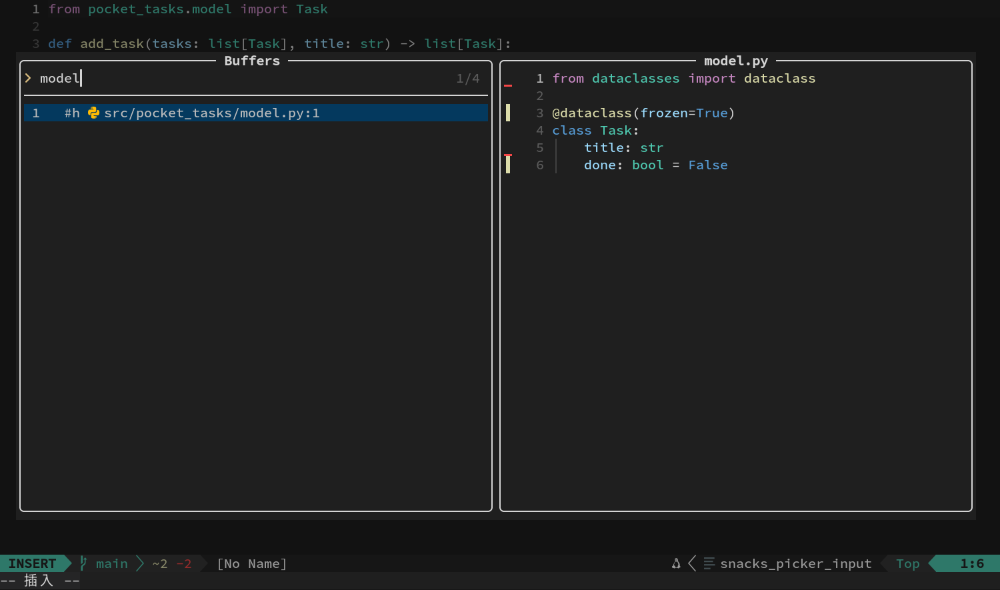

2. 按 `Esc` 关闭 Picker。
3. 再按 `Space ,`，搜索 `model`，按 `Ctrl-v` 恢复右侧分屏。

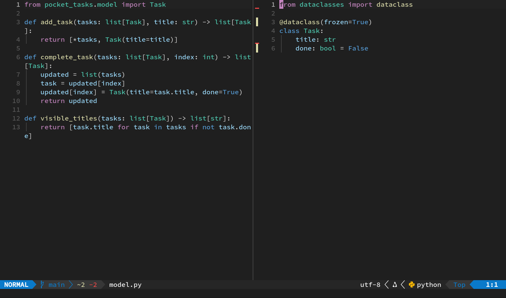

这就是关闭 Window 与卸载 Buffer 的区别。`Ctrl-w q` 关闭当前视口；Buffer Picker 中的 `Ctrl-x` 或 `dd` 会把 Buffer 从内存列表中卸载。

## 5. 工作流三：横分屏把测试放在代码下方

左右两栏适合对照定义和调用位置。测试通常放在实现代码下方，这样可以直接核对输入和预期结果。

这一轮新增：

| 按键 | 效果 |
| --- | --- |
| `Ctrl-s` | 在下方横分屏打开 Picker 当前结果 |
| `Ctrl-w j` / `Ctrl-w k` | 移到下方 / 上方 Window |

### 创建三窗口开发布局

当前应有左侧 `service.py` 和右侧 `model.py`，焦点在右侧。

1. 按 `Ctrl-w h` 到左侧 `service.py`。
2. 按 `Space ,`，输入 `test_service`。

3. 选中 `tests/test_service.py`，按 `Ctrl-s`。

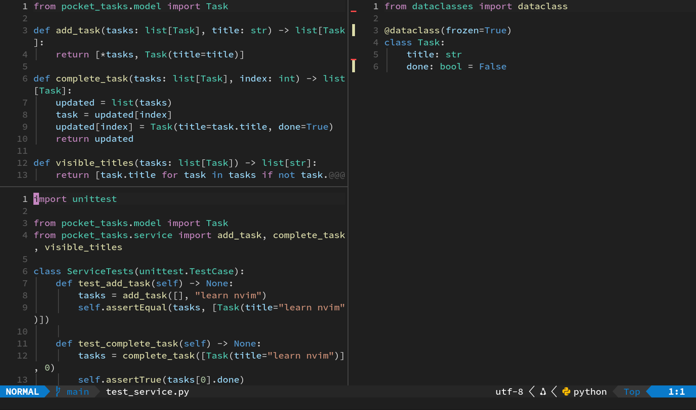

配置会把新横分屏放在下方，得到：

```text
+----------------------+----------------------+
| service.py           |                      |
|                      | model.py             |
+----------------------+                      |
| test_service.py      |                      |
|                      |                      |
+----------------------+----------------------+
```

焦点现在位于左下的 `test_service.py`。

1. 按 `Ctrl-w k`，去左上 `service.py`。
2. 按 `Ctrl-w j`，回左下 `test_service.py`。
3. 按 `Ctrl-w l`，去右侧 `model.py`。
4. 按 `Ctrl-w h`，回到左侧与当前光标位置最接近的 Window。
5. 按 `Ctrl-w =` 重新整理尺寸。

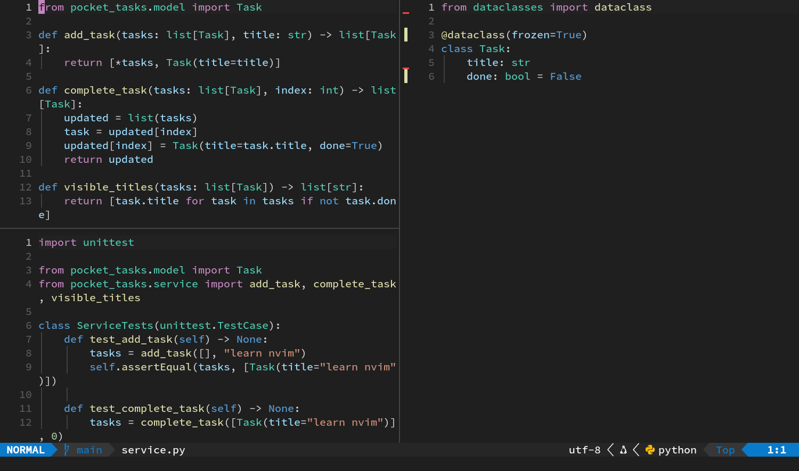

布局形状不规整时，`h` / `j` / `k` / `l` 会选对应方向上最合适的邻居。看一眼状态栏就知道落到了哪份文件。

### 在日常编码中使用这组布局

- 在 `service.py` 改 `complete_task`；
- 按 `Ctrl-w l` 核对 `Task` 的 `title` 和 `done` 字段；
- 回到 `service.py`，完成实现；
- 按 `Ctrl-w j` 对照 `test_complete_task`；
- 修改时用 `F1` → `write` → `Enter` → `Enter` 保存当前文件；
- 要一次保存全部，用 `F1` → `wall` → `Enter` → `Enter`。

一个小功能通常会同时涉及模型、实现和测试。让三个 Window 分别显示这几类内容，可以减少频繁切换文件带来的上下文丢失。

## 6. 工作流四：把 CLI 放进新 Tab

当前三窗口布局用于服务开发。CLI 暂时不需要与它们同时显示，可以放在单独的 Tab 中。

这一轮新增：

| 按键 | 效果 |
| --- | --- |
| `Ctrl-t` | 在新 Tab 中打开 Picker 当前结果 |
| `gt` / `gT` | 去下一个 / 上一个 Tab |

### 打开 CLI Tab

1. 在三窗口布局的任意 Window 中按 `Space ,`。
2. 输入 `cli`。

3. 选中 `src/pocket_tasks/cli.py`，按 `Ctrl-t`。

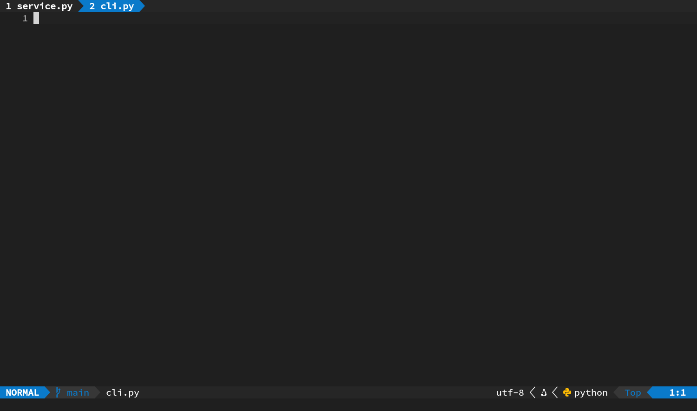

新 Tab 会在当前 Tab 后面创建，其中只有一个显示 `cli.py` 的 Window。当 Tab 数量变成两个时，顶部 Tabline 会出现，提示当前位置。

在空的 `cli.py` 中按 `i` 输入：

```python
from pocket_tasks.model import Task
from pocket_tasks.service import add_task, visible_titles

def main() -> None:
    tasks: list[Task] = []
    tasks = add_task(tasks, "learn nvim")
    for title in visible_titles(tasks):
        print(f"- {title}")

if __name__ == "__main__":
    main()
```

按 `Esc`，再按 `F1`，输入 `write`。

连按两次 `Enter` 保存。

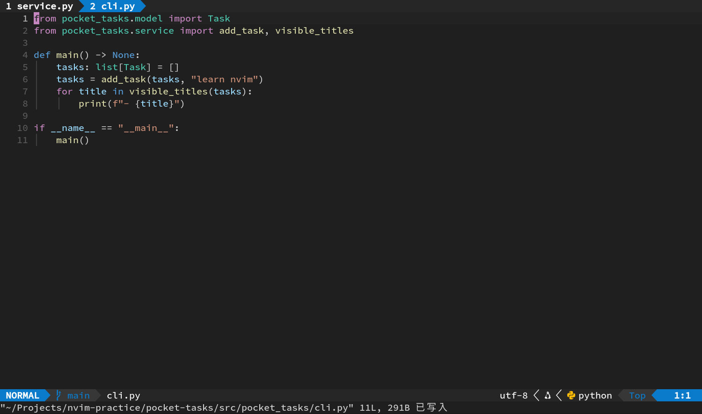

### 在两个 Tab 之间切换

1. 按 `gT`：回到前一个 Tab，三窗口布局仍然保留。

2. 按 `gt`：去下一个 Tab，回到 `cli.py`。

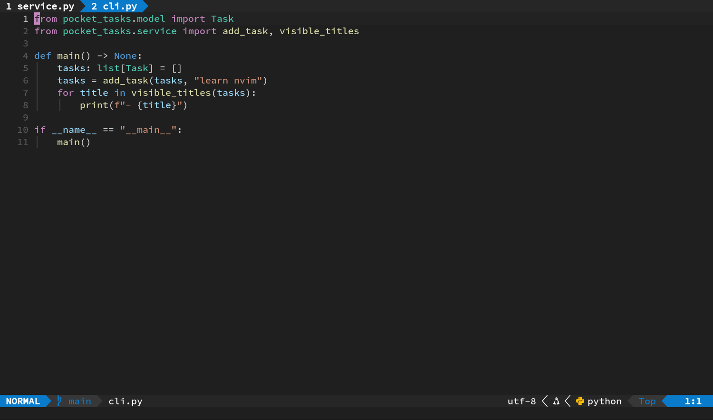

Tab 记住的是 Window 布局。Buffer 列表由整个 Neovim 共享，所以你在 CLI Tab 中按 `Space ,`，仍然会看到 `service.py`、`model.py` 和测试。

只有一个 Tab 时，`gt` 和 `gT` 的画面不会变。当前有两个，它们会在首尾之间循环。

## 7. Picker 三种打开方式的决策表

`Ctrl-v`、`Ctrl-s`、`Ctrl-t` 是 Snacks Picker 的通用操作，同样适用于 `Space /` 的项目搜索结果。以后搜到定义或引用时，可以直接选择合适的打开方式。

| 你当时的目标 | Picker 中按什么 | 结果 |
| --- | --- | --- |
| 只需查看当前结果，可以替换当前内容 | `Enter` | 在当前 Window 打开 |
| 并排对照两份代码 | `Ctrl-v` | 右侧竖分屏 |
| 上下对照实现与测试 | `Ctrl-s` | 下方横分屏 |
| 保留现有布局，另开一组窗口 | `Ctrl-t` | 新 Tab |

这组按键是整套配置里很值得形成肌肉记忆的特色工作流：

> 先搜索或筛选，再用 `Enter` / `Ctrl-v` / `Ctrl-s` / `Ctrl-t` 选择打开位置。

## 8. 最终项目检查点

按 `gT` 回到三窗口 Tab，然后按 `F1`，输入 `wall`。

连按两次 `Enter` 保存所有文件。

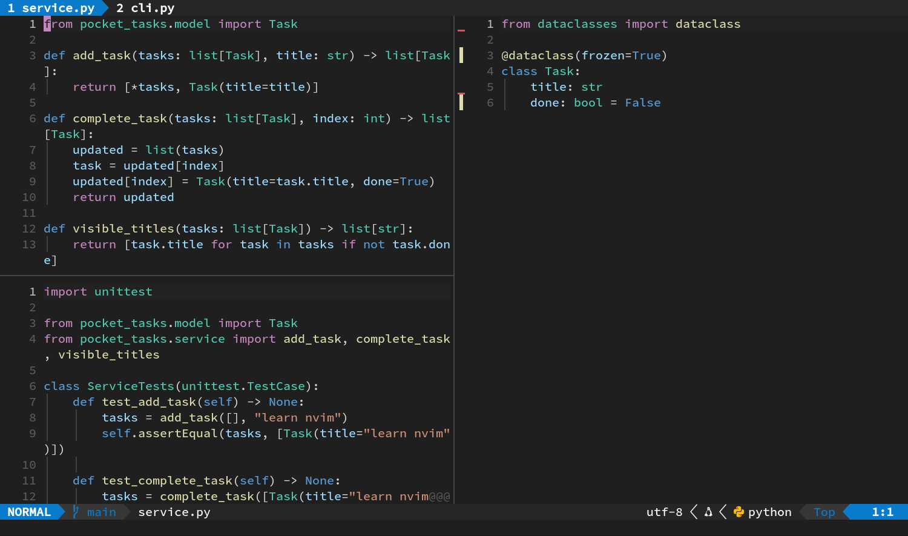

`src/pocket_tasks/` 下的两个核心源码文件应为：

::: code-group

```python [model.py]
from dataclasses import dataclass

@dataclass(frozen=True)
class Task:
    title: str
    done: bool = False
```

```python [service.py]
from pocket_tasks.model import Task

def add_task(tasks: list[Task], title: str) -> list[Task]:
    return [*tasks, Task(title=title)]

def complete_task(tasks: list[Task], index: int) -> list[Task]:
    updated = list(tasks)
    task = updated[index]
    updated[index] = Task(title=task.title, done=True)
    return updated

def visible_titles(tasks: list[Task]) -> list[str]:
    return [task.title for task in tasks if not task.done]
```

:::

`tests/test_service.py` 应有三个测试：

- `test_add_task`；
- `test_complete_task`；
- `test_visible_titles_hides_completed`。

`cli.py` 应有 `main()`，并在文件末尾调用它。

屏幕上的推荐开发布局是：

```text
Tab 1：服务开发
+----------------------+----------------------+
| service.py           |                      |
|                      | model.py             |
+----------------------+                      |
| test_service.py      |                      |
|                      |                      |
+----------------------+----------------------+

Tab 2：CLI
+---------------------------------------------+
| cli.py                                      |
+---------------------------------------------+
```

第 08 章会在这些文件中练习补全和 Copilot，第 09 章会使用 LSP 在定义、引用和诊断之间跳转。当前项目和窗口布局已经准备完成。

## 本章肌肉记忆

| 目标 | 按键 |
| --- | --- |
| 打开 Buffer Picker | `Space ,` |
| 卸载 Picker 当前 Buffer | `Ctrl-x`；结果列表中也可按 `dd` |
| 在右侧 / 下方 / 新 Tab 打开 Picker 结果 | `Ctrl-v` / `Ctrl-s` / `Ctrl-t` |
| 在 Window 间按方向移动 | `Ctrl-w h/j/k/l` |
| 均分 Window 尺寸 | `Ctrl-w =` |
| 关闭当前 Window | `Ctrl-w q` |
| 前往下一个 / 上一个 Tab | `gt` / `gT` |

上一章：[项目搜索与 Quickfix](06-search-and-quickfix.md) · 下一章：[补全与 Copilot](08-completion-and-copilot.md)
