# 08｜补全与 Copilot

第 07 章已经准备好 `model.py`、`service.py`、测试与 CLI 的窗口布局。本章不增加功能，只重写几行现有代码，用于练习 Blink 补全、函数签名提示和 Copilot 灰字建议。练习结束后文件内容仍与第 07 章结尾一致，第 10 章可以直接继续测试。

本章最重要的一条规则是：

> 看到候选菜单，用 [[Ctrl]]+[[n]] / [[Ctrl]]+[[p]] 选择，再用 [[Ctrl]]+[[y]] 或 [[Tab]] 接受；看到行内灰字，用 [[Alt]]+[[l]] 接受；[[Enter]] 只负责换行。

## 本章结束时，你会掌握

- 分清 Blink 候选菜单、签名浮窗与 Copilot 行内灰字；
- 用 [[Ctrl]]+[[n]] / [[Ctrl]]+[[p]] 浏览补全，用 [[Ctrl]]+[[y]] 或 [[Tab]] 接受；
- 明确当前配置中的 [[Enter]] 只换行；
- 用 [[Alt]]+[[l]] 接受 Copilot 建议，同时保留人工审查；
- 补全暂时没有出现时，也能继续输入和排查原因。

本章只新增下面几个按键：

| 按键 | 使用位置 | 效果 |
| --- | --- | --- |
| [[Ctrl]]+[[n]] / [[Ctrl]]+[[p]] | 插入模式的 Blink 菜单 | 选择下一项 / 上一项 |
| [[Ctrl]]+[[y]] | Blink 菜单 | 接受当前候选 |
| [[Tab]] | Blink 菜单 | 接受当前候选；没有可接受候选时执行普通 [[Tab]] |
| [[Ctrl]]+[[Space]] | 插入模式 | 手动请求显示补全菜单 |
| [[Alt]]+[[l]] | Copilot 灰字出现时 | 接受整条行内建议 |

[[Alt]]+[[l]] 中的 [[l]] 是小写字母 L。部分终端字体可能使它与数字 1 看起来相似。

## 1. 开始前：确认 CLI 基线

按 [[g]] [[t]] 或 [[g]] [[T]] 前往 `cli.py` 所在 Tab。若第 07 章的 Tab 已经关闭，就按 [[Space]] [[,]]，输入 `cli`，选中 `src/pocket_tasks/cli.py` 后按 [[Enter]]。

文件应为：

```python
from pocket_tasks.model import Task
from pocket_tasks.service import add_task, visible_titles

def main() -> None:
    tasks: list[Task] = []
    tasks = add_task(tasks, "learn nvim")
    for title in visible_titles(tasks):
        print(f"- {title}")

if __name__ == "__main__":
    main()
```


若内容有少量差异也没关系，先把本章练习涉及的几行调整到示例状态。保存时依次按 [[Esc]] → [[F1]] → 输入 `write` → [[Enter]] → [[Enter]]。

第一次回车选中命令并把 `:write` 放到底部命令行，第二次回车才执行写入。

### 三种提示的显示形式

| 屏幕现象 | 提示来源 | 常用操作 |
| --- | --- | --- |
| 一列可上下选择的候选，旁边可能有文档 | Blink | [[Ctrl]]+[[n]] / [[Ctrl]]+[[p]]，再按 [[Ctrl]]+[[y]] 或 [[Tab]] |
| 函数名、参数与返回类型的小浮窗 | LSP 签名提示 | 阅读后继续输入参数 |
| 光标后方的一段浅色行内文字 | Copilot | 审查内容，合适时按 [[Alt]]+[[l]] |

Blink 候选菜单通常提供短小、结构化的补全项；Copilot 通常提供较长的整段建议。接受前都应先检查内容。

## 2. 工作流一：用 Blink 重写类型标注

下面重新输入一次 `tasks: list[Task] = []`。代码保持不变，练习重点是补全操作。

### 第一步：让 `list` 出现在候选菜单

1. 普通模式输入 `/tasks:`，按 [[Enter]]，光标跳到类型标注这一行。

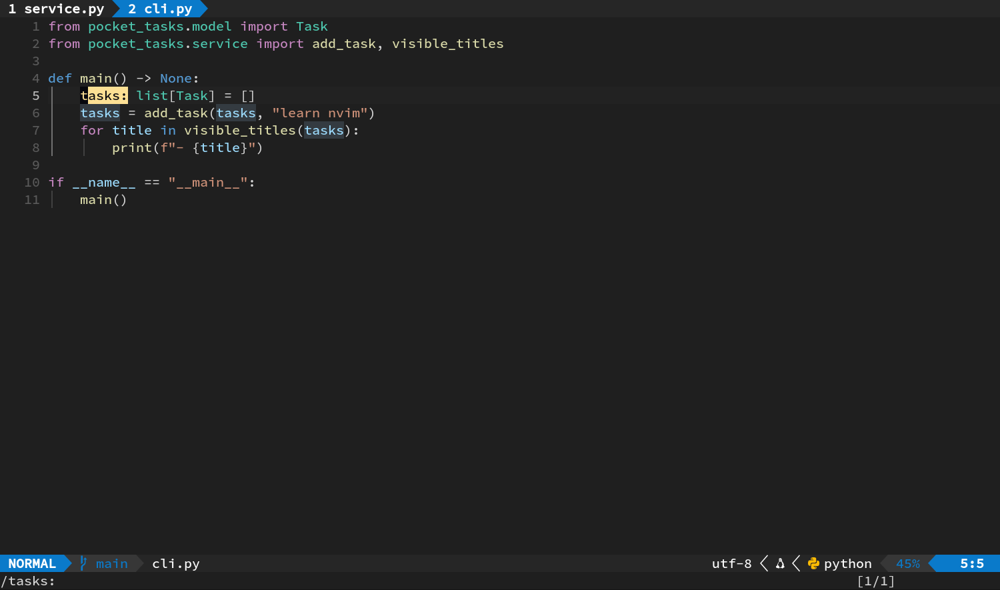

2. 按 [[c]] [[c]]。当前行内容被清空，Neovim 进入插入模式，并保留 Python 缩进。
3. 输入 `tasks: li`，先停一下。

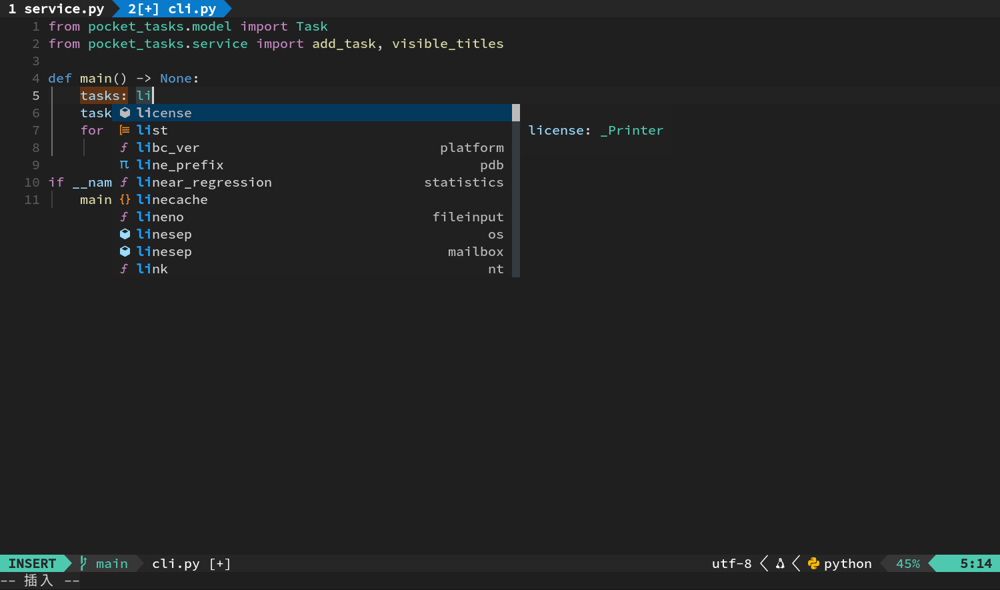

预期界面：光标附近出现 Blink 候选菜单，其中应有 `list`。高亮项变化后，旁边可能在约 200 毫秒后出现说明文档。

1. 按 [[Ctrl]]+[[n]]，高亮移到下一项。

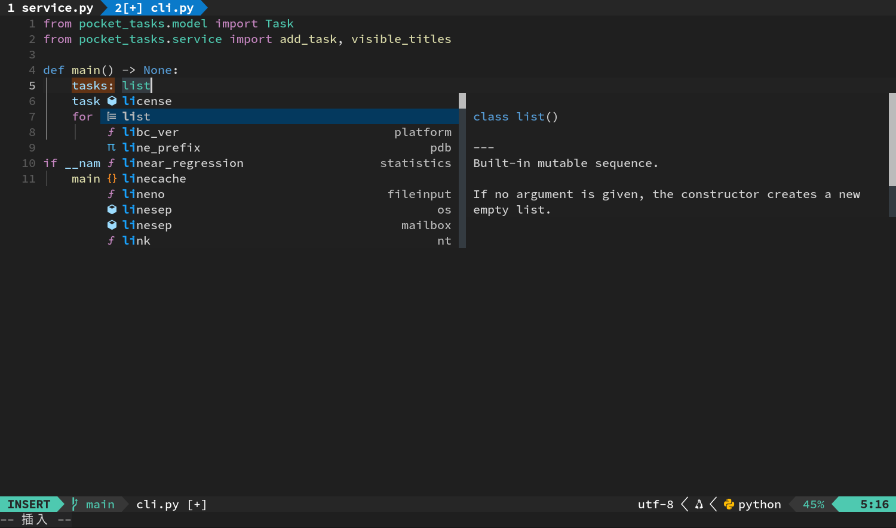

2. 按 [[Ctrl]]+[[p]]，高亮回到上一项。
3. 确认高亮的是 `list`，按 [[Ctrl]]+[[y]]。

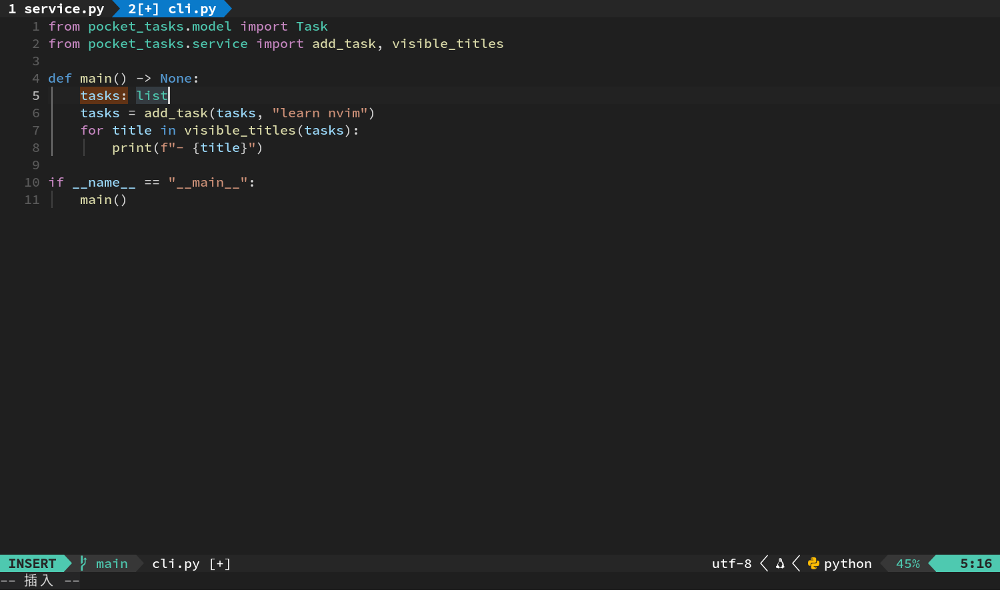

预期结果：缓冲区中变成 `tasks: list`，候选已真正写入代码。

### 第二步：用 [[Tab]] 接受 `Task`

1. 紧接着输入 `[Ta`。
2. 候选菜单里找到 `Task`。若当前项不对，用 [[Ctrl]]+[[n]] / [[Ctrl]]+[[p]] 调整。

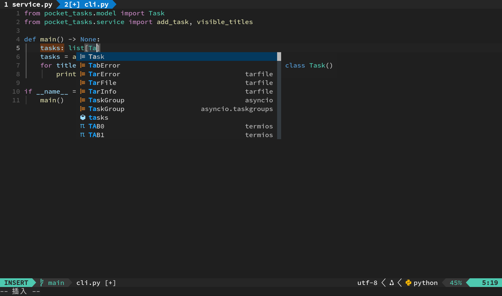

3. 按 [[Tab]] 接受。
4. 输入 `] = []`，按 [[Esc]]。

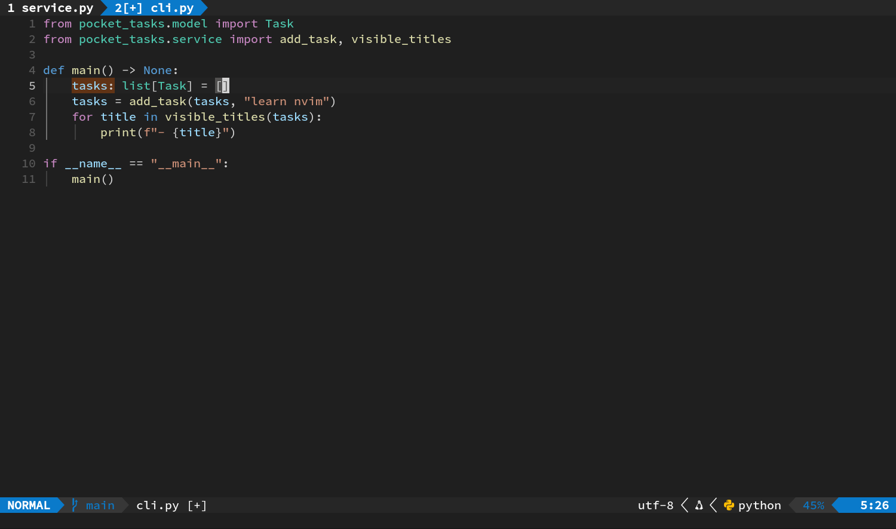

这一行最终仍是：

```python
    tasks: list[Task] = []
```

这里的 [[Tab]] 会优先接受候选；如果菜单中没有可接受的内容，则恢复为普通 Tab 行为，用于缩进等操作。

本配置给 [[Tab]] 的明确职责是接受当前补全候选。片段占位符之间的跳转没有单独承诺，遇到占位符时继续用普通移动与编辑键处理即可。

### 第三步：亲眼确认 [[Enter]] 只换行

找一行函数体，在普通模式按 [[o]] 新建临时行，然后：

1. 输入 `pri`，等 `print` 出现在候选菜单。

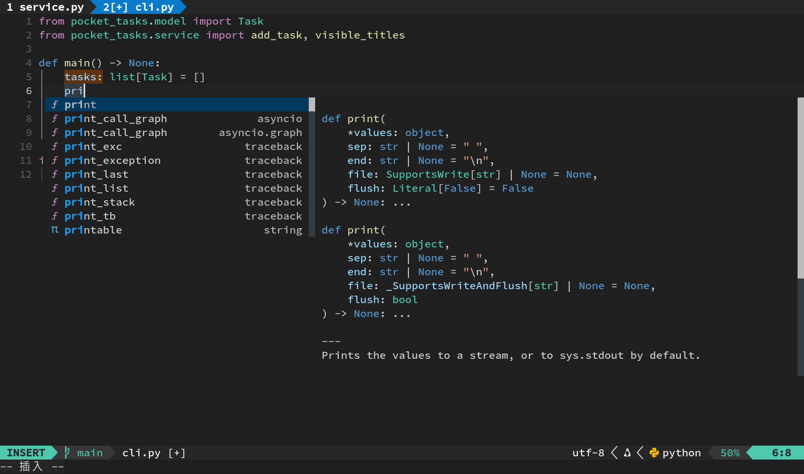

2. 保持候选高亮，按 [[Enter]]。

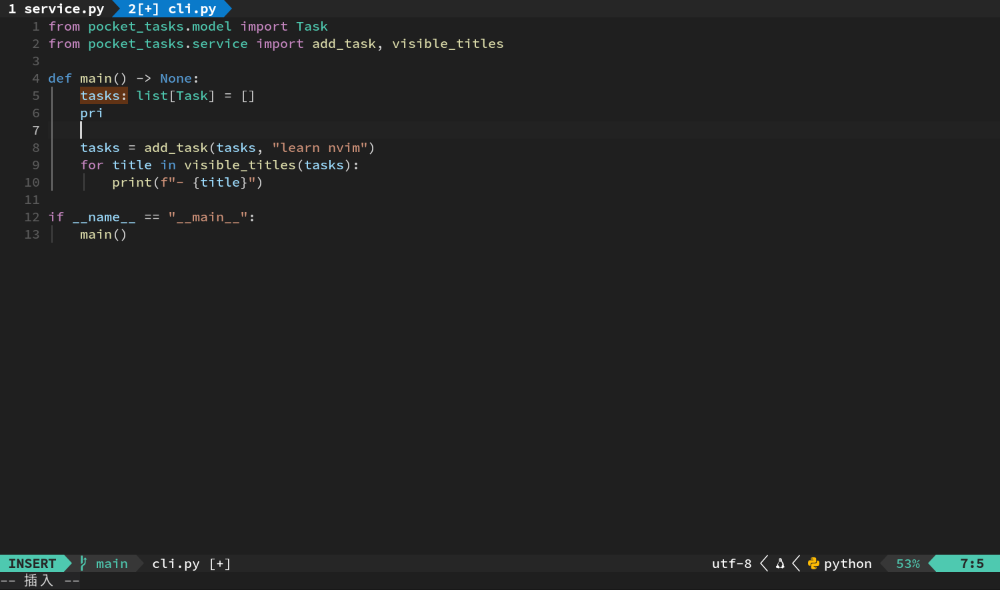

预期结果：光标进入下一行，上一行仍是 `pri`；`print` 没有被接受。按 [[Esc]] 回普通模式，再按 [[u]] 撤销这段临时练习。

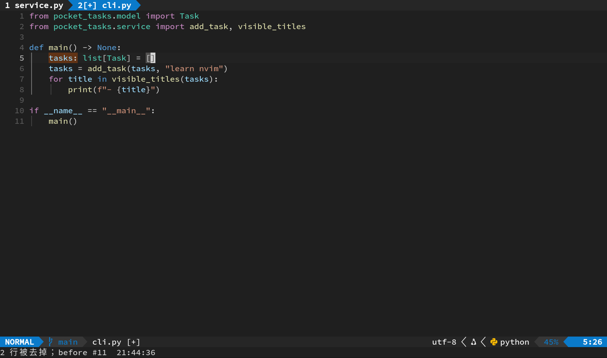

因此，按回车只会换行。需要接受 Blink 候选时，请使用 [[Ctrl]]+[[y]] 或 [[Tab]]。

::: details 菜单没有出现怎么办

按下面的顺序排查，每次只做一步：

1. 确认仍在插入模式，底部应显示 `INSERT`。
2. 再输入一两个字符，让候选范围更明确。
3. 按 [[Ctrl]]+[[Space]] 手动请求补全。
4. 确认文件后缀是 `.py`，项目根目录有 `pyproject.toml`。
5. 新打开项目时给 BasedPyright 一两秒启动时间。

即使 LSP 尚未附着，Blink 仍可能给出当前 Buffer、路径或片段来源的候选。语言级类型补全需要 LSP 已成功附着；这一条件会在第 09 章专门检查。

:::

## 3. 工作流二：一边看签名，一边填写调用参数

接着重写这一行：

```python
    tasks = add_task(tasks, "learn nvim")
```

### 操作步骤

1. 普通模式输入 `/tasks = add_task`，按 [[Enter]]。

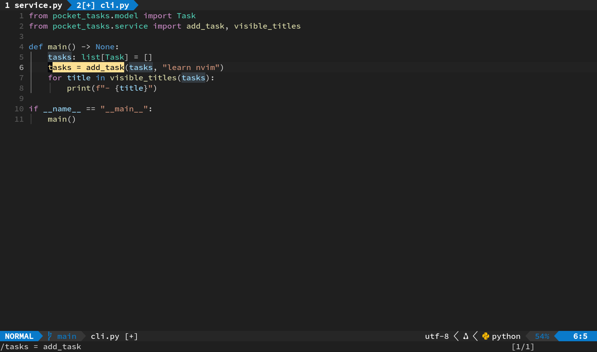

2. 按 [[c]] [[c]] 进入插入模式。
3. 输入 `tasks = add_`。

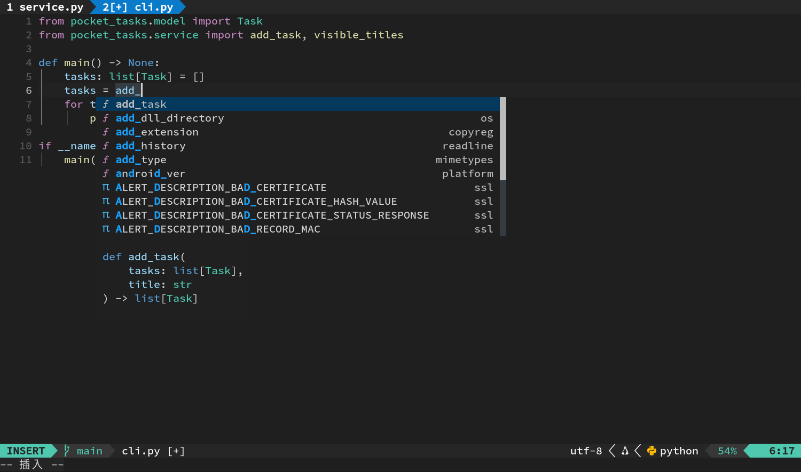

4. 在候选菜单中选中 `add_task`，按 [[Tab]] 接受。
5. [[Tab]] 会自动插入一对括号，光标停在括号内；停一下观察签名浮窗。

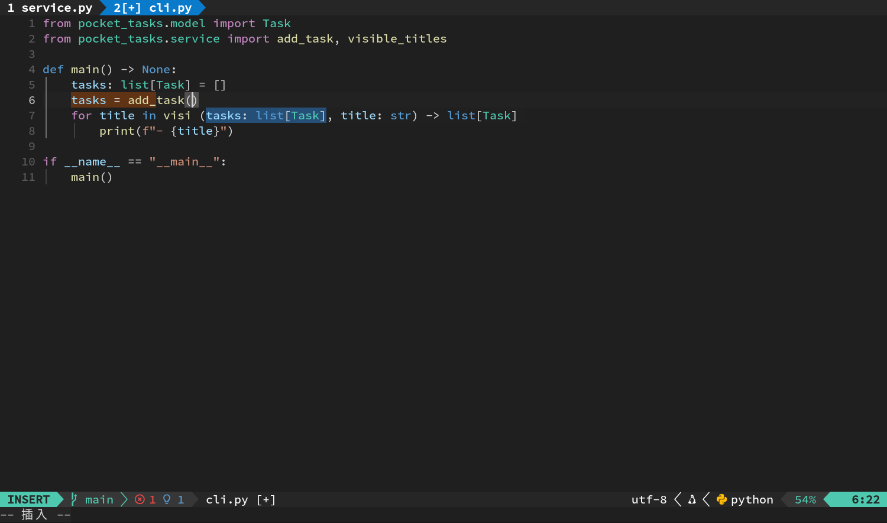

预期界面：附近出现函数签名，内容大致会展示：

```text
add_task(tasks: list[Task], title: str) -> list[Task]
```

签名浮窗会提示当前函数需要哪些参数。继续输入第一个参数时，高亮位置通常会随参数推进。

1. 输入 `tasks, "learn nvim"`，再越过补全自动生成的右括号。

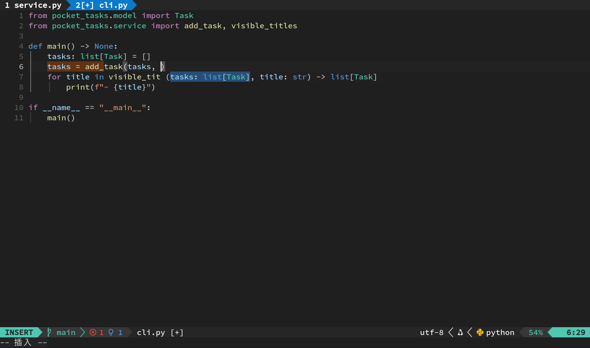

2. 按 [[Esc]]。

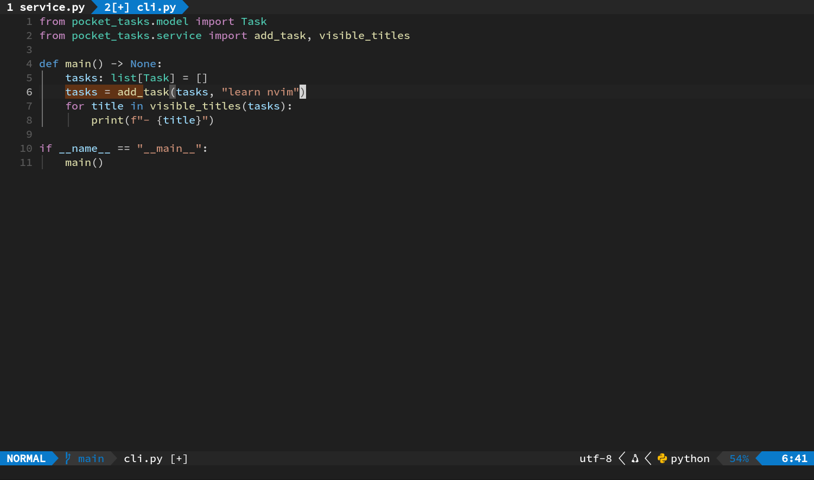

最终代码与开始时一致。签名提示可以减少记忆参数顺序的负担，尤其是函数带有多个布尔参数时，能够避免把参数位置写错。

::: details 签名浮窗没有出现

- 可以先继续输入，签名浮窗不会影响正常编辑；
- 确认 BasedPyright 已附着当前 Python Buffer；
- 确认光标前的函数名能够被识别，拼写错误会让语言服务器找不到对应定义；
- 函数来自动态代码或缺少类型信息时，服务器可能没有可展示的签名。

签名提示依赖 LSP。普通字符串、注释和未识别符号通常不会产生有意义的参数信息。

:::

## 4. 工作流三：用 Copilot 写回两行循环

这一轮只新增一个动作：[[Alt]]+[[l]] 接受 Copilot 行内灰字。

### 首次使用先登录 Copilot

若当前机器尚未登录：

1. 按 [[F1]]，输入 `Copilot`，选中同名命令。

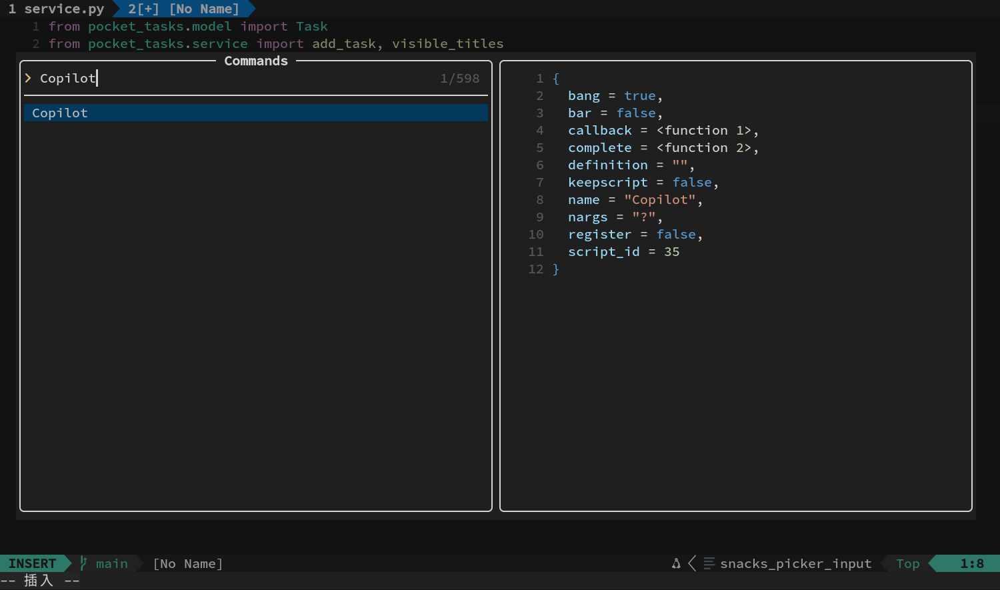

2. 按 [[Enter]]，在底部的 `:Copilot` 后输入 ` auth`。

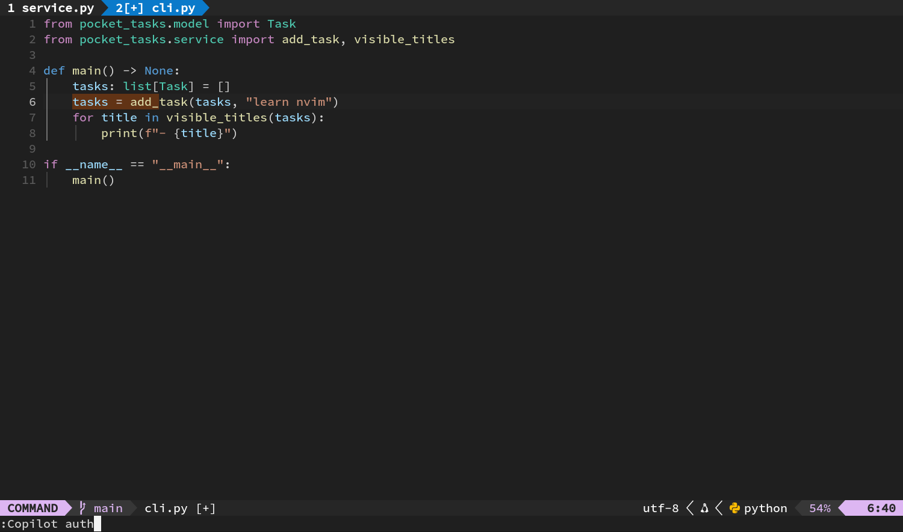

3. 按 [[Enter]] 执行，复制弹窗中的一次性代码，在浏览器打开 `https://github.com/login/device` 完成授权。

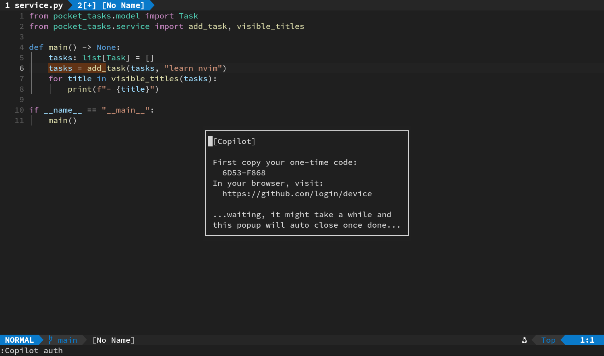

授权成功后弹窗会自动关闭。这个操作通常只需在当前用户环境中完成一次。

若要确认授权结果，按 [[F1]]，选择 `Copilot`，在底部补上 ` status` 后执行。看到 `Online` 和 `Buffer status: attached`，说明当前 Python Buffer 已经可以请求建议。

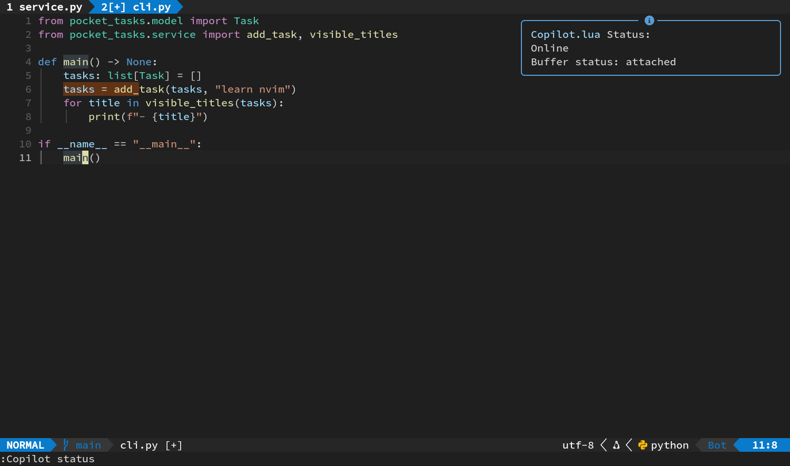

### 先删掉旧循环

1. 普通模式输入 `/for title`，按 [[Enter]]。
2. 按 [[2]] [[d]] [[d]]，删掉循环及其 `print` 行。

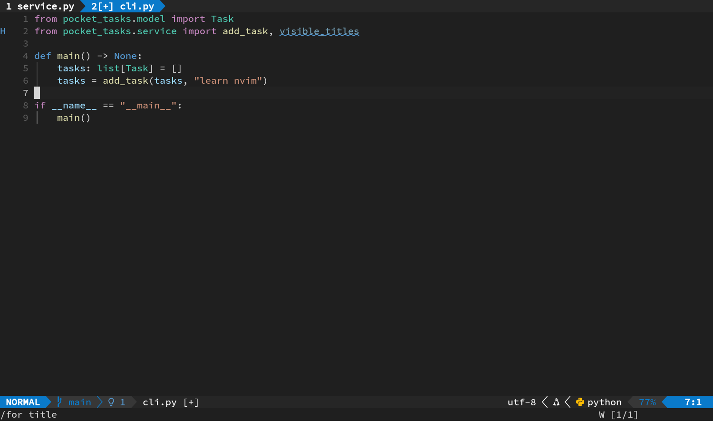

3. 按 [[O]]，在当前行上方新建一行并进入插入模式。
4. 输入下面这条临时提示注释，再按 [[Enter]]：

```python
    # Print every visible task title as a bullet
```

保持插入模式；若空行出现 Blink 候选菜单，按 [[Ctrl]]+[[e]] 收起它，让画面只剩提示注释和空白输入行。

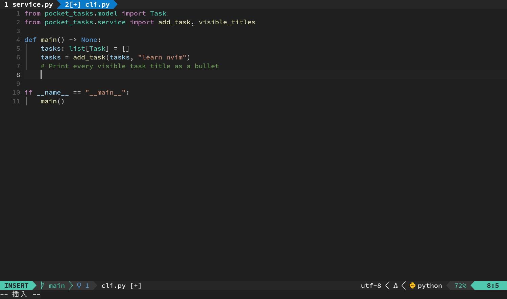

### 审查灰字，再决定是否接受

当前配置不会在每次输入后自动请求建议。在空白输入行按一次 [[Alt]]+[[l]]：此时没有现成灰字，所以这一次按键只发起请求。稍等片刻，光标后方会出现类似下面的浅色建议：

```python
    for title in visible_titles(tasks):
        print(f"- {title}")
```

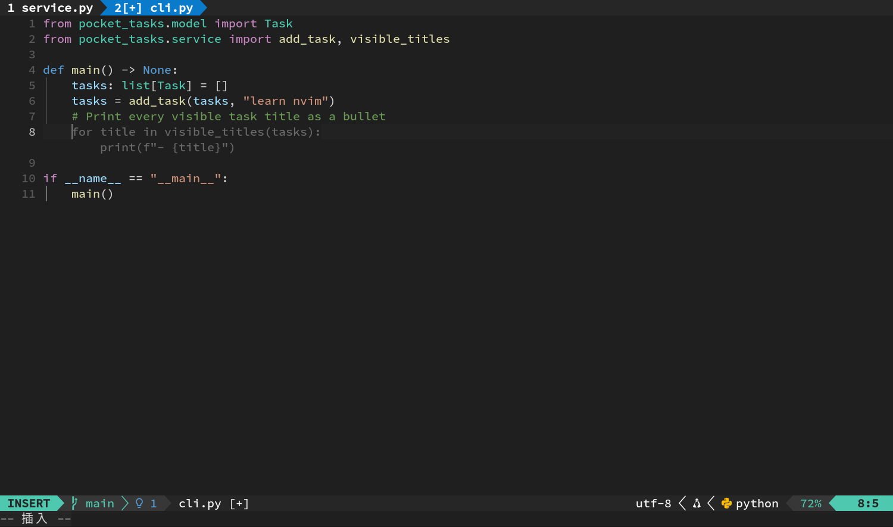

先逐项看：

- 调用的是 `visible_titles(tasks)`；
- 循环变量叫 `title`；
- 输出格式是 `- 标题 `；
- 没有乱改动别代码逻辑。

内容合适时再按一次 [[Alt]]+[[l]]。灰字会变成正常代码，并进入 Buffer 的修改历史。

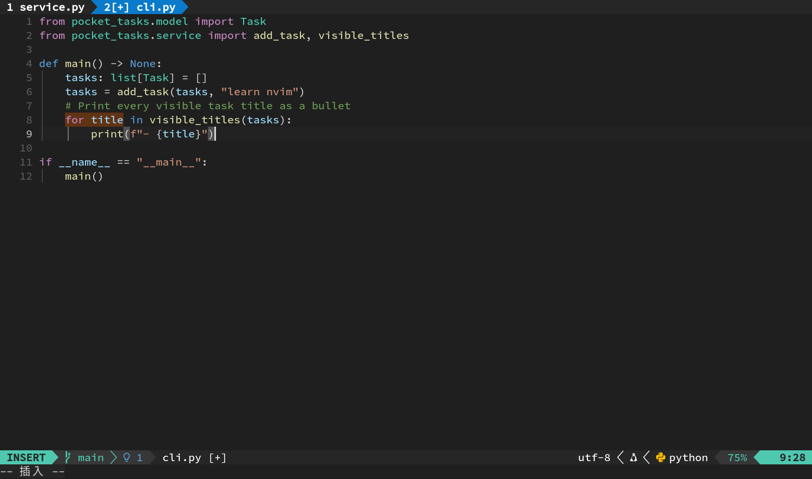

> [!WARNING] 接受 AI 建议后仍要审查和测试
> 若建议内容不符合要求，继续手动输入目标代码即可。没有按 [[Alt]]+[[l]] 时，灰字不会写入文件。Copilot 建议在接受后仍需继续审查和测试。

::: details 没有 Copilot 灰字也能完成练习

Copilot 需要登录、可用网络和正常运行的后端。没有建议时，手动输入：

```python
    for title in visible_titles(tasks):
        print(f"- {title}")
```

练习重点仍然成立：灰字出现后只用 [[Alt]]+[[l]] 接受，Blink 菜单继续使用 [[Ctrl]]+[[y]] 或 [[Tab]]。

若灰字已经出现，但按 [[Alt]]+[[l]] 没有反应，常见原因是终端或桌面环境拦截了该快捷键。可以先手动完成代码，之后再检查终端的 Meta/Alt 键设置。

:::

### 清掉临时提示注释

1. 按 [[Esc]] 回普通模式。
2. 输入 `/# Print every`，按 [[Enter]]。

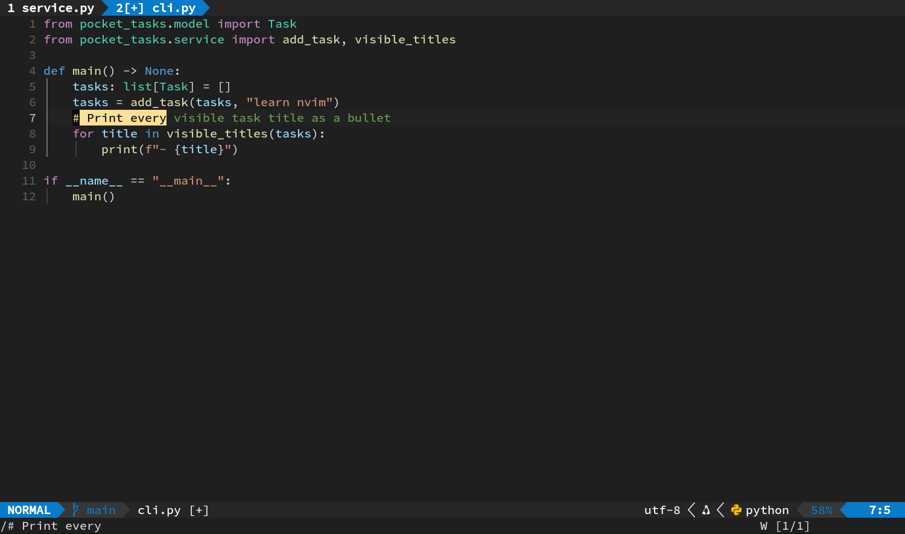

3. 按 [[d]] [[d]] 删除这条临时注释。

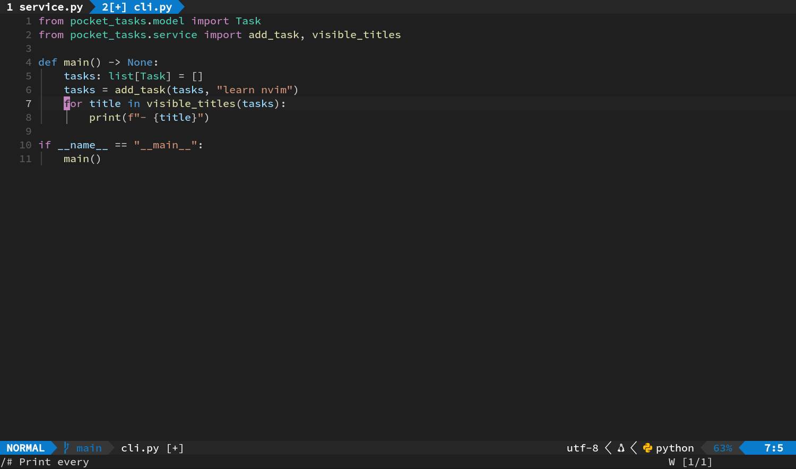

此时 `main()` 应恢复成原来的四行实现。

## 5. 两种建议同时出现时，先看显示形式

有时 Blink 菜单和 Copilot 灰字会同时出现，可以按下面的方式区分：

| 看到什么 | 怎么操作 |
| --- | --- |
| 可上下选择的候选菜单 | 用 [[Ctrl]]+[[n]] / [[Ctrl]]+[[p]] 选择，用 [[Ctrl]]+[[y]] 或 [[Tab]] 接受 |
| 光标后方整段浅色文字 | 先审查内容，确认合适后按 [[Alt]]+[[l]] 接受 |
| 只想换行 | 按 [[Enter]] |

几个容易踩到的小坑：

- 在 Blink 菜单中按 [[Enter]] 会换行，不会接受候选；
- 在 Copilot 灰字出现时按 [[Tab]] 仍优先执行 Blink 的接受或普通 Tab 回退；
- [[Alt]]+[[l]] 专门交给 Copilot 建议；
- 接受任何自动生成内容后，都要重新阅读，并通过诊断和测试验证。

## 6. 保存并核对最终文件

普通模式按 [[F1]]，输入 `write`。

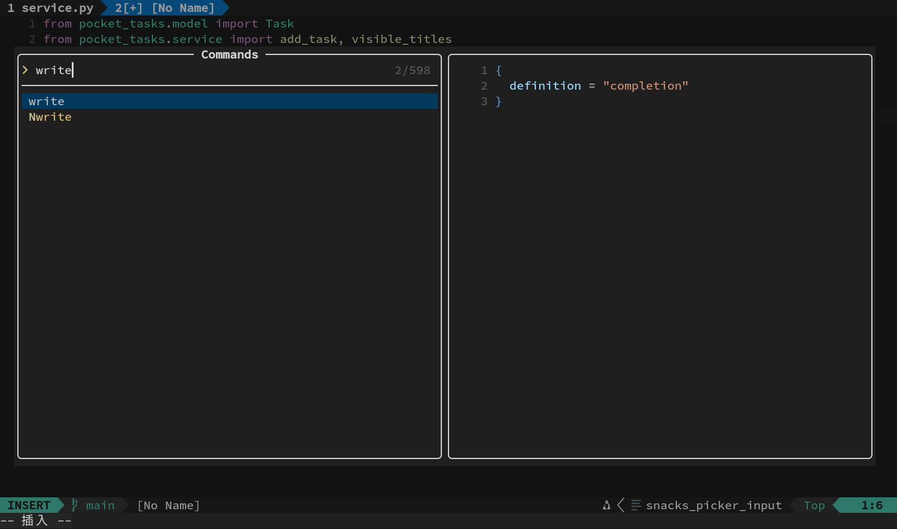

按第一次 [[Enter]]，让命令行形成 `:write`。

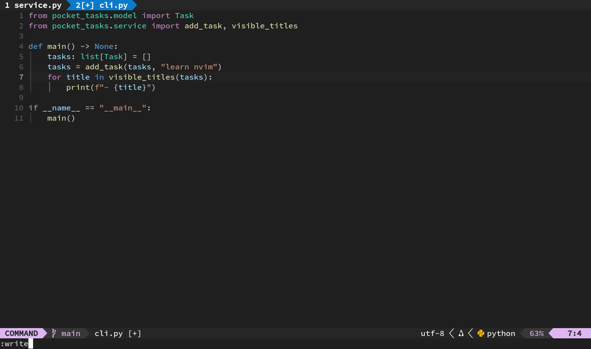

再按一次 [[Enter]] 保存。

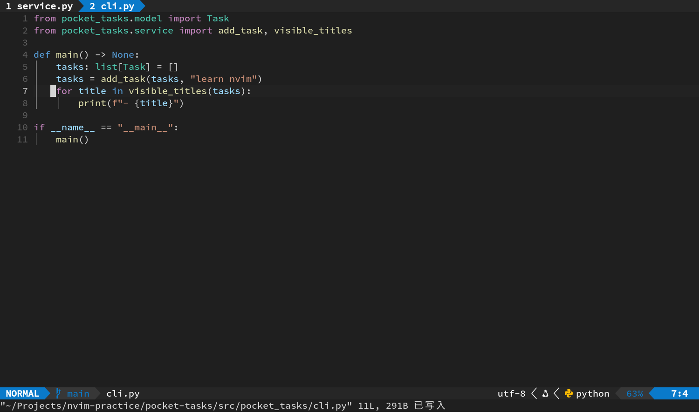

`cli.py` 最终应回到：

```python
from pocket_tasks.model import Task
from pocket_tasks.service import add_task, visible_titles

def main() -> None:
    tasks: list[Task] = []
    tasks = add_task(tasks, "learn nvim")
    for title in visible_titles(tasks):
        print(f"- {title}")

if __name__ == "__main__":
    main()
```

若担心其他 Window 里还有修改，按 [[F1]] → 输入 `wall` → [[Enter]] → [[Enter]]。

第 09 章会沿着这些补全结果继续：跳定义、找引用、读诊断，再做一次跨文件安全改名。

## 本章肌肉记忆

| 目标 | 按键 |
| --- | --- |
| Blink 下一项 / 上一项 | [[Ctrl]]+[[n]] / [[Ctrl]]+[[p]] |
| 接受 Blink 当前项 | [[Ctrl]]+[[y]] 或 [[Tab]] |
| 手动唤出补全 | [[Ctrl]]+[[Space]] |
| 普通换行 | [[Enter]] |
| 接受 Copilot 行内灰字 | [[Alt]]+[[l]] |
| 保存当前文件 | [[F1]] → `write` → [[Enter]] → [[Enter]] |

上一章：[Buffer、Window 与 Tab](07-buffers-windows-and-tabs.md) · 下一章：[LSP、诊断与重构](09-lsp-diagnostics-and-refactor.md)
