# 09｜LSP、诊断与重构

补全帮你少敲一些字，LSP 则负责看懂代码之间的关系。它知道 `add_task` 定义在哪儿，哪些文件调用了 `visible_titles`，某个表达式为什么类型不对，也能安全地给整个项目里的符号改名。

这一章继续拿 `pocket-tasks` 练手。中途故意制造的错误，都会在结尾清理干净；函数名也会改回第 07 章的基线，这样第 10 章就能直接开始跑测试。

## 本章结束时，你会掌握

- 判断 LSP 是否已经附着当前 Buffer；
- 查看悬浮信息，跳到定义，再回到原来的位置；
- 把所有引用加入 Quickfix 逐个检查；
- 在诊断之间前后跳转，并读懂当前位置的完整报错；
- 用语义重命名跨文件修改符号；
- 打开代码动作 Picker，选择服务器提供的修复或整理操作。

这一章会按工作流分批加入新按键。先看一眼总览，真正练习时每次只记两三个：

| 按键 | 效果 |
| --- | --- |
| [[Space]] [[l]] [[h]] | 显示光标下符号的悬浮信息 |
| [[Space]] [[l]] [[g]] [[d]] | 跳到定义 |
| [[Ctrl]]+[[o]] | 沿跳转历史后退一步 |
| [[Space]] [[l]] [[g]] [[r]] | 列出所有引用并打开 Quickfix |
| [[Space]] [[l]] [[e]] | 打开光标处诊断浮窗 |
| [[Space]] [[l]] [[g]] [[n]] / [[Space]] [[l]] [[g]] [[p]] | 下一条 / 上一条诊断，并自动展示诊断浮窗 |
| [[Space]] [[l]] [[n]] | 语义重命名 |
| [[Space]] [[l]] [[a]] | 打开当前位置的代码动作 |

这些都是当前锁定版本的 nvf 最终生成的 Buffer 局部映射。只有 LSP 成功附着到当前 Buffer，它们才会出现并生效。

## 1. 开始前检查：确认 BasedPyright 已附着

本项目的 `pyproject.toml` 应包含：

```toml
[project]
name = "pocket-tasks"
version = "0.1.0"
requires-python = ">=3.11"

[tool.basedpyright]
extraPaths = ["src"]
typeCheckingMode = "standard"
```

`pyproject.toml` 同时告诉 BasedPyright 项目根目录在哪儿，以及去哪里找 `src` 下的导入。打开 Python 文件后，语言服务器会在后台启动，通常只要等一小会儿。

### 用 Which-key 看附着结果

1. 按 [[Space]] [[,]]，输入 `cli`，选中 `cli.py` 后按 [[Enter]]。
2. 等一两秒。
3. 普通模式按 [[Space]]，稍停一下。
4. 继续按 [[l]]。

这时 Which-key 应该会列出 [[h]]、[[g]]、[[n]]、[[a]] 等 LSP 后续键。

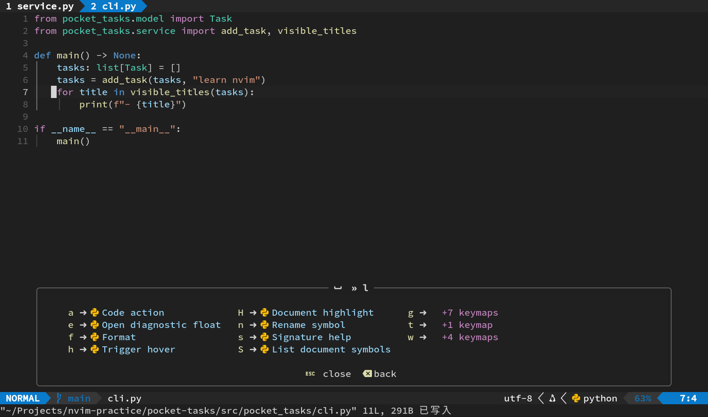

按 [[Esc]] 收起菜单。

如果 [[Space]] [[l]] 下面没有这些项目：

1. 确认当前文件是已保存的 `.py` 文件；
2. 确认 Neovim 从 `pocket-tasks` 项目目录启动；
3. 确认项目根目录存在上面的 `pyproject.toml`；
4. 等两秒，再切到另一个 Buffer 后切回来；
5. 仍无结果时，用 [[F1]] → `wqa` → [[Enter]] → [[Enter]] 保存并退出，再从项目根目录重新执行 `nvim .`。

LSP 还没附着时，下面这些按键可能根本不存在，也可能按了没有任何结果。先把附着问题解决，再继续练习；对着同一组键反复按，不会让连接自己变好。

## 2. 工作流一：悬浮查看、跳定义、原路返回

这一轮只记三个动作：

| 目的 | 按键 |
| --- | --- |
| 查看悬浮信息 | [[Space]] [[l]] [[h]] |
| 跳到定义 | [[Space]] [[l]] [[g]] [[d]] |
| 返回原位置 | [[Ctrl]]+[[o]] |

### 查看 `add_task` 的类型

1. 在 `cli.py` 普通模式输入 `/tasks = add_task`，按 [[Enter]]。

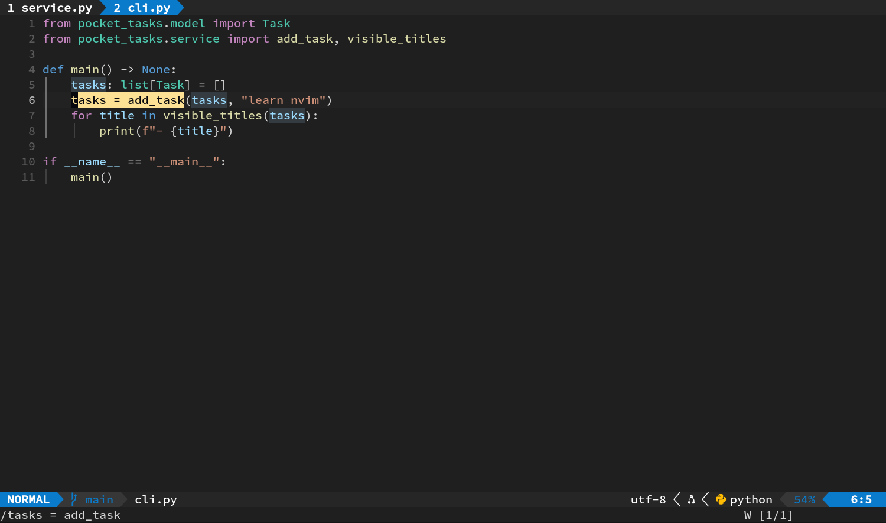

2. 用 [[w]] 或 [[l]] 把光标准确移到 `add_task` 的字母上。
3. 依次按 [[Space]]、[[l]]、[[h]]。

这时光标附近应该会出现浮窗，里面大致包含函数参数和返回类型：

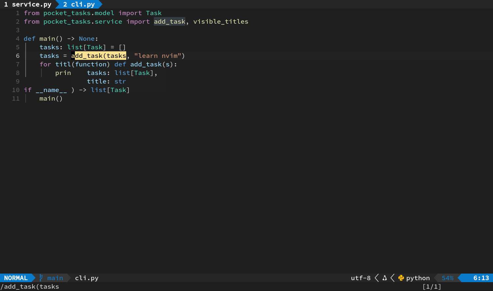

```text
add_task(tasks: list[Task], title: str) -> list[Task]
```

挪动光标以后，浮窗通常会自己收起来。悬浮信息很适合快速确认一个符号接收哪些参数、返回什么类型，以及有没有附带文档说明。

### 跳到真实定义

1. 再把光标放到 `add_task` 上。
2. 依次按 [[Space]]、[[l]]、[[g]]、[[d]]。

按完以后，当前 Window 会切到 `src/pocket_tasks/service.py`，光标落在 `def add_task(...)` 附近。这个符号只有一处定义，所以 LSP 会直接跳过去。

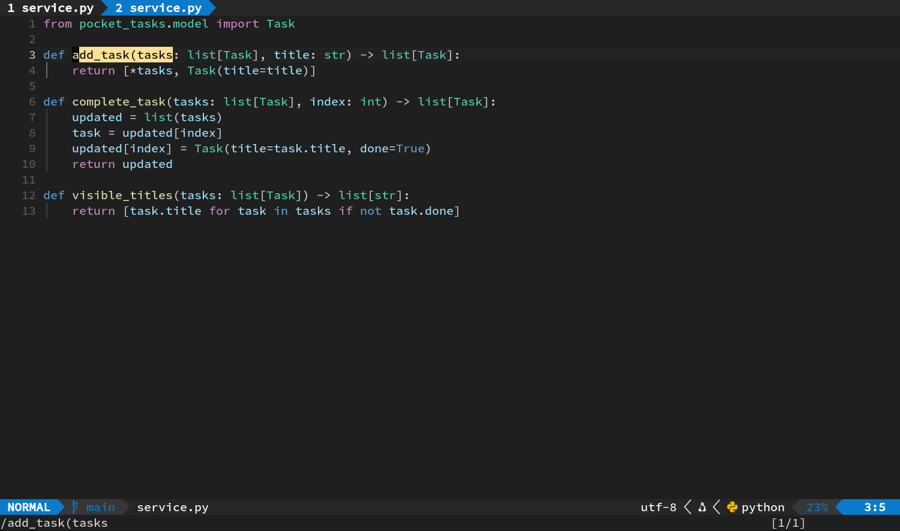

1. 按 [[Ctrl]]+[[o]]。

按一下就会回到 `cli.py` 原来的调用位置。[[Ctrl]]+[[o]] 会沿着跳转历史往回走，定义看完了，按一下便能接着读刚才的代码。

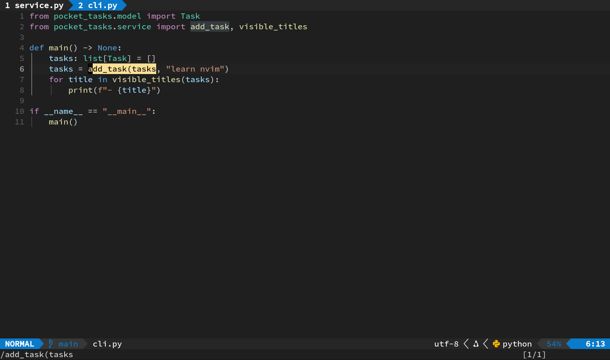

如果 [[Space]] [[l]] [[g]] [[d]] 提示 `No locations found`：

- 确认光标在名称字母上，没有停在括号或逗号；
- 检查名称拼写；
- 确认 LSP 已附着；
- 动态生成的对象可能没有可追踪的定义，这时可以用 [[Space]] [[/]] 搜索相关文字。

### 定义有多个时会发生什么

语言服务器只返回一个位置时，Neovim 会直接跳过去；如果返回了多个位置，底部就会打开一份列表让你选。列表由 Quicker 美化，用 [[j]] / [[k]] 选行，按 [[Enter]] 跳到高亮位置。

## 3. 工作流二：列出一个符号的所有引用

跳定义回答的是“它从哪儿来”，查引用回答的则是“谁在用它”。这一轮只加一个 [[Space]] [[l]] [[g]] [[r]]。

### 查 `visible_titles` 的调用点

1. 按 [[Space]] [[,]]，输入 `service`，选中 `service.py` 后按 [[Enter]]。

2. 输入 `/def visible_titles`，按 [[Enter]]。
3. 把光标放在 `visible_titles` 名称上。


4. 依次按 [[Space]]、[[l]]、[[g]]、[[r]]。

这时底部会打开 Quickfix，里面至少能看到这些位置：

- `service.py` 中的定义；
- `tests/test_service.py` 中的导入和调用；
- `cli.py` 中的导入和调用。

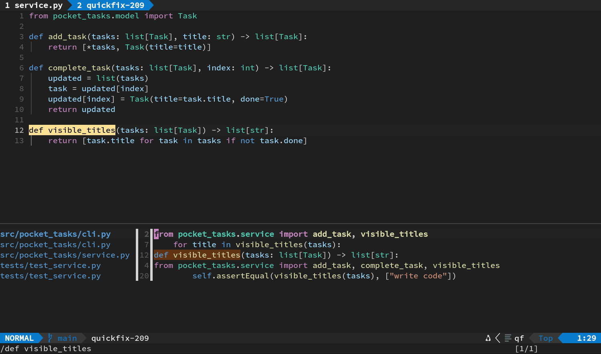

当前 Neovim 的引用请求会把声明位置也算进结果。Quicker 会按文件和行号显示列表，用起来和第 06 章的 grep 结果很接近。

### 浏览引用列表

1. 用 [[j]] / [[k]] 移动高亮行。
2. 在 `tests/test_service.py` 的结果上按 [[Enter]]。
3. 当前代码 Window 跳到对应引用，Quickfix 仍可继续使用。

继续在 Quickfix 里移到测试调用那一项，再按 [[Enter]]，就能直接对照断言的位置。

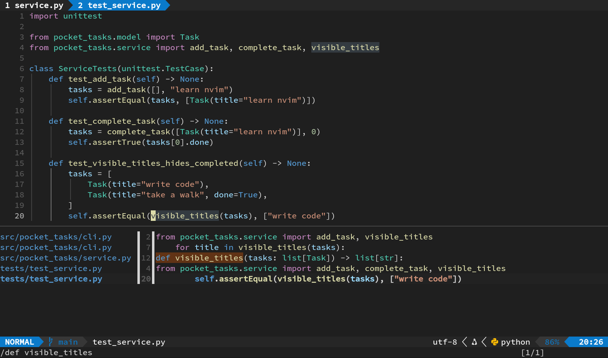

4. 检查完后按 [[F1]]，输入 `cclose`。

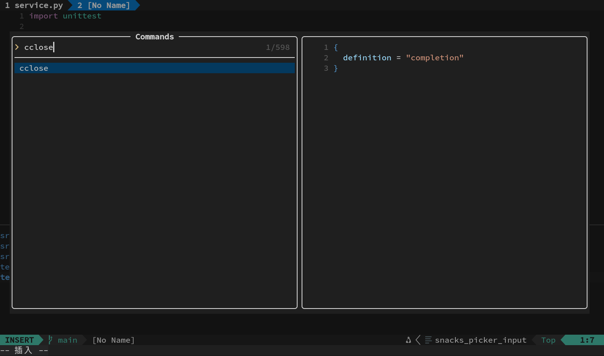

5. 连按两次 [[Enter]] 执行命令。

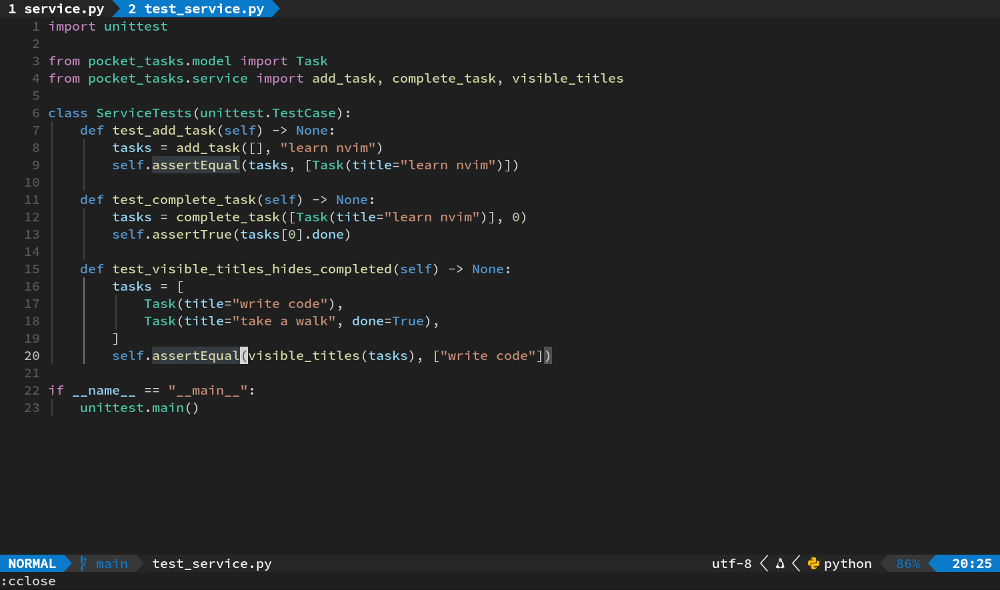

`cclose` 只会关掉 Quickfix Window，列表里打开过的源码 Buffer 还会继续留在内存里。

如果出现 `No references found`，先把光标移回完整的符号名称。字符串里碰巧同名的文字，通常不会被算作代码引用，所以语义查询比全文搜索更准确；如果还想把注释和文档也搜出来，再用 [[Space]] [[/]]。

## 4. 工作流三：制造两条诊断，再逐条修掉

诊断就是语言服务器给出的错误、警告、信息和提示。编辑区里会出现相关高亮或符号，状态栏也可能显示诊断数量。

这一轮只记：

| 目的 | 按键 |
| --- | --- |
| 读当前诊断 | [[Space]] [[l]] [[e]] |
| 下一条诊断 | [[Space]] [[l]] [[g]] [[n]] |
| 上一条诊断 | [[Space]] [[l]] [[g]] [[p]] |

### 在 `cli.py` 加两个临时错误

1. 按 [[Space]] [[,]]，输入 `cli`，选中 `cli.py` 后按 [[Enter]]。

2. 输入 `/def main`，按 [[Enter]]。

3. 按 [[O]]，在 `main()` 上方进入插入模式。
4. 输入下面两个临时函数：

```python
def render_count(count: int) -> str:
    return count  # [!code error]

def first_title(tasks: list[Task]) -> str:
    return tasks[0].missing_title  # [!code error]

```

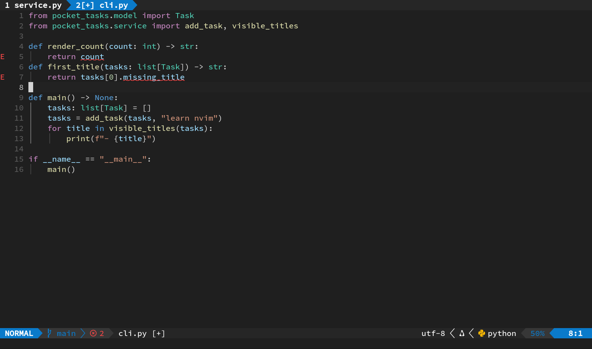

5. 按 [[Esc]]，等一两秒。

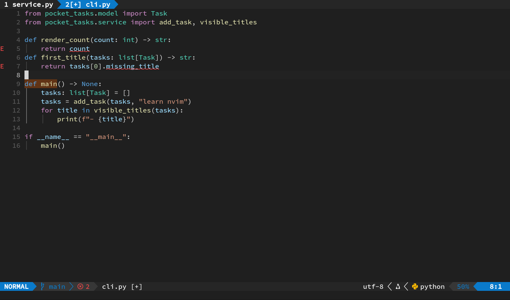

完成后应该会看到：

- `return count` 附近出现类型错误，因为函数承诺返回 `str`，实际给出 `int`；
- `missing_title` 附近出现成员错误，因为 `Task` 只有 `title` 和 `done`。

BasedPyright 的具体措辞可能会随版本稍有变化，但报错的核心应该和上面一致。

### 在诊断之间移动

1. 光标放在文件上方，依次按 [[Space]]、[[l]]、[[g]]、[[n]]。
2. 光标跳到第一条诊断，旁边自动出现该诊断的浮窗。

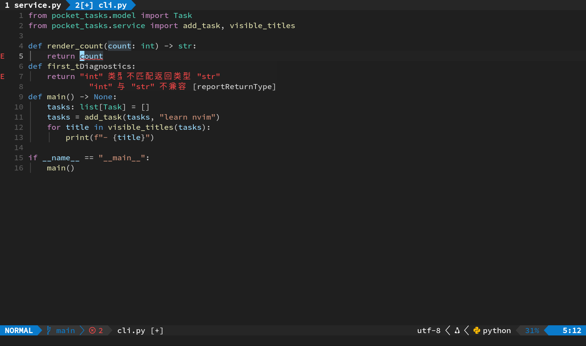

3. 再按一次 [[Space]] [[l]] [[g]] [[n]]，去下一条。

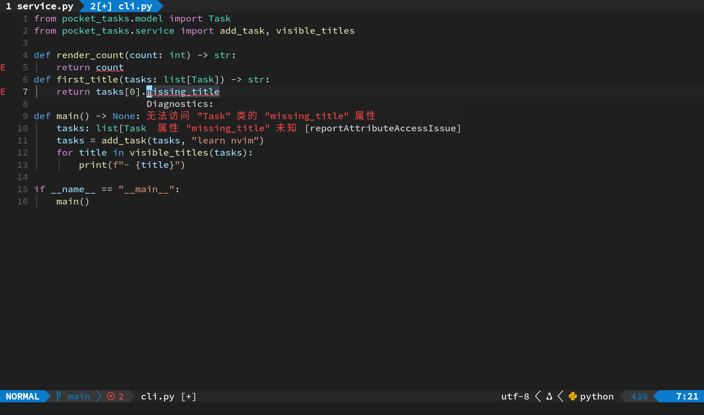

4. 按 [[Space]] [[l]] [[g]] [[p]]，回上一条。

这两个映射跳转成功后，会自动打开诊断浮窗，所以“去下一条”和“读下一条”一步就能完成。

### 单独重看光标处诊断

1. 把光标放在 `count` 或 `missing_title` 的高亮范围内。
2. 按 [[Space]] [[l]] [[e]]。

这时光标附近会出现完整消息、严重级别和诊断来源。那些一行里放不下的诊断信息，都会在浮窗里完整显示。

::: details 诊断浮窗显示 No diagnostics found

- 光标可能停在同一行的其他位置，移到波浪线范围再试；
- 服务器可能仍在分析，稍等片刻；
- 错误可能已经被修复，因此当前位置不再有诊断。

:::

### 修复两条错误

先把错误的返回值改成 `str(count)`：

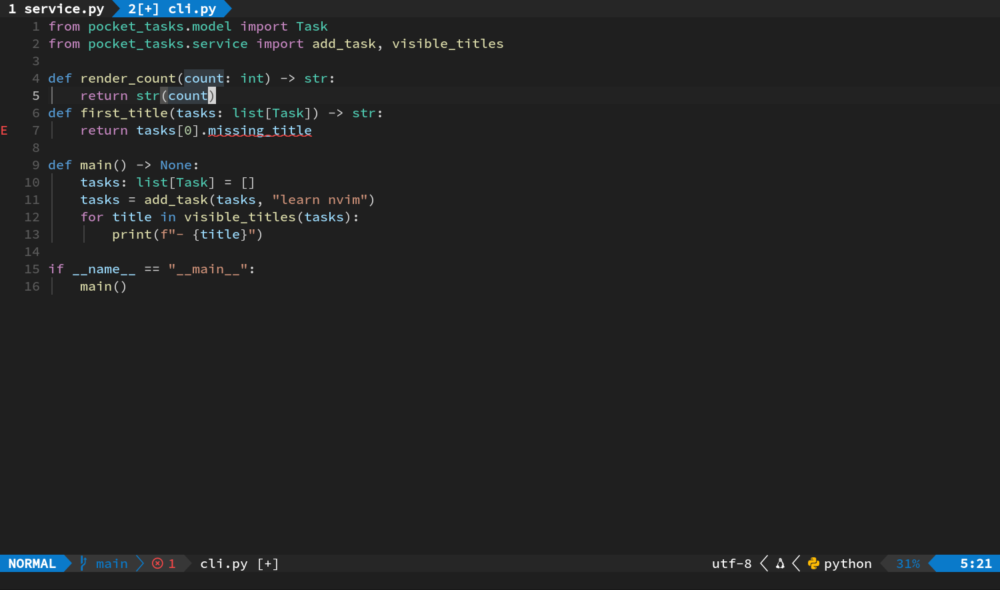

再把不存在的 `missing_title` 改回真实字段 `title`。两处修复的差异如下：

```diff
-    return count
+    return str(count)
-    return tasks[0].missing_title
+    return tasks[0].title
```

修复后的完整代码应为：

```python
def render_count(count: int) -> str:
    return str(count)

def first_title(tasks: list[Task]) -> str:
    return tasks[0].title
```

稍等一会儿，两条诊断应该都会消失。再按 [[Space]] [[l]] [[g]] [[n]]，如果项目里没有别的问题，Neovim 就会提示找不到下一条诊断。

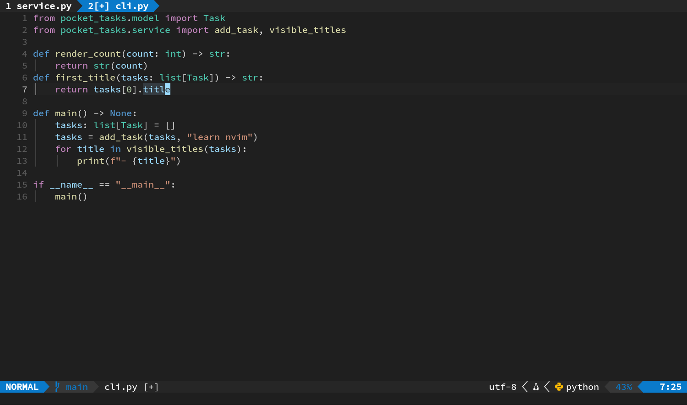

### 清掉临时函数，恢复 CLI

1. 输入 `/def render_count`，按 [[Enter]]。

2. 按 [[V]] 选中函数定义行，再按 [[j]] 把 `return` 行加入选区。

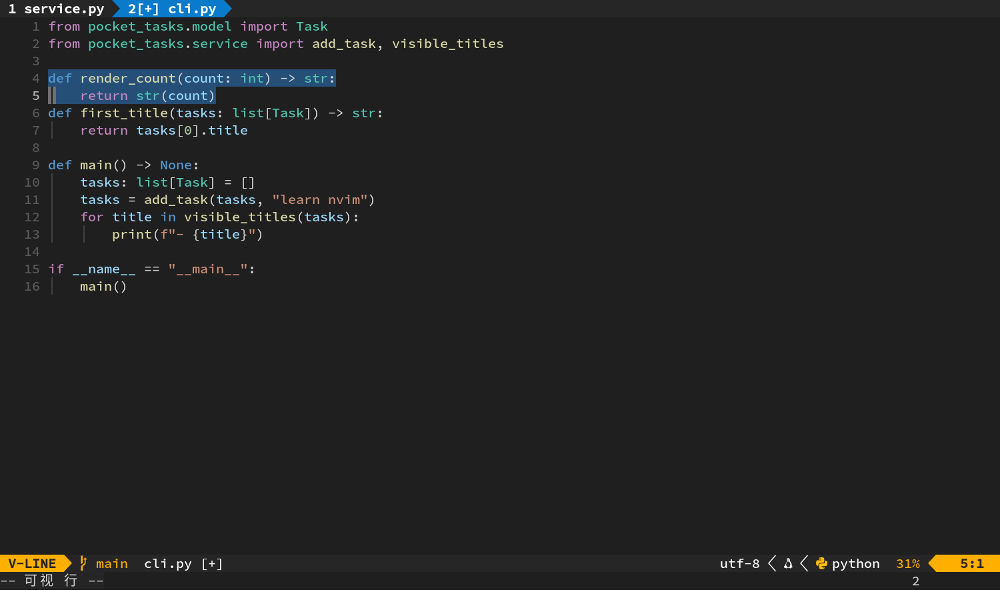

3. 按 [[d]] 删除选区。

4. 多余空行可以用 [[d]] [[d]] 清理，顶层函数之间保留两行空白。
5. 输入 `/def first_title`，按 [[Enter]]。

6. 同样按 [[V]]、[[j]]、[[d]] 删除这个函数，再整理空行。

这时文件应该重新从导入直接接到 `def main()`。

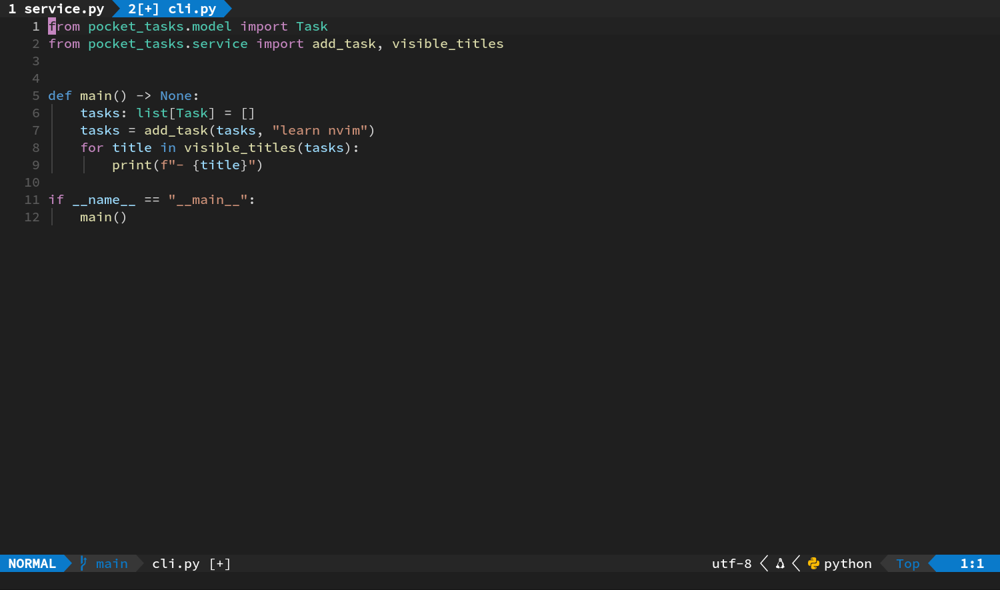

## 5. 工作流四：跨文件语义重命名，再改回来

全文替换会扫过所有匹配的文字。LSP 重命名则顺着符号关系，只修改定义、导入和调用；无关的字符串和普通说明文字通常会原样保留。

这一轮新增两个动作：[[Space]] [[l]] [[n]] 打开语义重命名，[[Ctrl]]+[[u]] 清空输入框里的旧名称。

### 把 `visible_titles` 改成 `open_titles`

1. 按 [[Space]] [[,]]，输入 `service`，选中 `service.py` 后按 [[Enter]]。

2. 输入 `/def visible_titles`，按 [[Enter]]。
3. 把光标放在函数名的字母上。

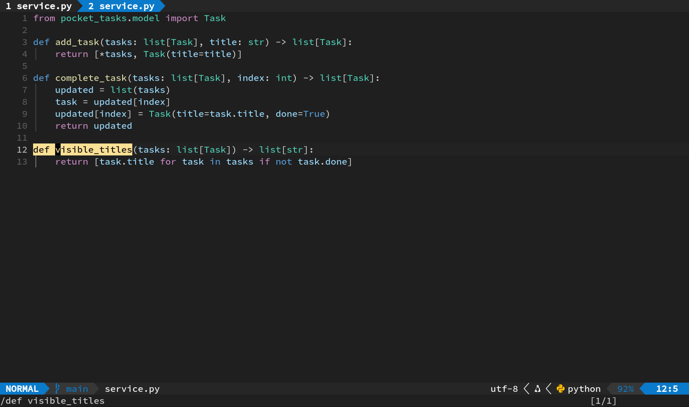

4. 依次按 [[Space]]、[[l]]、[[n]]。

这时屏幕上方会出现 Snacks 输入浮窗，标题类似 `New Name`。输入框里已经填好了 `visible_titles`，光标停在旧名称末尾。

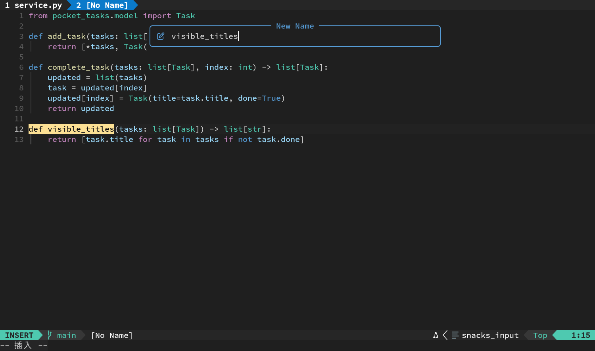

1. 按住 [[Ctrl]] 点一下 [[u]]，清空旧名称。
2. 输入 `open_titles`。


3. 按 [[Enter]] 确认。

确认以后，LSP 会一次改动多个 Buffer：

- `service.py` 的函数定义变成 `open_titles`；
- `tests/test_service.py` 的导入和调用同步变化；
- `cli.py` 的导入和调用同步变化。

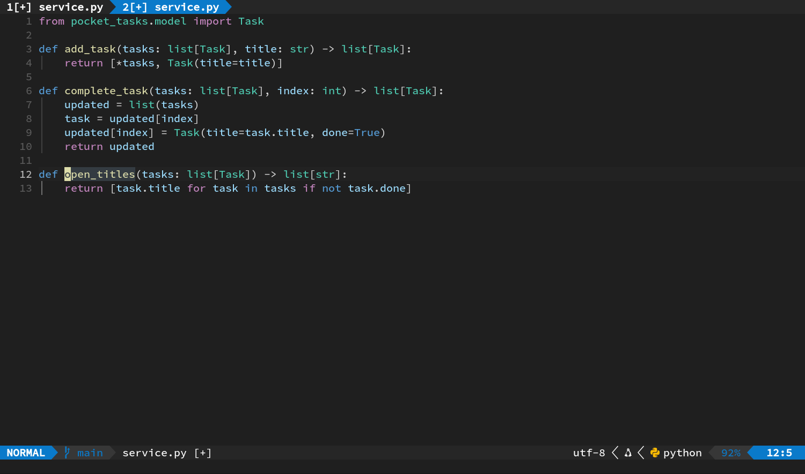

这些改动现在可能还只在内存里，状态栏会提示文件已经修改。先别保存，我们马上把它改回基线。

### 用引用查询验收改名

1. 光标仍放在 `open_titles` 上，按 [[Space]] [[l]] [[g]] [[r]]。
2. 在 Quickfix 中确认定义、测试和 CLI 都使用新名称。


3. 按 [[F1]]，输入 `cclose`，按两次 [[Enter]] 关闭列表。

如果旧名称还出现在注释或字符串里，这是正常的；语义重命名只关心代码符号。想把所有文字都检查一遍，保存后再用 [[Space]] [[/]] 搜索。

### 把名称改回 `visible_titles`

1. 回到 `service.py` 的 `open_titles` 定义。
2. 按 [[Space]] [[l]] [[n]]。

3. 输入框出现旧名称后按 [[Ctrl]]+[[u]] 清空。
4. 输入 `visible_titles`，按 [[Enter]]。

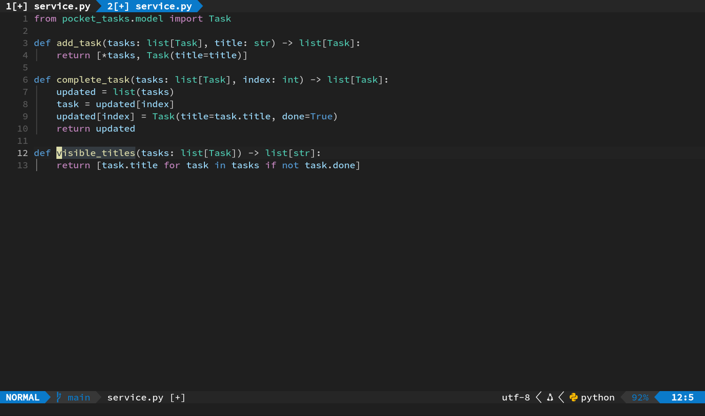

5. 用 [[Space]] [[l]] [[g]] [[r]] 再检查一次引用，然后关闭 Quickfix。

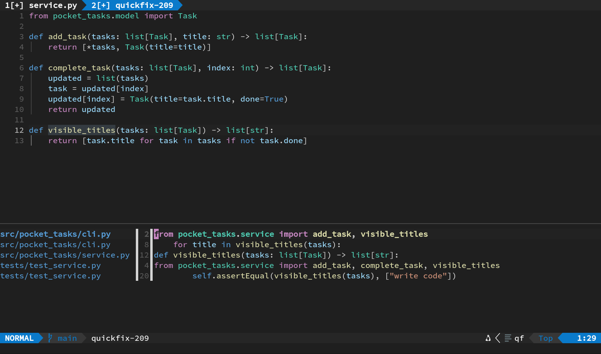

这次来回改名，是为了看清语义重命名到底会动哪些文件。以后修改公共 API 时，心里就能提前估出大致范围。

::: details 重命名只改到一个文件时

- 确认相关文件都属于同一个 `pocket-tasks` LSP 工作区；
- 确认导入可以被 BasedPyright 解析；
- 确认 `pyproject.toml` 中仍有 `extraPaths = ["src"]`；
- 先保存语法错误附近的文件，严重解析错误可能截断符号关系；
- 最后再用 [[Space]] [[/]] 搜索旧名称，确认没有遗漏。

:::

## 6. 工作流五：打开代码动作 Picker

代码动作由语言服务器根据光标位置和诊断临时给出，常见的有快速修复、整理导入、代码生成和重构。菜单会随着文件状态变化；如果里面什么都没有，说明服务器在当前位置没有能做的动作。

### 用导入顺序练习

1. 打开 `cli.py`。

2. 临时把前两行交换成：

```python
from pocket_tasks.service import add_task, visible_titles  # [!code warning]
from pocket_tasks.model import Task  # [!code warning]
```

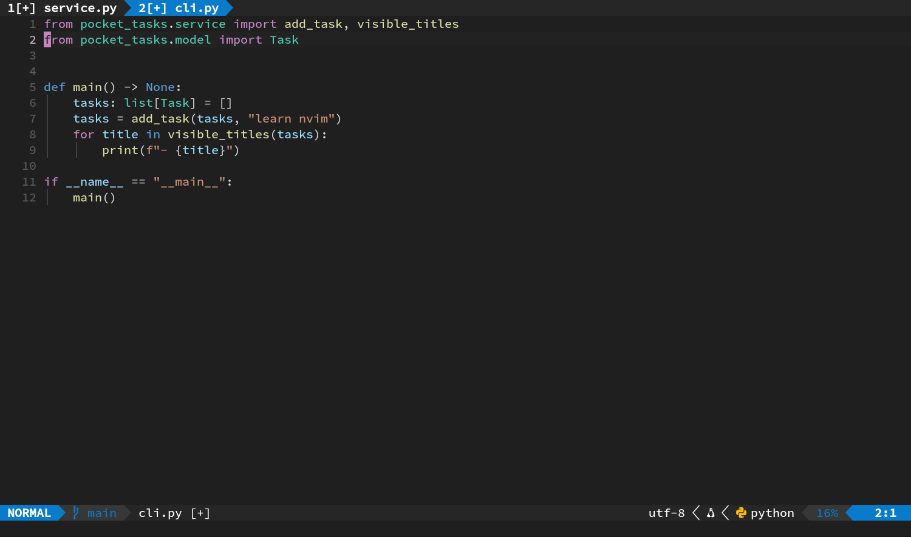

1. 按 [[Esc]]，把光标放在任意一条导入上。
2. 依次按 [[Space]]、[[l]]、[[a]]。

如果 BasedPyright 在当前位置提供了 `Organize Imports`，Snacks 就会打开选择器。焦点默认落在输入框里：

1. 直接输入 `organize` 过滤；
2. 用 [[Ctrl]]+[[n]] / [[Ctrl]]+[[p]] 或方向键选择；
3. 按一次 [[Enter]] 确认代码动作。

这里是普通 Picker，按一次回车就会确认。只有 [[F1]] 命令 Picker，才需要第二次回车去运行底部命令。

代码动作跑完以后，导入通常会恢复到合理顺序。如果屏幕提示 `No code actions available`，说明 BasedPyright 没有给这个光标位置返回动作；手动把导入改回下面的基线就行：

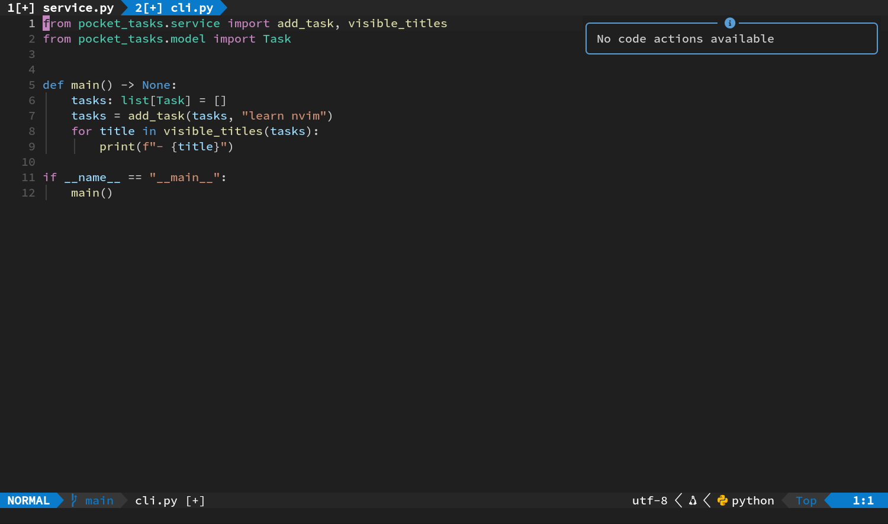

```python
from pocket_tasks.model import Task  # [!code highlight]
from pocket_tasks.service import add_task, visible_titles  # [!code highlight]
```

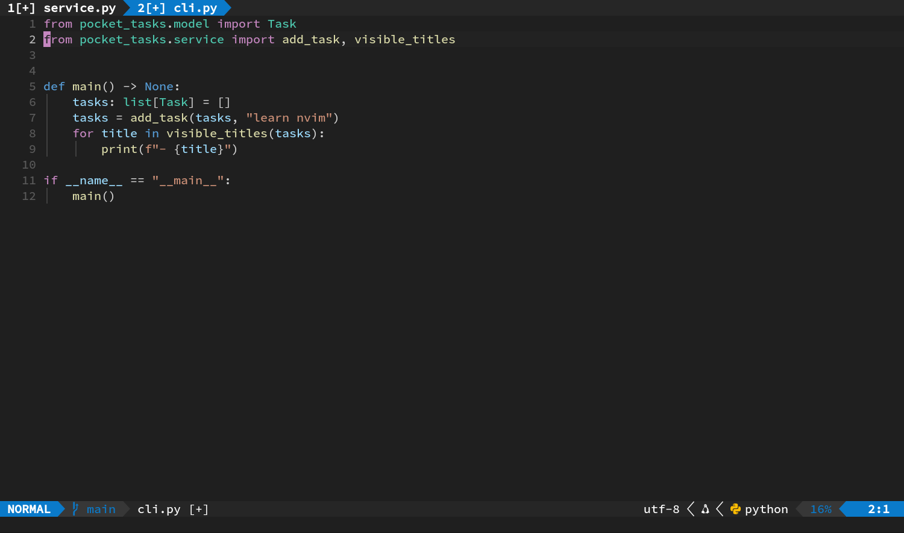

### 面对诊断时的代码动作习惯

以后看到诊断，可以按这个小循环：

1. [[Space]] [[l]] [[e]] 读完整原因；
2. [[Space]] [[l]] [[a]] 看服务器有没有建议；
3. 阅读动作标题；
4. 选择动作后检查实际改动；
5. 没有合适动作就手动修改。

代码动作只是服务器给出的候选方案。用完以后，还是要检查它究竟改了什么；设计和行为对不对，最终仍得由开发者判断。

## 7. 最终恢复与保存

先核对这四件事：

- `cli.py` 中已经没有 `render_count` 和 `first_title`；
- 服务函数最终名为 `visible_titles`；
- 测试和 CLI 的导入、调用也使用 `visible_titles`；
- `cli.py` 的导入顺序与第 07 章基线一致。

然后按 [[Esc]] 回普通模式，按 [[F1]]，输入 `wall`。

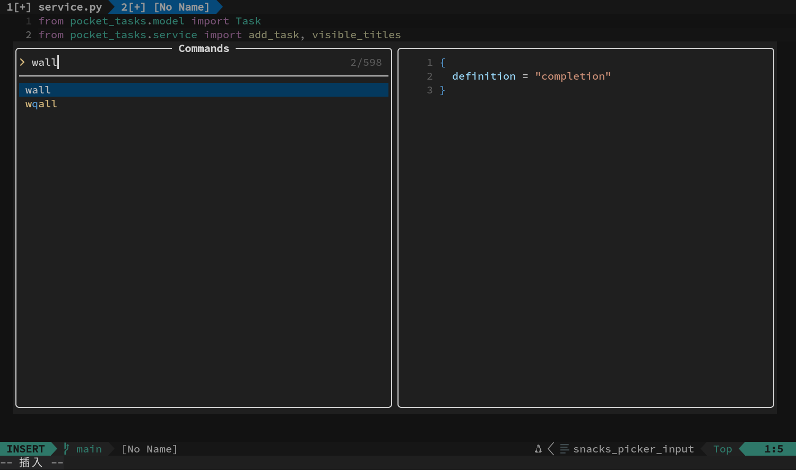

连按两次 [[Enter]] 保存全部 Buffer。


第一次回车会把 `:wall` 放到底部命令行，第二次才会运行。保存以后，可以按 [[Space]] [[/]] 分别搜索 `open_titles`、`render_count` 和 `missing_title`；三次都应该没有结果。

第 10 章将从下面这个状态继续：

- `Task(title, done)`，数据类使用 `frozen=True`；
- `service.py` 提供 `add_task`、`complete_task`、`visible_titles`；
- `tests/test_service.py` 有三条 `unittest` 测试；
- `cli.py` 可以调用服务并打印可见任务。

## 本章肌肉记忆

| 目标 | 按键 |
| --- | --- |
| 查看悬浮信息 | [[Space]] [[l]] [[h]] |
| 跳到定义 / 返回 | [[Space]] [[l]] [[g]] [[d]] / [[Ctrl]]+[[o]] |
| 列出引用 | [[Space]] [[l]] [[g]] [[r]] |
| 当前诊断 | [[Space]] [[l]] [[e]] |
| 下一条 / 上一条诊断 | [[Space]] [[l]] [[g]] [[n]] / [[Space]] [[l]] [[g]] [[p]] |
| 跨文件重命名 | [[Space]] [[l]] [[n]]，输入框中 [[Ctrl]]+[[u]] 清旧名 |
| 代码动作 | [[Space]] [[l]] [[a]] |
| 保存所有修改 | [[F1]] → `wall` → [[Enter]] → [[Enter]] |

上一章：[补全与 Copilot](08-completion-and-copilot.md) · 下一章：[右侧终端、测试循环与手动格式化](10-terminal-test-and-format.md)
