# 11｜Git 变更块——逐块查看与暂存

测试全部通过以后，先不要把整个目录的改动全部加入提交。Gitsigns 会把当前文件相对于 Git index 的变化切成多个 hunk，也就是“变更块”。你可以一块块查看、预览和暂存，让每次提交只带上真正相关的修改。

这一章安排了四个简短的工作流，每一轮只加少量新按键。

## 工作流一的新按键：找变化、看变化

| 按键 | 效果 |
| --- | --- |
| [[&#93;]] [[c]] | 跳到下一个 Git 变更块 |
| [[&#91;]] [[c]] | 跳到上一个 Git 变更块 |
| [[Space]] [[h]] [[P]] | 预览当前变更块；[[P]] 要大写 |
| [[Space]] [[h]] [[b]] | 显示当前行的完整 Git blame |

## 建立练习项目的 Git 基线

Gitsigns 得有 Git 基线才能比较。先把前十章的成果保存下来，并做一次提交。

1. 按 [[F1]]，输入 `wall`，连按两次 [[Enter]]。这会保存所有已修改文件。
2. 按 [[Ctrl]]+[[&#92;]] 打开右侧终端。
3. 先运行：

```console
git status --short
```

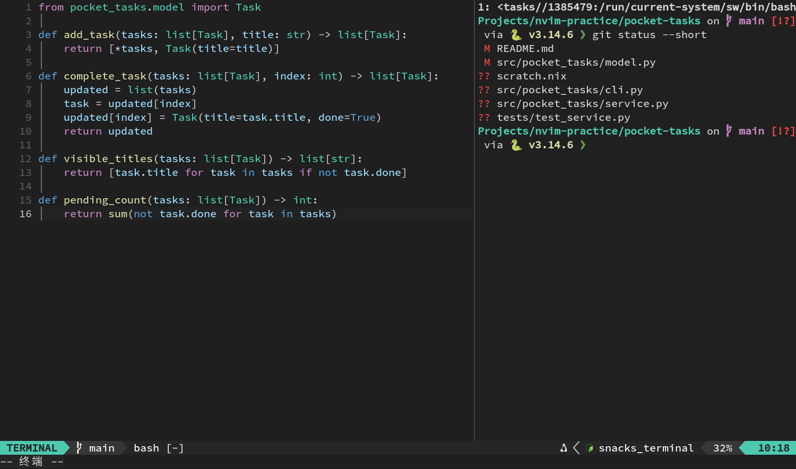

4. 确认列出来的正是前十章积累的文件，然后运行：

```console
git add .
git commit -m "build pocket tasks baseline"
```

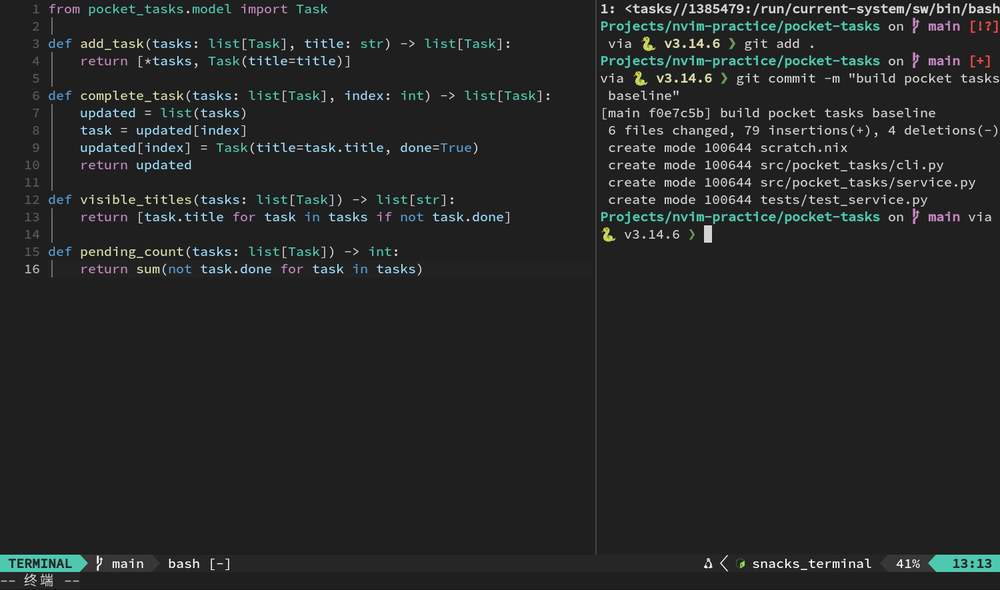

如果 Git 第一次提交时要求设置身份，照着提示填好 `user.name` 和 `user.email`，再重新运行提交命令。

最后运行：

```console
git status --short
```

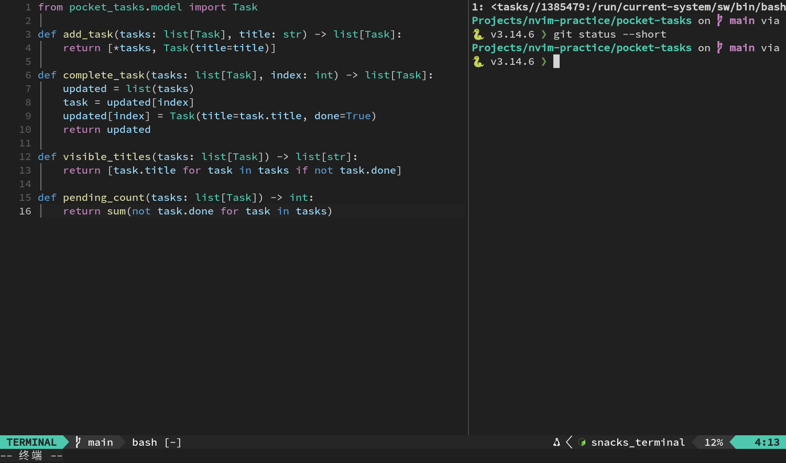

什么也没输出，就说明工作树是干净的。按 [[Ctrl]]+[[&#92;]] 隐藏终端。

> [!NOTE] 未跟踪文件不会显示完整 hunk
> 默认不会给全新的未跟踪文件显示完整 hunk 标记。文件至少得经过一次 `git add`，Gitsigns 才能稳定地拿它和 Git 基线比较。刚才那次基线提交已经满足了这个条件。

## 制造四块值得审查的改动

下面为“清理标题”和“统计完成数量”分别增加一组代码与测试。

打开 `src/pocket_tasks/service.py`，把 `add_task` 改成：

```python{2-5}
def add_task(tasks: list[Task], title: str) -> list[Task]:
    clean_title = title.strip()
    if not clean_title:
        raise ValueError("title cannot be empty")
    return [*tasks, Task(title=clean_title)]
```

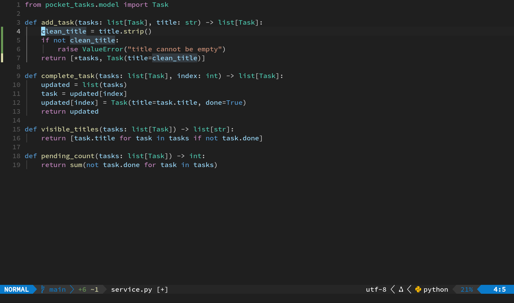

在文件末尾加入：

```python
def completed_count(tasks: list[Task]) -> int:
    return sum(task.done for task in tasks)
```


打开 `tests/test_service.py`，在服务导入列表中加入 `completed_count`：

```python
from pocket_tasks.service import (
    add_task,
    complete_task,
    completed_count,  # [!code ++]
    pending_count,
    visible_titles,
)
```

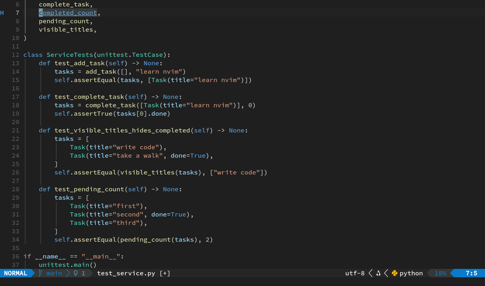

把原来的 `test_add_task` 改成：

```python{2-3}
    def test_add_task(self) -> None:
        tasks = add_task([], "  learn nvim  ")
        self.assertEqual(tasks, [Task(title="learn nvim")])
```

紧接着加入空标题检查测试：

```python
    def test_add_task_rejects_empty_title(self) -> None:
        with self.assertRaisesRegex(ValueError, "title cannot be empty"):
            add_task([], "   ")
```

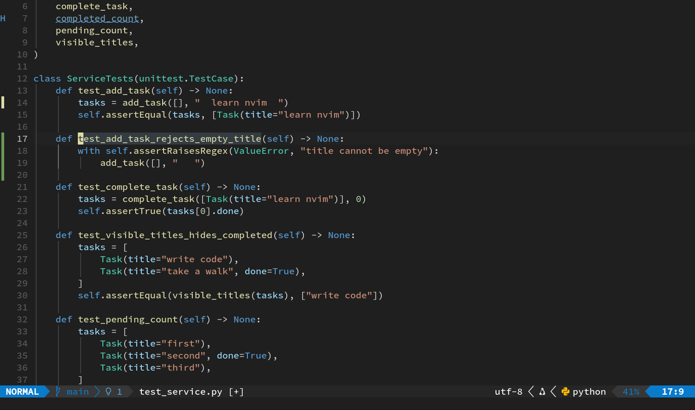

再把完成数量测试放到 `test_pending_count` 后面、文件末尾的 `if __name__` 前面。这样它和文件顶部的标题测试隔得够远，可以单独形成一个 hunk：

```python
    def test_completed_count(self) -> None:
        tasks = [
            Task(title="first"),
            Task(title="second", done=True),
        ]
        self.assertEqual(completed_count(tasks), 1)
```

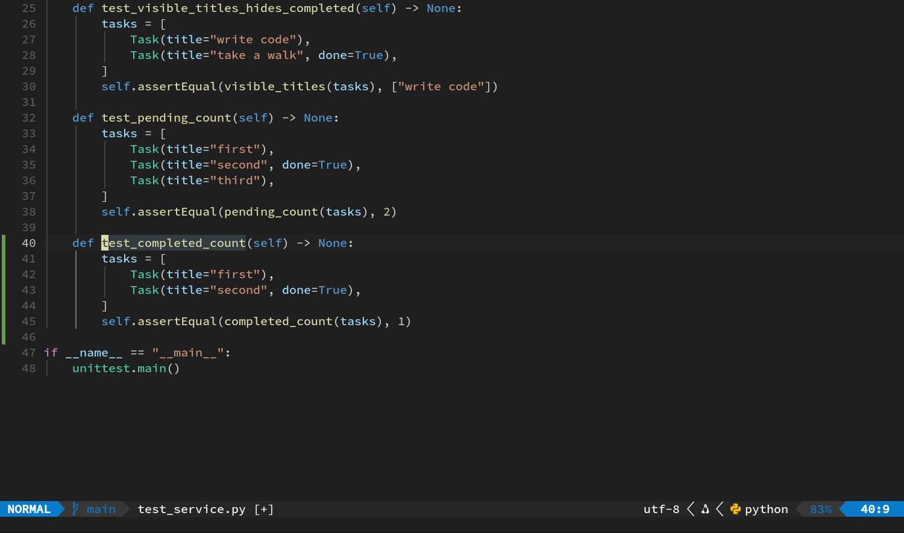

用 [[F1]] → `wall` → [[Enter]] → [[Enter]] 保存全部文件。现在行号左边应该会出现彩色的 Git 标记。具体形状由主题决定，含义大致如下：

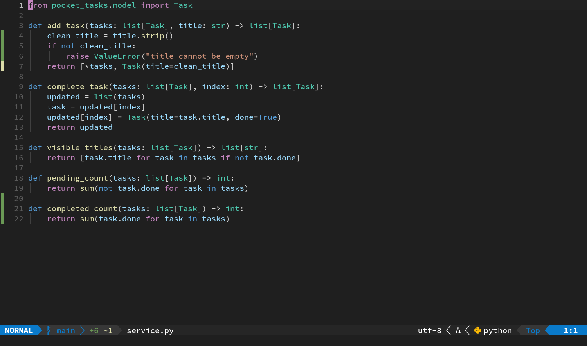

- 新增行会有新增标记；
- 修改行会有修改标记；
- 删除发生在两行之间时，标记会贴在附近；
- 同一小片连续变化会被归为一个 hunk。

测试文件顶部也会分别标出导入、标题修改和新增测试所在的 hunk。

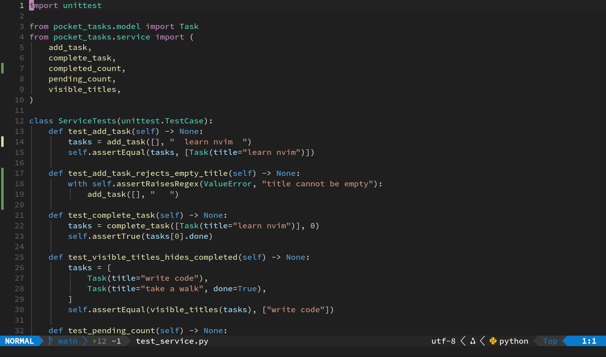

## 工作流一：检查当前文件

先打开 `src/pocket_tasks/service.py`。

1. 按 [[g]] [[g]] 到文件顶部。
2. 按 [[&#93;]] [[c]]。
3. 光标跳到 `add_task` 附近的第一块修改。


4. 按 [[Space]] [[h]] [[P]]。

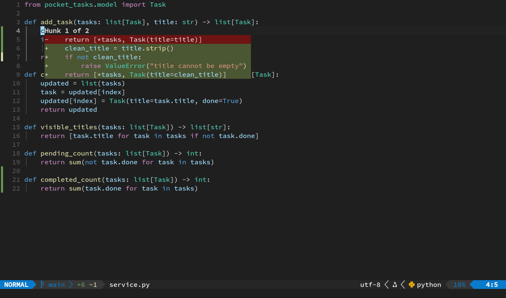

5. 浮窗显示这块修改前后的行；按 [[Esc]] 收起。
6. 再按 [[&#93;]] [[c]]，来到 `completed_count`。

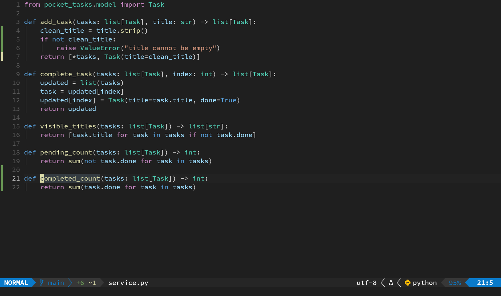

7. 再按一次 [[Space]] [[h]] [[P]]，确认第二块只新增了完成数量函数。

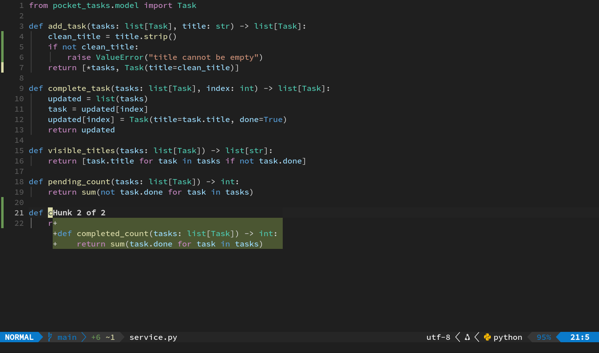

8. 按 [[Esc]] 收起预览，再按 [[&#91;]] [[c]] 回到上一块。

这套操作很适合在提交前快速检查文件：

> [[&#93;]] [[c]] 找下一块，[[Space]] [[h]] [[P]] 看它究竟改了什么。

光标放在已有代码上时，按 [[Space]] [[h]] [[b]]，浮窗会显示提交者、提交时间和完整的提交信息；新写的行通常会标成尚未提交。blame 主要是用来了解代码背景和改动原因的，不是拿来追究责任的。

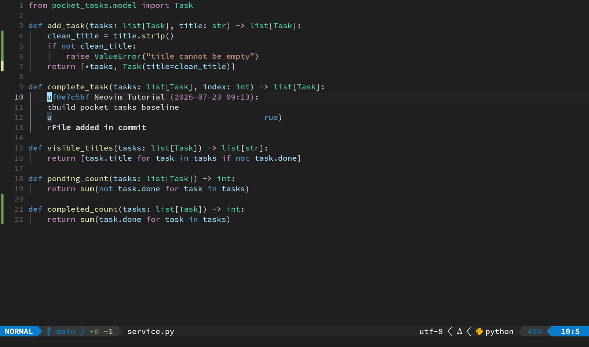

## 工作流二的新按键：只暂存想提交的块

| 按键 | 效果 |
| --- | --- |
| [[Space]] [[h]] [[s]] | 暂存光标所在 hunk |
| [[Space]] [[h]] [[u]] | 撤销本次 Neovim 会话里最近一次 hunk 暂存 |

### 暂存并核对结果

把光标放进 `add_task` 的修改块，按：

[[Space]] [[h]] [[s]]

效果：

- 这一个 hunk 被写入 Git index；
- 已暂存的 hunk 仍保留 gutter 标记，但会使用 staged 配色；
- 同文件末尾的 `completed_count` 仍留在工作区。

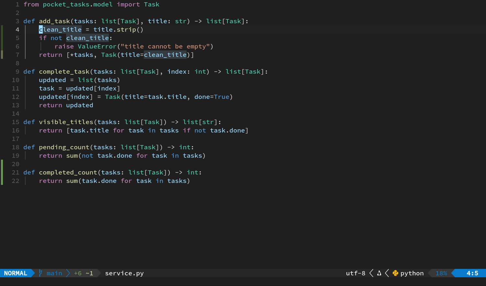

打开终端运行：

```console
git diff --cached
```

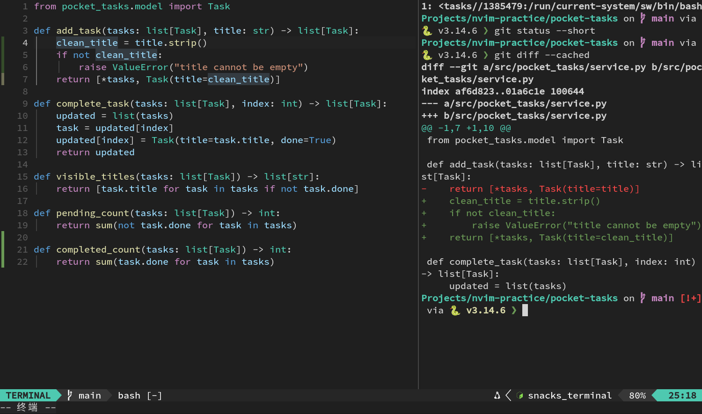

输出里应看到 `add_task` 的改动。按 [[q]] 退出 Git pager，再隐藏终端。

### 撤销刚才的暂存

回到代码，按：

[[Space]] [[h]] [[u]]

刚才的 hunk 会回到未暂存状态。

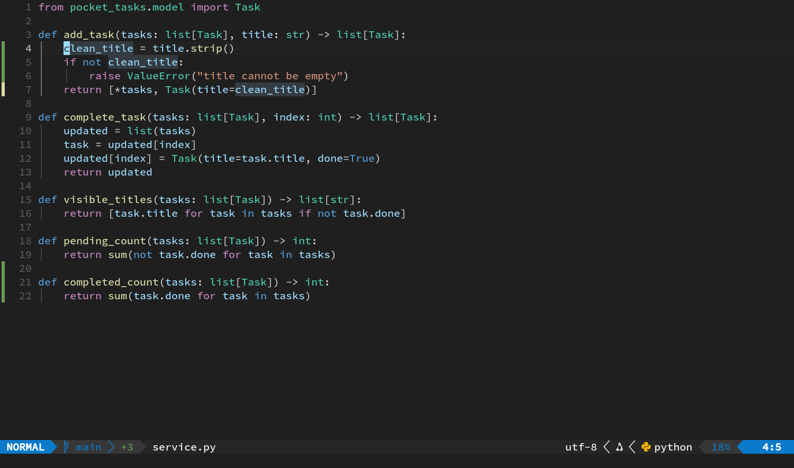

这里有个明确的边界：[[Space]] [[h]] [[u]] 只能撤销当前 Neovim 会话里，最近一次由 Gitsigns 完成的 hunk 暂存。它不是通用版的 `git restore --staged`。

### 保留“半暂存”状态

下一章要同时观察 staged 和 unstaged 的变化，所以这里要完成三次暂存：

1. 在 `service.py` 的 `add_task` hunk 中按 [[Space]] [[h]] [[s]]。
2. 打开 `tests/test_service.py`，搜索 `/tasks = add_task`，按 [[Enter]]。
3. 按 [[V]] [[j]]，只选中测试体里的赋值与断言两行。

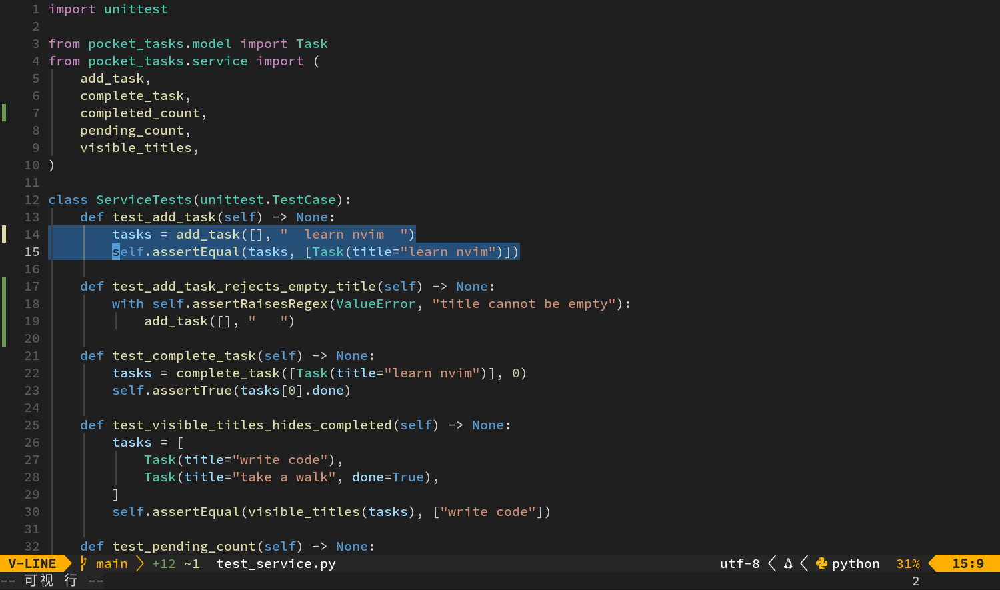

4. 在可视模式按 [[Space]] [[h]] [[s]]，只暂存这两行。

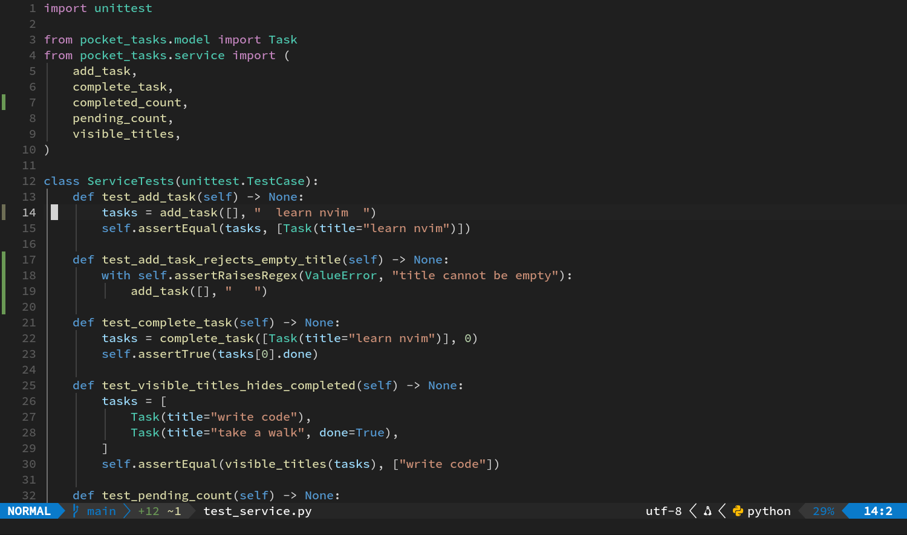

5. 搜索 `/def test_add_task_rejects_empty_title`，按 [[Enter]]。
6. 按 [[V]] [[2]] [[j]]，选中这条测试的三行。

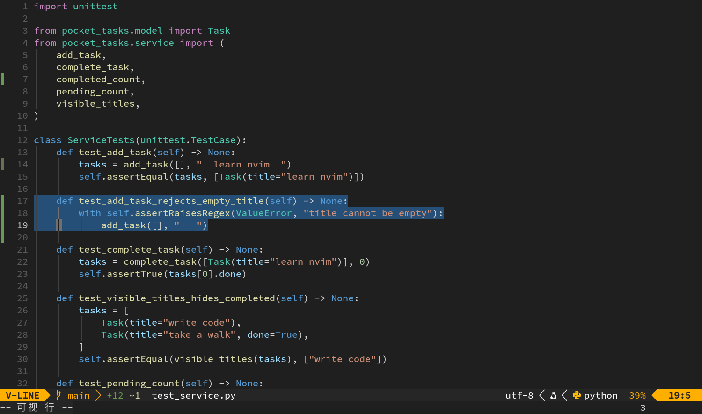

7. 再按 [[Space]] [[h]] [[s]] 暂存选区。

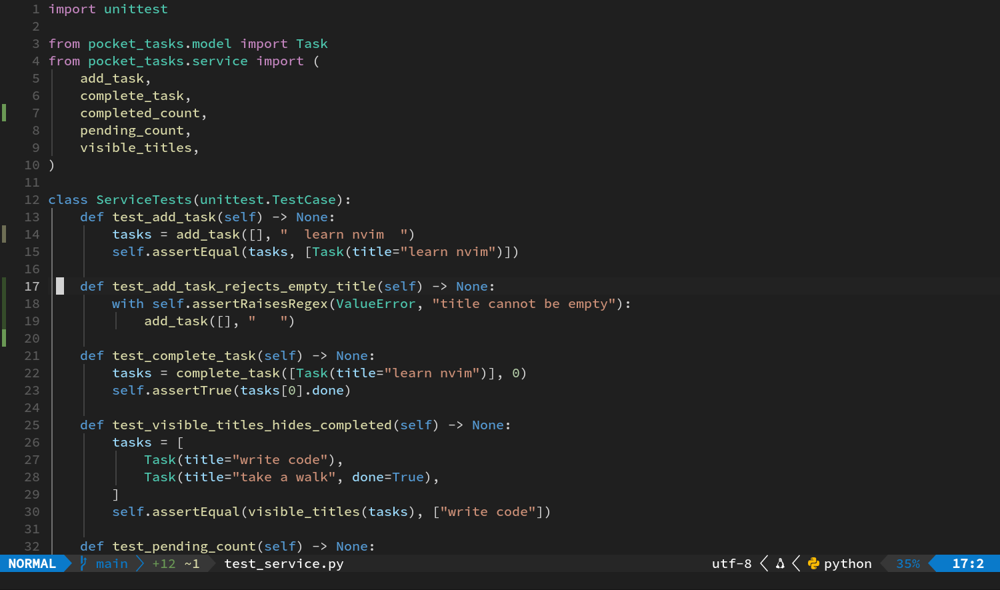

这样一来，`test_add_task` 和空标题检查测试会进入 index，而 `completed_count` 的导入、实现和测试仍留在工作树里。终端里的 `git status --short` 很可能会显示两个 `MM`：

```text
MM src/pocket_tasks/service.py
MM tests/test_service.py
```

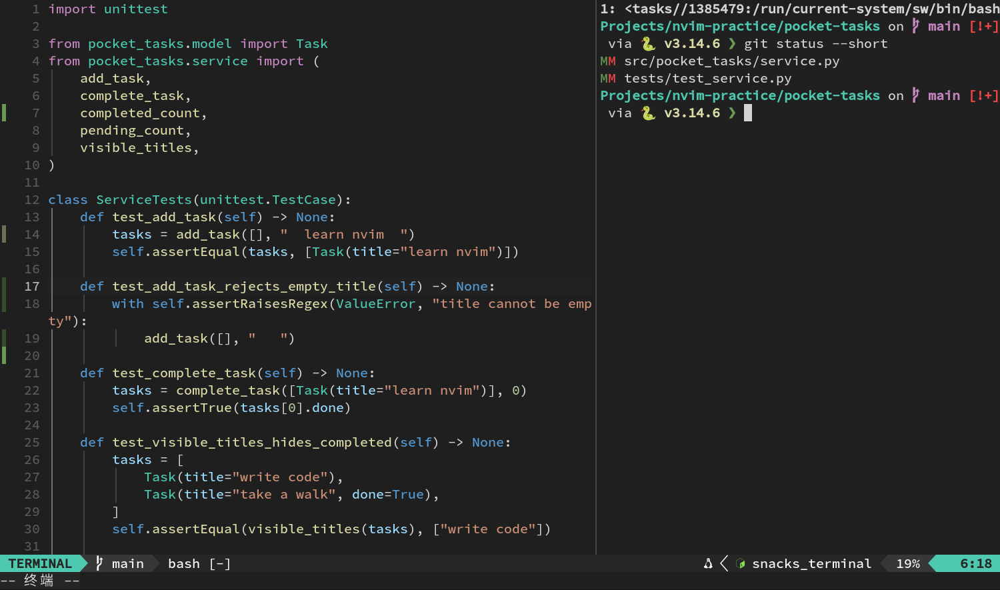

第一个位置表示 index 里有修改，第二个位置表示工作树里还有修改。换句话说，同一个文件里同时混着已暂存和未暂存的内容。

还可以运行 `git diff --cached -- tests/test_service.py`，确认 index 里只有标题清理相关的测试，还没有 `completed_count` 的导入和测试。

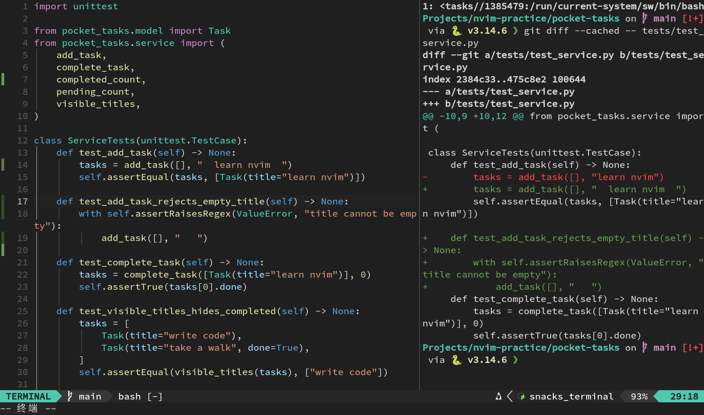

## 工作流三：可视范围暂存

有时一个 hunk 内混着两件事。刚才测试文件的暂存已经实际使用了 Gitsigns 可视范围：

1. 按 [[V]] 进入按行选择。
2. 用 [[j]]/[[k]] 选中需要的行。
3. 按 [[Space]] [[h]] [[s]]。

只有选中的范围会进入 index。一个 hunk 里混着两类修改时，这个功能尤其好用。现在下一章要用的半暂存状态已经准备好了，不用再重复练习，免得打乱刚整理好的内容。

## 工作流四的新按键：练习丢弃一小块

| 按键 | 效果 |
| --- | --- |
| [[Space]] [[h]] [[r]] | 丢弃当前 hunk，立即改写 Buffer |

> [!CAUTION] 重置 hunk 不会二次确认
> 这个操作会直接丢掉修改，所以这里只用一行专门用于练习的临时内容。动手前先预览 hunk，并确认 Git 里已经有可靠的基线。

1. 打开已经提交过的 `scratch.nix`。
2. 按 [[G]] 到末尾，按 [[o]]。
3. 输入 `# temporary noise`，按 [[Esc]]。
4. 保存文件。

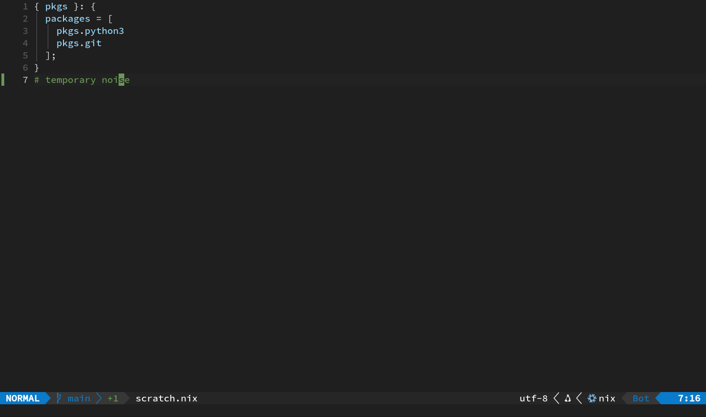

5. 按 [[Space]] [[h]] [[P]]，确认预览里只有这行临时内容。

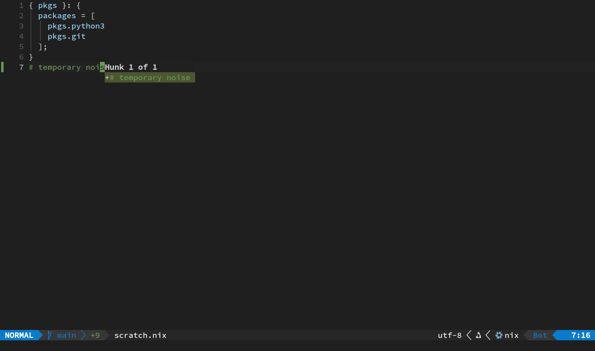

6. 按 [[Space]] [[h]] [[r]]。
7. 临时行消失。再保存一次，让磁盘也回到干净版本。

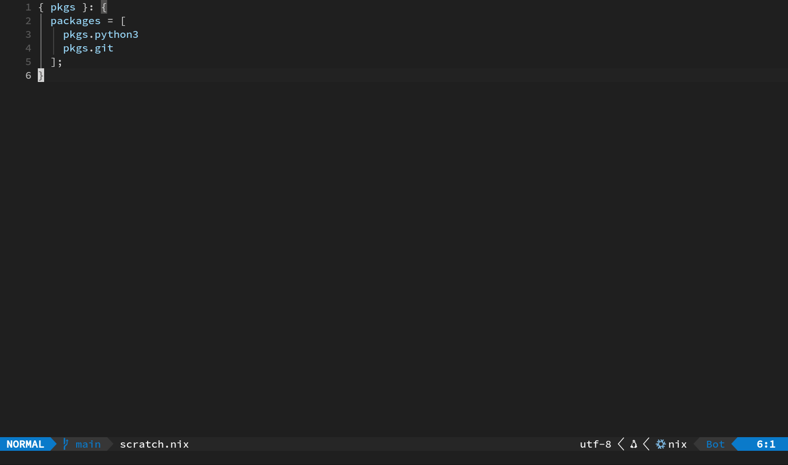

同一组映射里，还有两个影响范围更大的操作：

- [[Space]] [[h]] [[R]]：丢弃当前文件的全部工作区变化；
- 可视模式的 [[Space]] [[h]] [[r]]：丢弃选中范围。

> [!CAUTION] 大写 R 会丢弃当前文件的全部修改
> 这些操作都不会再问一句“你确定吗”。平时使用前先预览，再确认 Git 里已经有可靠的基线。

## 可选：让 blame 常驻行尾

按 [[Space]] [[t]] [[b]]，当前行末尾会显示一小段 blame 信息；再按一次同样的组合就能关闭。需要连续查看代码历史时可以打开，平时关着，界面会清爽一些。

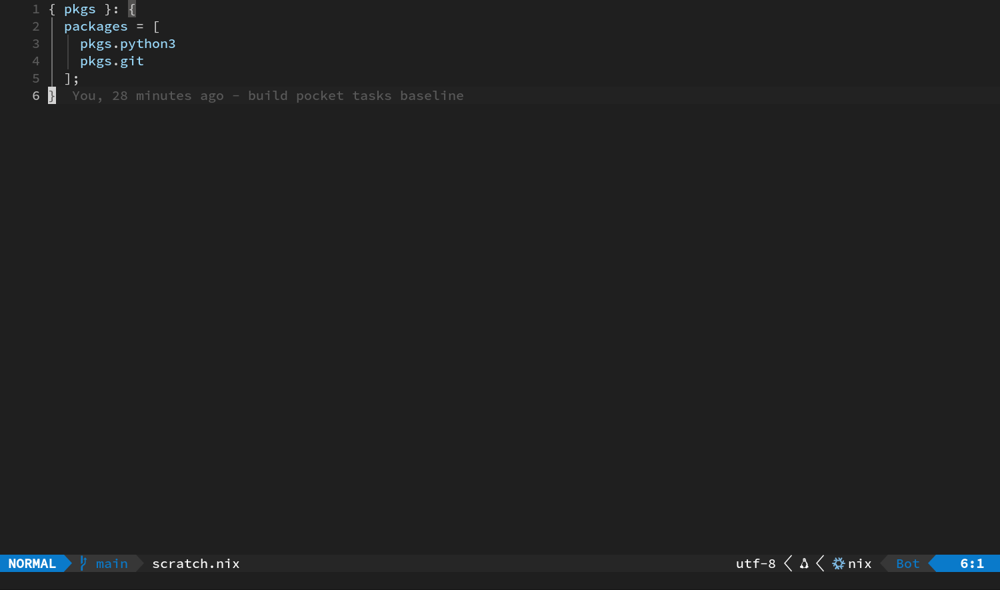

## 日常检查流程

以后改完一个文件，可以这样检查：

1. 保存文件。
2. [[g]] [[g]] 回顶部。
3. 反复按 [[&#93;]] [[c]]。
4. 每块按 [[Space]] [[h]] [[P]] 预览。
5. 属于本次提交的块按 [[Space]] [[h]] [[s]]。
6. 暂存错了就立刻按 [[Space]] [[h]] [[u]]。
7. 终端运行测试与 `git diff --cached`。

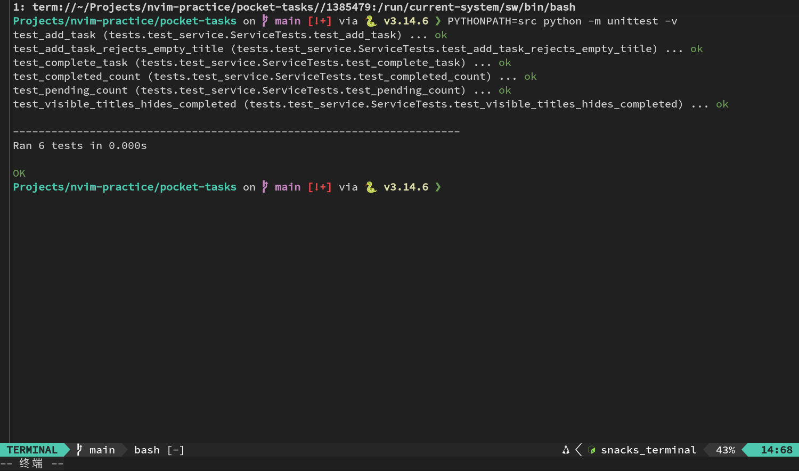

下一章进入 [12：完整代码对照](12-diffview-and-comparison.md)。届时会从单个 hunk 扩展到任意两个文件、单文件 Git 版本以及整个项目的修改。
