# 12｜代码对照——单文件与全项目

“看差异”其实有三种尺度：

1. 当前文件相对 Git index 有什么变化；
2. 任意两份文件有哪些不同；
3. 整个项目的 staged、unstaged 和文件历史长什么样。

本章会分别练习这三种场景。开始对比前要先保存，因为 Diffview 主要读取磁盘上的工作树，未保存的内容可能不会显示出来。

## 工作流一的新按键：当前文件对 Git index

| 按键 | 效果 |
| --- | --- |
| [[Space]] [[h]] [[d]] | 当前文件与 Git index 并排对照 |
| [[&#93;]] [[c]] / [[&#91;]] [[c]] | 在 diff 模式跳到下一处 / 上一处差异 |

上一章留下了半暂存状态。打开 `src/pocket_tasks/service.py`，保存后按：

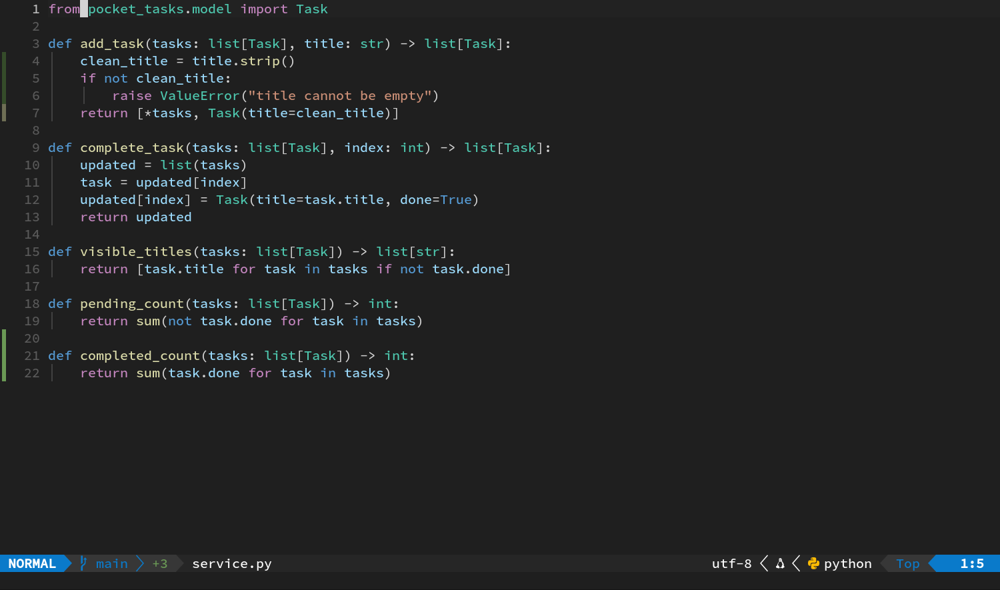

[[Space]] [[h]] [[d]]

屏幕会出现一个 Git 快照窗口和一个当前文件窗口。由于 `add_task` 已经进入 index，这次对照主要应显示尚未暂存的 `completed_count`。

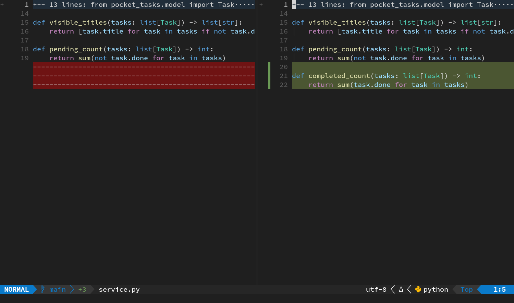

1. 按 [[&#93;]] [[c]] 跳到下一处差异。
2. 按 [[&#91;]] [[c]] 回上一处。
3. 用 [[Ctrl]]+[[w]] 加 [[h]]/[[l]] 看清两个窗口的文件名。
4. 焦点放到 Git 快照窗口，按 [[Ctrl]]+[[w]]，再按 [[q]] 关闭它。

若剩余窗口仍保留 diff 折叠或高亮，按 [[F1]]，输入 `diffoff`，连按两次 [[Enter]]。

这套简单的对比视图适合确认一件事：

> 当前 Buffer 还有哪些内容没进 index？

## 工作流二的新按键：任意两个文件的原生 diff

| 按键 | 效果 |
| --- | --- |
| Picker 中 [[Ctrl]]+[[v]] | 在竖向分屏打开候选 |
| [[F1]] → `diffthis` → 两次 [[Enter]] | 让当前窗口加入 diff |
| [[d]] [[o]] | 从另一窗口取得当前差异块 |
| [[d]] [[p]] | 把当前差异块送到另一窗口 |
| [[F1]] → `diffoff` → 两次 [[Enter]] | 让当前窗口离开 diff |

这套流程不依赖 Git。配置文件、生成结果、不同版本的文案或接口响应，都可以直接拿来比较。

### 创建两份一次性对照文件

按 [[Space]] [[e]] 打开 Explorer，在项目根目录按 [[a]]，输入 `compare/`，按 [[Enter]]。

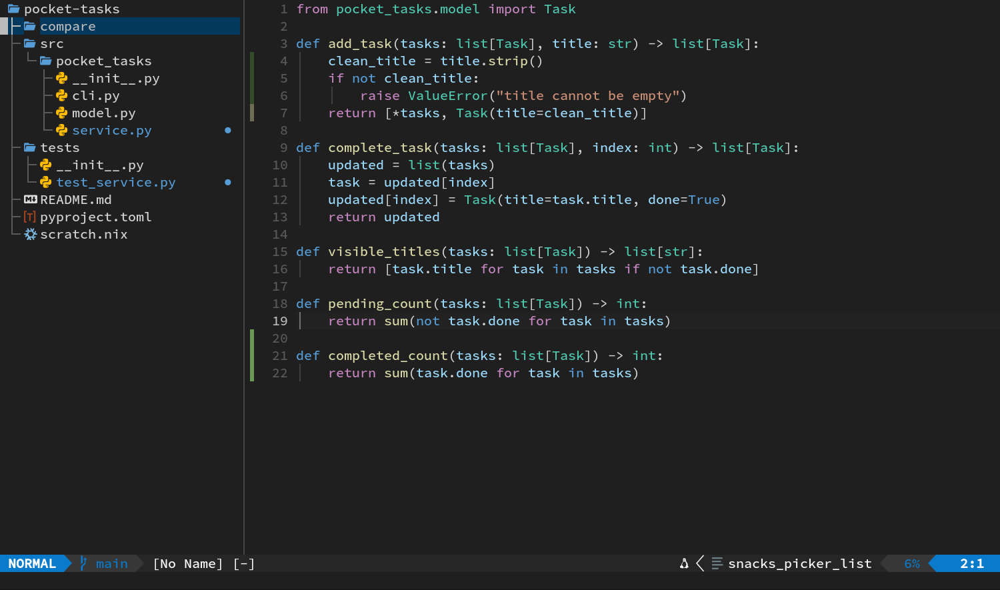

进入新目录，创建 `left.conf`，输入：

```ini
[display]
theme = light
show_help = yes
show_count = yes

[limits]
max_items = 5
trim_titles = no

[sorting]
primary = created
stable = yes
```

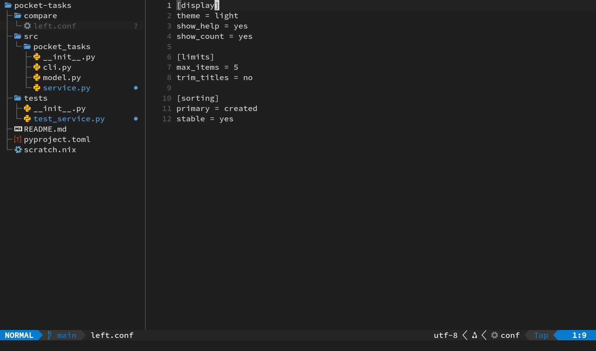

保存。回到 Explorer，创建 `right.conf`，输入：

```ini
[display]
theme = dark
show_help = yes
show_count = yes

[limits]
max_items = 10
trim_titles = no

[sorting]
primary = title
stable = yes
```

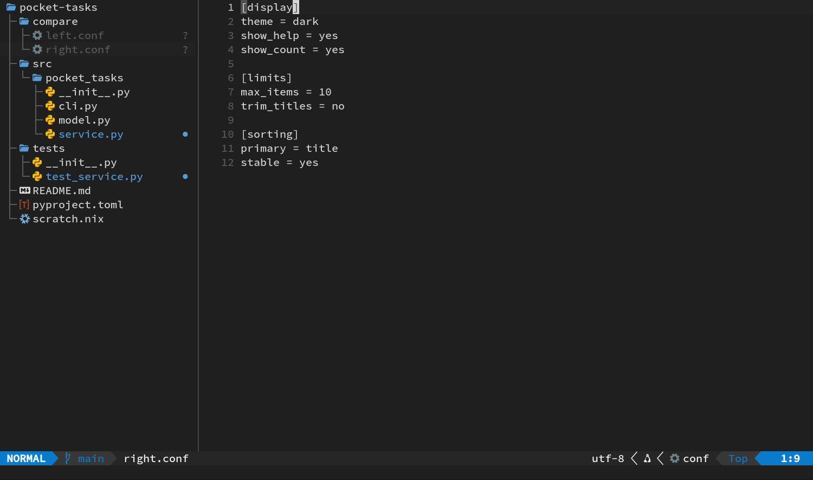

保存。两份文件都已经成为 Buffer，当前停在 `right.conf` 即可。

### 用 Buffer Picker 竖向并排

1. 按 [[Space]] [[,]]。
2. 输入 `left.conf`。

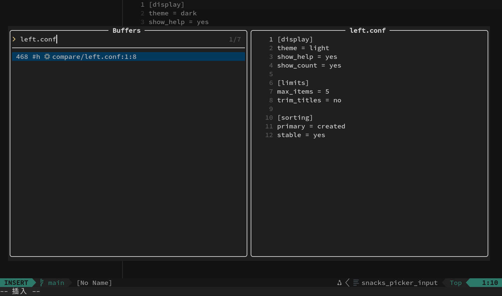

3. 候选高亮到它时按 [[Ctrl]]+[[v]]。

现在两个代码窗口分别显示 left 和 right。分屏出现在哪一侧会受当前布局影响，因此应该根据文件名确认内容，不要只凭左右位置判断。

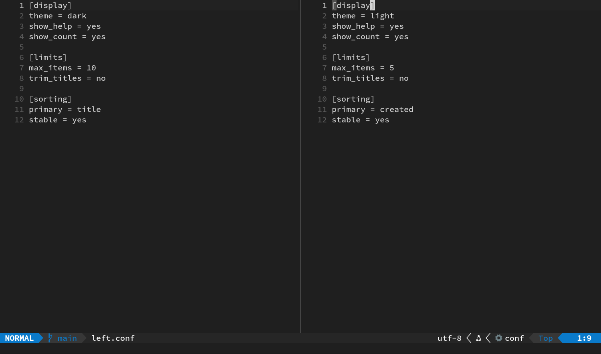

### 让两个窗口都进入 diff

1. 在当前窗口按 [[F1]]。
2. 输入 `diffthis`，连按两次 [[Enter]]。
3. 按 [[Ctrl]]+[[w]]，再按 [[h]] 或 [[l]]，移动到另一份文件。
4. 再执行一次 [[F1]] → `diffthis` →[[Enter]] → [[Enter]]。

预期效果：

- 相同行会对齐；
- 不同内容带有 diff 高亮；
- 大段相同内容可能折叠；
- [[&#93;]] [[c]] 和 [[&#91;]] [[c]] 在三个差异块之间跳转。

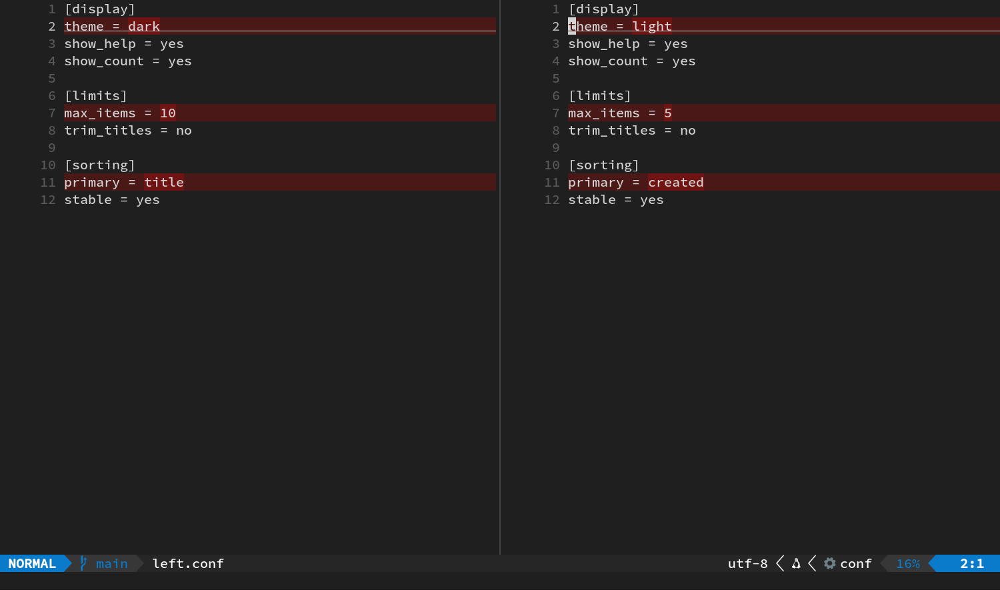

### 使用 [[d]] [[o]] 和 [[d]] [[p]] 合并差异

先找到显示 `left.conf` 的窗口。

1. 搜索 `/theme`，按 [[Enter]]。
2. 按 [[d]] [[o]]。
3. 当前窗口从另一侧取得这一块，`light` 变成 `dark`。

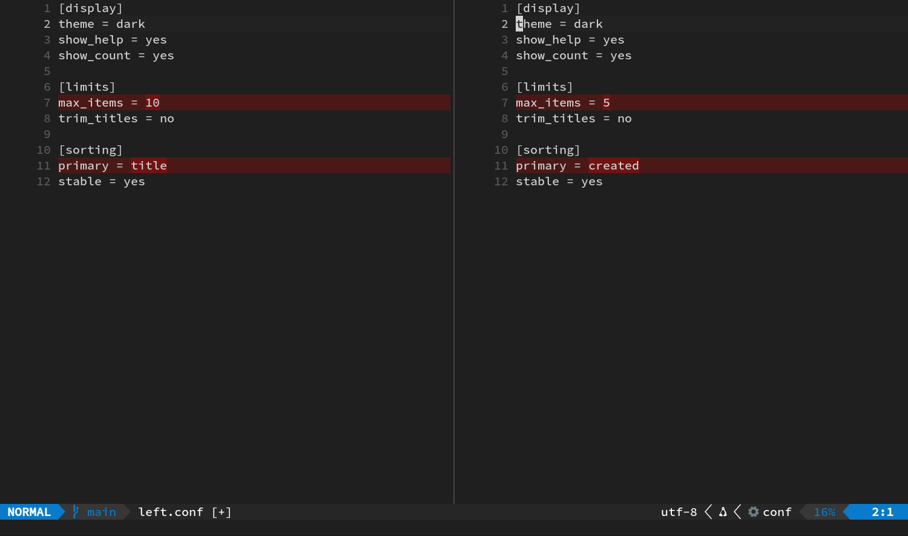

4. 按 [[u]]，把练习修改撤销。

接着仍在 left 窗口：

1. 搜索 `/max_items`，按 [[Enter]]。
2. 按 [[d]] [[p]]。
3. 另一窗口收到当前块，`10` 变成 `5`。

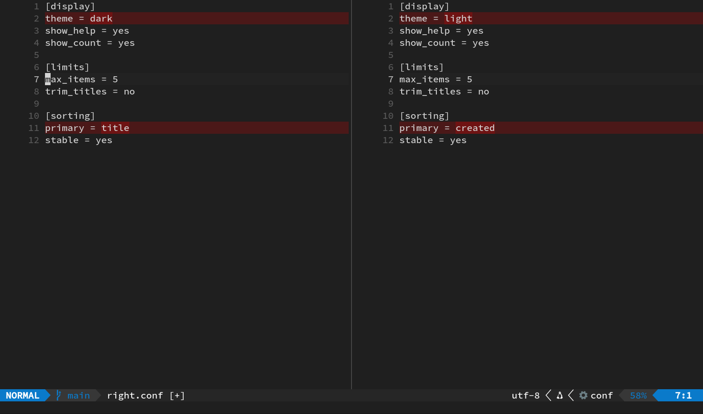

4. 移到 right 窗口，按 [[u]] 撤销。

可以这样记：

> [[d]] [[o]]：obtain，把差异取到当前窗口。[[d]] [[p]]：put，把差异放到另一个窗口。

两条命令会修改目标 Buffer，但不会替你保存。对真实文件操作后，请先审查结果，再决定保存或撤销。

### 退出双文件 diff

在第一个窗口执行 [[F1]] → `diffoff` → [[Enter]] → [[Enter]]，移动到第二个窗口，再执行一次。随后可用 [[Ctrl]]+[[w]]、[[q]] 关闭其中一个分屏。

`compare` 目录只为本次训练服务。若要清理：

1. 确认两份文件没有想保留的内容。
2. 按 [[Space]] [[,]]，筛选 `compare`，用 [[Ctrl]]+[[x]] 删除两个临时 Buffer。

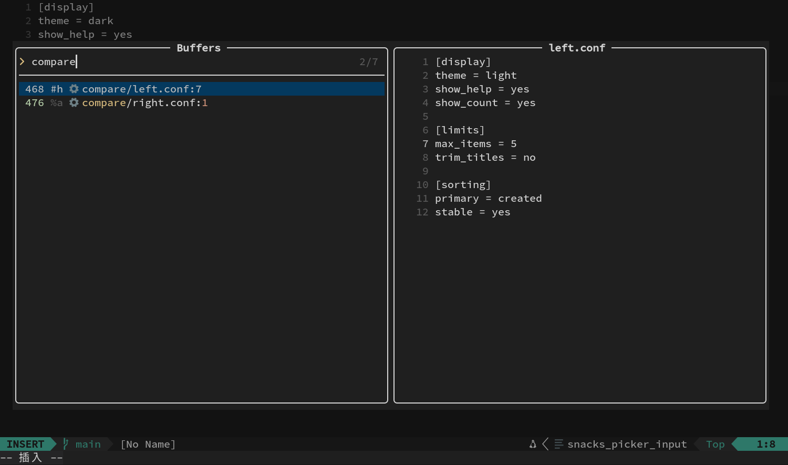

3. 在 Explorer 把光标放到 `compare` 目录。
4. 按 [[d]] 并确认。

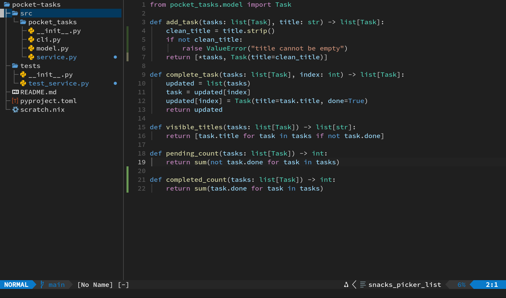

如果当前系统没有可用的回收站后端，Explorer 会永久递归删除目录。这里只删除名称明确的练习目录；处理真实目录时，确认路径和内容后再按 [[d]]。

## 工作流三：Diffview 全项目审查

先按 [[F1]] → `wall` →[[Enter]] → [[Enter]]，随后按：

[[Space]] [[g]] [[s]]

Diffview 会新建一个 Tab。默认界面大致如下：

```text
┌─ 文件面板 ─────────┬──────────── 对照区域 ───────────┐
│ Staged changes    │    左侧版本    │    右侧版本     │
│ Unstaged changes  │               │                │
└───────────────────┴────────────────────────────────┘
```

同一路径可能同时出现在 Staged 和 Unstaged 分组中。上一章留下的两个 `MM` 文件正好可以展示这种状态。

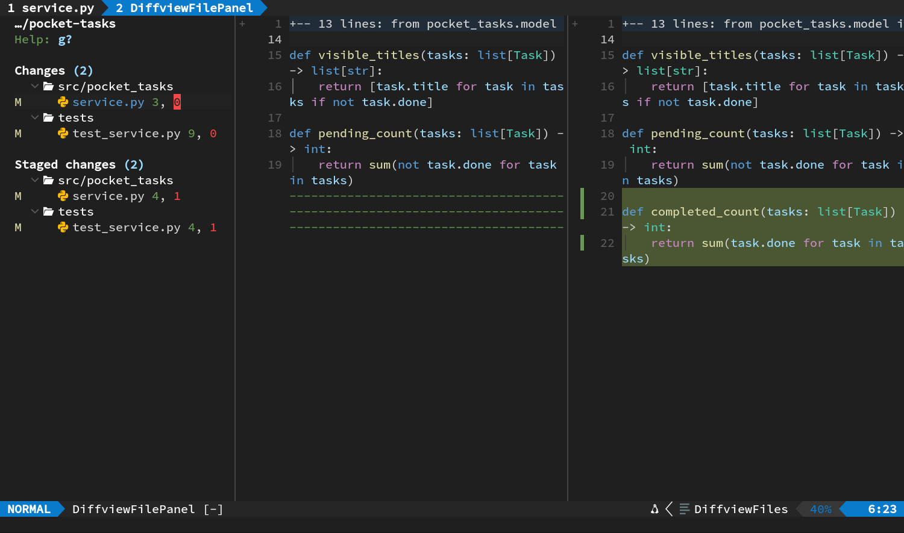

### 第一步：浏览所有变化

| 按键 | 效果 |
| --- | --- |
| [[Tab]] | 打开下一份变更文件 |
| [[Shift]]+[[Tab]] | 打开上一份变更文件 |
| [[Space]] [[e]] | 聚焦 Diffview 文件面板 |
| 文件面板 [[j]]/[[k]] | 上下移动 |
| 文件面板 [[Enter]] | 打开所选文件的 diff |
| [[Space]] [[b]] | 隐藏或显示文件面板 |
| [[g]] [[f]] | 在先前的普通 Tab 打开真实工作文件 |

先反复按 [[Tab]] 看完所有文件，再按 [[Space]] [[e]] 回文件面板，用 [[j]]/[[k]] 和 [[Enter]] 精确选择。

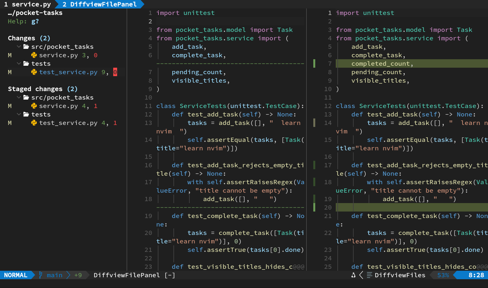

在 Diffview 中，[[Space]] [[e]] 的含义只对当前界面生效：它负责聚焦文件面板，不会打开或关闭普通的 Explorer。

需要修代码时，在对照窗口按 [[g]] [[f]]。Diffview 保持在自己的 Tab，真实文件会在先前的工作 Tab 打开。修完并保存后，用 [[g]] [[t]] 或 [[g]] [[T]] 回到 Diffview，按 [[Space]] [[e]]，再按 [[R]] 刷新文件列表。

### 两侧到底代表谁

- Unstaged 条目通常比较 index 与工作树；
- Staged 条目通常比较 HEAD 与 index；
- 左右标题和文件面板分组比颜色更值得信任；
- 对照区里的 Git 快照与 index 视图不适合作为日常编辑入口。

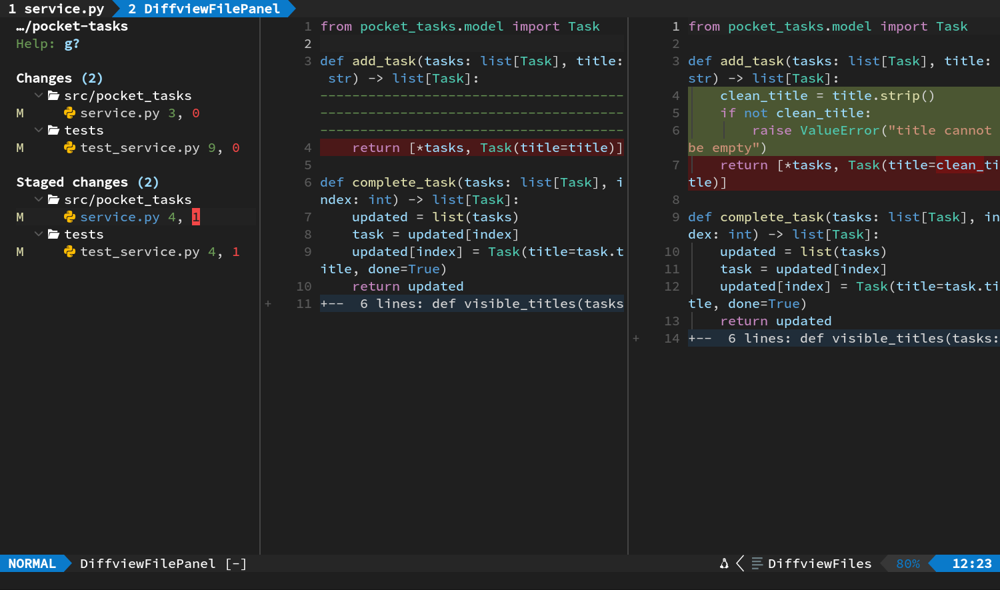

若误在 Changes 视图的 index 一侧进入插入模式并保存，暂存区也会改变。想改真实文件，优先按 [[g]] [[f]] 回普通工作 Tab。

### 第二步：按文件暂存

Diffview 文件面板的暂存动作处理整份文件：

| 按键 | 效果 |
| --- | --- |
| [[s]] 或 [[-]] | 暂存 Unstaged 条目；对 Staged 条目执行时会取消暂存 |
| [[S]] | 暂存列表里的全部变化 |
| [[U]] | 取消暂存全部变化 |

本次只练小写 [[s]]：

1. 按 [[Space]] [[e]] 聚焦文件面板。
2. 在 Unstaged 分组找到 `service.py`，按 [[s]]。

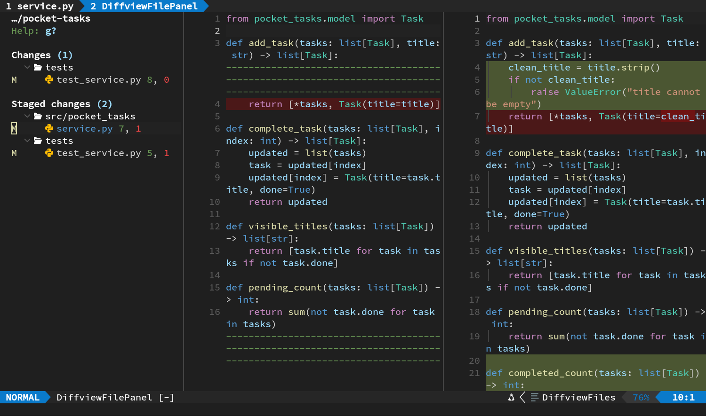

3. 对 `test_service.py` 重复一次。
4. 观察它们的未暂存条目消失，暂存条目保留或更新。

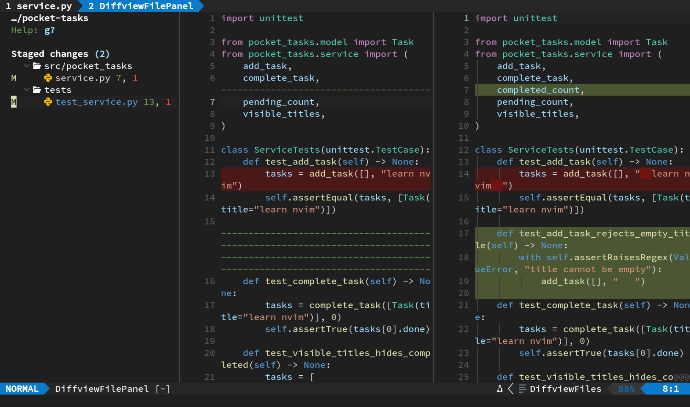

这会把上一章留下的 `completed_count` 及其测试也放入 index。若按错文件，把光标移到它的 Staged 条目，再按一次 [[s]] 即可取消整文件暂存。

### 一个需要了解但不必练习的高风险操作

> [!CAUTION] Diffview 文件面板的 X 键会直接恢复文件
> [[X]] 会把所选文件恢复到 diff 左侧状态，而且没有确认提示。插件会短暂显示一条可能用于恢复的 Git 命令，但消息很容易错过。日常审查时不要随意使用；确实需要丢弃内容时，优先回到普通文件预览 hunk，再使用逐块操作。

### 正确关闭 Diffview

普通 [[q]] 只会影响当前窗口或面板，不负责关闭整套 Diffview。

1. 按 [[F1]]。
2. 输入 `DiffviewClose`。

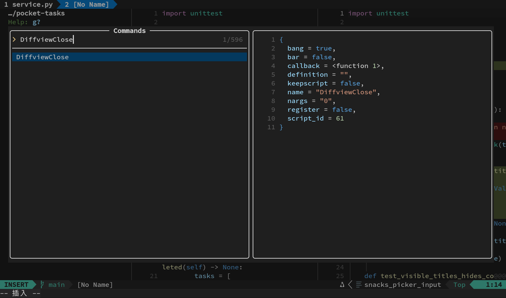

3. 连按两次 [[Enter]]。

你会回到原来的工作 Tab。

## 审查、测试、提交

打开终端，依次运行：

```console
PYTHONPATH=src python -m unittest -v
git diff --cached --check
git diff --cached
```

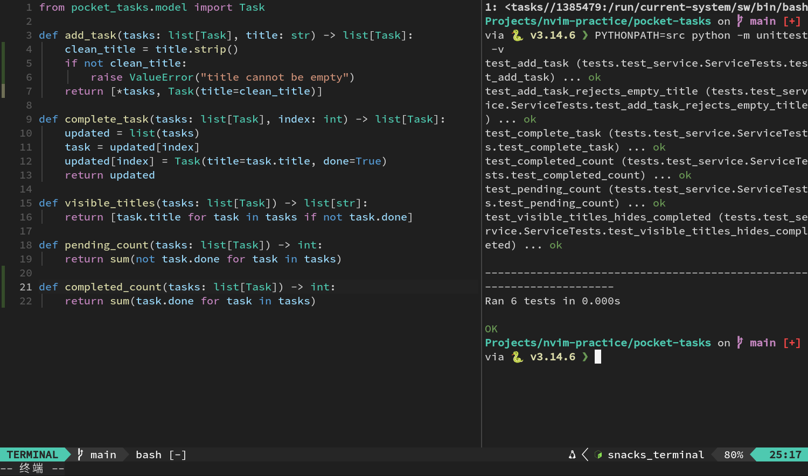

测试应全部通过；`git diff --cached --check` 没有输出代表未发现空白错误。第三条会打开补丁，按 [[q]] 退出 pager。

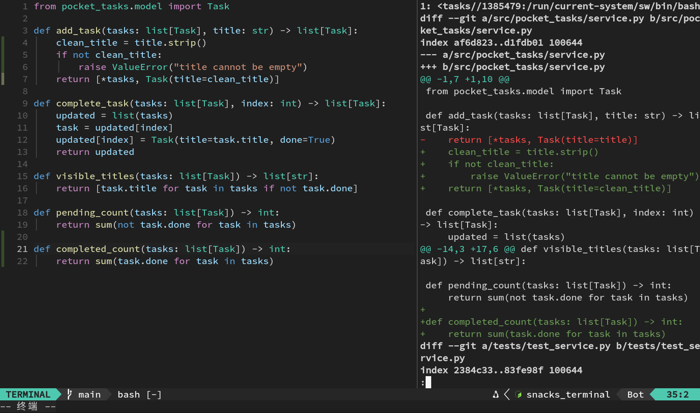

确认提交内容只包含标题清理和完成数量后运行：

```console
git commit -m "clean task titles and count completions"
git status --short
```

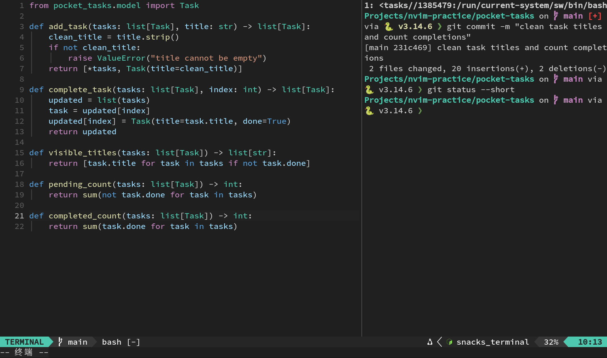

最后应回到干净工作树。

## 工作流四：当前文件对上一提交的父提交

现在项目至少有两个提交。打开 `service.py`，按：

[[Space]] [[h]] [[D]]


注意最后的 [[D]] 为大写。这个映射实际比较“当前文件”和 `HEAD~`，也就是当前提交的父提交。它只看当前文件，不会打开全项目 diff。

用 [[&#93;]] [[c]] 浏览刚提交的变化，随后关闭 Git 快照窗口。若项目只有根提交，`HEAD~` 尚不存在，这个动作会报找不到 revision。

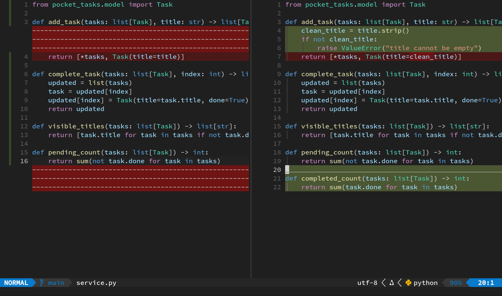

::: details 可选工作流：翻项目提交历史

1. 按 [[F1]]。
2. 输入 `DiffviewFileHistory`。

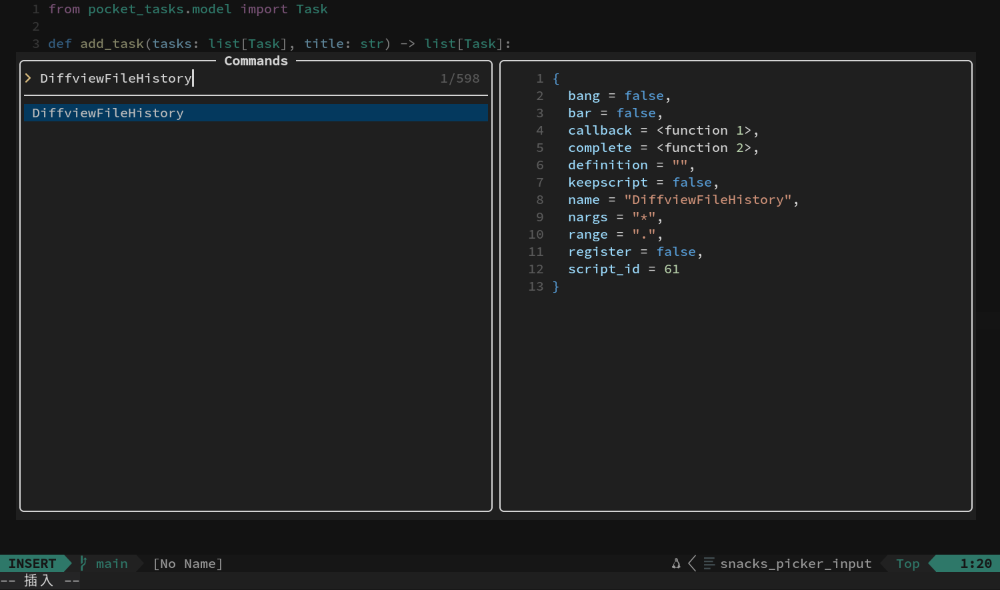

3. 连按两次 [[Enter]]。

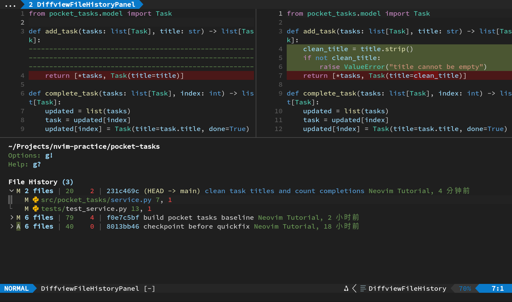

4. 在历史面板用 [[j]]/[[k]] 选择提交，按 [[Enter]] 查看该提交的文件差异。

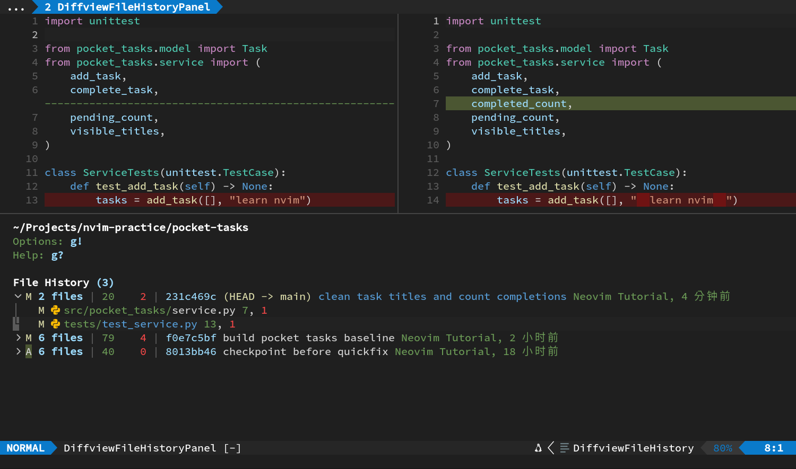

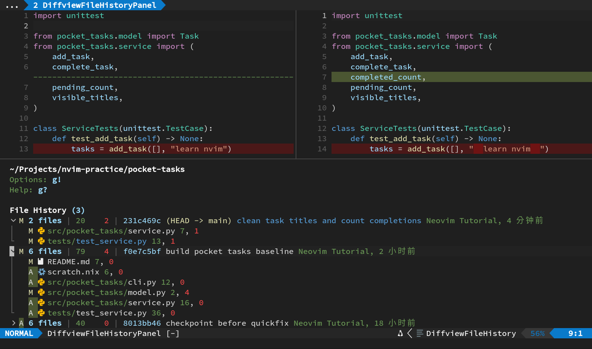

5. 用 [[F1]] → `DiffviewClose` → 两次 [[Enter]] 退出。

无参数的 `DiffviewFileHistory` 会查看项目历史。带有精细 Git 参数的高级历史查询可以在实际需要时再学习，本教程不要求提前掌握。

:::

## 三种代码对照方式的选择

| 你想回答的问题 | 工具 |
| --- | --- |
| 当前文件还有什么没进 index | [[Space]] [[h]] [[d]] |
| 两份任意文件哪里不同，并在两边传递差异 | 双分屏 + `diffthis` |
| 项目里哪些文件 staged/unstaged | [[Space]] [[g]] [[s]] |
| 当前文件相对父提交改了什么 | [[Space]] [[h]] [[D]] |
| 提交历史里每次动了什么 | `DiffviewFileHistory` |

下一章进入 [13：合并冲突演练](13-merge-conflicts.md)。我们会制造两处冲突，并分别练习在不同冲突中选择 ours 和 theirs。
