# 13｜合并冲突——理解 ours 与 theirs

出现冲突，不代表 Git 坏了。只是两个分支都改了同一个地方，Git 猜不出该留哪一边。这一章会在两条练习分支上制造两处可控的冲突，再用 Diffview 的三方界面一块块解决。

> [!IMPORTANT] 开始前先确认工作树干净
> 全程只会动 `README.md`。开始前务必保存所有文件，并确认 `git status --short` 什么也没输出。

## 本章核心新按键

| 按键 | 效果 |
| --- | --- |
| [[&#93;]] [[x]] / [[&#91;]] [[x]] | 下一个 / 上一个冲突区 |
| [[Space]] [[c]] [[o]] | 当前冲突选择 ours |
| [[Space]] [[c]] [[t]] | 当前冲突选择 theirs |
| [[Space]] [[c]] [[b]] | 当前冲突只保留共同祖先 base 内容 |
| [[Space]] [[c]] [[a]] | 按 ours → base → theirs 拼接当前冲突内容并删除标记 |
| [[d]] [[x]] | 删除整个当前冲突区 |

主练习只会用到前四项里的 ours 和 theirs。其他按键先知道是干什么的，不用在这一章全记住。

## 开始前检查

按 [[F1]] → `wall` →[[Enter]] → [[Enter]]，打开终端运行：

```console
git status --short
git branch --show-current
git config --local merge.conflictStyle diff3
git config --local --get merge.conflictStyle
```

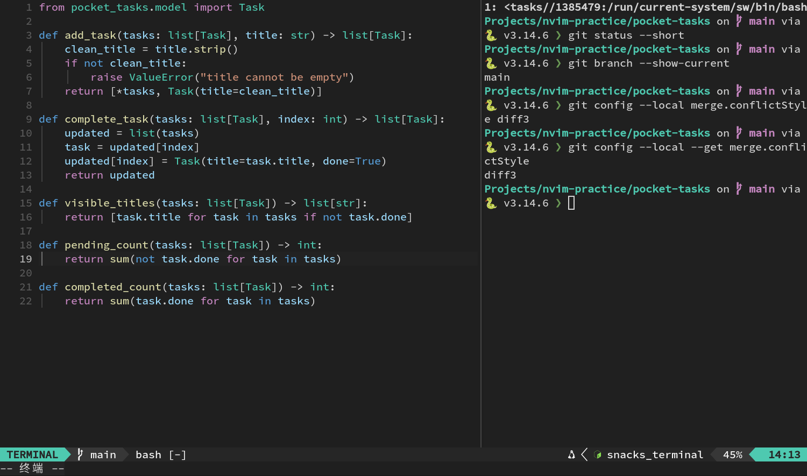

第一条应该没有输出。第二条会告诉你当前的基线分支叫什么，可能是 `main`、`master`，也可能是别的名字。练习会从这里分出两条教学分支，不会改写原来的基线。最后一条应该输出 `diff3`，表示这个仓库会把共同祖先的内容也写进冲突标记。这项设置只对当前练习仓库生效。

## 工作流一：制作 ours 版本

在终端运行：

```console
git switch -c tutorial-ours
```

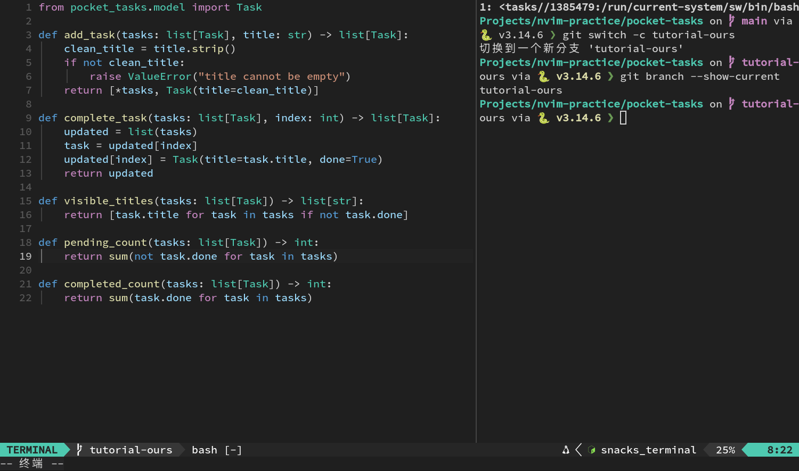

隐藏终端，打开 `README.md`。

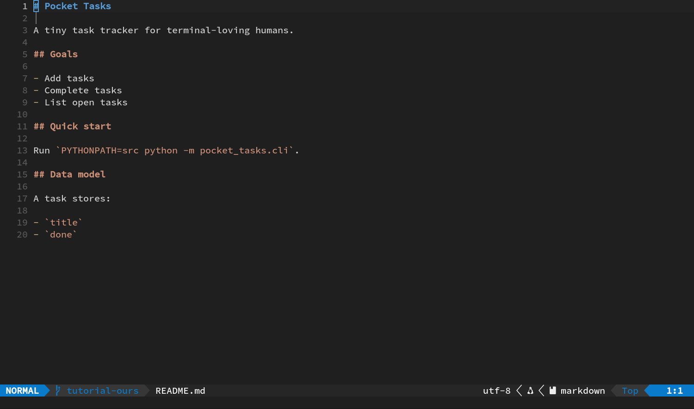

输入 `/A tiny`，按 [[Enter]] 搜索描述行。

按 [[c]] [[c]]，输入：

```text
A tiny task tracker for focused terminal sessions.
```

按 [[Esc]]。

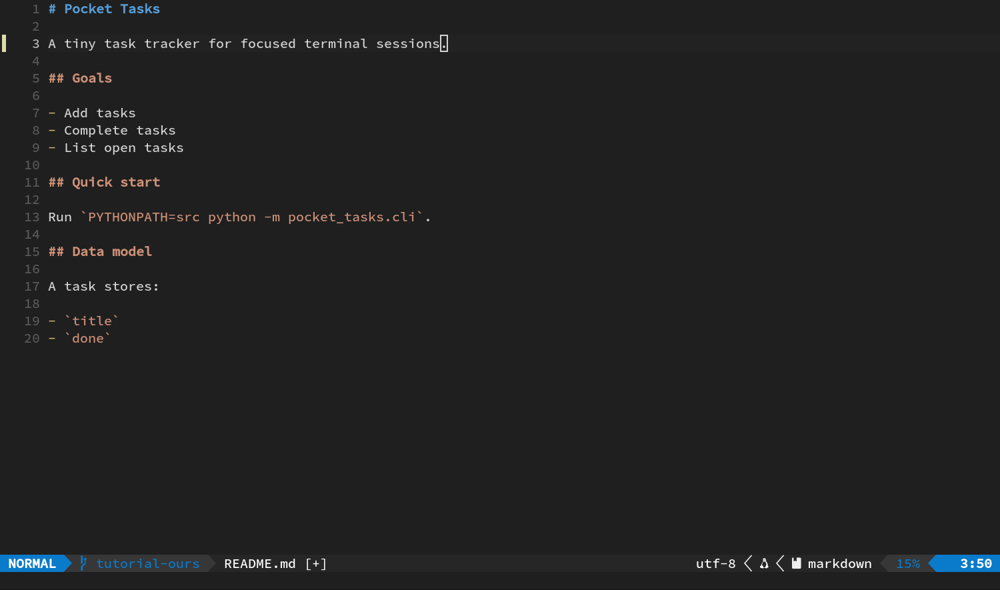

再输入 `/Run`，按 [[Enter]] 搜索 Quick start 的命令行。

按 [[c]] [[c]]，输入：

```text
Run the CLI with `PYTHONPATH=src python -m pocket_tasks.cli`.
```

按 [[Esc]]，保存文件。打开终端运行：

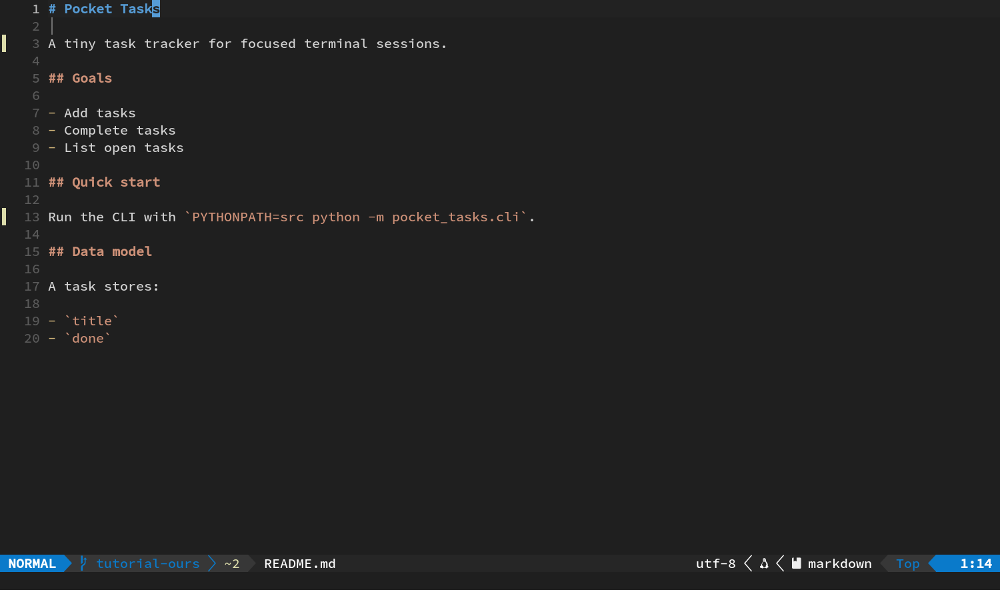

```console
git add README.md
git commit -m "describe a focused workflow"
```

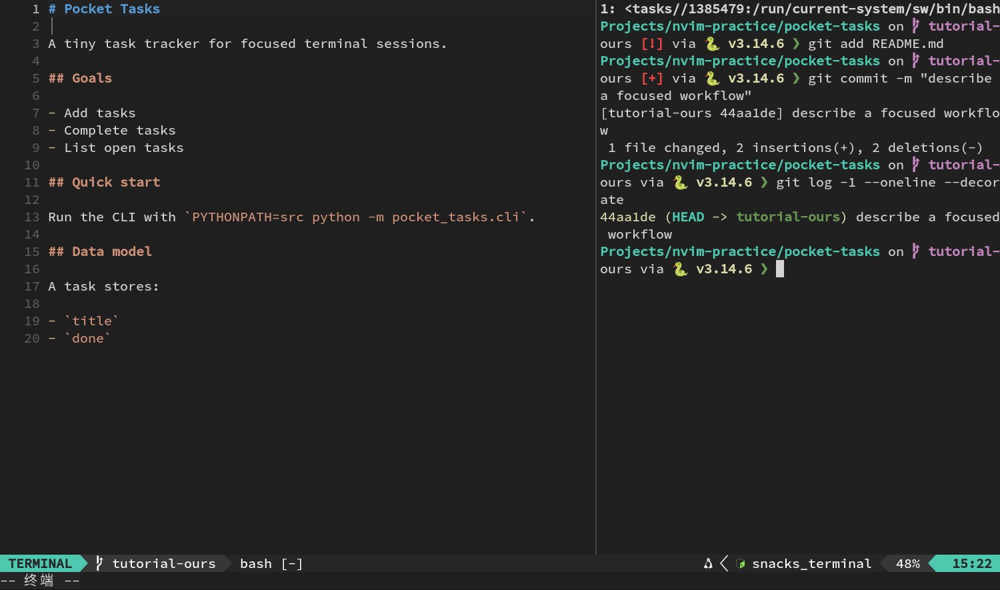

现在 `tutorial-ours` 比共同基线往前多了一个提交。

## 工作流二：从共同基线制作 theirs 版本

终端运行：

```console
git switch -c tutorial-theirs HEAD~1
```

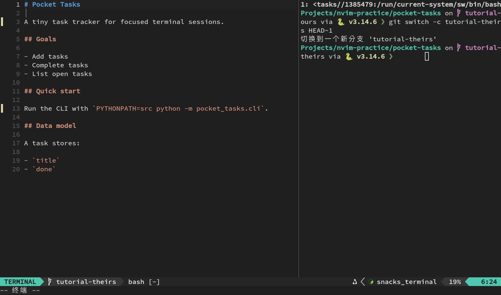

这条命令会从 ours 提交的父提交拉出新分支，所以两边拥有同一个共同祖先。

切换分支会改写磁盘上的文件。回到 README 后，如果屏幕上还留着上一条分支的句子：

1. 按 [[F1]]。
2. 输入 `edit`。
3. 连按两次 [[Enter]]，重新读取磁盘版本。


再把同样两行改成另一套文案。

描述行：

```text
A friendly task tracker for terminal-loving humans.
```

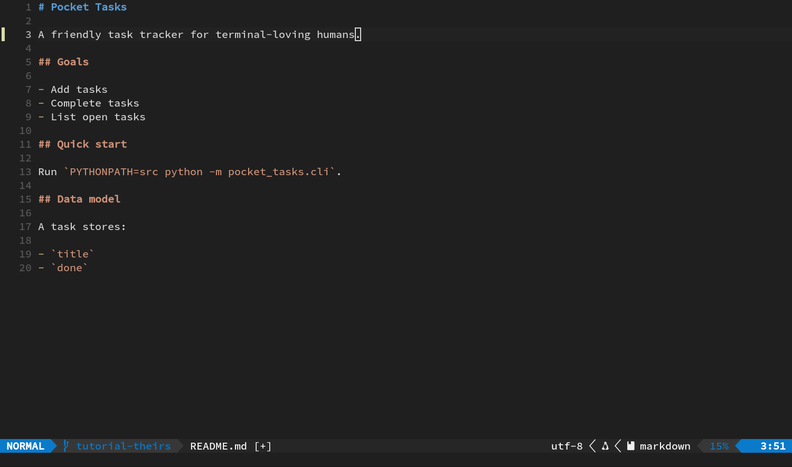

Quick start 行：

```text
Start it with `PYTHONPATH=src python -m pocket_tasks.cli`.
```

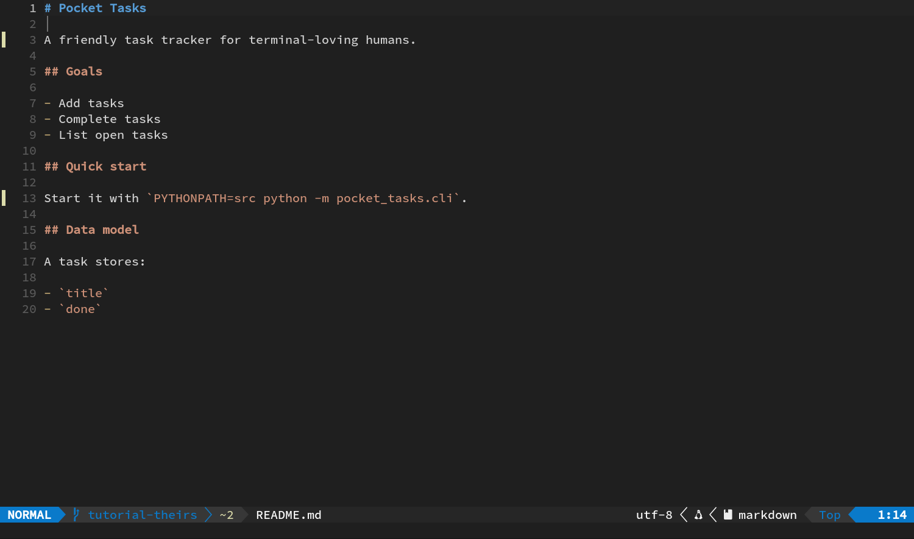

保存，终端运行：

```console
git add README.md
git commit -m "describe a friendly workflow"
```

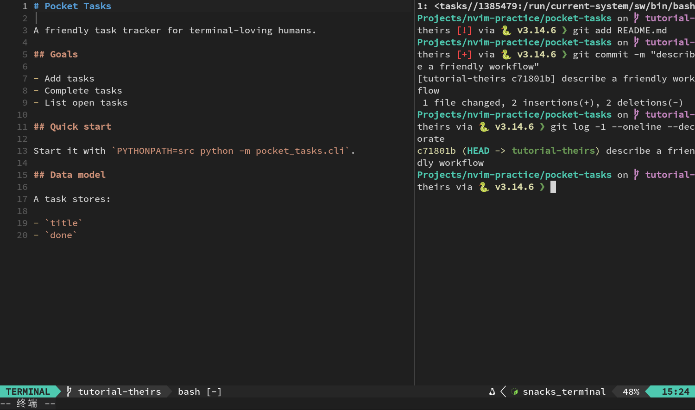

现在两条分支各自修改了同样的两行，合并时自然会产生冲突。

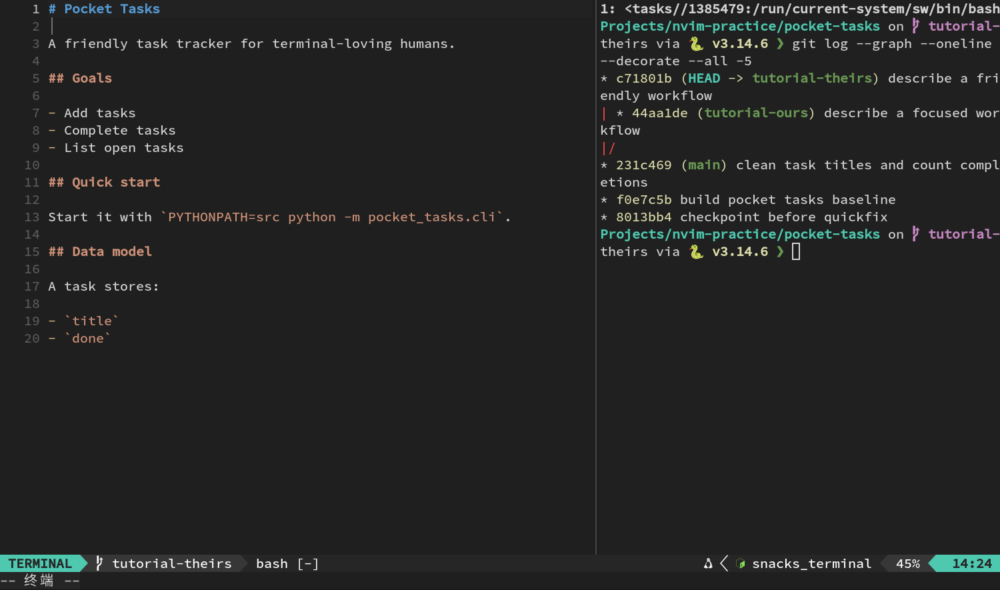

## 工作流三：制造冲突

终端运行：

```console
git switch tutorial-ours
git merge tutorial-theirs
```

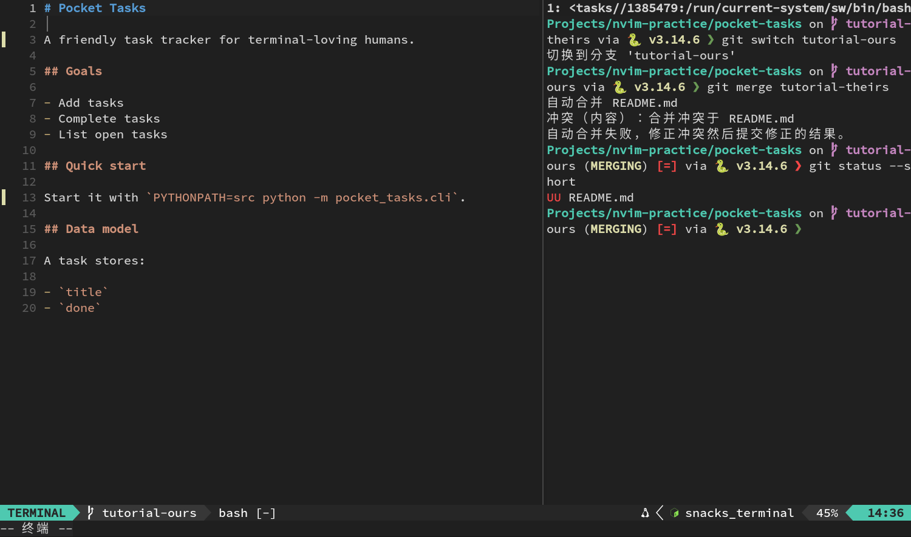

Git 应该会报告 `README.md` 存在 content conflict，然后暂停合并。这正是我们想要的练习状态。

隐藏终端。如果 README 仍显示切换前的内容，执行一次 [[F1]] → `edit` → [[Enter]] → [[Enter]]。

此时直接打开文件会看到类似标记：

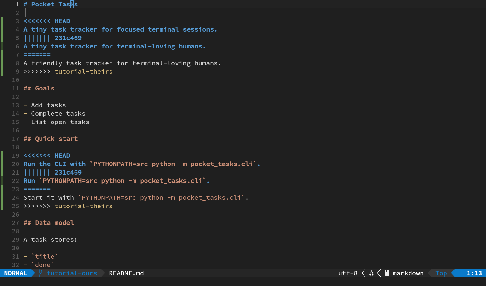

```text
<<<<<<< HEAD
A tiny task tracker for focused terminal sessions.
||||||| 共同祖先提交
A tiny task tracker for terminal-loving humans.
=======
A friendly task tracker for terminal-loving humans.
>>>>>>> tutorial-theirs
```

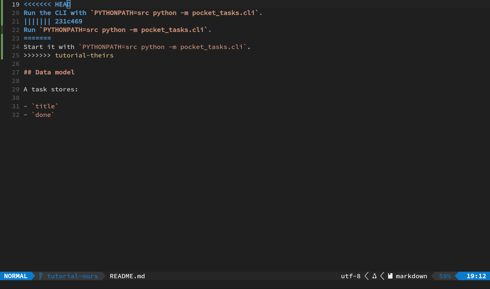

当然也能手工删掉冲突标记，不过这一节会用 Diffview 的三方界面，这样三个版本可以直接摆在眼前比较。

### 为什么练习启用 diff3

中间以 `|||||||` 开头的那段就是 BASE，也就是两个分支动手之前的共同祖先。Diffview 的 [[b]] 和 [[a]] 操作，会读取 LOCAL 文件里的这段冲突标记：

- 有 BASE 时，[[Space]] [[c]] [[b]] 会只留下共同祖先内容；
- 有 BASE 时，[[Space]] [[c]] [[a]] 会按 ours → base → theirs 的顺序拼接三段内容，再删除标记；
- 缺少 BASE 标记时，[[b]] 会把 BASE 当作空内容，当前冲突可能被清空；
- 缺少 BASE 标记时，[[a]] 会拼接现有的 ours 与 theirs；
- BASE 标记存在、段落内容恰好为空时，[[b]] 得到的结果同样为空。

大写 [[B]] 和 [[A]] 会把相应操作套到当前文件的所有冲突上，影响范围更大。在真实项目里使用 [[b]]/[[B]] 或 [[a]]/[[A]] 之前，先确认 LOCAL 里确实有 `|||||||` BASE 标记。

## 工作流四：在三方界面逐块解决

按：

[[Space]] [[g]] [[s]]

Diffview 发现未合并文件后，会自动启用 merge tool。默认的 `diff3_horizontal` 布局，会把三个版本横着排开：

```text
┌──────── OURS ────────┬──────── LOCAL ────────┬─────── THEIRS ───────┐
│ 当前分支版本         │ 磁盘上的合并结果       │ 传入分支版本          │
│ A                    │ B，可编辑              │ C                     │
└──────────────────────┴────────────────────────┴───────────────────────┘
```

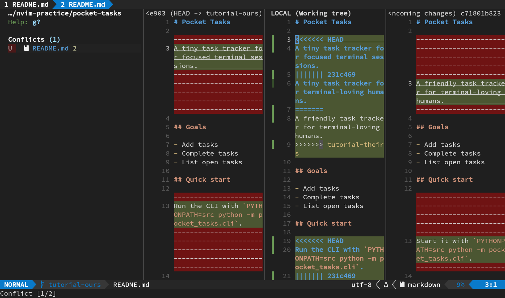

- OURS 是当前分支 `tutorial-ours`；
- THEIRS 是正在合入的 `tutorial-theirs`；
- LOCAL 是最终要保存并暂存的工作文件；
- BASE 是两边共同祖先，默认三窗布局没有单独展示它，但选择键仍可取用。

用 [[Ctrl]]+[[w]] 加 [[h]]/[[l]]，移到标题里写着 LOCAL 的中间窗口。

### 第一处冲突选 ours

1. 按 [[g]] [[g]] 到顶部。
2. 按 [[&#93;]] [[x]] 跳到第一处冲突。
3. 确认三窗显示的是 README 描述行。

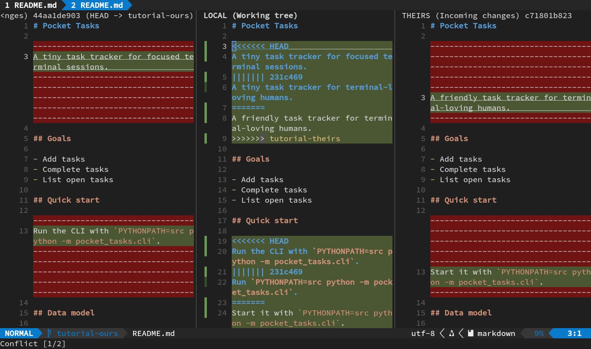

4. 按 [[Space]] [[c]] [[o]]。

LOCAL 中这一块应变成：

```text
A tiny task tracker for focused terminal sessions.
```

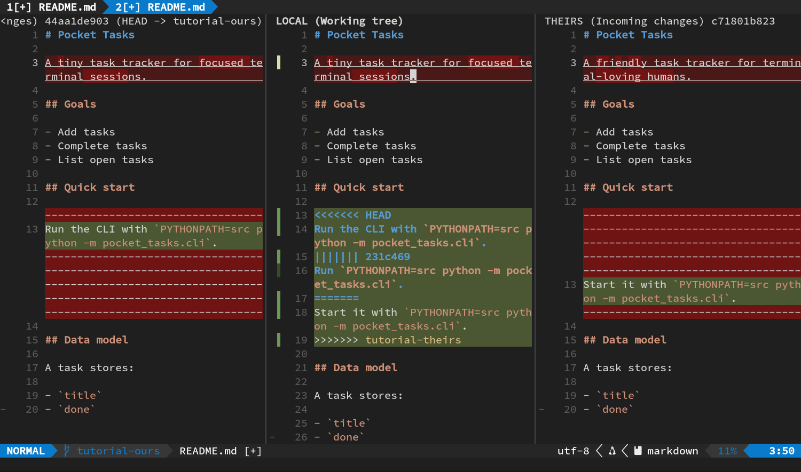

冲突标记随之消失。

### 第二处冲突选 theirs

1. 再按 [[&#93;]] [[x]]。
2. 光标来到 Quick start 行的冲突。

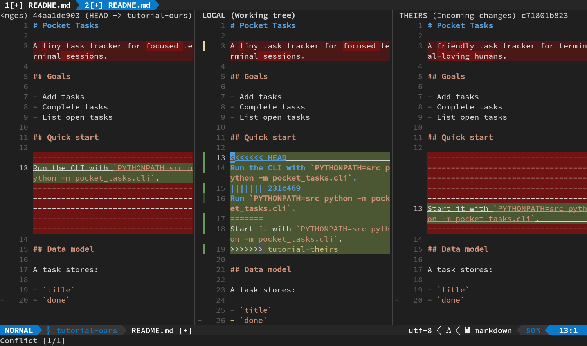

3. 按 [[Space]] [[c]] [[t]]。

LOCAL 中这一块应变成：

```text
Start it with `PYTHONPATH=src python -m pocket_tasks.cli`.
```

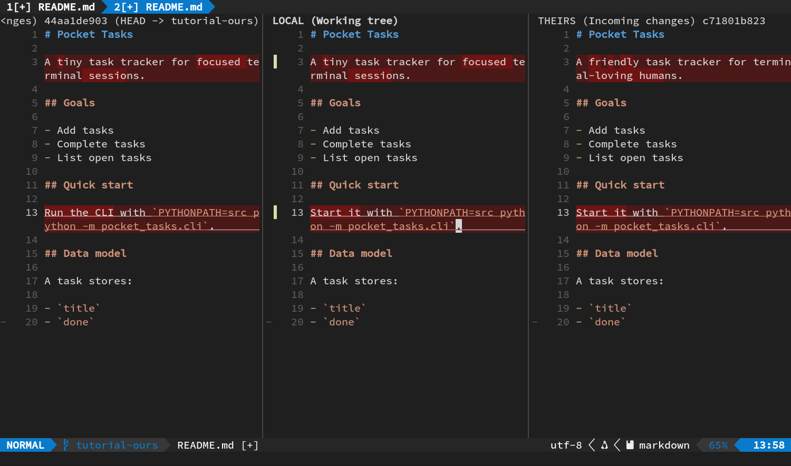

最后的结果各取了两个分支的一处修改，README 里的两处冲突都解决了。

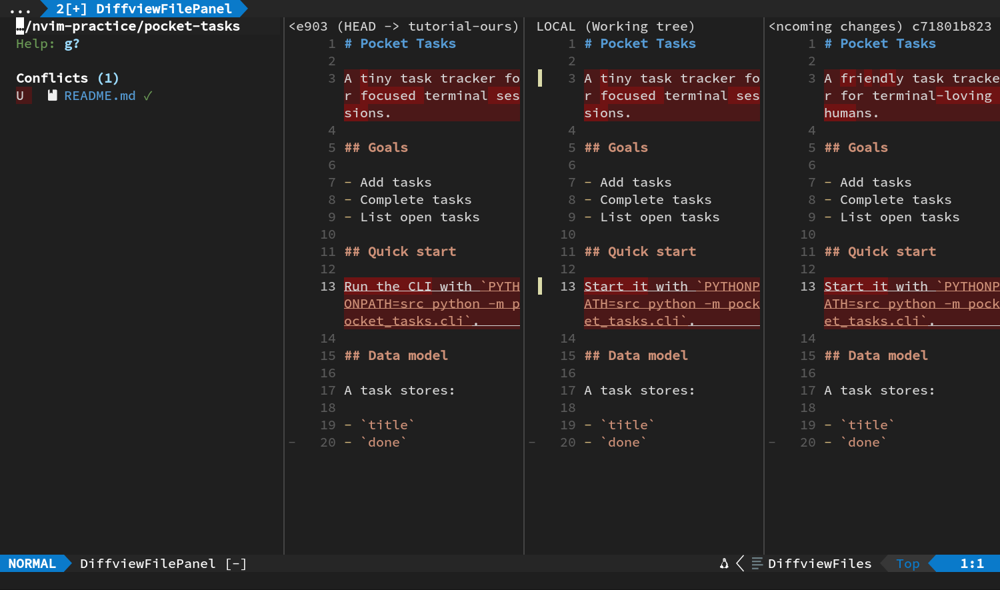

### 另外三种选择何时有用

| 按键 | 适合的情况 |
| --- | --- |
| [[Space]] [[c]] [[b]] | 两边的修改都不合适，先恢复共同祖先内容再重写 |
| [[Space]] [[c]] [[a]] | 按 ours → base → theirs 拼接后，再手工去重与整理 |
| [[d]] [[x]] | 整块内容都应删除 |

这三项都会直接修改 LOCAL。拿不准时先把三个窗口看清楚，再动手。

## 保存、暂存、完成合并

确认焦点位于 LOCAL 窗口，然后：

1. 按 [[F1]]。
2. 输入 `write`。

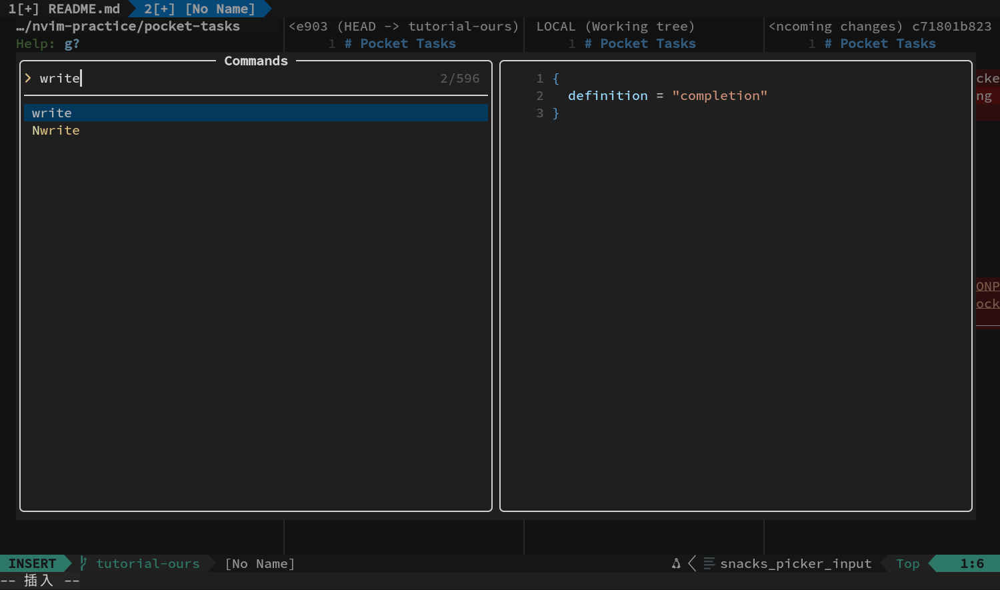

3. 连按两次 [[Enter]]。
4. 按 [[Space]] [[e]] 聚焦 Diffview 文件面板。
5. 把光标放在 `README.md` 上，按小写 [[s]] 暂存整份已解决文件。

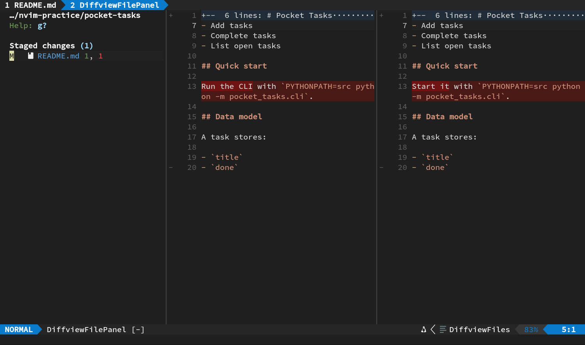

6. 按 [[F1]] → `DiffviewClose` →[[Enter]] → [[Enter]]。

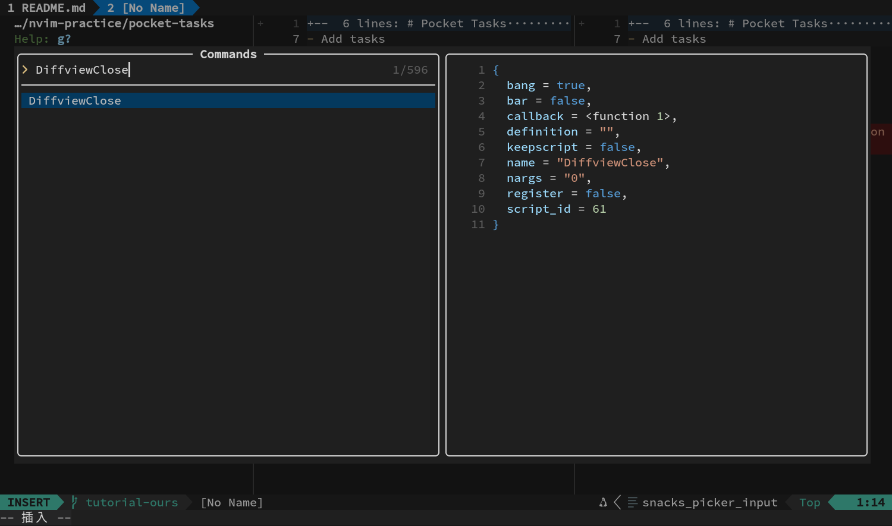

打开终端运行：

```console
git status
git diff --cached --check
PYTHONPATH=src python -m unittest -v
```

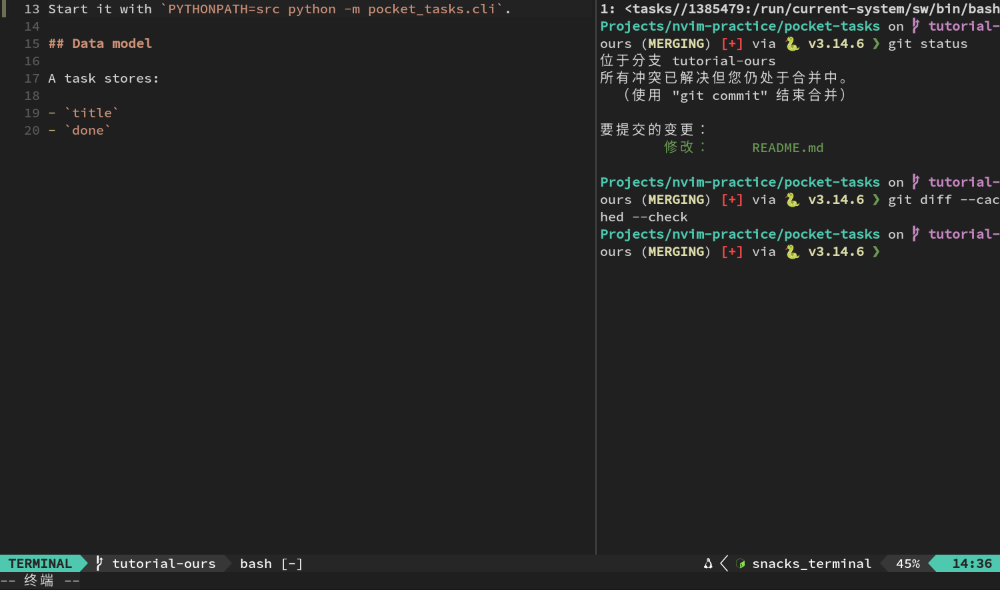

Git 应该会提示冲突已经解决，但合并还在进行。等测试通过以后，再完成合并提交：

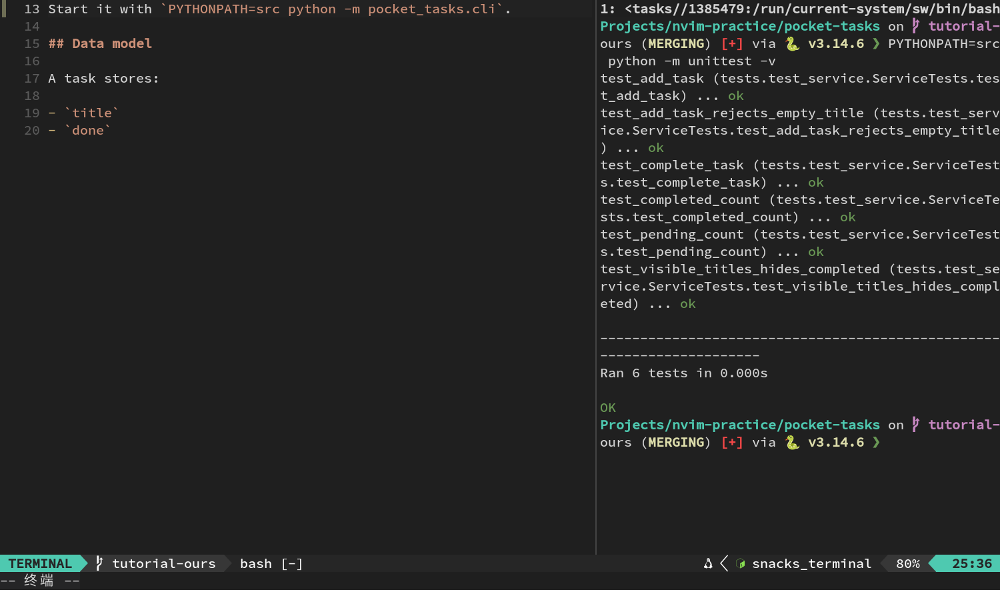

```console
git commit -m "merge tutorial conflict branches"
git status --short
```

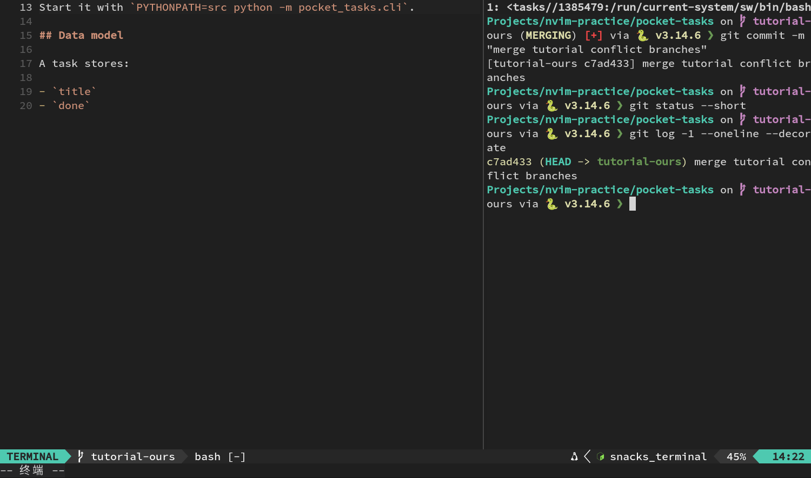

最后一条应该没有输出。当前分支仍然是 `tutorial-ours`，只是多了一个合并提交。

真实项目里，也可以在暂存完成后运行 `git merge --continue`。如果 Git 打开了提交信息编辑器，确认内容以后保存退出即可。

::: details 重新开始冲突练习

只要合并提交还没创建，就可以关掉 Diffview，在终端运行：

```console
git merge --abort
```

工作树会回到合并开始前的 `tutorial-ours`。随后再运行一次 `git merge tutorial-theirs`，就能重新制造冲突。

:::

::: details 高风险：单次应用全部

下面这些映射会一口气处理当前文件里的全部冲突：

> [!CAUTION] 大写映射会处理整份文件
> 大小写虽然只差一个 Shift，影响范围却会从当前冲突扩大到整个文件。优先用小写一块块处理；只有确认所有冲突都要采用同一种策略时，才考虑大写版本。

| 按键 | 效果 |
| --- | --- |
| [[Space]] [[c]] [[O]] | 全文件选择 ours |
| [[Space]] [[c]] [[T]] | 全文件选择 theirs |
| [[Space]] [[c]] [[B]] | 每处冲突都只保留共同祖先 base 内容 |
| [[Space]] [[c]] [[A]] | 每处冲突都按 ours → base → theirs 拼接并删除标记 |
| [[d]] [[X]] | 删除全文件的全部冲突区 |

:::

## rebase 中 ours 与 theirs 的含义

普通 merge 中：

- ours 通常是当前所在的分支；
- theirs 通常是正在合入的分支。

rebase 会把提交一个个重新应用到目标分支上。这时 Git 口中的 ours 往往是 rebase 目标分支的状态，theirs 则往往是眼前正在应用的提交，和普通 merge 时的直觉可能正好相反。

所以遇到 rebase 冲突时：

1. 先读 Diffview 窗口标题；
2. 再看两边具体内容；
3. 确认版本身份后才按 [[Space]] [[c]] [[o]] 或 [[Space]] [[c]] [[t]]。

> [!WARNING] rebase 中不要凭 ours/theirs 的名称判断版本
> 不要只看 ours/theirs 这两个名字来猜版本身份，先读窗口标题，再看两边实际是什么内容。

## 冲突处理固定流程

以后可以按下面的固定流程处理：

1. 终端执行 merge 或 rebase。
2. 保存其他工作，按 [[Space]] [[g]] [[s]]。
3. [[&#93;]] [[x]] 逐块跳。
4. 每块选 ours、theirs、base、all，或手工编辑 LOCAL。
5. 保存 LOCAL。
6. 文件面板按 [[s]] 暂存已解决文件。
7. 关闭 Diffview。
8. 跑测试和 `git diff --cached --check`。
9. 终端完成 merge 或 rebase。

下一章进入 [14：会话与日常工作流](14-sessions-and-daily-workflow.md)。我们会把编辑、LSP、测试、Git 审查、会话保存和恢复串成完整的日常开发流程。
